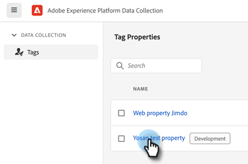
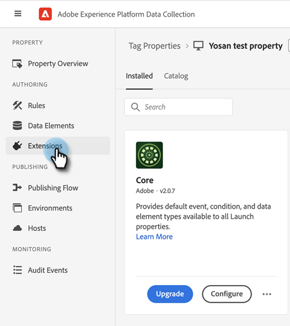
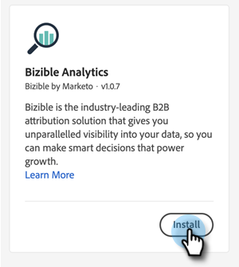
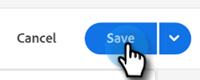
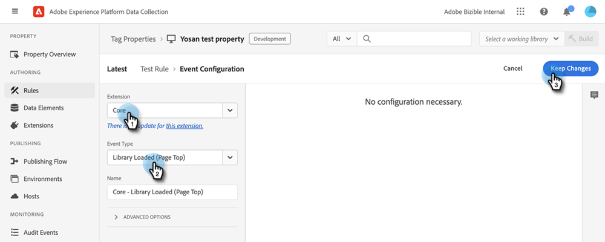
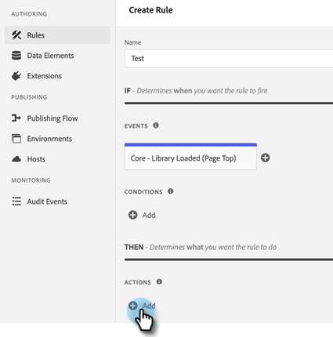
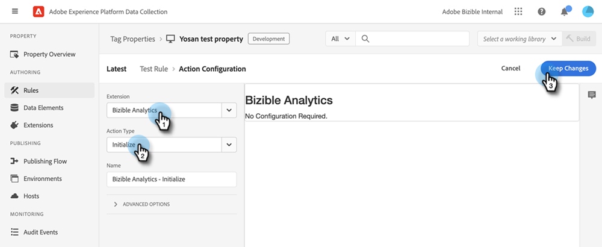

# [!DNL Marketo Measure] と Adobe Launch の統合 {#marketo-measure-integrations-with-adobe-launch}

Adobe Launch拡張機能は、web サイトで既にAdobe Launchを使用している既存の[!DNL Marketo Measure]人のユーザー向けに設計されています。 この拡張機能は、特定のイベントと条件に基づいてページ上のスクリプトを設定および動的に読み込むためのタグ管理ソリューションとして機能します。

Adobe Launchにインストールして設定すると、[!DNL Marketo Measure]拡張機能は、Adobe Launch スクリプトが存在するページにbizible.js スクリプトを読み込みます。 これにより、マーケターは、web ページを明示的に変更してbizible.js スクリプトタグを追加するのではなく、Adobe Launch設定を使用してbizible.jsを追加できます。

## Adobe Launch拡張機能の設定 {#configure-the-adobe-launch-extension}

>[!PREREQUISITES]
>
>Adobe Launchとその拡張機能について詳しくは、次のリンクを参照してください。
>
>* [[!DNL Marketo Measure] 拡張機能](https://experienceleague.adobe.com/docs/experience-platform/destinations/catalog/email/bizible.html#catalog){target="_blank"}
>* [Adobe Launchの概要](https://experienceleague.adobe.com/docs/platform-learn/implement-in-websites/overview.html?lang=ja){target="_blank"}
>* [Adobe Launch拡張機能の概要](https://experienceleague.adobe.com/docs/experience-platform/tags/extension-dev/overview.html){target="_blank"}

1. この記事[&#128279;](https://experienceleague.adobe.com/docs/platform-learn/implement-in-websites/configure-tags/create-a-property.html#go-to-the-data-collection-interface){target="_blank"}の手順に従ってプロパティを作成します。

1. 作成したプロパティをクリックします。

   

1. 「**[!UICONTROL 拡張機能]**」をクリックします。

   

1. 「**[!UICONTROL カタログ]**」タブをクリックし、「[!UICONTROL Bizible]」を検索します。

   

1. [!UICONTROL Bizible Analytics] タイルで、**[!UICONTROL インストール]**&#x200B;をクリックします。

   

1. Bizible AccountId フィールドに、web サイトのURLを入力します（例：`adobe.com`）。

   のURLを入力します

1. 「**[!UICONTROL 保存]**」をクリックします。

   

1. 「**[!UICONTROL ルール]**」をクリックし、「**[!UICONTROL 新しいルールを作成]**」を選択します。

   

1. 「[!UICONTROL &#x200B; イベント &#x200B;]」の下にある「**[!UICONTROL 追加]**」ボタンをクリックします。

   

1. 拡張機能ドロップダウンで、**[!UICONTROL Core]**&#x200B;を選択します。 次に、「イベントタイプ」ドロップダウンで、「**[!UICONTROL ライブラリ読み込み（ページトップ）]**」を選択します。 イベントに名前を付けないと、デフォルトの名前が適用されます。 完了したら、**[!UICONTROL 変更を保持]**&#x200B;をクリックします。

   で

1. 「アクション」の「**[!UICONTROL 追加]**」ボタンをクリックします。

   

1. 拡張機能ドロップダウンで、**[!UICONTROL Bizible Analytics]**&#x200B;を選択します。 次に、「アクションタイプ」ドロップダウンで、「**[!UICONTROL 初期化]**」を選択します。 アクションに名前を付けないと、デフォルトの名前が適用されます。 完了したら、**[!UICONTROL 変更を保持]**&#x200B;をクリックします。

   で

1. 「**[!UICONTROL 保存]**」をクリックします。

   

