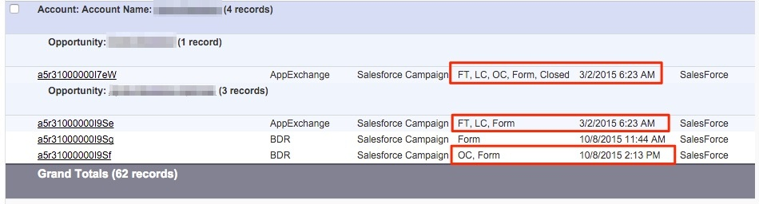

# アカウントベースドアトリビューション {#account-based-attribution}

Account-Based Marketing（ABM）の台頭により、[!DNL Marketo Measure]がABM戦略をどのように補完できるかを理解することが重要です。 [!DNL Marketo Measure]は、アカウントの下の各リードと取引先責任者の各タッチポイントを表示します。

## [!UICONTROL 概要] {#the-what}

1つのアカウントに複数の商談がある場合、異なる商談は、最初の2つの顧客接点であるファーストタッチ（FT）とリード作成（LC）を共有します。 新しい商談が作成されると、個々の収益金額は、商談をfunnelの下部に移動させることに貢献したタッチポイント全体に割り当てられます。 商談に関連付けられたタッチポイントは、BAT （Buyer Attribution Touchpoint）と見なされます。

例えば、以下のアカウントには 2 つの商談があります。 最初の商談には、タッチポイントが 1 つだけあります。 このタッチポイントには、FT、LC および商談作成（OC）タッチポイントが含まれます。 2番目の商談は、1番目の商談と同じFT &amp; LCですが、OC タッチポイントは異なります。 さらに、2番目の商談には、最初の商談の成約日の後に発生するため、最初の商談に関連付けられていない追加の顧客接点があります。

## これはどのように役立つでしょうか？ {#how-does-this-help}

[!DNL Marketo Measure]では、アカウントに関連するすべてのマーケティングインタラクションが表示されるため、マーケターは、アカウントの成約の可能性が高いアカウント、自社とのエンゲージメントの頻度、各エンゲージメントの売上などの詳細を把握できます。

[!DNL Marketo Measure]とABMのアプローチにより、マーケティングパフォーマンスは収益に基づいています。 アカウントベースドマーケティングへの移行を検討している場合は、[CMOによるABM オーケストレーション入門ガイド ](https://engage.marketo.com/rs/460-TDH-945/images/BZ-CMOs-Guide-To-ABM-Orchestration-By-Bizible.pdf)をご覧ください。ABM オーケストレーションの計画、実行、測定の各フェーズについて順を追って説明しています。
