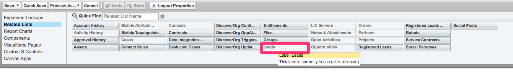

# アカウントベースドマーケティングの概要 {#account-based-marketing-overview}

以下に、ABM のコンポーネントである、 [!DNL Marketo Measure] ABM 機能と、 [!DNL Salesforce] ページレイアウト。 ABM の詳細を確認するには、 [このページ](https://www.marketo.com/account-based-marketing/){target=&quot;_blank&quot;}。

ABM を [!DNL Salesforce] 例として、 [ここをクリック](/help/advanced-marketo-measure-features/account-based-marketing/account-based-marketing-overview.md#setting-up-abm-page-layout-in-salesforce){target=&quot;_blank&quot;}。

## ABM とは {#what-is-abm}

アカウントベースドマーケティング (ABM) は、企業やアカウント全体に対して、個人としてではなくターゲットを設定し、販売するマーケティング戦略です。 [!DNL Marketo Measure] マーケティングチームとセールスチームは、リードとアカウントのマッピング機能と予測エンゲージメントスコアを使用して、成功した ABM 戦略を実行できます。

アドビのアカウントベースドマーケティングモデルが CRM に入力を開始するには、 [!DNL Marketo Measure] を満たすには、次の条件が必要です。

* お客様の CRM には、少なくとも 1 つのクローズ済み獲得商談を持つ 25 件のアカウントが必要です。そのため、お客様のビジネスに対する「成功した」アカウント/商談の一般性をより適切に測定できます。
* コインの他の側、CRM は、クローズド獲得商談のない少なくとも 25 アカウントが必要です ( すべての商談は、「オープン」ステージカテゴリか、「クローズドロスト」カテゴリのどちらかです — これは、組織の低グレードアカウントを測定するのに役立ちます。

>[!NOTE]
>
>上記の「悪い」アカウントは、クローズド・ウォン・オププを蓄積することなく、少なくとも 12 ヶ月間開かれる必要がある。これが、Opp がモデルの目的で古くなったかどうかに関する基本的なガイドラインです。

## リードとアカウントのマッピング {#lead-to-account-mapping}

リードとアカウントのマッピングは、効果的な ABM アプローチの重要な部分です。 リード — アカウント間マッピングを使用する場合、見込み客またはリードは、ブランドに関与するのと同じ会社アカウントにグループ化されます。 これにより、同じ会社の個人を一貫した方法でターゲット化し、販売できます。 追加の [!DNL Salesforce] この機能の利点を活用するために必要な設定です。 この [!DNL Marketo Measure] リードとアカウントのマッピング 5 つの異なる照合方法：

* ウェブサイトをアカウントウェブサイトにリード
* リードメールドメインからアカウント Web サイトドメインへ
* リード企業名からアカウント名へ
* リード企業からアカウント Web サイトドメインへ
* 連絡先のメールアドレスを使用したリードのメールアドレス上のドメインとアカウントとの照合

## 予測エンゲージメントスコア {#predictive-engagement-score}

この [!DNL Marketo Measure] 予測エンゲージメントスコア (PES) は、特定のアカウントとマーケティング活動とのエンゲージメントの程度を示す動的な値です。 このスコアは、ターゲットにするアカウントをセグメント化する際に役立ちます。 これは、より効果的かつ効率的にターゲットを絞るために、アカウントを識別するための貴重なツールです。

PES を計算するアルゴリズムには、多くのコンポーネントが含まれます。 最新性と年齢は、前回のタッチポイントアクティビティまたはページビューと共に、スコアの変更に大きな影響を与えます。 アカウントに新しい連絡先を追加すると、PES にも影響します。 以下に、いくつかの PES 入力のリストを示します。

* アカウントからのページビューの合計数
* 平均ページビュー数
* アカウント内の平均人数
* 最後のページビューの年齢
* ページビューの平均年齢
* アカウント内の人数
* 特定の重要なページ、および過去30/60/90日間に訪問があった場合
* アカウントがクローズ済みの損失/獲得契約を持つ場合
* クローズする可能性がどれくらいか（損失/獲得）

>[!NOTE]
>
>一部のアカウントの予測エンゲージメントスコアに「N/A」または「 — 」（ダッシュ記号）の等級が表示される場合があります。

_「N/A」のグレードは、単にモデルが真のグレードを生成するのに十分なデータがそのアカウントにないことを意味します。より多くのデータを使用すると、最終的にグレードが提供されます。_
_「 — 」（ダッシュ記号）のグレードは、時間の制約、時々失われたプロセスなどの理由で、このアカウントが ABM プロセスでまだ処理されていないことを意味します。 他の類似のアカウントや期間に基づいて、アカウントにグレードがあると思われる場合は、連絡を取り、 [!DNL Marketo Measure] 知ってる。_

## での ABM ページレイアウトの設定 [!DNL Salesforce] {#setting-up-abm-page-layout-in-salesforce}

PES の使用を開始するには、PES フィールドと関連リストを [!DNL Salesforce].

1. に移動します。 **[!UICONTROL 設定]** > **[!UICONTROL カスタマイズ]** > **[!UICONTROL アカウント]** > **[!UICONTROL ページレイアウト]**. 次に、編集するページレイアウトを選択します。
1. に移動します。 [!UICONTROL フィールド] 「予測エンゲージメントスコア」フィールドを「アカウント情報」セクションに移動します。

   

1. 最後に、に移動します。 [!UICONTROL 関連リスト] 「リード」関連リストをページレイアウトに移動します。

   

1. 次に、に移動します。 **[!UICONTROL 設定]** > **[!UICONTROL カスタマイズ]** > **[!UICONTROL リード]** > **[!UICONTROL ページレイアウト]** をクリックし、編集する適切なページレイアウトを選択します。
1. クリック **[!UICONTROL フィールド]** をクリックし、 [!UICONTROL アカウント] フィールドに貼り付けます。

   

準備完了です。

