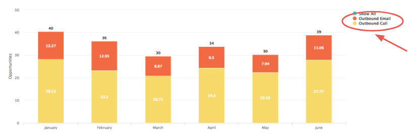
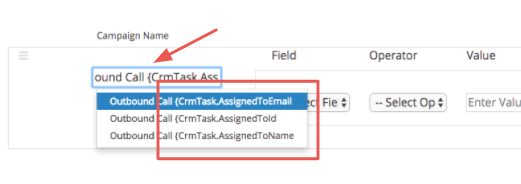
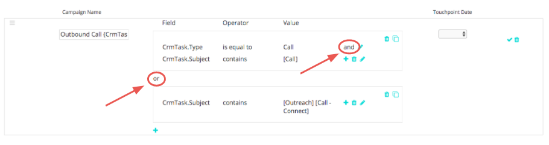
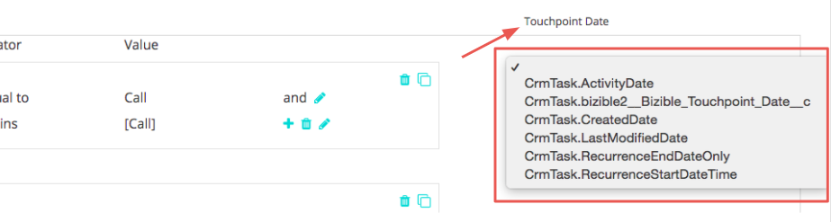
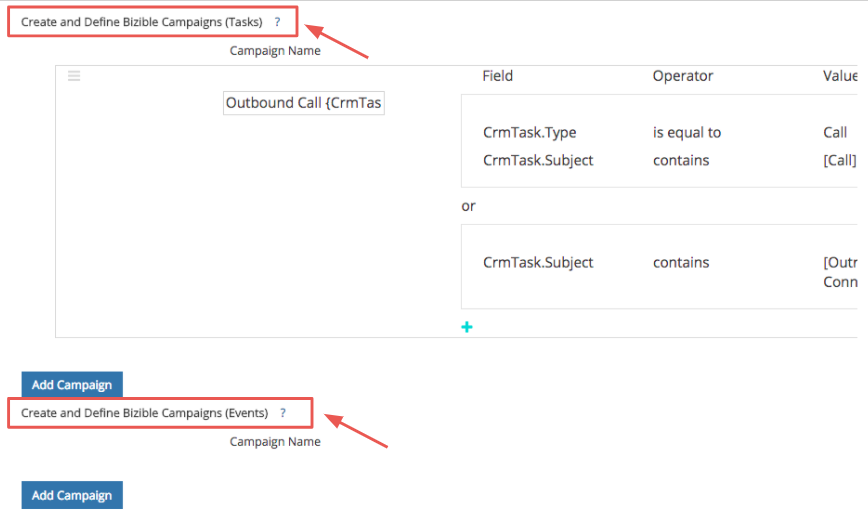
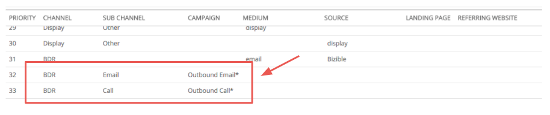
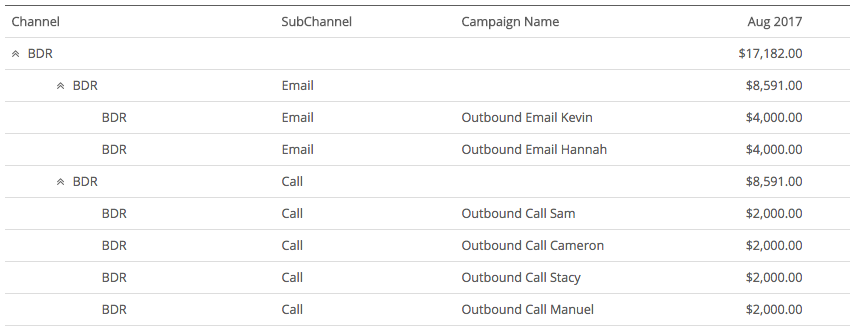

# Salesforce アクティビティのアトリビューション {#salesforce-activities-attribution}

[!DNL Marketo Measure] Salesforce アクティビティの統合により、特定のタスクとイベントのレコードがアトリビューションモデルに取り込まれます。 営業メールや、期限内のクレジットが届いていない営業電話などを追跡し始めます。 アクティビティ ルールを設定するには、[experience.adobe.com/marketo-measure](https://experience.adobe.com/marketo-measure?lang=ja){target="_blank"}に移動します。 そこから、**[!UICONTROL 設定]** タブに移動し、**[!UICONTROL アクティビティ]** タブをクリックします。

>[!AVAILABILITY]
>
>この機能は、Tier 2のお客様に対してのみ有効です。 より高いレベルのアカウントをリクエストするには、Adobe アカウントチーム（担当のアカウントマネージャー）にお問い合わせください。

まず、[!DNL Marketo Measure] キャンペーンと呼ばれる新しいコンセプトを導入します。 定義した各ルールについて、レコードを名前を付けることができる[!DNL Marketo Measure] キャンペーンにバケット化します。 必要に応じて複数のキャンペーンを追加します。 有料メディアキャンペーンの横に表示されているアウトバウンドセールスキャンペーンの有効性を測定することを想像してください。

この[!DNL Marketo Measure] キャンペーン名を使用して、どのチャネルにマッピングするかを指定します。 まだアウトバウンドセールスを検討している場合は、すべてのアウトバウンドセールスキャンペーンをBDR チャネルに配置する必要があります。

階層の詳細：

* チャネル
   * サブチャネル
      * キャンペーン
      * キャンペーン
   * サブチャネル
      * キャンペーン

>[!TIP]
>
>たとえば、営業担当者ごとに一意のキャンペーンを設定する場合は、動的置換パラメーターを使用して[!DNL Marketo Measure] キャンペーン名を入力します。 同じ例では、`"Outbound Sales - {AssignedTo}"`を入力すると、`"Outbound Sales - Jill"`や`"Outbound Sales - Jack."`のようになります

[!DNL Marketo Measure] キャンペーン名を設定したら、アクティビティルールを設定します。

ルールは、アトリビューションの対象となるレコードを示すフィルターとして機能します。 例えば、類似のロジックを使用してCRMでレポートを作成し、そのレポートを生成するとします。 および/またはステートメントと、`matches any`、`contains`、`starts with`、`ends with`、`is equal to`などの様々な演算子を組み合わせて使用できる柔軟性があります。 ボックス化されたルール内で`and` ステートメントを定義するか、ボックス外のレイヤー`or` ステートメントを定義します。

>[!NOTE]
>
>数式フィールドはルール内で使用できず、選択リストには表示されません。 数式はバックグラウンドで計算され、レコードは変更されないため、[!DNL Marketo Measure]はレコードがルールに適合するかどうかを検出できません。
>
>CrmEvent.CreatedByIdなどのID フィールドには、必ず正しい値を使用してください。 [!DNL Salesforce IDs]は18文字です（0054H000007WmrfQAC）。

最後に、Buyer Touchpointの日付として使用する日付フィールドまたは日付/時刻フィールドのいずれかを選択します。 標準フィールドとカスタムフィールドのどちらも選択可能です。

>[!TIP]
>
>パッケージのインストール時に、[!DNL Marketo Measure]にはアクティビティ レコードにカスタム Buyer Touchpoint日付フィールドが含まれます。 ステータスが変更された日付など、動的な日付を使用する場合は、CRM ワークフローを使用して「Buyer Touchpoint日」を設定し、この手順で「Buyer Touchpoint日」を選択することができます。

タスクやイベントに異なるルールを設定することを忘れないでください。 営業部門が活動を記録するために使用するオブジェクトを把握する必要があります。

これらの新しい顧客接点を、適切な[ マーケティングチャネル ](https://experience.adobe.com/#/marketo-measure/MyAccount/Business?busView=false&id=10#/!/MyAccount/Business/Account.Settings.SettingsHome?tab=Channels.Online%20Channels){target="_blank"}に配置することをお勧めします。 作成したばかりの新しいキャンペーンマッピングでチャネルを定義します。

>[!TIP]
>
>チャネル定義を追加する場合は、ワイルドカード値を使用して、次のような演算子を簡単にステートできます。
>
>で始まる（Outbound&#42;）
>
>次を含む（&#42;送信&#42;）
>
>で終わる（&#42;送信）
>
>ワイルドカードは基本的に「次と等しい」という意味ではないので、必要に応じて使用してください。

| **演算子** | **ユースケース** |
|---|---|
| 次と等しい | 単一の値 – 完全一致 |
| 次を含む | 単一の値 – 値を含む |
| 任意に一致 | 複数の値 – 完全一致 |
| 任意の（を含む）と一致 | 複数の値 – &#42;値&#42;、&#42;値、&#42;値&#42; |

さらに、新しいチャネルのコストを入力することもできます。 [ マーケティング費用のアップロード ](https://experience.adobe.com/#/marketo-measure/MyAccount/Business?busView=false&id=10#/!/MyAccount/Business/Account.Settings.SettingsHome?tab=Reporting.Marketing%20Spend){target="_blank"}を使用すると、チャネルレベル、サブチャネルレベル、またはキャンペーンレベルで費用を入力できます。 新しい[!DNL Marketo Measure] キャンペーンでは、関連コストを月ごとに追加し、各キャンペーンのROIを確認できます。

>[!MORELIKETHIS]
>
>[ アクティビティ属性に関するFAQ](/help/advanced-marketo-measure-features/activities-attribution/activities-attribution-faq.md)
