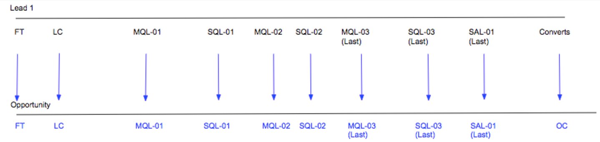
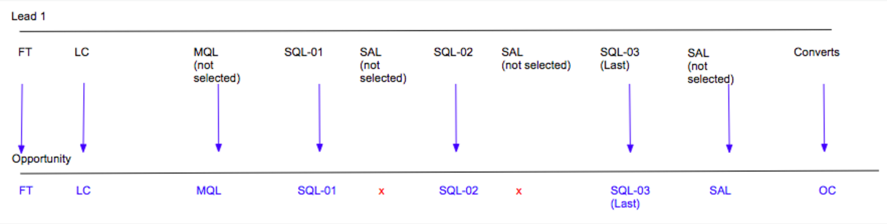
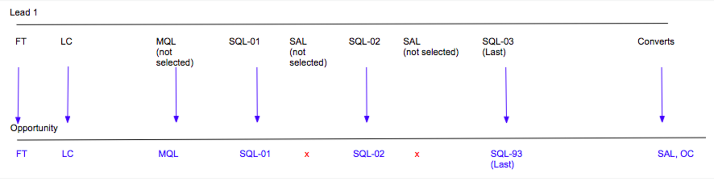
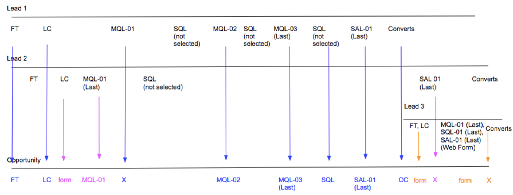
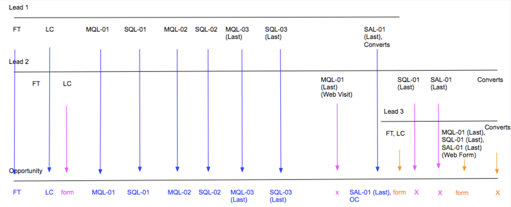
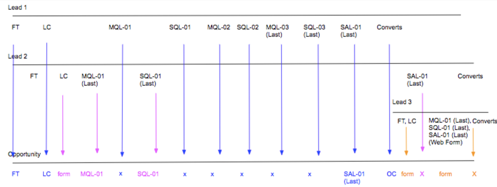
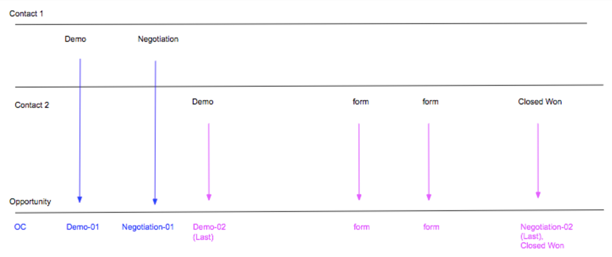

# ブーメランステージのシナリオ {#boomerang-stage-scenarios}

>[!AVAILABILITY]
>
>Boomerang機能は、Tier 2および3のお客様に対してのみ有効です。 より高いレベルのアカウントをリクエストするには、Adobe アカウントチーム（担当のアカウントマネージャー）にお問い合わせください。

以下に、[!DNL Marketo Measure]が各状況でどのようにタッチポイントを作成するかを理解するために、Boomerang ステージのシナリオの例をいくつか示します。

## 単一のリードシナリオ {#single-lead-scenarios}

**シナリオ 1: リードの標準ブーメラン タッチポイント**

これは最も単純なブーメランのシナリオです。 一番上の行（リード 1というラベル）は、個々のリードのジャーニーと、そのリードのタッチポイントがリードレコードでどのように表示されるかを表しています。 一番下の行（商談のラベル付き）には、リードのタッチポイントが商談にどのように変換されるかが表示されます。 顧客接点の進捗状況は、左から右へ、時系列で説明されます。

このシナリオでは、お客様が&#x200B;**MQL**&#x200B;および&#x200B;**SQL**&#x200B;のステージをブーメランで追跡することを選択しました。 各ブーメランのタッチポイント位置は、ステージとそれが発生する番号（MQL-01、SQL-01、MQL-02）でラベル付けされます。 そのステージの最後のブーメランのタッチポイントは、タッチポイント位置に「（最後）」があります。

その後、リード 1は商談とのコンタクトに変換されます。これはOC タッチと見なされます。

**シナリオ 2: リードのブーメランのタッチポイントとカスタムステージ**

このシナリオでは、お客様はブーメランのタッチポイントを使用して&#x200B;**SQL ステージ**&#x200B;を追跡することのみを選択しました。 MQLおよびSAL ステージは引き続き追跡されますが、[!DNL Marketo Measure] カスタムステージ機能を使用します。

MQL タッチポイントの位置に番号のラベルが付いていないことに注意してください。 これは、Boomerangのタッチポイントで追跡するように選択されていなかったためです。 カスタムモデルに含まれているがBoomerangで追跡されていないステージのタッチポイントを作成する場合、[!DNL Marketo Measure]はそのステージから最後のオカレンスを取得します。

SAL ステージの場合、[!DNL Marketo Measure]はこのステージの最初の2回の出現を無視します。 [!DNL Marketo Measure]は、_最後の_&#x200B;件のオカレンスに対してのみSAL タッチポイントを作成します。 上記の例では、これはOC タッチポイントの直前に発生します。

SQL ステージはBoomerang タッチポイントで追跡されており、3つのタッチポイントが作成され、それに応じてラベル付けされています。

その後、リード 1は商談とのコンタクトに変換されます。これはOC タッチと見なされます。

**シナリオ 3: リードがステージに到達しない/ステージをスキップしない場合**

このシナリオでは、シナリオ 2と同じ基準を使用します。 顧客がSQL ステージを追跡するためには、ブーメランの顧客接点を使用するだけです。 MQLとSALは引き続き追跡されますが、[!DNL Marketo Measure] カスタムステージ機能があります。

このシナリオでは、リードは実際にはSAL ステージに移行しません。 SAL ステージに到達する前に連絡先に変換し、基本的にSAL ステージを「スキップ」します。 この状況では、[!DNL Marketo Measure]は、SALがOC タッチポイントで発生し、SALとOCの両方の位置が同じタッチポイントに表示されることを前提としています。

その後、リード 1は商談とのコンタクトに変換されます。これはOC タッチと見なされます。

## 複数のリードを含むシナリオ {#scenarios-with-multiple-leads}

以下のシナリオでは、複数のリードが商談ジャーニーにどのように影響するかを検討しているため、Boomerang ステージがより複雑になる可能性があります。

一番上の行（リード 1というラベル、青）は、個々のリードのジャーニーと、そのリードのタッチポイントがリードレコードでどのように表示されるかを表しています。 同じことが、リード 2 （ピンク）とリード 3 （オレンジ）にも当てはまります。 一番下の行（商談のラベル付き）には、これらのリードの両方のタッチポイントが商談にどのように変換されるかが表示されます。 顧客接点の進捗状況は、左から右へ、時系列で説明されます。

**シナリオ 1: [!UICONTROL 商談を持つ3つのリード]**

このシナリオでは、お客様が&#x200B;**MQL**&#x200B;および&#x200B;**SAL ステージ**&#x200B;をブーメランのタッチポイントで追跡することを選択しました。 SQL ステージは、標準のカスタムステージによって追跡されます。

商談のFTおよびLC タッチポイントは、リード 2のFTおよびLCの前に発生したため、リード 1から取得されます（青）（ピンク）。 リード 2のLC タッチポイントは、商談の「フォーム」タッチポイントとして表示されます。

リード 2のMQL-01 （最後）は、商談の最初のMQLになります。 リード 1のMQL-01は、リード 2のMQLが最初に発生したため、商談のタッチポイントとして表示されません。 ただし、リード 1のMQL-02とMQL-03は商談に表示されます。

SQL ステージは、ブーメランステージではなく、カスタムステージで追跡されています。 リード 1とリード 2の間にSQL ステージが3回発生しても、商談のタッチポイントとして含まれるのは最後のSQL発生のみです。

リード 1からのSAL-01 （最後）タッチポイントは、商談のタッチポイントとして引き継がれます。 その後、リード 1は商談とのコンタクトに変換されます。これはOC タッチと見なされます。 リード 2のSAL-01 （最後）タッチポイントは、このステージの移行がOC タッチの&#x200B;_後_&#x200B;に発生したため、タッチポイントとして作成されません。

リード 3のFT、LC、MQL、SQL、SALのタッチポイント（オレンジ）はすべて、商談のOC タッチポイントの後に発生しました。 これらのタッチポイントは商談に含まれますが、「中間接点」とみなされます。

リード 2と3が連絡先に変換された場合、商談作成ステージは1つしかないため、[!DNL Marketo Measure]は別のOC タッチポイントを作成しません。

**シナリオ 2 - Web訪問Boomerang タッチポイント**

このシナリオでは、お客様がBoomerang タッチポイントを使用して&#x200B;**MQL**、**SQL**、**SAL**&#x200B;の各ステージを追跡することを選択しました。 このシナリオは、いくつかの例外を除いて、上記のシナリオとほぼ同じです。

リード 1のすべてのタッチポイントは、FTからSAL-01 （最後）まで、商談に含まれます。 リード 2のLC タッチポイントは、商談のLC タッチポイントとMQL-01 タッチポイントの間のフォームタッチポイントとして含まれます。

リード 2のMQL-01 （最後）（Web訪問）は、商談のタッチポイントとして作成されません。 これは、このタッチポイントが、SQL ステージの最後の発生後に発生するweb訪問であり、商談を前進させる助けにはならないためです。

リード 1のステージがSALに変更され、その後、商談とのコンタクトに変換されます。この場合、SAL-01 （Last）とOCの位置は同じタッチポイントで組み合わされます。

リード 3のFT,LC タッチは、商談のフォームタッチポイントとして作成されます。 OC タッチ後にタッチポイントとして作成されるのは、フォーム入力アクションのみです。 このため、リード 2のSQL-01 （最後）およびSAL-01 （最後）ステージ遷移は、これらのタッチポイントがweb訪問であったため、タッチポイントとして作成されません。

リード 3のMQL、SQL、SALのタッチは、フォーム入力アクションであるため、タッチポイントとして含まれます。

**シナリオ 3 - Boomerang アトリビューションの重み付け**

このシナリオでは、お客様がBoomerang タッチポイントを使用して&#x200B;**MQL**、**SQL**、**SAL**&#x200B;の各ステージを追跡することを選択しました。

商談のFTおよびLC タッチポイントは、リード 2のFTおよびLCの前に発生したため、リード 1から取得されます（青）（ピンク）。 リード 2のLC タッチポイントは、商談の「フォーム」タッチポイントとして表示されます。

リード 2のMQL-01 （最後）が、商談の最初のMQLになります。 リード 1のMQL-01は、リード 2のMQLが最初に発生したため、商談のタッチポイントとして表示されません。

リード 2のSQL-01 （最後）は、商談のSQL-01になります。 リード 1のSQL-01は、リード 2のSQL-01が最初に発生したため、商談のタッチポイントとして表示されません。

リード 1は、最終的にSAL ステージに到達する前に、MQLとSQLの間で数回急上昇することに注意してください。 SQL-01、MQL-02、SQL-02、MQL-03、SQL-03 _は、これらのステージ遷移がジャーニー内で商談を促進するのに役立たないため、商談のタッチポイントとして含まれません_。

リード 1のSAL-01 （最後）のタッチポイントは、商談に含まれる次のタッチポイントです。 その後、リード 1は商談とのコンタクトにコンバージョンし、OC タッチポイントを作成します。

リード 3のFTおよびLC、およびMQL、SQLおよびSALのタッチポイントは、商談に対するフォームタッチとして表示されます。

リード 2のSQL-01 （最後）タッチポイントは、OC タッチポイントの後に発生したため、商談のタッチポイントとして含まれません。 また、リード 2のSQL ステージの移行は、最終SAL ステージの移行&#x200B;_後に_&#x200B;発生しており、商談ジャーニーを前進させる助けにはなりません。

## 機会シナリオ {#opportunity-scenarios}

**シナリオ 1 – 商談およびBoomerang トラッキングに関する連絡先**

このシナリオでは、お客様が&#x200B;**連絡先**&#x200B;で&#x200B;**デモと交渉ステージの移行**&#x200B;を追跡することを選択しました。 各ブーメランステージは、最大2つのタッチポイントを受け取ることができます。 コンタクトのステージ遷移とリードのステージ遷移の違いは、コンタクトのステージ遷移が商談&#x200B;_OC タッチポイントの_&#x200B;後のにブーメランのタッチポイントとして表示されることです。 これは、リードで発生するステージ移行には当てはまりません。これらはフォームのタッチポイントとして表示されます。

この例では、Contact 1のデモおよび交渉段階の移行は、商談のDemo-01およびNegotiation-01のタッチポイントとして含まれます。 連絡先2のデモ ステージの移行は&#x200B;_後_&#x200B;の連絡先1で発生し、商談のデモ 02 （最後）のタッチポイントとして表示されます。

交渉段階への2回目の移行がないことに注意してください。商談はすぐにDemo-02 （Last）からClose Wonに移動します。 この場合、[!DNL Marketo Measure]には、クローズしたウォン タッチポイントを使用したネゴシエーション移行が含まれます。
