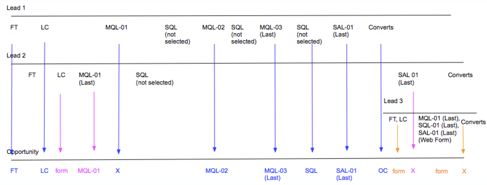

# ブーメランステージのシナリオ {#boomerang-stage-scenarios}

>[!AVAILABILITY]
>
>ブーメラン機能は、Tier 3 のお客様に対してのみ有効です。 より高いアカウント層をリクエストするには、Adobeアカウントチーム（担当のアカウントマネージャー）にお問い合わせください。

次に、Boomerang Stage のシナリオの例をいくつか示します [!DNL Marketo Measure] 各状況にタッチポイントを作成します。

## 単一リードシナリオ {#single-lead-scenarios}

**シナリオ 1：リードの標準ブーメランタッチポイント**

これは最も単純なブーメランのシナリオです。 上の行（リード 1 というラベル）は、個々のリードのジャーニーを表し、リードレコード上でのタッチポイントの表示方法を示します。 最終的な行（「商談」というラベル）には、リードのタッチポイントが商談にどのように変換されるかが表示されます。 タッチポイントの進行は、左から右へ、時系列で説明されます。

このシナリオでは、顧客が **MQL** および **SQL** ブーメラングで追跡されたステージ。 各ブーメランタッチポイントの位置には、発生するステージと番号でラベルが付けられます (MQL-01、SQL-01、MQL-02)。 そのステージの最後のブーメランタッチポイントには、タッチポイントの位置に「(Last)」が含まれています。

次に、リード 1 は商談の連絡先に変換され、OC タッチと見なされます。

**シナリオ 2：リードのブーメランタッチポイントとカスタムステージ**

このシナリオでは、顧客は **SQL ステージ** boomerang タッチポイントを使用します。 MQL ステージと SAL ステージは、引き続き追跡されていますが、 [!DNL Marketo Measure] カスタムステージ機能。

MQL タッチポイントの位置には数値のラベルは付けられません。 これは、ブーメランタッチポイントでの追跡の対象として選択されていなかったためです。 カスタムモデルに含まれるが、ブーメランでは追跡されないステージのタッチポイントを作成する場合、 [!DNL Marketo Measure] は、そのステージから最後のオカレンスを取得します。

SAL ステージの場合、 [!DNL Marketo Measure] は、このステージの最初の 2 つの出現を無視します。 [!DNL Marketo Measure] は、 _last_ 発生件数。 上の例では、OC タッチポイントの直前にこれが発生します。

SQL ステージはブーメランタッチポイントで追跡され、それに応じて 3 つのタッチポイントが作成およびラベル付けされています。

次に、リード 1 は商談の連絡先に変換され、OC タッチと見なされます。

**シナリオ 3：リードがステージに到達/スキップしない場合**

このシナリオでは、シナリオ 2 と同じ条件を使用します。 顧客が選択したのは、ブーメランタッチポイントを使用して SQL ステージのみです。 MQL および SAL は引き続き追跡されますが、 [!DNL Marketo Measure] カスタムステージ機能。

このシナリオでは、リードは実際には SAL ステージに移行しません。 SAL ステージに到達する前に連絡先に変換され、基本的に SAL ステージを「スキップ」します。 この状況では、 [!DNL Marketo Measure] は、SAL が OC タッチポイントで発生し、SAL と OC の両方の位置が同じタッチポイントに現れると仮定します。

次に、リード 1 は商談の連絡先に変換され、OC タッチと見なされます。

## 複数のリードを持つシナリオ {#scenarios-with-multiple-leads}

複数のリードが商談のジャーニーにどのように影響するかを見ているので、ブーメランステージはより複雑になる可能性があるシナリオを次に示します。

上の行（リード 1 のラベルが青色）は、個々のリードのジャーニーと、そのタッチポイントがリードレコードにどのように表示されるかを表します。 同様に、「リード 2」（ピンク）と「リード 3」（オレンジ色）も同じです。 下線（「商談」というラベル）には、これらのリードのタッチポイントの両方が商談にどのように変換されるかが表示されます。 タッチポイントの進行は、左から右へ、時系列で説明されます。

**シナリオ 1: [!UICONTROL 商談を持つ 3 名のリード]**

このシナリオでは、顧客が **MQL** および **SAL ステージ** boomerang タッチポイントを使用します。 SQL ステージは、標準のカスタムステージで追跡されています。

商談の FT および LC タッチポイントは、リード 2（ピンク）の FT および LC より前に発生したので、リード 1（青）から来ます。 リード 2 の LC タッチポイントは、商談の「フォーム」タッチポイントとして表示されます。

リード 2 の MQL-01（最後）がオポチュニティの最初の MQL になります。 リード 2 の MQL が最初に発生したので、リード 1 の MQL-01 は商談のタッチポイントとして表示されません。 ただし、リード 1 の MQL-02 と MQL-03 は商談に表示されます。

SQL ステージは、ブーメランステージではなく、カスタムステージで追跡されています。 リード 1 とリード 2 の間に 3 つの SQL ステージが存在する場合でも、オポチュニティのタッチポイントには最後の SQL オカレンスのみが含まれます。

リード 1 の SAL-01（最後）タッチポイントは、商談のタッチポイントとして引き継がれます。 次に、リード 1 は商談の連絡先に変換され、OC タッチと見なされます。 このステージ遷移が発生したので、リード 2 の SAL-01（最後）のタッチポイントがタッチポイントとして作成されます _次より後_ OC タッチ。

リード 3 の FT、LC、MQL、SQL、SAL タッチポイント（オレンジ）は、商談の OC タッチポイントの後にすべて発生しました。 これらのタッチポイントはオポチュニティに含まれますが、「ミドルタッチ」と見なされます。

リード 2 および 3 が連絡先に変換されたとき、 [!DNL Marketo Measure] は、オポチュニティ作成ステージを 1 つだけ持つことができるので、別の OC タッチポイントを作成しません。

**シナリオ 2 - [!UICONTROL 商談を持つ 3 名のリード]**

このシナリオでは、顧客が **MQL**, **SQL**、および **SAL** ブーメランタッチポイントを持つステージ。

リード 1 のすべてのタッチポイントが商談に含まれ、FT から SAL-01（最後）に至ります。 リード 2 の LC タッチポイントは、商談の LC タッチポイントと MQL-01 タッチポイントの間のフォームタッチポイントとして含まれます。

リード 2 の MQL-01（最後）は、商談の MQL-04（最後）タッチポイントになります。 このシナリオでは、1 つのオポチュニティ内で複数のリードのジャーニーを調べているので、リードのタッチポイントがオポチュニティ上のタッチポイントとして翻訳されると、リードの位置付けと番号付けが変わる場合があります。 同様に、リード 2 の SQL-01（最後）は商談上で SQL-04（最後）になります。 リード 2 の SAL-01（最後）も商談の SAL-02（最後）になります。

オポチュニティには SAL タッチポイントが 2 つだけ含まれています。 [!DNL Marketo Measure] ステージトランジションにタッチポイントが発生していない場合、はタッチポイントを強制/作成しようとしません。

リード 3 のタッチポイントジャーニーは、OC タッチが発生する直前に開始され、リード 1 とリード 2 の FT と LC タッチの直後に開始されます。 この場合、リード 3 の FT および LC は商談のフォームタッチポイントとして表示されます。 次に、リード 1 は商談の連絡先に変換され、OC タッチと見なされます。

リード 3 の MQL、SQL、SAL タッチは、OC タッチ後に同時に発生します。 OC タッチポイントの後に発生したので、このタッチポイントはブーメランのステージ遷移ではなく、商談に対してフォーム/ミドルタッチとして表示されます。

**シナリオ 2a - Web 訪問ブーメランタッチポイント**

このシナリオでは、顧客が **MQL**, **SQL**、および **SAL** ブーメランタッチポイントを持つステージ。 このシナリオは、上記とほとんど同じですが、いくつかの例外があります。

リード 1 のすべてのタッチポイントが商談に含まれ、FT から SAL-01（最後）に至ります。 リード 2 の LC タッチポイントは、商談の LC タッチポイントと MQL-01 タッチポイントの間のフォームタッチポイントとして含まれます。

リード 2 の MQL-01（最後）（Web 訪問）は、商談上のタッチポイントとして作成されません。 これは、このタッチポイントが SQL ステージの最後の発生後に発生する Web 訪問であり、商談を前に進めるのに役立たないためです。

リード 1 のステージが SAL に変わり、商談のある連絡先に変換されます。この場合、SAL-01（最後）と OC のポジションは同じタッチポイントで結合されます。

リード 3 の FT、LC タッチは、商談上のフォームタッチポイントとして作成されます。 OC タッチ後に、フォームの入力アクションのみがタッチポイントとして作成されます。 このため、リード 2 の SQL-01（最後）および SAL-01（最後）ステージ遷移は、Web 訪問であったので、タッチポイントとして作成されません。

リード 3 の MQL、SQL、SAL タッチは、フォーム入力アクションなので、タッチポイントとして含まれます。

**シナリオ 3 — ブーメラン属性の重み付け**

このシナリオでは、顧客が **MQL**, **SQL**、および **SAL** ブーメランタッチポイントを持つステージ。

商談の FT および LC タッチポイントは、リード 2（ピンク）の FT および LC より前に発生したので、リード 1（青）から来ます。 リード 2 の LC タッチポイントは、商談の「フォーム」タッチポイントとして表示されます。

リード 2 の MQL-01（最後）が商談の最初の MQL になります。 リード 2 の MQL が最初に発生したので、リード 1 の MQL-01 は商談のタッチポイントとして表示されません。

リード 2 の SQL-01（最後）は商談の SQL-01 になります。 リード 2 の SQL-01 が最初に発生したので、リード 1 の SQL-01 は商談のタッチポイントとして表示されません。

MQL と SQL の間のリード 1 のブーメランが、最終的に SAL ステージに到達する前に、2 回の回数であることに注意してください。 SQL-01、MQL-02、SQL-02、MQL-03、SQL-03 _次の条件を満たさない_ これらのステージの遷移は、ジャーニーのオポチュニティを前に進めるのに役立たないので、オポチュニティのタッチポイントとして含めます。

リード 1 の SAL-01（最後）タッチポイントは、商談に含まれる次のタッチポイントです。 次に、リード 1 が商談に対する連絡先に変換され、OC タッチポイントが作成されます。

リード 3 の FT および LC と、MQL、SQL、SAL のタッチポイントが商談に触れる形で表示されます。

リード 2 の SQL-01（最後）タッチポイントは、OC タッチポイントの後に発生したため、Opp 上のタッチポイントとして含まれません。 また、リード 2 の SQL ステージの移行が発生しました _最終 SAL 段階移行後_&#x200B;を使用して、オポチュニティのジャーニーを前に進めるのに役立ちません。

## 商談のシナリオ {#opportunity-scenarios}

**シナリオ 1 — 商談およびブーメラン追跡を持つ連絡先**

このシナリオでは、顧客が **デモおよびネゴシエーションのステージ遷移** の **連絡先**. 各ブーメランステージは、最大 2 つのタッチポイントを受け取ることができます。 取引先責任者のステージ遷移とリードのステージ遷移の違いは、取引先責任者のステージ遷移が商談にブーメランタッチポイントとして表示される場合がある点です _次より後_ OC タッチポイント。 これは、リードで発生するステージ遷移がフォームタッチポイントとして表示される場合には当てはまりません。

この例では、連絡先 1 のデモおよびネゴシエーションステージ遷移が、商談に Demo-01 および Negotiation-01 タッチポイントとして含まれます。 連絡先 2 のデモステージ遷移が発生します _次より後_ 1 の担当者で、商談の Demo-02（最後）タッチポイントとして表示されます。

ネゴシエーション・ステージへの 2 番目の遷移が存在しないことに注意してください。商談は直ちに Demo-02（最後）から [ 獲得のクローズ ] に移動します。 この場合、 [!DNL Marketo Measure] は、クローズ済み獲得タッチポイントとのネゴシエーショントランジションを含みます。
