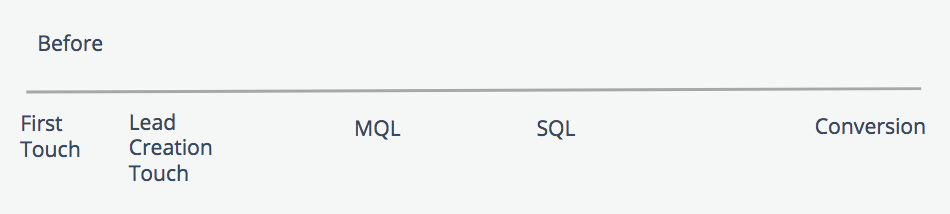
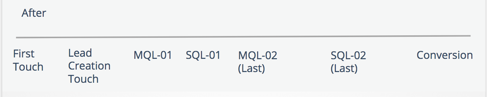

# ブーメランステージとタッチポイント {#boomerang-stages-and-touchpoints}

>[!AVAILABILITY]
>
>Boomerang機能は、Tier 2および3のお客様に対してのみ有効です。 より高いレベルのアカウントをリクエストするには、Adobe アカウントチーム（担当のアカウントマネージャー）にお問い合わせください。

[!DNL Marketo Measure]がBoomerang ステージ機能をリリースしました。 Boomerang ステージ機能は、長いセールスサイクルを持つ[!DNL Marketo Measure]人の顧客のカスタマージャーニーをより可視化するために作成されました。 この機能により、マーケターは、連絡先のMQLがSALに移行してからMQL ステージに戻るなど、商談ジャーニーで発生するすべてのステージ移行のタッチポイントを作成できます。 コンタクトが「MQL ステージに再エントリ」または「再MQL」の場合、MQLはブーメランステージとみなされます。 ブーメランステージ機能は、[!DNL Marketo Measure] カスタムステージと一緒に機能します。

## この機能の機能 {#what-this-feature-does}

* オポチュニティのジャーニーで発生するすべてのステージ遷移に対して「ブーメラン」タッチポイントを作成します
* 任意のカスタムステージ（例：）間の繰り返しのトランジションをトラッキングします。 連絡先MQLがSALに移行し、MQL ステージに戻る場合）
* 商談に含めるステージ遷移の数とセットを指定できます（例： 最初の10MQLまたは最後の5MQL）
* カスタムモデルのユーザーであれば、これらの各段階に割り当てるアトリビューションの重み付けとパーセンテージのクレジットを決定できます（例： 最初または最後のMQL オカレンスにアトリビューションの重みを指定するか、すべてのオカレンス間でアトリビューションの重みを均等に配分します）

>[!NOTE]
>
>[Boomerang ステージの設定方法に関する説明](/help/advanced-marketo-measure-features/boomerang/setting-up-boomerang-stages.md)。

## CRMでのBoomerangのステージとタッチポイントの表示 {#what-boomerang-stages-and-touchpoints-look-like-in-your-crm}

Boomerang ステージ（「before」）を使用しない場合、リード/連絡先レコードに関連付けられている最新のMQLまたは最新のSQL タッチポイントのみが表示されます。

ブーメランステージとタッチポイントを使用すると、ステージのトランジションごとに発生するタッチポイントを確認できます。 これらのブーメランのタッチポイントの命名規則は次のとおりです。

**[ステージ名]-00.**

次の例を使用すると、この[!DNL Marketo Measure] アカウントはMQLとSQLをブーメラン ステージに含め、ステージごとに2つのブーメラン タッチポイントを表示することを選択しました。

**MQL-01**&#x200B;は、最初のMQL ステージ移行です。

タッチポイント位置の数値は、ステージの遷移が発生した順序を表します。 最後のブーメラン タッチポイントは次のようにスタンプされます。

MQL-02 **（最終）**

## Boomerang ステージが既存のデータを変更する方法 {#how-boomerang-stages-change-your-existing-data}

ブーメラン段階の影響：

**チャネル別アトリビューション**

* [!DNL Boomerang Stages]では、さらに多くのタッチポイントが作成されるため、現在データに存在するタッチポイント間でのアトリビューションの分散方法が変更されます。 そのため、マーケティングチャネル間で売上額が移動する可能性があります。 [!DNL Boomerang stages]を実装する前にこの点を考慮するか、アカウントマネージャーに問い合わせて詳細を確認してください。

**「等しい[ タッチポイントの位置]」を使用するすべてのレポート**

* ブーメランの段階は、データに新しい顧客接点の位置をもたらします。 [!DNL Marketo Measure]は、「MQL-01」や「MQL-05 （Last）」など、ステージの出現を含めるようにタッチポイント位置の形式を変更しています。 この例を使用すると、Boomerang ステージは、「タッチポイントの位置がMQLと等しい」を使用しているすべてのレポートに影響を与えます。 これらのレポートを調整するには、代わりに「contains」演算子を使用する必要があります。

## よくある質問 {#faq}

**アトリビューションモデルに含めるブーメランステージの数は？**

最大15 ステージまで選択できます。

**Q: ステージごとに「ブーメラン」タッチポイントはいくつありますか？**

1 ステージにつき10個までブーメランのタッチポイントを選択できます。

**Q: ステージごとに10個のブーメラン制限があるのはなぜですか？**

処理時間を管理するために、[!DNL Marketo Measure]はステージ数に制限を設ける必要があります。 アトリビューションモデルに15のブーメランステージすべてを含め、ステージごとに10のブーメランタッチポイントを含めることを選択した場合、リード/コンタクトのレコードごとに150を超えるタッチポイントがある可能性があります。

**Q: Data Warehouseがあります。 すべてのデータを取得しますか、それともBoomerang Stages キャップも適用されますか？**

キャップは、[!DNL Marketo Measure]の処理制限が設定されているため、Data WarehouseおよびCRMに適用されます。 また、Data Warehouseでは、1 ステージにつき10件までという制限があります。

**Q: カスタムモデリングでBoomerang ステージを使用するメリットは何ですか？**

カスタムモデリングで[!UICONTROL Boomerang] ステージを使用すると、アトリビューションの重み付けを[!UICONTROL Boomerang]のタッチポイントに割り当てることができ、これらのステージに収益クレジットが割り当てられます。

カスタムモデリングを使用しない場合、[!DNL Marketo Measure]はブーメランとステージの遷移ごとにタッチポイントを作成しますが、これらのタッチポイントにアトリビューションクレジットは割り当てません。 アトリビューションクレジットを受け取るブーメランの顧客接点は、送信の顧客接点のみです。 カスタムモデルを使用しない場合、[!DNL Boomerang]個のタッチポイントは「ミドルタッチ」と見なされ、それに応じてアトリビューションのクレジットが付与されます。
