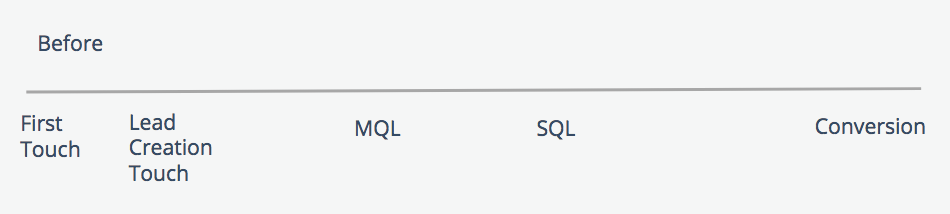

# ブーメランステージとタッチポイント {#boomerang-stages-and-touchpoints}

>[!AVAILABILITY]
>
>ブーメラン機能は、Tier 2 および 3 のお客様のみが使用できます。 上位のアカウント層をリクエストするには、Adobeアカウントチーム（アカウントマネージャー）にお問い合わせください。

[!DNL Marketo Measure] ブーメランステージ機能をリリースしました！ ブーメランステージ機能は、次の顧客のジャーニーをより明確に把握できるように作成されました [!DNL Marketo Measure] 販売サイクルが長いお客様。 この機能を使用すると、マーケターは、商談ジャーニーで発生するすべてのステージ遷移（連絡先 MQL がその後 SAL に移動し、その後 MQL ステージに戻った場合など）に対してタッチポイントを作成できます。 連絡先が「MQL ステージに再エントリ」または「re-MQL」した場合、MQL はブーメランステージと見なされます。 ブーメランステージ機能は、と同時に使用できます [!DNL Marketo Measure] カスタムステージ。

## この機能の機能 {#what-this-feature-does}

* 商談のジャーニーで発生するすべてのステージ遷移に対して「ブーメラン」タッチポイントを作成
* 任意のカスタムステージ間の繰り返しトランジションをトラッキングします（例： コンタクト先 MQL が SAL に移動し、MQL ステージに戻る場合）
* 商談に含めるステージ遷移のセットとその数（例： 最初の 10 個の MQL または最後の 5 個の MQL）
* カスタムモデルユーザーの場合は、これらの各ステージに割り当てるアトリビューションの重み付けとクレジットの割合（例： アトリビューションの重み付けを最初または最後の MQL 発生に指定するか、アトリビューションの重み付けをすべての発生に均等に分散させます）。

>[!NOTE]
>
>[ブーメランステージの設定方法の説明](/help/advanced-marketo-measure-features/boomerang/setting-up-boomerang-stages.md).

## CRM でのブーメランステージとタッチポイントの概要 {#what-boomerang-stages-and-touchpoints-look-like-in-your-crm}

ブーメランステージ（「前」）がない場合、リード/連絡先レコードに関連付けられた最新の MQL または最新の SQL タッチポイントのみが表示されます。

ブーメランステージとタッチポイントを使用すると、ステージ移行ごとに発生するタッチポイントを確認できます。 これらのブーメランタッチポイントの命名規則は次のとおりです。

**[ステージ名]-00。**

次の例を使用すると、次のようになります [!DNL Marketo Measure] アカウントは、ブーメランステージに MQL と SQL を含めており、ステージごとに 2 つのブーメランタッチポイントを表示することを選択しています。

**MQL-01** は最初の MQL ステージ移行です。

タッチポイント位置の数値は、ステージ遷移が発生した順序を示します。 最後のブーメランタッチポイントは、次のようにスタンプされます。

MQL-02 **（前回）**

## ブーメランステージによる既存データの変更方法 {#how-boomerang-stages-change-your-existing-data}

ブーメランステージの影響：

**チャネル別アトリビューション**

* 以降 [!DNL Boomerang Stages] により多くのタッチポイントが作成されます。これにより、現在データに存在するタッチポイント間でのアトリビューションの配分方法が変更されます。 その結果、売上高の値がマーケティングチャネル間でシフトする場合があります。 実装する前に考慮してください [!DNL Boomerang stages]または、アカウントマネージャーに詳細をお問い合わせください。

**「次に等しい」を使用するすべてのレポート [タッチポイント位置]“**

* ブーメランステージは、新しいタッチポイントの位置をデータに導入します。 [!DNL Marketo Measure] は、「MQL-01」や「MQL-05 （最後）」など、ステージの発生を含めるようにタッチポイント位置の形式を変更しています。 この例を使用すると、ブーメランステージは、「タッチポイントの位置が MQL と等しい」を使用しているすべてのレポートに影響を与えます。 これらのレポートを調整するには、フィルターに代わりに「contains」演算子を使用する必要があります。

## よくある質問 {#faq}

**アトリビューションモデルに含めることができるブーメランステージはいくつですか？**

最大 15 のステージを選択できます。

**Q: 1 つのステージに含めることができる「ブーメラン」タッチポイントの数**

1 ステージにつき最大 10 個の boomerang タッチポイントを選択できます。

**Q なぜブーメランが 10 回までしか出ないのですか？**

[!DNL Marketo Measure] 処理時間を制御するために、ステージ数を制限する必要があります。 アトリビューションモデルに 15 のブーメランステージをすべて含め、1 ステージあたり 10 のブーメランタッチポイントを含めることを選択した場合、リード/連絡先レコードあたり 150 を超えるタッチポイントがある可能性があります。

**Q:Data Warehouseがあります。 すべてのデータを取得できますか？それとも、ブーメランステージキャップも適用されますか？**

この上限は、の処理制限により、Data Warehouseと CRM に適用されます。 [!DNL Marketo Measure] が実施されている。 また、Data Warehouseには、ステージごとの 10 個のタッチポイントの制限も表示されます。

**Q：カスタムモデリングでブーメランステージを使用する利点は何ですか？**

使用 [!UICONTROL ブーメラン] カスタムモデリングを使用したステージでは、アトリビューションの重み付けを次の項目に割り当てることができます [!UICONTROL ブーメラン] タッチポイント：これらのステージに収益実績を割り当てます。

カスタムモデリングを使用しない場合、 [!DNL Marketo Measure] は、ブーメランとステージ遷移ごとにタッチポイントを作成しますが、これらのタッチポイントにアトリビューションクレジットを割り当てません。 アトリビューションクレジットを受け取るブーメランタッチポイントは、送信タッチポイントのみです。 カスタムモデルがない場合、 [!DNL Boomerang] タッチポイントは「ミドルタッチ」と同じと見なされ、それに応じてアトリビューションクレジットを受け取ります。
