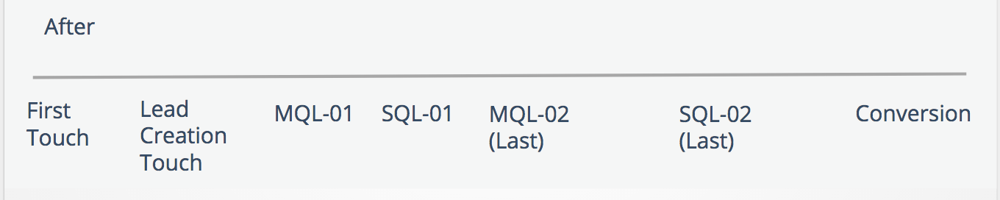

# ブーメランステージとタッチポイント {#boomerang-stages-and-touchpoints}

>[!AVAILABILITY]
>
>ブーメラン機能は、Tier 2 および 3 のお客様のみが使用できます。 上位のアカウント層をリクエストするには、Adobe アカウントチーム（アカウントマネージャー）にお問い合わせください。

[!DNL Marketo Measure] がブーメランステージ機能をリリースしました！ ブーメランステージ機能は、販売サイクルの長い [!DNL Marketo Measure] 顧客のジャーニーをより明確に把握するために作成されました。 この機能を使用すると、マーケターは、商談ジャーニーで発生するすべてのステージ遷移（連絡先 MQL がその後 SAL に移動し、その後 MQL ステージに戻った場合など）に対してタッチポイントを作成できます。 連絡先が「MQL ステージに再エントリ」または「re-MQL」した場合、MQL はブーメランステージと見なされます。 ブーメランステージ機能は、[!DNL Marketo Measure] のカスタムステージと連携して動作します。

## この機能の機能 {#what-this-feature-does}

* 商談のジャーニーで発生するすべてのステージ遷移に対して「ブーメラン」タッチポイントを作成
* 任意のカスタムステージ間の繰り返しトランジションをトラッキングします（例： コンタクト先 MQL が SAL に移動し、MQL ステージに戻る場合）
* 商談に含めるステージ遷移のセットとその数（例： 最初の 10 個の MQL または最後の 5 個の MQL）
* カスタムモデルユーザーの場合は、これらの各ステージに割り当てるアトリビューションの重み付けとクレジットの割合（例： アトリビューションの重み付けを最初または最後の MQL 発生に指定するか、アトリビューションの重み付けをすべての発生に均等に分散させます）。

>[!NOTE]
>
>[&#x200B; ブーメランステージの設定方法の説明 &#x200B;](/help/advanced-marketo-measure-features/boomerang/setting-up-boomerang-stages.md)

## CRM でのブーメランステージとタッチポイントの概要 {#what-boomerang-stages-and-touchpoints-look-like-in-your-crm}

ブーメランステージ（「前」）がない場合、リード/連絡先レコードに関連付けられた最新の MQL または最新の SQL タッチポイントのみが表示されます。

ブーメランステージとタッチポイントを使用すると、ステージ移行ごとに発生するタッチポイントを確認できます。 これらのブーメランタッチポイントの命名規則は次のとおりです。

**[ステージ名 ]-00.**

次の例では、この [!DNL Marketo Measure] アカウントは、ブーメランステージに MQL と SQL を含めており、ステージごとに 2 つのブーメランタッチポイントを表示することを選択しています。

**MQL-01** は、最初の MQL ステージ移行です。

タッチポイント位置の数値は、ステージ遷移が発生した順序を示します。 最後のブーメランタッチポイントは、次のようにスタンプされます。

MQL-02 **（前回）**

## ブーメランステージによる既存データの変更方法 {#how-boomerang-stages-change-your-existing-data}

ブーメランステージの影響：

**チャネルによる帰属**

* [!DNL Boomerang Stages] がより多くのタッチポイントを作成するので、現在データに存在するタッチポイント間でのアトリビューションの配分方法が変更されます。 その結果、売上高の値がマーケティングチャネル間でシフトする場合があります。 [!DNL Boomerang stages] を実装する前にこの点を考慮するか、アカウントマネージャーに詳細を問い合わせてください。

**「次と等しい [ タッチポイントポジション ]」を使用するすべてのレポート**

* ブーメランステージは、新しいタッチポイントの位置をデータに導入します。 タッチポイント位置の形式を変更して、「MQL-01」や「MQL-05 （最後）」などのステージの発生を含めよ [!DNL Marketo Measure] としています。 この例を使用すると、ブーメランステージは、「タッチポイントの位置が MQL と等しい」を使用しているすべてのレポートに影響を与えます。 これらのレポートを調整するには、フィルターに代わりに「contains」演算子を使用する必要があります。

## よくある質問 {#faq}

**アトリビューションモデルに含めることができるブーメランステージはいくつですか？**

最大 15 のステージを選択できます。

**Q:1 つのステージに設定できる「ブーメラン」タッチポイントの数を教えてください。**

1 ステージにつき最大 10 個の boomerang タッチポイントを選択できます。

**Q なぜブーメランが 10 回までしか出ないのですか？**

処理時間 [!DNL Marketo Measure] 制御するために、ステージ数を制限する必要があります。 アトリビューションモデルに 15 のブーメランステージをすべて含め、1 ステージあたり 10 のブーメランタッチポイントを含めることを選択した場合、リード/連絡先レコードあたり 150 を超えるタッチポイントがある可能性があります。

**Q:Data Warehouseを持っています。 すべてのデータを取得することはできますか？それとも、ブーメランステージキャップも適用されますか？**

この上限は、設定されている処理制限により、Data Warehouseと CRM に適用さ [!DNL Marketo Measure] ます。 Data Warehouseには、1 ステージあたり 10 個のタッチポイントという制限もあります。

**Q：カスタムモデリングでブーメランステージを使用する利点は何ですか？**

カスタムモデリングで [!UICONTROL &#x200B; ブーメラン &#x200B;] ステージを使用すると、アトリビューションの重み付けを [!UICONTROL &#x200B; ブーメラン &#x200B;] タッチポイントに割り当てることができ、これにより、これらのステージに収益クレジットが割り当てられます。

カスタムモデリングを使用しない場合、[!DNL Marketo Measure] はブーメランとステージ遷移ごとにタッチポイントを作成しますが、これらのタッチポイントに属性クレジットを割り当てません。 アトリビューションクレジットを受け取るブーメランタッチポイントは、送信タッチポイントのみです。 カスタムモデルがない場合、[!DNL Boomerang] タッチポイントは「ミドルタッチ」と同じと見なされ、それに応じて属性クレジットを受け取ります。
