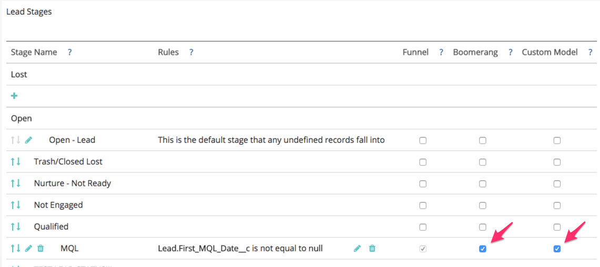
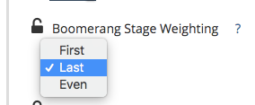

# ブーメランステージの設定 {#setting-up-boomerang-stages}

有効にするには [!UICONTROL ブーメラン] アカウントのステージの場合は、アカウント管理者である必要があります。 または、 [Marketoサポート](https://nation.marketo.com/t5/support/ct-p/Support){target=&quot;_blank&quot;}。 この機能を有効にしたら、次の手順に従って設定してください。

## ブーメランステージ設定 {#boomerang-stage-setup}

1. に移動します。 [!UICONTROL ステージマッピング]. 「[!UICONTROL ブーメラン]」と入力し、追跡するステージの横にあるボックスを選択します。

   

1. 次に移動： [!UICONTROL 属性設定] タブに移動し、表示する各ステージのタッチポイント数を入力します。 最大 10 個を許可します。 デフォルトは 1 に設定されています。

   

1. 「**[!UICONTROL 保存]**」をクリックします。

   >[!NOTE]
   >
   >これらの変更に従ってデータが再処理されるまで 24 ～ 48 時間かかります。

## カスタムモデル属性を使用したブーメランステージの設定 {#boomerang-stage-setup-with-custom-model-attribution}

1. に移動します。 [!UICONTROL ステージマッピング]. 「[!UICONTROL ブーメラン]」と入力し、追跡するステージの横にあるボックスを選択します。

   

1. また、これらのブーメランステージをカスタムモデルに含め、属性クレジットを受け取る場合は、「[!UICONTROL カスタムモデル]」列に表示されます。

   

1. 次に移動： [!UICONTROL 属性設定] タブをクリックします。 ブーメランステージの属性の重み付け方法を決定します。 オプションでは、最初のオカレンスのアトリビューションに重みを付けるか、最後のオカレンスで重みを付けるか、すべてのオカレンスに均等に分割します。

   

1. 表示する各ステージの発生回数を入力します。 最大 10 個まで許可されます。 デフォルトは 1 に設定されています。

   

1. カスタムモデルに含めるブーメランステージに割り当てるアトリビューションの割合を設定します。 すべてのステージのアトリビューションの合計が 100%まで増えるようにしてください。 クリック **[!UICONTROL 保存して処理]**.

   

   >[!NOTE]
   >
   >これらの変更に従ってデータが再処理されるまで 24 ～ 48 時間かかります。
