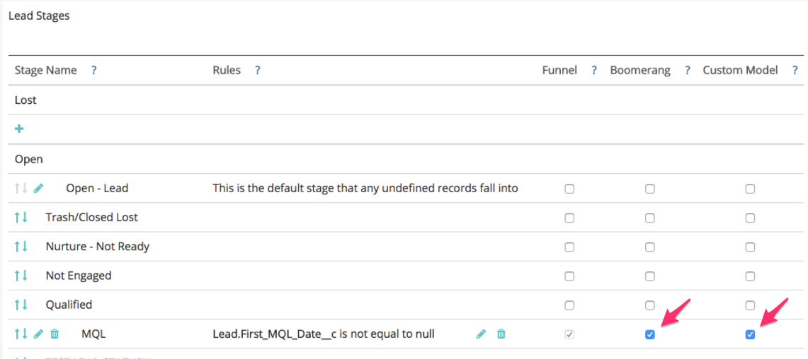
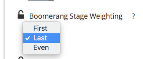
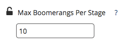
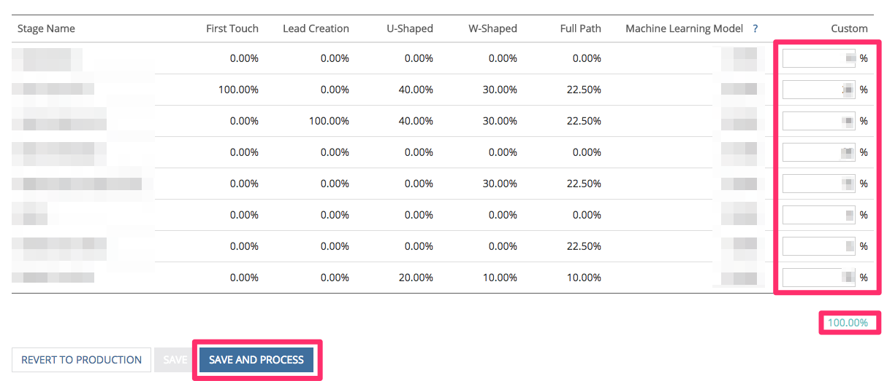

# ブーメランステージの設定 {#setting-up-boomerang-stages}

>[!AVAILABILITY]
>
>Boomerang機能は、Tier 2のお客様に対してのみ有効です。 より高いレベルのアカウントをリクエストするには、Adobe アカウントチーム（担当のアカウントマネージャー）にお問い合わせください。

アカウントの[!UICONTROL Boomerang] ステージを有効にするには、アカウント管理者である必要があります。 または、[Marketo サポート ](https://nation.marketo.com/t5/support/ct-p/Support){target="_blank"}に連絡して有効にすることもできます。 機能を有効にした後、次の手順に従って設定します。

## ブーメランのステージ設定 {#boomerang-stage-setup}

1. [!UICONTROL  ステージマッピング ]に移動します。 「[!UICONTROL Boomerang]」というタイトルの列で、追跡するステージの横にあるボックスを選択します。

   

1. 「[!UICONTROL  アトリビューション設定]」タブに移動し、表示する各ステージのタッチポイントの数を入力します。 最大10個まで指定できます。 デフォルトは1に設定されています。

   

1. 「**[!UICONTROL 保存]**」をクリックします。

   >[!NOTE]
   >
   >これらの変更に従ってデータを再処理するには、24～48時間かかります。

## カスタムモデルアトリビューションによるブーメランステージの設定 {#boomerang-stage-setup-with-custom-model-attribution}

1. [!UICONTROL  ステージマッピング ]に移動します。 「[!UICONTROL Boomerang]」というタイトルの列で、追跡するステージの横にあるボックスを選択します。

   

1. これらのブーメランのステージをカスタムモデルに含め、アトリビューションクレジットを受け取りたい場合は、必ず「[!UICONTROL  カスタムモデル ]」列の下にあるボックスも選択してください。

   

1. 「[!UICONTROL  アトリビューション設定]」タブに移動します。 ブーメラン段階におけるアトリビューションに対する重み付けを決定します。 オプションは、最初に発生したアトリビューション、最後に発生したアトリビューションに重みを付けるか、すべてのオカレンスに均等に分割することです。

   

1. 表示したい各ステージの出現回数を入力します。 最大10個まで指定できます。 デフォルトは1に設定されています。

   

1. カスタムモデルに含まれているBoomerang ステージに割り当てるアトリビューションの割合を設定します。 すべての段階の合計アトリビューションが最大100%になります。 「**[!UICONTROL 保存して処理]**」をクリックします。

   

   >[!NOTE]
   >
   >これらの変更に従ってデータを再処理するには、24～48時間かかります。
