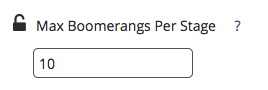

# ブーメランステージの設定  {#setting-up-boomerang-stages}

>[!AVAILABILITY]
>
>ブーメラン機能は、Tier 2 および 3 のお客様のみが使用できます。 上位のアカウント層をリクエストするには、Adobeアカウントチーム（アカウントマネージャー）にお問い合わせください。

を有効にする [!UICONTROL ブーメラン] アカウントの段階。アカウント管理者である必要があります。 または、に連絡して有効にすることもできます。 [Marketo サポート](https://nation.marketo.com/t5/support/ct-p/Support){target="_blank"}. この機能を有効にした後は、次の手順に従って設定します。

## ブーメランステージの設定 {#boomerang-stage-setup}

1. に移動 [!UICONTROL ステージマッピング]. 「」という列の下[!UICONTROL ブーメラン]」を選択して、追跡するステージの横にあるボックスを選択します。

   

1. に移動します [!UICONTROL アトリビューション設定] タブをクリックして、表示する各ステージのタッチポイントの数を入力します。 最大 10 まで許可します。 デフォルトは 1 に設定されています。

   

1. 「**[!UICONTROL 保存]**」をクリックします。

   >[!NOTE]
   >
   >これらの変更に従ってデータが再処理されるまで、24～48 時間かかります。

## カスタムモデル属性を使用したブーメランステージの設定 {#boomerang-stage-setup-with-custom-model-attribution}

1. に移動 [!UICONTROL ステージマッピング]. 「」という列の下[!UICONTROL ブーメラン]」を選択して、追跡するステージの横にあるボックスを選択します。

   

1. これらのブーメランステージをカスタムモデルに含めて、アトリビューションクレジットを受け取る場合は、必ず「」の下のボックスも選択してください[!UICONTROL カスタムモデル]「」列です。

   

1. に移動します [!UICONTROL アトリビューション設定] タブ。 ブーメランステージのアトリビューションに重み付けする方法を決定します。 オプションは、最初のオカレンス、最後のオカレンスにアトリビューションの重みを付けるか、すべてのオカレンスにアトリビューションを均等に分割するかです。

   

1. 表示する各ステージの出現回数を入力します。 最大 10 個まで許可できます。 デフォルトは 1 に設定されています。

   

1. カスタムモデルに含めたブーメランステージに割り当てるアトリビューションパーセンテージを設定します。 すべてのステージの合計アトリビューションが最大 100% になるように調整します。 クリック **[!UICONTROL 保存して処理]**.

   

   >[!NOTE]
   >
   >これらの変更に従ってデータが再処理されるまで、24～48 時間かかります。
