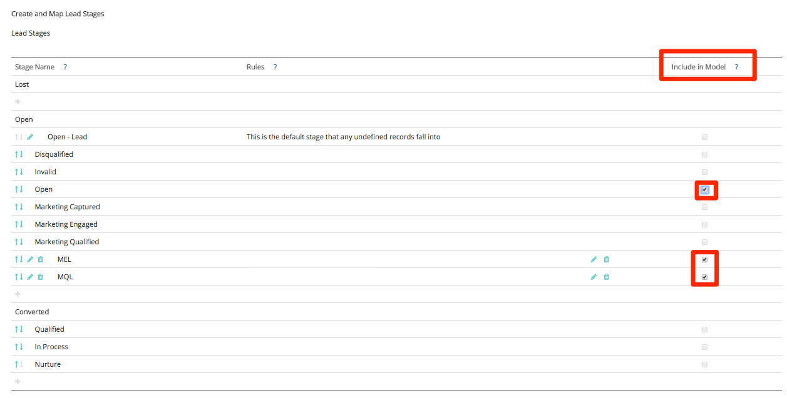
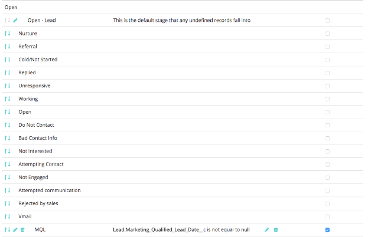
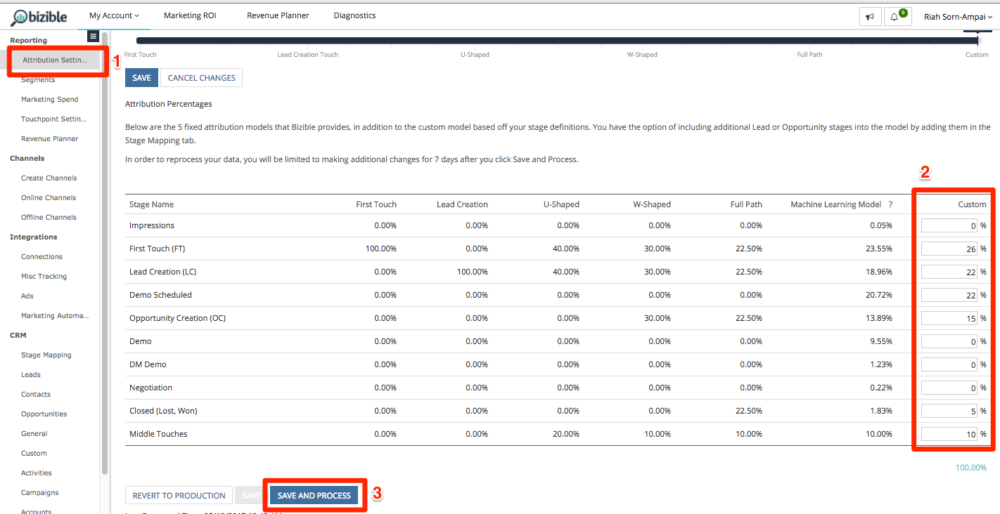
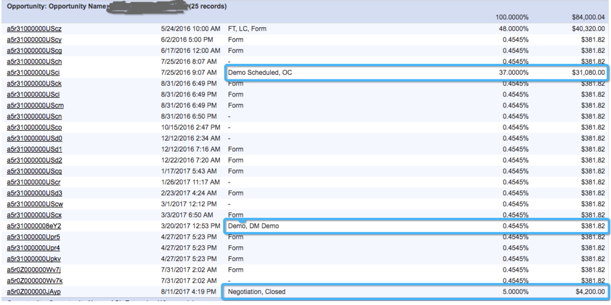
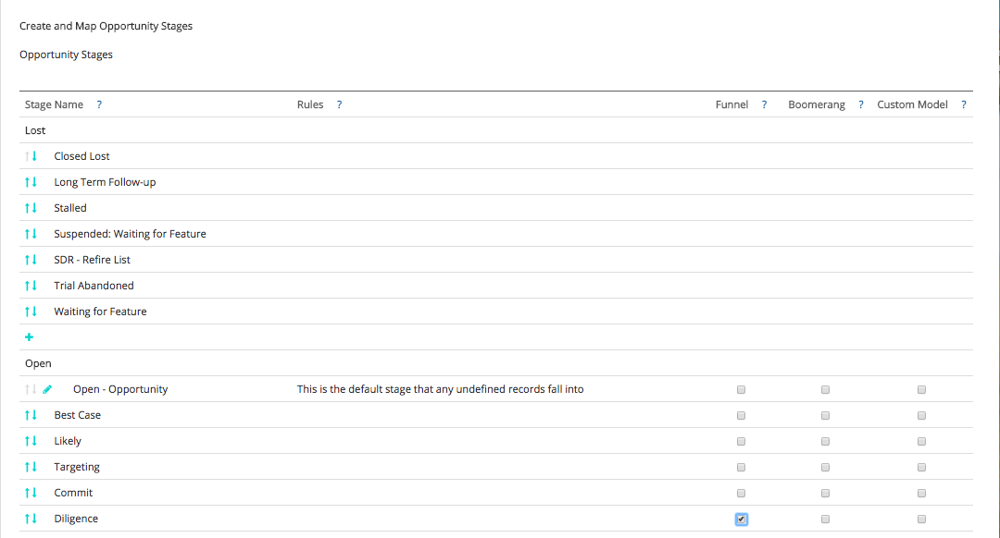

# カスタムアトリビューションモデルと設定 {#custom-attribution-model-and-setup}

[!DNL Marketo Measure] カスタムアトリビューションモデルの概要と設定方法については、以下を参照してください。

## カスタムアトリビューションモデル {#custom-attribution-model}

[!DNL Marketo Measure] カスタムアトリビューションモデルでは、ユーザーがモデルに含めるタッチポイントまたはカスタムステージを選択できます。 ユーザーは、これらのタッチポイントとステージに起因する収益クレジットの割合を制御できます。または、[!DNL Marketo Measure] マシンラーニングモデルによって提案されたアトリビューションの割合の値を使用できます。

## カスタムアトリビューションモデルの設定方法 {#how-to-set-up-your-custom-attribution-model}

1. カスタムモデルに含めるステージを決定します。

   カスタムアトリビューションモデルの構築を始めるには、マーケティング部門にとって重要なステージを選択する必要があります。 [!DNL Marketo Measure]個のマイルストーンステージ（FT、LC、OC、クローズ）に加えて、カスタムモデルに追加できるリード/コンタクトのステータスまたは商談ステージは、最大6つまで追加できます。 たとえば、MQL ステージはカスタムモデルに含まれるのが一般的です。 マーケティング部門は、MQL ステージへの移行にどのような取り組みやチャネルを推進しているのかを把握したいと考えがちです。

   [experience.adobe.com/marketo-measure](https://experience.adobe.com/marketo-measure?lang=ja){target="_blank"}にログインします。 [!UICONTROL &#x200B; マイアカウント &#x200B;] > [!UICONTROL 設定] >に移動し、CRM セクションで「**[!UICONTROL ステージマッピング]**」を選択します。

   次に、「**[!UICONTROL モデルに含める]**」ボックスを選択して、含めるリード/取引先責任者と商談のステージを選択します。

   >[!NOTE]
   >
   >最大6つのカスタムステージを使用できます（デフォルトのFT、LC、OC、Closedは含まれません）。

   

   >[!NOTE]
   >
   >_すべての_ リード/取引先責任者および商談のステージは、ステージが非アクティブであるか、[!DNL Salesforce]で使用されなくなった場合でも、ここに表示されます。 これらのステージを削除する場合は、[!DNL Salesforce]でハード削除する必要があります。

   ステージを選択したら、ページの下部にある「**[!UICONTROL 保存とプロセス]**」ボタンを必ずクリックしてください。 ステージが「**[!UICONTROL アトリビューション設定]**」タブに表示され、各ステージにアトリビューションの割合を割り当てることができます。 カスタムステージは、Marketing Performance Suiteの需要ウォーターフォール内のリードまたは商談ステージにも表示されます。

   モデルに含める他のステージがあるが、[!UICONTROL &#x200B; リード/連絡先ステータス &#x200B;]または[!UICONTROL 商談ステージ &#x200B;] リストにない場合は、CRMのフィールドに基づいて独自のカスタムステージを定義できます。

   次の例では、カスタム「MQL」ステージが日付フィールドを使用して定義されています。 このルールでは、MQL日付フィールドが空でない場合は、MQLとみなし、カスタムモデルに含める必要があることを簡単に示しています。 カスタムステージを作成した後で並べ替えて、セールスサイクルの進行に沿えるようにすることも重要です。

   

   >[!CAUTION]
   >
   >カスタムフィールドの履歴トラッキングを有効にすることが重要です。

カスタムモデルでカスタムフィールドを使用する場合、フィールド履歴トラッキングをCRMで有効にする必要があります。 フィールド履歴トラッキングを有効にする手順については、[&#x200B; カスタムモデル設定：フィールド履歴トラッキングを有効にする](/help/advanced-marketo-measure-features/custom-attribution-models/custom-model-setup-enable-field-history-tracking.md)を参照してください。

1. カスタムモデルのアトリビューション率を決定します。

   [!DNL Marketo Measure] アプリの&#x200B;**[!UICONTROL アトリビューション設定]**&#x200B;に移動します。カスタムステージは、アトリビューションテーブルにここに表示されます。 アトリビューションテーブルには、すべての[!DNL Marketo Measure] アトリビューションモデルと、各モデルのアトリビューションの重み付けが表示されます。 最初の5つのモデルのアトリビューション率は固定されており、変更できません。

   「**[!UICONTROL カスタム]**」というラベルの付いた右端の列で、カスタムアトリビューションモデルの各ステージの重み付けの割合を設定できます。 カスタム列の下に各ステージの値を入力し、完了したら「**[!UICONTROL 保存して再処理]**」をクリックします。

   _カスタム_&#x200B;列の左側には、**[!DNL Marketo Measure]機械学習モデル**&#x200B;があります。 マシンラーニングモデルは、各カスタムステージで何が起こったのかに応じて、成約に至るまでの相対的重要度にもとづいてアトリビューションの重み付けを計算します。 機械学習モデルについて詳しくは、[機械学習モデル FAQ](/help/advanced-marketo-measure-features/custom-attribution-models/machine-learning-model-faq.md)を参照してください。

   

## タッチポイントの位置 {#touchpoint-positions}

アトリビューションの割合が保存され、処理された後、顧客接点は更新され、新しいステージとポジションを受け取ります。 ステージの移行前に最も最近発生したタッチポイントは、そのステージのクレジットを受け取ります（以下を参照）。 カスタムの重み付けや収益も再配分されます。

## Funnel ステージとカスタムモデルステージの違い {#the-difference-between-funnel-stages-and-custom-model-stages}

カスタムモデルを有効にしていない場合でも、Marketing Funnelでカスタムステージを表示できるようになりました。 これは、Funnelのステージ機能を利用することで実現します。 Funnelのステージでは、funnelにステージを追加できますが、その際にアトリビューションは表示されません。

Funnelのステージは、引き続きタッチポイントとして追跡され、CRM内のタッチポイントポジションとして表示されます。 カスタムモデルを導入していない場合、フォームへの入力が完了した場合、これらの顧客接点には引き続きミドルタッチアトリビューションが適用され（ミドルタッチでは10%）、web訪問であれば、アトリビューションのクレジットがゼロになります。

以下に示すように、FunnelのステージにDiligence ステージを含めました。 つまり、ポジションにDiligenceが含まれるタッチポイントがありますが、カスタムモデルが有効になっていない場合（最大10%）のみ、これらのタッチポイントにミドルタッチアトリビューションのクレジットが付与されます。

>[!NOTE]
>
>BAT カスタムモデルの動作は、カスタムモデルの中間接率を他のステージに均等に分割することです。ただし、中間接点は存在しません。
