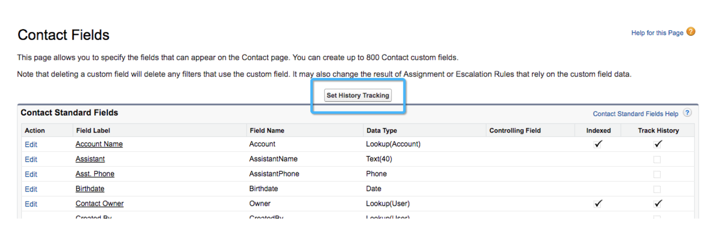
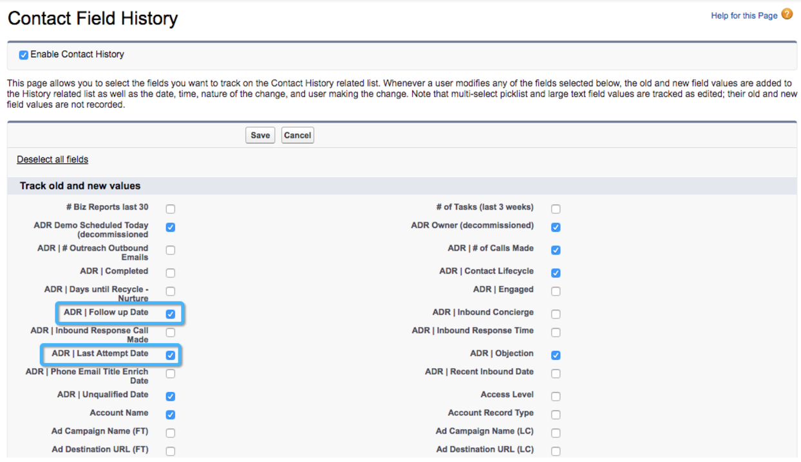

# カスタムモデル設定：フィールド履歴トラッキングの有効化 {#custom-model-setup-enable-field-history-tracking}

## フィールド履歴の追跡を有効にする理由とタイミング {#why-and-when-to-enable-field-history-tracking}

カスタム属性モデルにカスタムフィールドをステージとして含める場合、フィールド履歴の追跡をおこないます。 **は有効にする必要があります** を設定します。 フィールド履歴の追跡を有効にすると、 [!DNL Salesforce] 履歴追跡テーブルにレコードを作成することで、カスタムフィールドが編集された時点を追跡できます。 [!DNL Marketo Measure] は、このテーブルをダウンロードし、この情報を使用して「トランジション」が発生した日時を測定できます。 フィールド履歴の追跡がない場合、 [!DNL Marketo Measure] は、このフィールドに関連する変更を追跡できません。

次の場合のみ [!UICONTROL リードステータス] または、商談ステージがカスタムモデルで使用されている場合、フィールド履歴の追跡を有効にする必要はありません。これは、ステージ遷移として自動的に追跡されるからです。

フィールド履歴の追跡を有効にするには、以下の手順に従ってください。

## フィールド履歴の追跡を有効にする {#enable-field-history-tracking}

>[!NOTE]
>
>これらの変更をリード/連絡先/商談オブジェクトのフィールドに加えるには、システム管理者である必要があります。

1. カスタムフィールドが存在するオブジェクトに移動し、 **[!UICONTROL 履歴トラッキングを設定]** 」ボタンをクリックします。

   

1. 変更を追跡するフィールドを選択します。

   

[!DNL Marketo Measure] は、レコードが最近変更された場合にのみ、レコードを再読み込みできます。 数式フィールドは、バックグラウンドで計算されるので、レコードが変更されても、レコードは技術的には変更されません。 ルールがスキップされる問題が見られました。 [!DNL Marketo Measure] はレコードの変更を見なかったので、次をお勧めします。 **ルール定義で数式フィールドを使用しない**. 解決策は、テキストフィールドを作成し、ワークフローを使用して、レコードが編集されたり条件に合ったりしたときに、そのフィールドに適切な値や計算を入力することです。 この場合、ワークフローが古いレコードで遡って機能するように、すべてのレコードを編集する必要があります。
