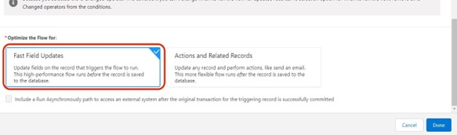
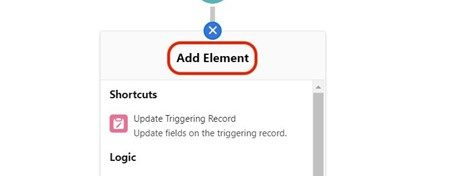

# カスタム収益額フィールドの使用 {#using-a-custom-revenue-amount-field}

デフォルトでは、購入者の属性タッチポイントは、次の 2 つのフィールドのいずれかから商談額を引き出します。

* 金額（SFDC デフォルト）
* [!DNL Marketo Measure] 商談額（カスタム）

商談のカスタムの「金額」フィールドを使用する場合は、購入者のタッチポイント売上高を計算するために、ワークフローを設定する必要があります。 これには、より高度な知識が必要です。 [!DNL Salesforce]の場合は、SFDC 管理者からの支援が必要になる場合があります。

最初に、次の情報が必要になります。

* 金額フィールドの API 名

ここから、ワークフローの作成を開始します。

## Salesforce Lightning でワークフローを作成 {#create-the-workflow-in-salesforce-lightning}

以下の手順は、Salesforce Lightning ユーザー向けです。 まだ Salesforce Classic を使用している場合は、次の手順に従います。 [次に示します。](#create-the-workflow-in-salesforce-classic).

1. 「設定」から「クイック検索」ボックスに「フロー」と入力し、を選択します。 **流れ** をクリックして、フロービルダーを起動します。 右側のパネルで、 **新規フロー** 」ボタンをクリックします。

   

1. 選択 **レコードトリガーフロー** をクリックし、 **作成** 」ボタンを右下にクリックします。

   

1. [ 開始の設定 ] ウィンドウで、商談オブジェクトを選択します。 設定トリガーで、 **レコードが作成または更新されました**.

   

1. 「エントリ条件の設定」セクションの「条件要件」で、 **カスタム条件ロジックが満たされています**.
   * 検索フィールドから、カスタムの「 Amount 」フィールドを選択します。
   * 演算子をに設定します。 **Is Null**、値は **False**.
   * 評価条件をに設定します。 **レコードが更新され、条件の要件を満たすたびに**.

   

1. 「フローを最適化」セクションで、 **フィールドの迅速な更新**. 「**完了**」をクリックします。

   

1. 要素を追加するには、プラス (+) アイコンをクリックし、 **トリガーレコードの更新**.

   

1. [ 新しいレコードの更新 ] ウィンドウで、次の情報を入力します。

   * ラベルを入力 — API 名が自動的に生成されます
   * 「更新するレコードを検索して値を設定する方法」で、 **フローをトリガーした商談レコードを使用**.
   * 「フィルター条件を設定」セクションで、 **常にレコードを更新** レコードを更新するための条件要件として。
   * 「キャンペーンレコードのフィールド値を設定」の「」フィールドで、「Marketo Measure商談の金額」を選択し、カスタムの「金額」フィールドに値を入力します。
   * 「**完了**」をクリックします。

   

1. 「**保存**」をクリックします。ポップアップが表示されます。 「フローを保存」ウィンドウに「フローラベル」と入力します（フロー API 名が自動的に生成されます）。 再度「**保存**」をクリックします。

   

1. 次をクリック： **有効化** ボタンをクリックして、フローをアクティブにします。

   

## Salesforce Classic でのワークフローの作成 {#create-the-workflow-in-salesforce-classic}

次の手順は、Salesforce Classic ユーザー向けです。 Salesforce Lightning に切り替えた場合は、次の手順に従います。 [は上にあります](#create-the-workflow-in-salesforce-lightning).

1. に移動します。 **[!UICONTROL 設定]** > **[!UICONTROL 作成]** > **[!UICONTROL ワークフローと承認]** > **[!UICONTROL ワークフロールール]**.

   

1. 選択 **[!UICONTROL 新規ルール]**&#x200B;をクリックし、オブジェクトを「商談」に設定して、 **[!UICONTROL 次へ]**.

   

   

1. ワークフローを設定します。 ルール名を「Update」に設定します。 [!DNL Marketo Measure] 商談の金額。」 評価条件を「作成済み、編集されるたびに」に設定します。 ルールの条件で、カスタムの「金額」フィールドを選択し、演算子を選択します。 [!UICONTROL 「次と等しくない」として] 「値」フィールドは空白のままにします。

   

1. ワークフローアクションを追加します。 この選択リストを&quot;[!UICONTROL 新しいフィールドの更新].&quot;
   

1. ここでフィールド情報を入力します。 「名前」フィールドでは、次の名前を使用することをお勧めします。[!DNL Marketo Measure] 商談額」 「一意の名前」は、「名前」フィールドに基づいて自動的に入力されます。 「更新するフィールド」の選択リストで、「[!DNL Marketo Measure] 商談の金額。」 フィールドを選択した後、「フィールドの変更後にワークフロールールを再評価」ボックスを選択します。 [ 新しいフィールド値の指定 ] で、[ 数式を使用して新しい値を設定する ] を選択します。 空のボックスに、カスタムの「Amount」フィールドの API 名をドロップします。 「**[!UICONTROL 保存]**」をクリックします。

   

1. ワークフローのロールアップページに戻ります。必ず「有効化」を選択してください。操作は完了です。 有効にするには、 **編集** 新しいワークフローの横にあるをクリックし、 **有効化**.

   これらの手順を完了したら、ワークフローに新しい値 ( [!UICONTROL カスタム商談] フィールドに入力します。

   これは、SFDC 内のデータローダーを通じて商談を実行することで実現できます。 でのデータローダーの使用の詳細を確認してください。 [この記事](/help/advanced-marketo-measure-features/custom-revenue-amount/using-data-loader-to-update-marketo-measure-custom-amount-field.md).

途中でご質問がある場合は、Adobeアカウントチーム（担当のアカウントマネージャー）に気軽にお問い合わせください。または [[!DNL Marketo] サポート](https://nation.marketo.com/t5/support/ct-p/Support){target="_blank"}.
