# カスタム収益額フィールドの使用 {#using-a-custom-revenue-amount-field}

デフォルトでは、Buyer Attribution Touchpointsは2つのフィールドのうちの1つから商談金額を引き出します。

* 金額（SFDCのデフォルト）
* [!DNL Marketo Measure]件の商談金額（カスタム）

商談でカスタム金額フィールドを使用している場合は、Buyer Touchpointの売上を計算するためにワークフローを設定する必要があります。 これには、[!DNL Salesforce]に関するより高度な知識が必要なため、SFDC管理者のサポートが必要になる場合があります。

まず、次の情報が必要です。

* 「金額」フィールドのAPI名

ここから、ワークフローの作成を開始します。

## Salesforce Lightningでのワークフローの作成 {#create-the-workflow-in-salesforce-lightning}

次の手順は、Salesforce Lightning ユーザー向けです。 Salesforce Classicを引き続き使用する場合、これらの手順[は以下のとおりです](#create-the-workflow-in-salesforce-classic)。

1. 「設定」から「フロー」をクイック検索ボックスに入力し、**[!UICONTROL フロー]**&#x200B;を選択してフロービルダーを開始します。 右側のパネルで、**[!UICONTROL 新規フロー]** ボタンをクリックします。

   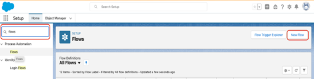

1. **[!UICONTROL レコードをトリガーしたフロー]**&#x200B;を選択し、右下の&#x200B;**[!UICONTROL 作成]**&#x200B;をクリックします。

   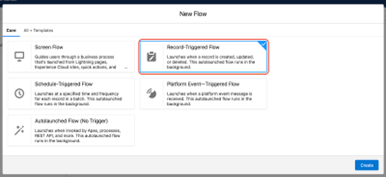

1. 「開始の設定」ウィンドウで、「商談」オブジェクトを選択します。 「[!UICONTROL トリガーの設定]」セクションで、「**[!UICONTROL レコードが作成または更新されました]**」を選択します。

   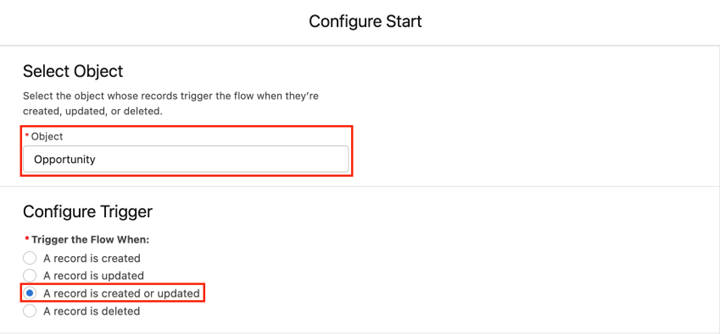

1. 「エントリ条件を設定」セクションの「[!UICONTROL 条件要件]」で、「**[!UICONTROL カスタム条件ロジックが満たされています]**」を選択します。
   * 検索フィールドから、カスタム金額フィールドを選択します。
   * 演算子を&#x200B;**Is Null**、値を&#x200B;**[!UICONTROL False]**&#x200B;に設定します。
   * レコードが更新され、条件要件&#x200B;**を満たすたびに、評価条件を**&#x200B;に設定します。

   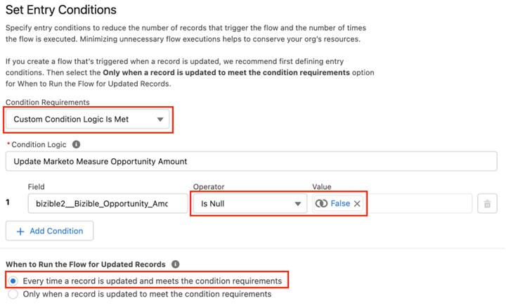

1. 「フローの最適化」セクションで、**[!UICONTROL 高速フィールド更新]**&#x200B;を選択します。 右下の「**[!UICONTROL 完了]**」をクリックします。

   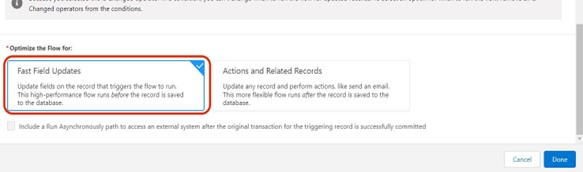

1. 要素を追加するには、プラス（+）アイコンをクリックし、**[!UICONTROL トリガーレコードの更新]**&#x200B;を選択します。

   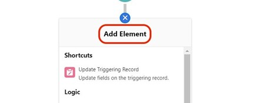

1. 「新規レコード更新」ウィンドウで、次のように入力します。

   * ラベルを入力 – API名が自動的に生成されます
   * 「更新するレコードを検索して値を設定する方法」で、**[!UICONTROL フローをトリガーした商談レコードを使用する]**&#x200B;を選択します。
   * 「[!UICONTROL &#x200B; フィルター条件を設定]」セクションで、「**[!UICONTROL 常にレコードを更新]**」をレコードを更新するための条件要件として選択します。
   * 「[!UICONTROL &#x200B; キャンペーンレコードのフィールド値を設定]」フィールドで、Marketo Measureの商談金額（**bizible2__Bizible_Opportunity_Amount__c**）と値を選択します。 次に、カスタム金額フィールドを選択します。
   * 「**[!UICONTROL 完了]**」をクリックします。

   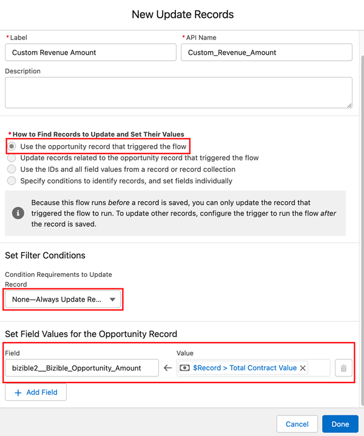

1. 「**[!UICONTROL 保存]**」をクリックします。 ポップアップが表示されます。 「フローを保存」ウィンドウで「フローラベル」と入力します（フローAPI名は自動的に生成されます）。 再度「**[!UICONTROL 保存]**」をクリックします。

   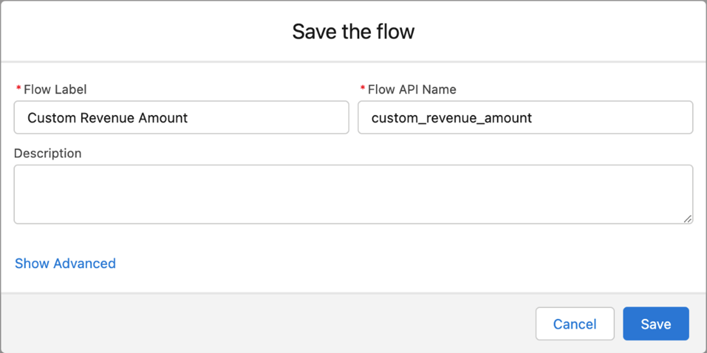

1. 「**[!UICONTROL アクティブ化]**」ボタンをクリックして、フローをアクティブ化します。

   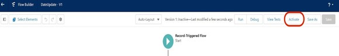

## Salesforce Classicでのワークフローの作成 {#create-the-workflow-in-salesforce-classic}

次の手順は、Salesforce Classic ユーザー向けです。 Salesforce Lightningに切り替えた場合は、上記の手順[を参照してください](#create-the-workflow-in-salesforce-lightning)。

1. **[!UICONTROL 設定]** > **[!UICONTROL 作成]** > **[!UICONTROL ワークフローと承認]** > **[!UICONTROL ワークフロールール]**&#x200B;に移動します。

   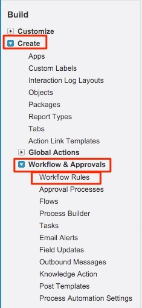

1. **[!UICONTROL 新しいルール]**&#x200B;を選択し、オブジェクトを「商談」に設定して、**[!UICONTROL 次へ]**&#x200B;をクリックします。

   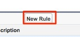

   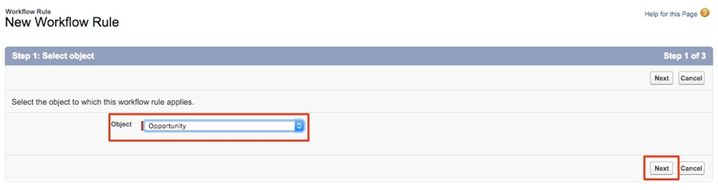

1. ワークフローを設定します。 ルール名を「Update [!DNL Marketo Measure] Opportunity Amount」に設定します。 評価条件を「作成され、編集されるたびに」に設定します。 ルール条件で、カスタム金額フィールドを選択し、演算子[!UICONTROL を「次と等しくない」 &#x200B;]として選択し、「値」フィールドを空白のままにします。

   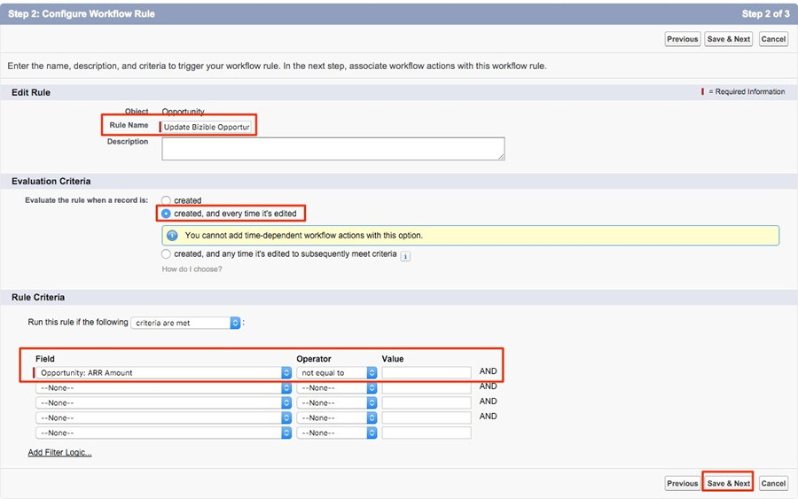

1. ワークフローアクションを追加します。 この選択リストを「[!UICONTROL 新規フィールド更新]」に設定します。
   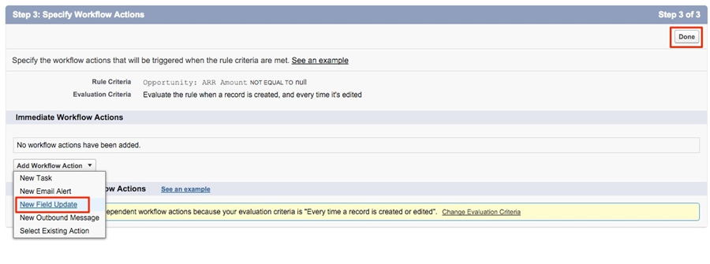

1. ここではフィールド情報を入力します。 「名前」フィールドでは、次の名前を使用することをお勧めします：「[!DNL Marketo Measure] Opp Amount」。 「一意の名前」フィールドに基づいて、「一意の名前」が自動的に入力されます。 「更新するフィールド」ピックリストで「[!DNL Marketo Measure] Opportunity Amount」を選択します。 フィールドを選択したら、「フィールド変更後のワークフロールールの再評価」ボックスを選択します。 「新しいフィールド値を指定」で、「数式を使用して新しい値を設定する」を選択します。 空のボックスに、カスタム金額フィールドのAPI名をドロップします。 「**[!UICONTROL 保存]**」をクリックします。

   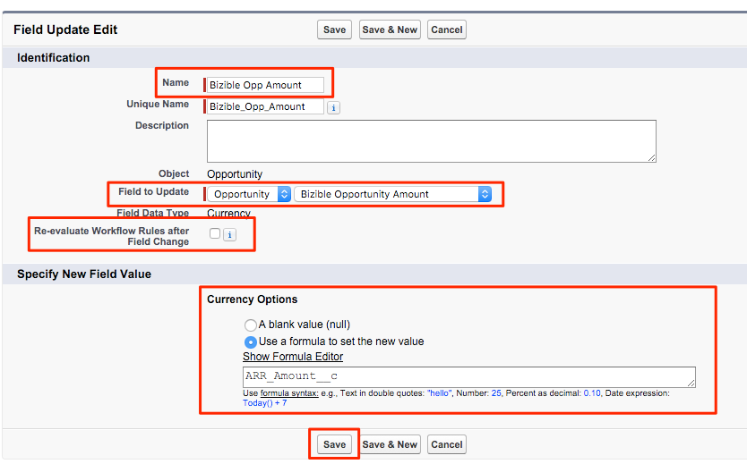

1. ワークフローのロールアップページに戻ります。必ず「アクティベート」し、問題ありません。 アクティブ化するには、新しいワークフローの横にある&#x200B;**[!UICONTROL 編集]**&#x200B;をクリックし、**[!UICONTROL アクティブ化]**&#x200B;をクリックします。

   これらの手順を完了したら、ワークフローをトリガーして[!UICONTROL &#x200B; カスタムオポチュニティ &#x200B;] フィールドから新しい値を取得するために、オポチュニティを更新する必要があります。

   これは、SFDC内のデータローダーを通じてオポチュニティを実行することで実現できます。 データ ローダーの使用に関する詳細については、[この記事](/help/advanced-marketo-measure-features/custom-revenue-amount/using-data-loader-to-update-marketo-measure-custom-amount-field.md){target="_blank"}を参照してください。

途中でご不明な点がある場合は、Adobe アカウントチーム（アカウントマネージャー）または[[!DNL Marketo]  サポート &#x200B;](https://nation.marketo.com/t5/support/ct-p/Support){target="_blank"}までお気軽にお問い合わせください。
