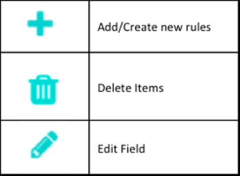

# カスタムセグメント化 {#custom-segmentation}

セグメントを使用すると、 [!DNL Marketo Measure] ROI ダッシュボードを使用して、特定のデータセットをさらに詳細に分析できます。 例えば、セグメントは地理的地域またはグレーディングシステムによって定義できます。

**カスタムセグメント化を使用する理由**

カスタムセグメントを使用すると、カテゴリ（フィルター名）とルール（フィルター値）でタッチポイントをフィルタリングできます。 第 1 層のお客様には 1 つのセグメントが割り当てられ、第 2 層以上には 10 のセグメントが割り当てられます。 ROI ダッシュが指すオブジェクト（リードまたは連絡先）に応じて、リード/連絡先オブジェクトで見つかったフィールドに基づいてセグメントを作成できます。 また、Opportunity オブジェクトで見つかったフィールドに基づいてセグメントを作成することもできます。

**カスタムセグメント化機能はいつ役立ちますか？**

カスタムセグメントは、特定のレコードタイプのデータを表示するために使用できます。 フィルターロジックをマッピングすると、 [!DNL Marketo Measure] ダッシュボードの Demand Watfarl 表示 — CRM に表示されるのと同じデータです。

**設定方法を教えてください。**

手順 1 — 表示する情報を決定します。

この機能を使用する前に、どのタッチポイント情報でフィルターしたいかを見つけ出します。 レコードタイプには、CRM の正確な値を必ず使用してください。 設定では、タッチポイントをマーケティングファネルの上部から下部にフィルタリングします。

手順 2 — ログインして、セグメント機能を探します。

* に移動します。 [experience.adobe.com/marketo-measure](https://experience.adobe.com/marketo-measure?lang=ja){target="_blank"} をクリックし、ログインします。
* の下 [!UICONTROL マイアカウント] タブ、選択 [!UICONTROL 設定]
* 選択 [!UICONTROL セグメント] サイドバーの左側の、 [!UICONTROL レポート] セクション

手順 3 — コンポーネントを理解します。

* この凡例を使用して、このページにある様々なアイコンを理解します

手順 4 — フィルタールールを追加します。

* まず、カテゴリ名を入力します。 ビジネスタイプがその一例です。 完了したら、チェックマークをクリックします。 セグメントを追加する前に、カテゴリ名を入力する必要があります
* プラス記号をクリックしてセグメントを追加する
* 「セグメント名」を入力します。 例えば、新規ビジネス、パートナー、更新、アップセル用のセグメントを 1 つ作成できます

* プラスアイコンをクリックすると、ルールの入力フィールドが表示されます。 フィールドピックリストのオプションは、CRM から直接フィールドを取り込みます

>[!NOTE]
>
>数式フィールドは、ルール内で使用できず、選択リストには表示されません。 数式はバックグラウンドで計算され、レコードは変更されないので、 [!DNL Marketo Measure] は、レコードがルールに適合するかどうかを検出できません。

* 「値」オプションはドロップダウンではなく、値を手動で入力する必要があります。 Salesforce 組織内の値を必ず確認してください
* 商談セグメントルールに対して、このプロセスを繰り返します。
* 「その他」カテゴリは、未定義のタッチポイントをすべて取り込むデフォルトのセグメントです。 デフォルトのセグメント名は変更できます
* ごみ箱アイコンをクリックすると、カテゴリ全体またはカテゴリ内の個々のルールが削除されます。 または、鉛筆アイコンをクリックして、カテゴリまたはルールを編集します
* 「保存」ボタンと「保存して処理」ボタンが表示されます。 「保存」ボタンを使用して、作業内容と変更内容を時間の経過と共に保存します。 「保存して処理」ボタンは、次の点を確認した場合にのみ使用します。

   * マッピングは正確です
   * 追跡するすべてのセグメントをカテゴリ内に追加しました
   * 「保存して処理」ボタンのトリガー [!DNL Marketo Measure] すべてのタッチポイントを同期し、追加した新しい情報を適用する。 この処理には 7 日かかり、この期間はルールを変更できません

**_追加情報：_**

リード/連絡先と商談の両方にルールが設定されていない場合、データの一部のみが表示されます。 詳細を説明するには、商談ルールを設定しない場合、リード/連絡先データのみが表示され、関連する商談は表示されません。 リード/連絡先のルールを設定しない場合も同様です。関連するリード/連絡先のない商談のみが表示されます。

完了したら、「 [!UICONTROL 保存] 最初に、すべてを確認し、次に「 [!UICONTROL 保存して処理]. 保存して処理する際、7 日間は設定を編集できないことに注意してください。 [!DNL Marketo Measure] は、この間にデータを再フォーマットしています。

Marketo Measure Ultimate のお客様で、デフォルトのダッシュボードオブジェクトを連絡先に設定している場合は、リード専用の次の 2 つのフィールド ([詳細はこちら](/help/marketo-measure-ultimate/data-integrity-requirement.md){target="_blank"}) をクリックします。

* b2b.personStatus
* b2b.isConverted

**生成したレポートを保存する方法を教えてください。**

生成したレポートは、ユーザーインターフェイスで直接保存できません。 しかし、 [!DNL Marketo Measure] はセグメント名を URL に保存し、ページにブックマークを付けて各レポートの記録を保持できるようにします。
