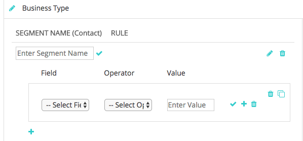
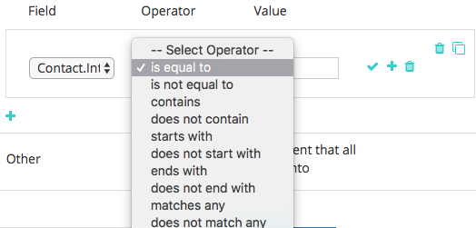

# カスタムセグメント化 {#custom-segmentation}

セグメントでは、特定のデータセットをさらにドリルダウンするために、[!DNL Marketo Measure] ROI ダッシュボードのデータをフィルタリングできます。 例えば、セグメントは地理的領域またはグレーディングシステムによって定義できます。

**カスタムセグメンテーションの理由？**

カスタムセグメンテーションを使用すると、カテゴリ（フィルター名）とルール（フィルター値）でタッチポイントをフィルタリングできます。 Tier 1の顧客は1つのセグメント、Tier 2の顧客は10を取得します。 ROI ダッシュが指すオブジェクト（リードまたは連絡先）に応じて、リード/連絡先オブジェクトにあるフィールドに基づいてセグメントを作成できます。 また、商談オブジェクトで見つかったフィールドに基づいてセグメントを作成することもできます。

**カスタムセグメンテーション機能はいつ役立ちますか？**

カスタムセグメンテーションを使用すると、特定のレコードタイプのデータを確認できます。 フィルターロジックをマッピングすると、[!DNL Marketo Measure] ダッシュボードのデマンドウォーターフォールビュー（CRMと同じデータ）に表示されます。

**どのように設定すればよいですか？**

>[!NOTE]
>
>セグメントルールを更新すると、過去のデータが再処理されます。

手順1 – 表示する情報を決定します。

この機能を利用する前に、フィルタリングするタッチポイント情報を決めます。 レコードタイプには、CRMの値を正確に指定することが重要です。 この設定では、マーケティングfunnelの上部から下部までのタッチポイントがフィルタリングされます。

手順2 - ログインして、[!UICONTROL  セグメント ]機能を見つけます。

* [experience.adobe.com/marketo-measure](https://experience.adobe.com/marketo-measure?lang=ja){target="_blank"}に移動してログインします
* 「[!UICONTROL  マイアカウント ]」タブで、[!UICONTROL 設定]を選択します
* [!UICONTROL  レポート ] セクションの左側にあるサイドバーのオプションから[!UICONTROL  セグメント ]を選択します

手順3 - コンポーネントの理解

* この凡例を使用して、このページに表示される様々なアイコンを理解します

手順4 - フィルタールールを追加します。

* まず、カテゴリ名を入力します。 [!UICONTROL  ビジネスタイプ ]はその一例です。 完了したら、チェックマークをクリックします。 セグメントを追加する前に、カテゴリ名を入力する必要があります
* プラス記号をクリックしてセグメントを追加します
* セグメント名を入力します。 たとえば、新規事業、パートナー、更新、アップセル用のセグメントを1つ作成できます

* プラスアイコンをクリックして、ルール入力フィールドを表示します。 フィールド選択リストのオプションでは、CRMから直接フィールドが取得されます

>[!NOTE]
>
>数式フィールドはルール内で使用できず、選択リストには表示されません。 数式はバックグラウンドで計算され、レコードは変更されないため、[!DNL Marketo Measure]はレコードがルールに適合するかどうかを検出できません。

* [!UICONTROL 値] オプションはドロップダウンではないので、値を手動で入力する必要があります。 Salesforce組織の値を確認してください
* このプロセスを商談セグメントルールに対して繰り返します
* 「その他」カテゴリは、未定義のタッチポイントをキャプチャするデフォルトのセグメントです。 デフォルトセグメントの名前は変更できます
* ごみ箱アイコンをクリックして、カテゴリ全体またはカテゴリ内の個々のルールを削除します。 または、鉛筆アイコンをクリックして、カテゴリまたはルールを編集します
* 「[!UICONTROL 保存]」ボタンと「保存と処理」ボタンがあることに注意してください。 「保存」ボタンを使用して、作業内容と時間の経過に伴う変更を保存します。 次のことを確認したら、「保存と処理」ボタンのみを使用します。

   * マッピングは正確です
   * 追跡したいセグメントがすべて追加されました
   * 「保存して処理」ボタンは、[!DNL Marketo Measure]をトリガーして、すべてのタッチポイントを同期し、追加した新しい情報を適用します。 このプロセスには7日かかり、この期間にルールを変更することはできません

**_追加メモ:_**

リード/コンタクトとオポチュニティの両方にルールが設定されていない場合は、データの一部のみが表示されます。 詳細に説明すると、商談ルールを設定しない場合は、商談に関連付けられていないリード/連絡先データのみが表示されます。 リード/取引先責任者のルールを設定しない場合も同様です。関連するリード/取引先責任者がない場合にのみ、商談が表示されます。

完了したら、最初に[!UICONTROL 保存]をクリックし、すべてを再確認してから、[!UICONTROL 保存と処理]をクリックします。 [!DNL Marketo Measure]がこの期間にデータを再フォーマットしているため、保存して処理してから7日間は設定を編集できません。

Marketo Measure Ultimateのお客様で、デフォルトのダッシュボードオブジェクトを「連絡先」に設定している場合は、リード（[詳細情報](/help/marketo-measure-ultimate/data-integrity-requirement.md){target="_blank"}）に固有の次の2つのフィールドを使用しないでください。

* b2b.personStatus
* b2b.isConverted

**生成されたレポートを保存するにはどうすればよいですか？**

生成されたレポートをユーザーインターフェイスに直接保存することはできません。 ただし、[!DNL Marketo Measure]はセグメント名をURLに保存するので、ページをブックマークして各レポートの記録を保持できます。
