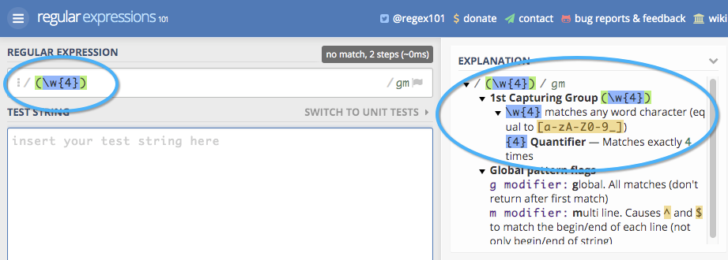

# Touchpointフィールド {#touchpoint-fields}

従来、お客様が [!DNL Marketo Measure] また、直接タグ付けを統合していない場合、カスタマーサクセスチームは、お客様に対し、正しい UTM 形式を利用して広告を解決できるように、ランディングページの適切なタグ付け方法を教えています。 UTM を使用しない顧客もいれば、独自のタグ付けパラメーターを使用するので、新しいタグ構造を使用してすべての広告ネットワークですべてのランディングページを編集するのに非常に時間がかかる場合があります。 [!DNL Marketo Measure] 強制。 タグ付け構造に適応するために、ルール定義にマッピングできるカスタムパラメーターを受け入れるようになりました。 目標は、顧客のカスタムトラッキングパラメーターの使用に適応し、URL 構造を変更する必要がないようにすることです。

>[!AVAILABILITY]
>
>階層 2 と階層 3 でフルセグメント化が利用可能になりました。

>[!NOTE]
>
>これは高度な機能で、Professional Services でのみ設定する必要があります。

## 機能の有効化 {#enabling-the-feature}

次の [!DNL Marketo Measure] 設定メニューで、タッチポイントフィールドページに移動します。 ここから、「 **はい** under **計算フィールドの有効化**. 有効にすると、タッチポイントフィールドを自由に作成できます。

## 方法 {#how-to}

計算フィールドを作成する場合、ユーザーが実行できるアクションは 3 つあります。を抽出し、にマッピングし、連結します。 これらは、計算フィールドを定義するための演算子とも呼ばれます。

抽出

抽出演算子は、次のような別の場所からフィールドの値を取り出します。「キャンペーン」フィールド、「リード」フィールド、またはより高度なユースケースでは、 [ランディングページからカスタムパラメーターを抽出](https://docs.google.com/document/d/1NRViyCsXvPKbCTfGW32Yi2vWBjMDRF7bzkzKj9s2DDA/edit?ts=5e20b482#heading=h.xxwtissvw4){target=&quot;_blank&quot;}。 次に、それをタッチポイントフィールドに配置します ( [例にマップ](https://docs.google.com/document/d/1NRViyCsXvPKbCTfGW32Yi2vWBjMDRF7bzkzKj9s2DDA/edit?ts=5e20b482#heading=h.xxwtissvw4){target=&quot;_blank&quot;} #2)。

**例#1**

顧客がレポート目的でタッチポイントにドロップしたい連絡先、campaign_source__c にカスタムフィールドがあります。 ルールを定義して、「キャンペーンのソース」と呼ばれる計算フィールドを作成し、そのフィールドに値をドロップできます。

目標：レポートを容易にするために、カスタムフィールドの値を使用して、タッチポイントオブジェクトに配置します。

* 計算フィールドを作成し、「キャンペーンのソース」というラベルを付けます。
* 「Contact.Campaign_Source__c」フィールドの検索から始めて、ルールを定義します
* パラメーターから値を取り出す必要があるので、演算子「extracts」を使用します。
* フィールドから完全な文字列を抽出するには、式「(.&#42;)&quot;

   * **(** 抽出の開始を示します
   * **)** 抽出の終了を示します
   * **.&#42;** 完全な文字列を抽出していることを示します

**例#2**

この機能で有効になる一般的な使用例は、URL 文字列のカスタムパラメーターから値を取り出す場合です。 これは、UTM 以外のパラメーターを使用し、タッチポイントフィールドに対する値を解析する場合に役立ちます。

**リンク：** `https://www.adobe.com/blog/marketing-revenue-reporting-overview?promo=5OFF` または `https://www.adobe.com/blog/marketing-revenue-reporting-overview?promo=25OFF`.\
**目標：** 「Discount Code」という名前のカスタムフィールドを作成し、値が渡された場合でも、値「5OFF」または「25OFF」にドロップします。

* 計算フィールドを作成し、&quot;割引コード&quot;というラベルを付けます
* 「Touchpoint.Session.LandingPage」フィールドの検索から始めて、ルールを定義します。
* パラメーターから値を取り出す必要があるので、演算子「extracts」を使用します。
* プロモーションの値を抽出するには、値を「promo=(\w+)」と定義します。

   * **(** 抽出の開始を示します
   * **)** 抽出の終了を示します
   * **\w** 0-9 を含む「単語」を抽出していることを示します
   * **+** は、文字に制限なくパラメーターの完全な値を抽出します
   * 現在、バックスラッシュではなくフォワードスラッシュを使用していることに注意してください

**例#3**

次のようなトラッキングコードを抽出した同様の例を見てみましょう。 `https://www.adobe.com/blog/marketing-revenue-reporting-overview?cid=123456`.

**目標：** 計算フィールドを作成し、 cid パラメーターの値を使用して「Adobe Campaign ID」というラベルを付けます。

* 計算フィールドを作成し、「Adobe Campaign Id」というラベルを付けます。
* 「Touchpoint.Session.LandingPage」フィールドの検索から始めて、ルールを定義します。
* パラメーターから値を取り出す必要があるので、演算子「extracts」を使用します。
* 「123456」値を抽出するには、値を「cid=(\d{6})」として定義します。

   * **(** 抽出の開始を示します
   * **)** 抽出の終了を示します
   * **\d** 「数字」を抽出していることを示します。
   * **{6}** は、抽出する文字数です

**例#4**

ランディングページがより複雑になり、複数のトラッキングパラメーターがあるので、次のように、複数のタッチポイントフィールドを作成して、値を複数回抽出する必要が生じる場合があります。
`https://www.adobe.com/blog/marketing-revenue-reporting-overview?trackID=123456&country=US&campaign_ID=7890`.

**目標：** 「ターゲット国」と「カスタムキャンペーン ID」の複数の計算フィールドを、それぞれのパラメーターの値と共に作成します。

* 計算フィールドを作成し、「ターゲット国」というラベルを付けます
* 「Touchpoint.Session.LandingPage」フィールドの検索から始めて、ルールを定義します。
* パラメーターから値を取り出す必要があるので、演算子「extracts」を使用します。
* 「US」値を抽出するには、値を「country=(\w{2})」として定義します。

   * **(** 抽出の開始を示します
   * **)** 抽出の終了を示します
   * **\w** 「単語」を抽出していることを示します
   * **{2}** は、抽出する文字数です

* 計算フィールドを作成し、「カスタムキャンペーン ID」というラベルを付けます。
* 「Touchpoint.Session.LandingPage」フィールドの検索から始めて、ルールを定義します。
* パラメーターから値を取り出す必要があるので、演算子「extracts」を使用します。
* 「123456」値を抽出するには、値を「campaign_ID=(\d{6})」として定義します。

   * **(** 抽出の開始を示します
   * **)** 抽出の終了を示します
   * **\d** 「数字」を抽出していることを示します。
   * **{6}** は、抽出する文字数です

**マッピング先**

「マップ先」演算子は、別の値に変換またはグループ化する必要がある値のテーブルを作成します。 通常、これはキー値の形式を取ります。コードはわかりやすい名前を表し、そのわかりやすい名前にマッピングする必要があります。

**例#1**

「夏の終わり」と「ブラックフライデーのプロモーション」用に作成したキャンペーンが複数のチャネルで実行されます。 「イニシアチブ」と呼ばれる計算フィールドを作成し、「夏のプロモーションの終わり」または「ブラックフライデープロモーション」のタッチポイントを、他の可能な値に加えて、「プロモーション」などのイニシアチブ値にマッピングします。

**例#2**

ここで、フィールドの抽出とマッピングの方法を学びました。これらのアクションを組み合わせて、最初にパラメーターから値を抽出し、次にわかりやすい名前にマッピングします。 次のランディングページから始めましょう。 `https://www.adobe.com/blog/marketing-revenue-reporting-overview?BZ=04-01-09-03-10`.

**目標：** 複数の計算フィールドを作成します。最初の数値は地域に、2 番目の数値は製品に、3 番目の数値はイニシアチブに、4 番目の数値はペルソナに、5 番目の数値はメディアプラットフォームにマッピングされます。 次に、数値を「わかりやすい名前」にマッピングします。

* 計算フィールドを作成し、&quot;Region&quot;というラベルを付けます。
* 「Touchpoint.Session.LandingPage」フィールドの検索から始めて、ルールを定義します。
* 演算子「[!UICONTROL 抽出]」と入力します。
* 「04」値を抽出するには、値を「BZ=(\d{2})-\d{2}-\d{2}-\d{2}-\d{2}-\d{2}-\d{2}」として定義します

   * **(** 抽出の開始を示します

      * 4 のみを抽出するので、最初の桁のみが始め丸括弧を持つことに注意してください
   * **)** 抽出の終了を示します

      * 4 のみを抽出するので、最初の桁のみが閉じ丸括弧を持つことに注意してください
   * **\d** 「数字」を抽出していることを示します。
   * **{2}** は、抽出する文字数です

* 「[!UICONTROL 保存]」をクリックします。新しいフィールドを次のルールで使用するには、その前に保存する必要があります。
* 次に、最初の桁のすべての可能な値を、わかりやすい名前にマッピングします
* 計算フィールドを作成し、&quot;Region_Name&quot;というラベルを付けます。
* 抽出したフィールドの検索から始めて、ルールを定義します。 この場合、Touchpoint.Region
* 演算子「[!UICONTROL マップ：]」という名前を付けます。
* 各マッピングをリストするテーブルが表示されます。 最終的には、次のようになります。
* マッピングと上記の URL に基づいて、このランディングページのタッチポイントの「Region_Value」は「EMEA」になります。
* 残りの 4 桁の桁に対して、抽出とマッピングを繰り返します

   * 01 を抽出するには、値を「BZ=\d{2} — 」と定義します。**(\d{2})**-\d{2}-\d{2}-\d{2}&quot;
   * 09 を抽出するには、値を「BZ=\d{2}-\d{2} — 」と定義します。**(\d{2})**-\d{2}-\d{2}&quot;
   * 03 を抽出するには、値を「BZ=\d{2}-\d{2}-\d{2}-\d{2}-**(\d{2})**-\d{2}&quot;
   * 10 を抽出するには、値を「BZ=\d{2}-\d{2}-\d{2}-\d{2}-\d{2} — 」と定義します。**(\d{2})**&quot;

**連結**

連結演算子は、複数のフィールドの値を 1 つのフィールドに結合します。 これは、様々なフィールドにわたるデータを取り込んで

**例#1**

Segment__c と Grade__c の Opportunity オブジェクトには、レポート目的で Touchpoint オブジェクト上の 1 つのフィールドに組み合わせたい別のフィールドがあります。 フィールドを連結すると、Enterprise_A や Mid-Market_B などの値が表示されます。

## タッチポイントフィールドとセグメント {#touchpoint-fields-and-segments}

URL からの値が解析され、タッチポイントに存在するようになったので、セグメントの作成やタッチポイント削除ルールの定義など、タッチポイントフィールドが使用されている場所に、新しいフィールドが表示されます。

この製品リリースでは、タッチポイントフィールドを使用してセグメントを作成する機能が利用できます。 以前は、タッチポイントフィールドを使用してセグメントを作成できませんでした。

セグメントの作成をより簡単にするために、作成したタッチポイントフィールドから動的なセグメントを作成できるようになりました。 例えば、地域ごとにセグメントを作成するのではなく、地域を解析したタッチポイントフィールドを作成した場合は、1 つのセグメントを設定して、インスタンスごとに新しい値が表示されるセグメントを作成します。 これは、郵便番号などの属性を解析してセグメントとして使用する必要がある場合に非常に役立ちます。

設定は、次のスクリーンショットのようになります。 セグメント名は、中括弧を使用してタッチポイントフィールドの値を動的に取り込み、フィールドを検索します。

ルールが同じタッチポイントフィールドを参照し、「null に等しくない」値を検索します。

## よくある質問 {#faq}

**作成できるタッチポイントフィールドの数は最大ですか？**

100 個のフィールドに制限されています。

**選択リストに作成した新しいタッチポイントフィールドが表示されません。 どこにある？**

ルールを作成した後は、忘れずにルールを保存してください。 新しいフィールドが表示されない場合は、保存したかどうかを確認します。 新しいフィールドを次のルールで使用するには、その前に保存する必要があります。

>[!NOTE]
>
>複雑さのレベルにより、「maps to」演算子を使用するタッチポイントフィールドを別のタッチポイントフィールドで使用することはできません。

**単一のランディングページから複数のパラメーターを抽出する際に使用する式は何ですか？**

「例を抽出」#4と同様に、複数のフィールドを作成して、各パラメーターを抽出する必要があります。 そのため、5 つの異なる値がある場合、それぞれを抽出する 5 つのタッチポイントフィールドを作成します。

**新しいフィールドがに表示されないのはなぜですか？ [!DNL Marketo Measure] スキーマ？**

新しいフィールドを [!DNL Marketo Measure] Data Warehouseスキーマ。 現時点では、フィールドは設定と設定を通じて公開されるので、セグメントの作成やタッチポイント削除ルールの作成でタッチポイントフィールドを使用できます。

**抽出した式が有効で正しい値を取り込んでいることを検証するには、どうすればよいですか？**

オンラインツール ([https://regex101.com/](https://regex101.com/){target=&quot;_blank&quot;}) を実行して、式をテストできます。 式は、有効な場合は緑、無効な場合は赤で表示されます。 また、右上の説明ボックスが役立ち、何を抽出しているかを示します。

