# Touchpoint フィールド {#touchpoint-fields}

従来、お客様が[!DNL Marketo Measure]にオンボーディングする際に、直接タグ付け統合がない場合、カスタマーサクセス チームは、適切なUTM形式を利用して広告を解決できるように、ランディングページに適切にタグ付けする方法について顧客に教育していました。 一部のお客様は、UTMを使用せず、独自のタグ付けパラメーターを使用しています。そのため、[!DNL Marketo Measure]が適用する新しいタグ付け構造を使用して、すべての広告ネットワークのすべてのランディングページを編集するには、非常に時間がかかります。 タグ付け構造に適応するために、ルール定義でマッピングできるカスタムパラメーターを受け入れるようになりました。 目標は、顧客のカスタムトラッキングパラメーターの使用に適応させることで、顧客がURL構造を変更する必要がないようにすることです。

>[!AVAILABILITY]
>
>Tier 2 サブスクリプションでは、フルセグメンテーションで利用できます。

>[!NOTE]
>
>これは高度な機能であり、Professional Servicesのみで設定する必要があります。

## 機能の有効化 {#enabling-the-feature}

[!DNL Marketo Measure]設定メニューから、タッチポイントフィールドページに移動します。 そこから、**計算フィールドを有効にする**&#x200B;で「**はい**」を選択して、この機能を有効にできます。 この機能を有効にすると、タッチポイントフィールドを作成できます。

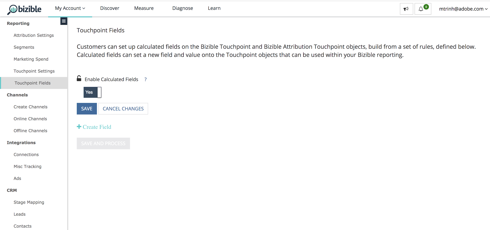

## 方法 {#how-to}

計算フィールドを作成するには、ユーザーが実行できる3つの異なるアクション（抽出、マッピング、連結）があります。 これらは、計算フィールドを定義するための演算子とも呼ばれます。

### 抽出 {#extracts}

[!UICONTROL extracts]演算子は、キャンペーンフィールド、リードフィールド、またはより高度なユースケースでは、ランディングページからカスタムパラメーターを抽出するなど、別の場所からフィールドの値を抽出します。 そして、タッチポイントフィールドに配置します。

**例#1**

連絡先、campaign_source__cに、レポート用にタッチポイントにドロップするカスタムフィールドがあります。 「Campaign Source」という計算フィールドを作成するためのルールを定義し、そのフィールドに値をドロップできます。

目標：カスタムフィールドの値を使用し、タッチポイントオブジェクトに配置すると、レポートが簡単になります。

* 計算フィールドを作成し、「Campaign Source」というラベルを付けます
* Contact.Campaign_Source__c フィールドの検索から始めて、ルールを定義します
* パラメータから値を引き出す必要があるため、演算子「抽出」を使用してください
* フィールドから全文字列を抽出するには、式「（。&#42;）」を使用します。

   * **（**&#x200B;は抽出の開始を示します
   * **）**&#x200B;は抽出の終了をマークします
   * **.&#42;** 文字列を抽出し、文字列を

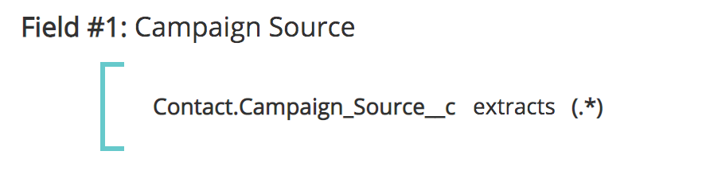

**例#2**

この機能を使用できる一般的なユースケースは、URL文字列のカスタムパラメーターから値を引き出すことです。 これは、UTM以外のパラメーターを使用する場合に、値をタッチポイントフィールドに解析する場合に便利です。

**リンク：** `https://www.adobe.com/blog/marketing-revenue-reporting-overview?promo=5OFF`または`https://www.adobe.com/blog/marketing-revenue-reporting-overview?promo=25OFF`。\
**目標：** 「割引コード」というカスタムフィールドを作成し、値「5OFF」または「25OFF」をドロップします。どのような値が渡されても同じです。

* 計算フィールドを作成し、「割引コード」というラベルを付けます
* Touchpoint.Session.LandingPage フィールドの検索から始めて、ルールを定義します
* パラメータから値を引き出す必要があるため、演算子「抽出」を使用してください
* プロモ – ションの価値を引き出すために、値を「promo=（\w+）」として定義します

   * **（**&#x200B;は抽出の開始を示します
   * **）**&#x200B;は抽出の終了をマークします
   * **\w**&#x200B;は、0-9を含む「単語」を抽出していることを伝えています
   * **+**&#x200B;は、文字に制限のないパラメーターの完全な値を抽出します
   * バックスラッシュではなく、フォワードスラッシュを使用していることに注意してください

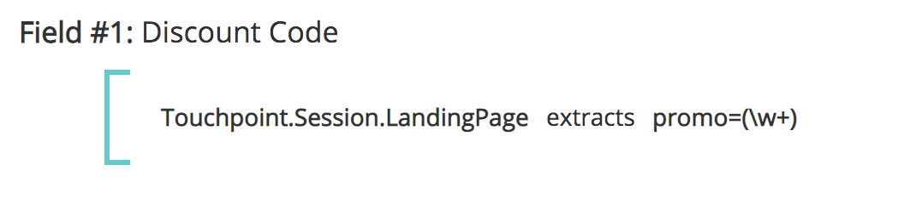

**例#3**

次のようなトラッキングコードを抽出する同様の例を試してみましょう：`https://www.adobe.com/blog/marketing-revenue-reporting-overview?cid=123456`。

**目標：**&#x200B;計算フィールドを作成し、cid パラメーターの値で「Adobe Campaign Id」にラベル付けします。

* 計算フィールドを作成し、「Adobe Campaign ID」というラベルを付けます
* Touchpoint.Session.LandingPage フィールドの検索から始めて、ルールを定義します
* パラメータから値を引き出す必要があるため、演算子「抽出」を使用してください
* 「123456」値を抽出するには、値を「cid=（\d{6}）」として定義します

   * **（**&#x200B;は抽出の開始を示します
   * **）**&#x200B;は抽出の終了をマークします
   * **\d**&#x200B;は、「桁」を抽出していることを伝えています
   * **{6}**&#x200B;は、抽出する文字数です

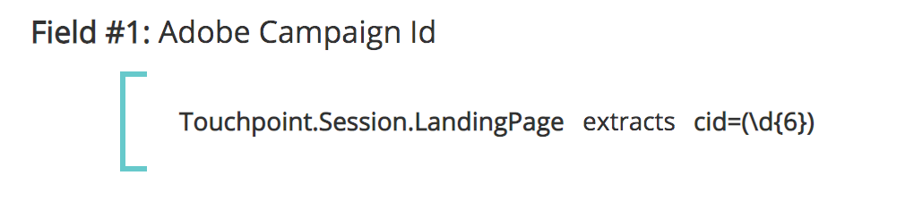

**例#4**

ランディングページが複雑になり、複数のトラッキングパラメーターを使用する場合、複数のタッチポイントフィールドを構築し、次のような値を複数回抽出する必要がある場合があります。
`https://www.adobe.com/blog/marketing-revenue-reporting-overview?trackID=123456&country=US&campaign_ID=7890`.

**目標：** パラメーターのそれぞれの値を使用して、「ターゲット国」と「カスタムキャンペーン ID」の複数の計算フィールドを作成します。

* 計算フィールドを作成し、「ターゲット国」というラベルを付けます
* Touchpoint.Session.LandingPage フィールドの検索から始めて、ルールを定義します
* パラメータから値を引き出す必要があるため、演算子「抽出」を使用してください
* 「US」値を抽出するには、値を「country=（\w{2}）」として定義します

   * **（**&#x200B;は抽出の開始を示します
   * **）**&#x200B;は抽出の終了をマークします
   * **\w**&#x200B;は、「単語」を抽出していることを伝えています
   * **{2}**&#x200B;は、抽出する文字数です

* 計算フィールドを作成し、「カスタムキャンペーン ID」というラベルを付けます
* Touchpoint.Session.LandingPage フィールドの検索から始めて、ルールを定義します
* パラメータから値を引き出す必要があるため、演算子「抽出」を使用してください
* 「123456」値を抽出するには、値を「campaign_ID=（\d{6}）」として定義します

   * **（**&#x200B;は抽出の開始を示します
   * **）**&#x200B;は抽出の終了をマークします
   * **\d**&#x200B;は、「桁」を抽出していることを伝えています
   * **{6}**&#x200B;は、抽出する文字数です

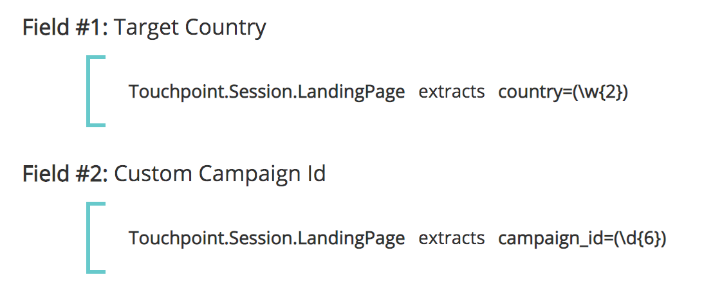

### マッピング先 {#maps-to}

[!UICONTROL  マップから]演算子は、変換または別の値へのバケット化が必要な値のテーブルを作成します。 通常、これはキー値の形式を取ります。コードはわかりやすい名前を表し、そのフレンドリ名にマッピングする必要があります。

**例#1**

「夏の終わりプロモーション」と「ブラックフライデープロモーション」のために作成したキャンペーンは、複数のチャネルをまたいで実行されます。 「イニシアチブ」という計算フィールドを作成し、「夏の終了プロモーション」または「ブラックフライデープロモーション」を含むタッチポイントを、その他の可能な値に加えて、「プロモーション」などのイニシアチブ値にマッピングする場合。

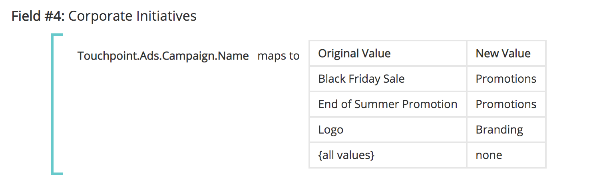

**例#2**

フィールドを抽出してマッピングする方法を学んだので、これらのアクションを組み合わせて、最初にパラメーターから値を抽出し、次に、もう少し意味のある親しみやすい名前にマッピングしましょう。 次のランディングページから始めましょう：`https://www.adobe.com/blog/marketing-revenue-reporting-overview?BZ=04-01-09-03-10`。

**目標：**&#x200B;複数の計算フィールドを作成します。最初の数値は地域に、2番目は製品に、3番目はイニシアチブに、4番目はペルソナに、5番目はメディアプラットフォームにマップします。 次に、数値を「わかりやすい名前」にマッピングします。

* 計算フィールドを作成し、「地域」というラベルを付けます
* Touchpoint.Session.LandingPage フィールドの検索から始めて、ルールを定義します
* パラメーターから値を引き出す必要があるため、演算子「[!UICONTROL extracts]」を使用します
* 「04」の値を抽出するには、値を「BZ=（\d{2}） – \d{2}-\d{2}-\d{2}-\d{2}」と定義します。

   * **（**&#x200B;は抽出の開始を示します

      * 4のみを抽出するため、最初の数字のみが開括弧を持つことに注意してください
   * **）**&#x200B;は抽出の終了をマークします

      * 4のみを抽出しているため、最初の数字のみが閉じた括弧を持っています
   * **\d**&#x200B;は、「桁」を抽出していることを伝えています
   * **{2}**&#x200B;は、抽出する文字数です

* 「[!UICONTROL 保存]」をクリックします。 次のルールで使用できるようにするには、新しいフィールドを保存する必要があります。
* 次に、最初の数字の可能なすべての値をわかりやすい名前にマッピングします
* 計算フィールドを作成し、「Region_Name」というラベルを付けます
* 抽出したフィールドの検索を開始して、ルールを定義します。 この場合、[!DNL Touchpoint.Region]
* 各数値の値へのマッピングを作成するには、演算子「[!UICONTROL  マップから]」を使用します
* 各マッピングを一覧表示するテーブルが表示されます。 最終的には、次のようになります。
* マッピングと上記のURLに基づいて、このランディングページを持つタッチポイントの「Region_Value」は「EMEA」になります
* 抽出と残りの4つの桁のマッピングを繰り返します

   * 01を抽出するには、値を「BZ=\d{2}-**（\d{2}）**-\d{2}-\d{2}-\d{2}」と定義します。
   * 09を抽出するには、値を「BZ=\d{2}-\d{2}-**（\d{2}）**-\d{2}-\d{2}」と定義します。
   * 03を抽出するには、値を「BZ=\d{2}-\d{2}-\d{2}-**（\d{2}）**-\d{2}」と定義します
   * 10を抽出するには、値を「BZ=\d{2}-\d{2}-\d{2}-\d{2}-**（\d{2}）**」と定義します。

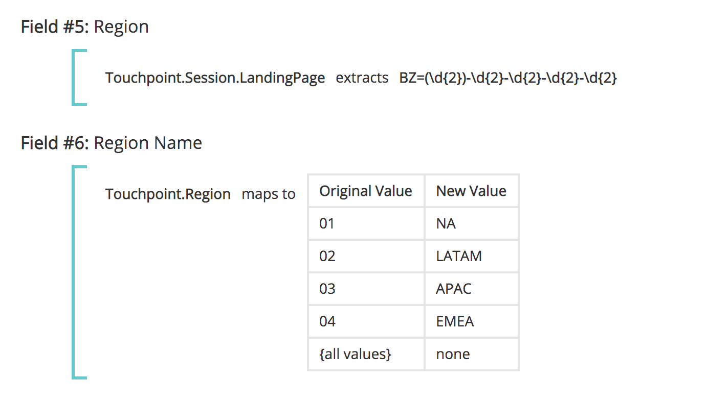

### 連結 {#concatenates}

[!UICONTROL concatenates]演算子は、複数のフィールドの値を1つのフィールドに結合します。 これは、様々なフィールドにまたがるデータを作成するためのカスタム値を作成するのに便利です。

**例#1**

セグメント__cおよびGrade__cのOpportunity オブジェクトには、レポート用にTouchpoint オブジェクト上の1つのフィールドに結合するフィールドが個別に存在します。 フィールドを連結すると、Enterprise_AやMid-Market_Bなどの値が表示されます。

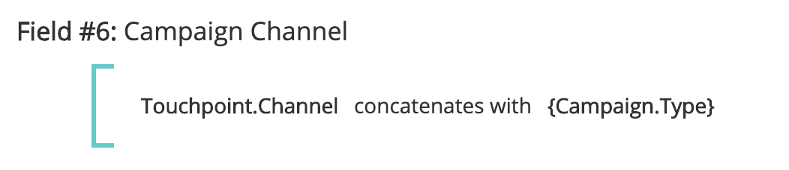

## タッチポイントフィールドとセグメント {#touchpoint-fields-and-segments}

URLの値が解析され、タッチポイントに存在するようになったので、セグメントの作成やタッチポイント削除ルールの定義など、タッチポイントフィールドが使用される場所に新しいフィールドが表示されます。

タッチポイントフィールドを使用してセグメントを作成する機能は、この製品リリースで使用できます。 以前は、タッチポイントフィールドでセグメントを構築できませんでした。

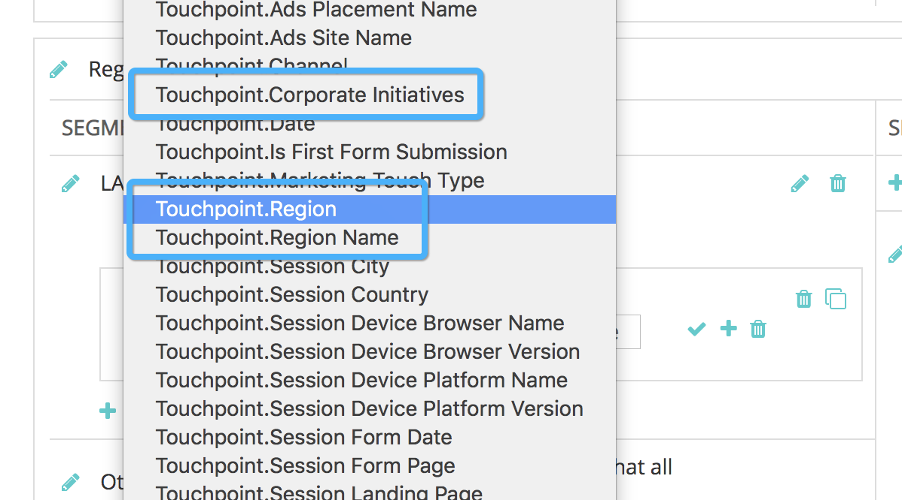

セグメントの作成を容易にするために、作成したタッチポイントフィールドから動的セグメントを作成できるようになりました。 例えば、地域ごとにセグメントを作成するのではなく、地域を解析するタッチポイントフィールドを作成した場合、1つのセグメントを設定すると、新しい値が表示されるたびにセグメントを作成します。 これは、郵便番号などの属性を解析してセグメントとして使用する必要がある場合に非常に便利です。

設定は下のスクリーンショットのようになります。 セグメント名では、中括弧を使用してタッチポイントフィールドの値が動的に取り込まれ、フィールドが検索されます。

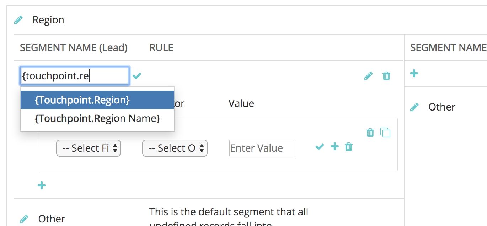

ルールは同じタッチポイントフィールドを参照し、「nullと等しくない」値を検索します。

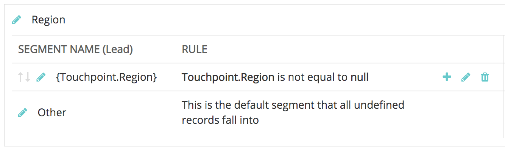

## よくある質問 {#faq}

**作成できるタッチポイントフィールドの最大数はありますか？**

最大100件のフィールドまでです。

**ピックリストで作成した新しいタッチポイントフィールドが表示されません。 どこですか？**

ルールを作成したら、ルールを保存することを忘れないでください。 新しいフィールドが表示されない場合は、保存したかどうかを確認します。 次のルールで使用できるようにするには、新しいフィールドを保存する必要があります。

>[!NOTE]
>
>複雑なレベルのため、「マップ先」演算子を使用するタッチポイントフィールドは、別のタッチポイントフィールドで使用できません。

**単一のランディングページから複数のパラメーターを抽出する式を選択してください。**

抽出の例#4と同様に、各パラメーターを抽出するには、複数のフィールドを作成する必要があります。 5つの異なる値がある場合は、5つのタッチポイントフィールドを作成して、それぞれに抽出します。

**新しいフィールドが[!DNL Marketo Measure] スキーマに表示されないのはなぜですか？**

[!DNL Marketo Measure] Data Warehouse スキーマで新しいフィールドを公開するには、さらに作業が必要です。 現時点では、フィールドは設定と設定によって公開されるため、セグメントの構築やタッチポイント削除ルールの作成でタッチポイントフィールドを使用できます。

**抽出式が有効で、正しい値を取得していることを検証するにはどうすればよいですか？**

式を実行してテストできるオンラインツール （[[!DNL https]://regex101.com/](https://regex101.com/){target="_blank"}）があります。 式が有効な場合は緑、無効な場合は赤で表示されます。 また、右上の[!UICONTROL 説明] ボックスは、抽出する内容を示す便利なボックスです。

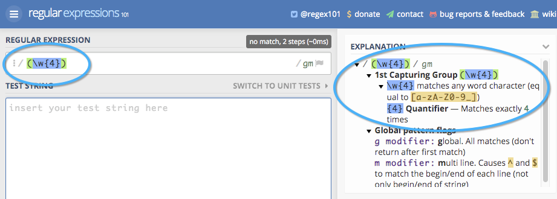

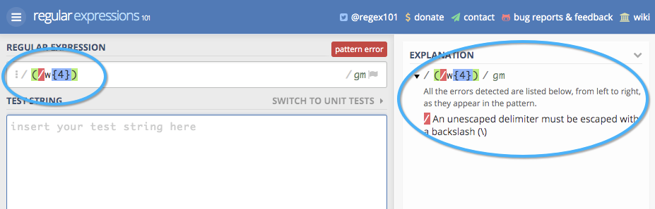
