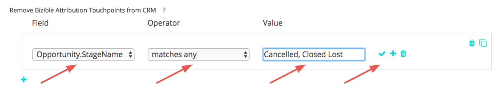
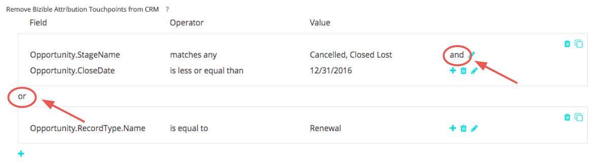
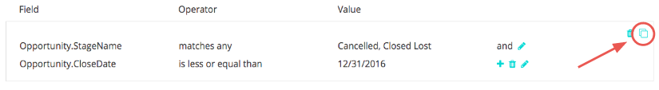
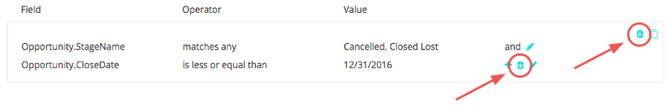
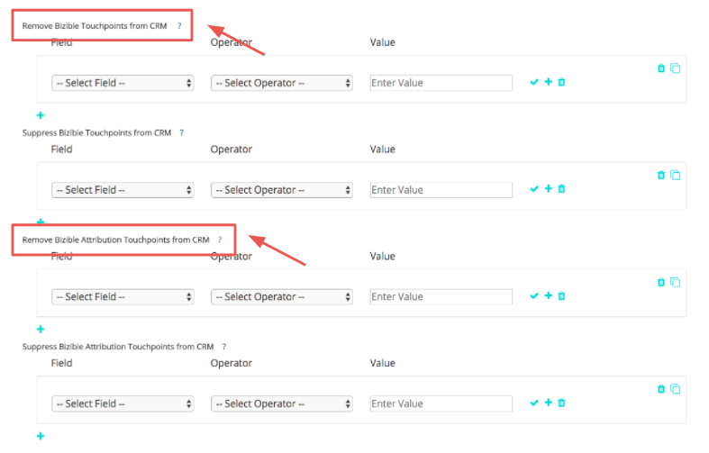

# Touchpoint の削除と Touchpoint の抑制 {#touchpoint-removal-and-touchpoint-suppression}

CRMから特定の条件を満たすタッチポイントを削除または除外する方法について説明します。 これは、[!DNL Salesforce]個のデータ ストレージの制限がある場合に、データ領域を解放するのに役立ちます。

タッチポイント削除ルールとタッチポイント抑制ルールの間には、重要な違いが1つあります。

* タッチポイントの削除 – [!DNL Marketo Measure]は、ルール条件に適合するタッチポイントをCRMから削除（つまり削除）します。 データ _can_&#x200B;は、[!DNL Marketo Measure] ROI ダッシュボード内でレポートできますが、CRM内ではレポートされません。
* タッチポイントの非表示 – タッチポイントの削除と同様ですが、ROI ダッシュボード内でデータを報告することはできません。

タッチポイントの削除/抑制ルールの作成を開始する前に、導入計画をマーケティングおよびセールスオペレーション部門と共有することをお勧めします。 削除するタイプや値について、既にアイデアが決まっているはずです。 一般的なユースケースには、次のようなものがあります。

* クローズした失注した商談からタッチポイントを削除
* 非常に古いリードからタッチポイントを削除
* 非適格リードから顧客接点を削除

ルールが保存されると、[!DNL Marketo Measure]はアトリビューションモデルをクリーンアップして再配布します。 これは、マイルストーンとポジションが変化し、チャネルのアトリビューションクレジットが変化することを意味します。 これによりデータが変更されるため、サポートが必要な場合はサクセスマネージャーにお問い合わせください。

`1)`削除/抑制の設定には2つのセクションがあります。 バイヤータッチポイント（リードと連絡先）またはバイヤーアトリビューションタッチポイント（連絡先、機会、アカウント）用に設定するオプションがあります。

まず、ルールを追加し、基準を定義するフィールドを選択します。

次の列に追加する次の値セットに関連する演算子のリストから選択します。

>[!TIP]
>
>フィールドに複数の値を追加するには、「任意の値に一致」演算子を使用して、各値を区切るコンマを使用します。

>[!TIP]
>
>フィールド内の空白またはNULL値を考慮するには、[!UICONTROL 値] ボックスを空のままにします。 これには、フォーム URLのないタッチポイントに対する評価などのシナリオが考慮されます。

>[!NOTE]
>
>数式フィールドはルール内で使用できず、選択リストには表示されません。 数式はバックグラウンドで計算され、レコードは変更されないため、[!DNL Marketo Measure]はレコードがルールに適合するかどうかを検出できません。

`2)`同じグループ内にルールを追加して、ステートメントで「AND」ロジックを利用します。
または、グループ外に新しいステートメントを追加して、ステートメントで「OR」ロジックを利用します。

`3)` ルールが複雑になり、グループを再作成して各ステートメントに小さな変更を加える必要がある場合は、[!UICONTROL &#x200B; クローン &#x200B;] オプションを使用して処理を簡単にします。

ミスをした場合でも、ご安心ください。 ステートメントの個々の行または完全なグループも削除できます。

`4)`両方のオブジェクトに適用するバイヤーアトリビューションタッチポイントのルールを設定します。 アドビの柔軟性では、1つのオブジェクトまたは両方のオブジェクトのルールを設定でき、両方のオブジェクトに適用される場合は、両方に設定できます。

最後に、[!UICONTROL &#x200B; ルールを保存して処理]します。 多くの変更を加える場合は、必ず変更を保存してください。 [!DNL Marketo Measure]は、クリックするまでタッチポイントの削除を開始しません
[!UICONTROL **保存して処理**]。

| **演算子** | **ユースケース** |
|---|---|
| 次と等しい | 単一の値 – 完全一致 |
| 次を含む | 単一の値 – 値を含む |
| 任意に一致 | 複数の値 – 完全一致 |
| 任意の（を含む）と一致 | 複数の値 – &#42;値&#42;、&#42;値、&#42;値&#42; |

Dynamicsを使用しているお客様で、ステータスやステートコードに基づいて抑制ルールを設定する場合は、ルールを設定する際に次の形式が必要です。`[Object].Statecode`は`[Status Value]`と等しいか、等しくありません。 例えば、Dynamics内のStatecodeが取引先責任者で「1」を読み取り、ステータスが「非アクティブ」を読み取り、そのような取引先責任者をすべて除外する場合、抑制ルールに対して次の形式が正しくありません。Contact.Statecodeが1に等しい。 代わりに、次の形式を使用します。StatecodeとStatusはペアとして動作するので、[!DNL Marketo Measure]はクエリでStatusから値を読み取ります：Contact.StatecodeはInactiveと等しいです。
