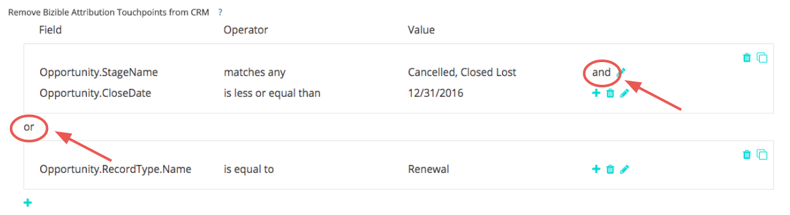
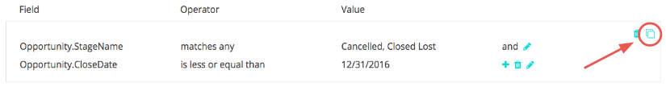

# Touchpoint の削除と Touchpoint の抑制 {#touchpoint-removal-and-touchpoint-suppression}

特定の条件を満たすタッチポイントを CRM から削除または抑制する方法を説明します。 これは、 [!DNL Salesforce] データストレージの制限。

タッチポイント削除ルールとタッチポイント抑制ルールには、主な違いが 1 つあります。

* タッチポイントの削除 — [!DNL Marketo Measure] は、ルール条件に適合するタッチポイントを CRM からパージ（つまり削除）します。 データ _can_ 内部で報告される [!DNL Marketo Measure] ROI ダッシュボードに表示されますが、CRM には表示されなくなりました。
* タッチポイント抑制 — タッチポイントの削除と同様ですが、ROI ダッシュボード内でデータを報告できません。

タッチポイントの削除/抑制ルールの作成を開始する前に、実装計画をマーケティングおよび販売オペレーションチームと共有することをお勧めします。 削除するタイプや値に関するアイデアが既に存在しているはずです。 一般的な使用例の一部を次に示します。

* クローズした損失商談からタッチポイントを削除
* 非常に古いリードからタッチポイントを削除
* 未適合のリードからタッチポイントを削除

ルールを保存したら、 [!DNL Marketo Measure] は、アトリビューションモデルをクリーンアップして再配布します。 これは、マイルストーンと位置が変更され、チャネルのアトリビューションクレジットが変更されることを意味します。 これによりデータが変更されるので、サポートが必要な場合はサクセスマネージャーにお問い合わせください。

`1)` 削除/抑制の設定には 2 つのセクションがあります。 これは、購入者タッチポイント（リードと連絡先）または購入者属性タッチポイント（連絡先、商談、アカウント）用に設定することができます。

まず、ルールを追加し、条件を定義する「フィールド」を選択します。

次の値のセットに関連する演算子のリストから選択します。次の列に追加します。

>[!TIP]
>
>1 つのフィールドに複数の値を追加するには、「任意に一致」演算子を使用し、各値をコンマで区切ります。

>[!TIP]
>
>フィールド内の空白または NULL 値を考慮するには、 [!UICONTROL 値] ボックスが空です。 これには、フォーム URL のないタッチポイントに対する評価などのシナリオが考慮されます。

>[!NOTE]
>
>数式フィールドは、ルール内で使用できず、選択リストには表示されません。 数式はバックグラウンドで計算され、レコードは変更されないので、 [!DNL Marketo Measure] は、レコードがルールに適合するかどうかを検出できません。

`2)` 同じグループ内にルールを追加して、ステートメントで「AND」ロジックを利用します。
または、グループ外に新しい文を追加して、文に「OR」ロジックを使用します。

`3)` ルールが複雑になり、グループを再作成して各文に小さな変更を加える必要がある場合は、 [!UICONTROL 複製] よりシンプルにするオプションを使用できます。

間違いを犯した場合は、心配しないでください。 ステートメントの個々の行や完全なグループも削除できます。

`4)` 両方のオブジェクトに適用する場合は、購入者属性タッチポイントのルールを設定します。 柔軟性により、1 つのオブジェクトまたは両方のオブジェクトに対してルールを設定でき、適用する場合は両方のオブジェクトに対してルールを設定することもできます。

終了するには、 [!UICONTROL 保存して処理] ルールを設定します。 多くの変更を加える場合は、途中で必ず「変更を保存」してください。 [!DNL Marketo Measure] タッチポイントの削除は、「
[!UICONTROL **保存して処理**].

| **演算子** | **使用例** |
|---|---|
| 次と等しい | 単一の値 — 完全一致 |
| 次を含む | 単一の値 — 値を含む |
| 任意に一致 | 複数の値 — 完全一致 |
| いずれかに一致（次を含む） | 複数の値 — &#42;値&#42;, &#42;値 &#42;値&#42; |

Dynamics を使用し、ステータスやステートコードに基づいて抑制ルールを設定するお客様の場合、ルールを設定する際には次の書式が必要です。 `[Object].Statecode` 次と等しい/等しくない `[Status Value]`. たとえば、Dynamics 内の Statecode が連絡先で&quot;1&quot;と読み取り、ステータスが&quot;非アクティブ&quot;と読み取られ、これらの連絡先をすべて抑制したい場合、抑制規則に対して次の形式が正しくありません： Contact.Statecode が 1 と等しい。 代わりに、次の形式を使用します。Statecode と Status はペアとして動作するので、 [!DNL Marketo Measure] は、問い合わせ中のステータスから値を読み取ります。Contact.Statecode が非アクティブと等しいです。
