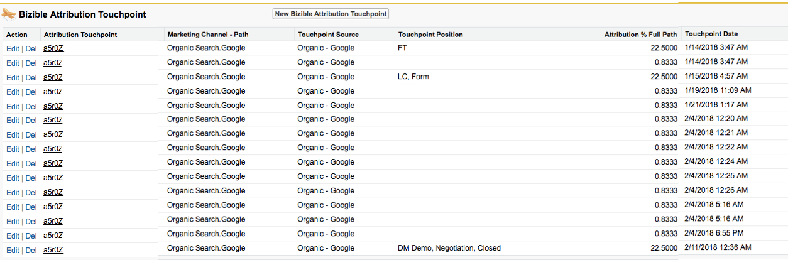

# タッチポイントを削除してはいけない理由 {#why-you-should-never-delete-touchpoints}

不適切な方法でアトリビューションクレジットが割り当てられている商談にタッチポイントが存在する場合は、アカウントマネージャーに連絡して次の手順を決定してください。 このような場合は、バイヤーズ顧客接点の抑制機能を使用して、SFDCとROI ダッシュボードから顧客接点を取り除くことをお勧めします。 アカウントマネージャーは、これらのルールの作成を支援します。 これらの顧客接点は、手作業で削除しないでください。

[!DNL Marketo Measure]処理システムは、タッチポイントがSFDCから手動で削除されたことを登録しません。 現在のところ、データを調整するためにシステムにシグナルを送るトリガーはありません。 [!DNL Marketo Measure]は、削除されたタッチポイントを置き換えるために別のタッチポイントを自動的にプッシュしません。また、タッチポイントの位置やアトリビューションを後続のタッチポイントに再割り当てしません。

タッチポイントが削除されると、アトリビューションデータに穴が開きます。 通常、これは商談のアトリビューション接点で表示されます。 下の画像では、商談作成タッチを受け取ったタッチポイントが削除されていました。 その結果、この商談にはOC タッチポイントが含まれておらず、この商談のアトリビューション率は合計で100%になりません。

タッチポイントがSFDCから削除された場合は、[Marketo サポート &#x200B;](https://nation.marketo.com/t5/support/ct-p/Support){target="_blank"}に連絡して、データの再インポートをリクエストしてください。
