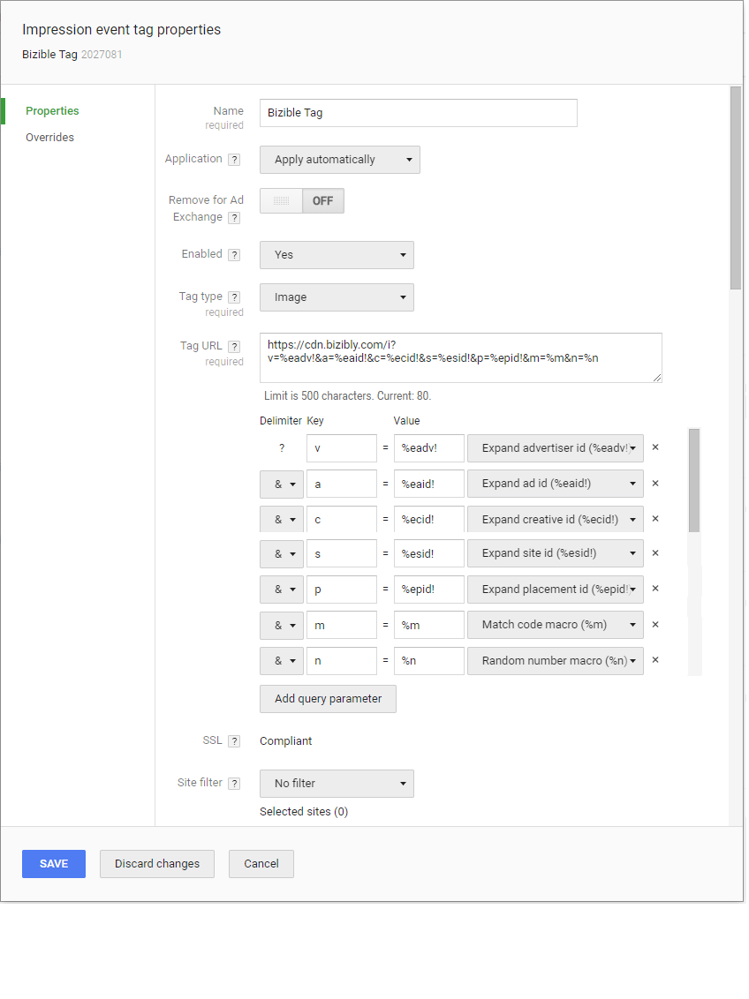

# Doubleclick Campaign Manager ビュースルーアトリビューションの設定 {#configuring-doubleclick-campaign-manager-view-through-attribution}

## アトリビューションによるビューの測定 {#measuring-view-through-attribution}

>[!IMPORTANT]
>
>プライバシーに関する懸念により、サードパーティ Cookie は廃止されます。 Google Chrome が 2024 年第 3 四半期に発表したサードパーティ Cookie の廃止は、事実上、この形式のトラッキングの終了を意味します。 その結果、アドビでは、サードパーティ Cookie に依存する Marketo Measure 機能、特に、Google／DoubleClick インプレッション Cookie を使用するクロスドメイントラッキングとビュースルーアトリビューションを廃止します。 Marketo Measure のその他の機能に影響はありません。 また、ファーストパーティ cookie の使用にも影響はありません。 Google のスケジュールを考慮すると、上記 2 つの機能の廃止予定日は 2024年6月1日（PT）です。 この日付より前に収集された関連データは、アドビのお客様が引き続き使用できます。

>[!NOTE]
>
>[!DNL Marketo Measure]と[!DNL DoubleClick Campaign Manager]の統合を使用している場合は、広告を解決するためにキャンペーンとクリエイティブの詳細をダウンロードできるように、[API接続](/help/api-connections/utilizing-marketo-measures-api-connections/integrated-ad-platforms.md#how-to-connect-ad-platforms)が必要です。

[!DNL Doubleclick Campaign Manager]を使用したトラッキングを通じて、表示からより詳細なinsightの取得を開始するには、トラッキングピクセルを設定する必要があります。

[!DNL Marketo Measure] ビュースルーアトリビューション機能について詳しくは、[Marketo Measure ビュースルーアトリビューション FAQ](/help/advanced-marketo-measure-features/view-through-attribution/marketo-measure-view-through-attribution-faq.md)を参照してください。

[!DNL Marketo Measure]はDCM広告タグを介したサードパーティ呼び出しであるため、ピギーバック タグと見なされます。 Piggyback タグは画像タグでは機能せず、iframeまたはjavascript タグのみです。 DCM サポートによると、これは最近変わっておらず、常にそうでした。 標準タグは2017年10月2日に廃止されましたが、[!DNL Marketo Measure]のインプレッションの追跡機能には影響しません。

DCMで親子階層を使用する場合は、インプレッションの追跡のために、すべてのレベルにタグを適用する必要があります。

## 画像タグの追加方法 {#how-to-add-the-image-tag}

広告主設定の下にあるDoubleclickにタグを追加し、インプレッションイベントタグを作成します。

1. 次のコードを1x1の画像ピクセルとして追加します。

`https://cdn.bizibly.com/i?v=%eadv!&a=%eaid!&c=%ecid!&s=%esid!&p=%epid!&m=%m&n=%n`

1. 追加したら、区切り記号が次のようにマッピングされていることを確認します。 タグが適用されると、これは自動的に行われます。

   v = %eadv![!DNL Expand] 広告主ID\
   a = %eaid! 広告IDを展開\
   c = %ecid! Creative IDを展開\
   s = %esid! サイト IDを展開\
   p = %epid! プレースメント IDを展開\
   m = %m Match Code マクロ\
   n = %n乱数マクロ

   

## よくある質問 {#faq}

**Q：画像タグは安全ですか？**

A：はい。 JavaScriptのタグではなく、画像のタグです。

**Q：接続されたユーザーに必要な権限は何ですか？**

A: dfatrafficking、dfareporting、userinfo.email

**Q：支出データの読み込みにどのくらいの時間がかかりますか？**

A:6時間まで

**Q：広告データの読み込みにどのくらいの時間がかかりますか？**

A:6時間まで
