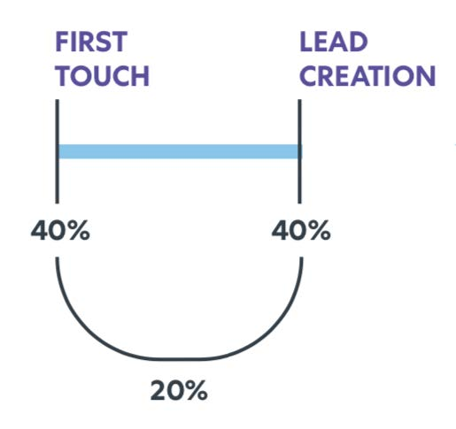
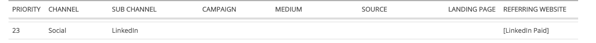
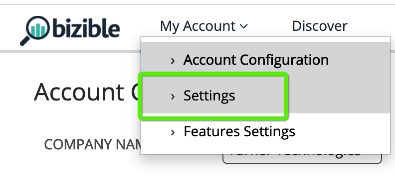
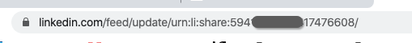

# LinkedInとの連携 {#linkedin-integration}

## 概要 {#overview}

LinkedInとの[!DNL Marketo Measure]統合は、次の2つの部分で構成されています。

スポンサーコンテンツ：スポンサーコンテンツ統合により、[!DNL Marketo Measure]は[!DNL LinkedIn]広告の宛先URLをタグ付けできます。これにより、[!DNL Marketo Measure]は最終的に、ユーザーのタッチポイントジャーニー全体を通じてユーザーをフォローし、特定の[!DNL LinkedIn] キャンペーンとCreativeにアクティビティをマッピングできます。 これにより、顧客の[!DNL LinkedIn] アクティビティのROIに関するインサイトが得られます。

リードジェネレーション Forms: LinkedInのリードジェネレーション Formsと統合することで、Marketo Measureは、LinkedInのプラットフォームを通じて送信されたフォームにinsightを取り込むことができます。 これらのフォーム入力は、アトリビューションの対象となるように、CRMまたは[!DNL Marketo Engage] インスタンスのリードと照合されます。 Adobe insightをAdobe Campaign、Adobe Creative、Adobe Experience Manager Formsに組み込み、フォームの生成を支援したことで、マーケティング部門と広告部門の支出をさらに最適化できるようになりました。

## 利用可能性 {#availability}

すべてのユーザーが利用できます。

## 要件 {#requirements}

### キャンペーンマネージャーの役割

[!DNL Marketo Measure]が広告データと広告コストデータをダウンロードするには、Campaign Managerに次のいずれかの役割が必要です。

* 課金管理者
* アカウントマネージャ
* Campaign Manager

詳細：[Campaign Managerのユーザーの役割と機能](https://www.linkedin.com/help/lms/answer/a425731/user-roles-and-functions-in-campaign-manager)。

### ペイドメディアの管理者の役割

[!DNL Marketo Measure]がスポンサークリエイティブを作成/更新できるようにするには、次のいずれかの有料メディア管理者の役割が必要です：

* スポンサードコンテンツポスター
* リードジェネレーション Forms Manager

詳細：[LinkedIn ページ管理者の役割](https://www.linkedin.com/help/linkedin/answer/4783/linkedin-page-admin-roles-overview)。

統合に&#x200B;**not**&#x200B;が必要とする他の[!DNL LinkedIn]個の役割があります。 これらの役割は、必要な役割と間違えられることが多いので、違いがあることに注意してください。

### ページ管理者の役割

[!DNL Marketo Measure]がリードジェネレーションフォームからリードをダウンロードまたは統合するには、次のページ管理者の役割が必要です。

* スーパー管理者

詳細：[LinkedIn ページ管理者の役割](https://www.linkedin.com/help/linkedin/answer/4783/linkedin-page-admin-roles-overview)。

## LinkedInの広告タイプ {#linkedin-ad-types}

[!DNL Marketo Measure]は次をサポートします：

スポンサードコンテンツを使用すると、会社をフォローしているメンバー以外のメンバーの[!DNL LinkedIn] フィードにコンテンツを配信できます。 スポンサードコンテンツは、特定のオーディエンスをターゲットにすることができ、広告主が[!DNL LinkedIn] メンバーに、デスクトップ、モバイル、タブレットをまたいで[!DNL LinkedIn] プラットフォームでエンゲージしているときにいつでもどこでもリーチするのに役立ちます。 Lead Gen Formsによるスポンサードコンテンツもサポートされています。

[!DNL Marketo Measure]がサポートするスポンサードコンテンツ広告の種類は、シングル画像広告とビデオ広告（リードジェネレーション Formsを通じて）です。 スキーマが複雑であるため、カルーセル広告はサポートされていません。

[!DNL Marketo Measure]は、スポンサードメッセージ、テキスト広告、または動的広告をサポートしていません。

をサポートしていません

>[!TIP]
>
>非スポンサー付きコンテンツソースから発生するキャンペーン/支出（「テキスト広告」または「スポンサー付きInMail」のキャンペーンタイプなど）については、[!DNL Marketo Measure]はこれらのキャンペーンタイプの追跡を本質的にサポートしていません&#x200B;_not_。 このようなキャンペーンの支出を「スポンサードコンテンツ」支出と一緒に追跡したい場合は、必ず当社のマーケティング支出CSVを使用して、その支出を手動で記録してください。

## 仕組み：スポンサードコンテンツ {#how-it-works-sponsored-content}

>[!NOTE]
>
>最初に使用する前に、[!DNL Marketo Measure] [!UICONTROL Settings] > [!UICONTROL Integrations] > [!UICONTROL Ads] > [!UICONTROL Enable LinkedIn Lead Gen Forms]に移動して、この機能設定を有効にする必要があります。

### [!DNL LinkedIn's]の固有の自動タグ付け要件

[!DNL Marketo Measure]は、ランディングページを自動タグ付けすることで、[!DNL LinkedIn] キャンペーンのパフォーマンスを追跡するのに役立ちます。

[!DNL Marketo Measure]は、一意のLinkedIn Shareを持つクリエイターを検索し、その末尾に`?_bl={creativeId}` パラメーターを追加します。

### 共有のコピー

この[!DNL Marketo Measure/LinkedIn]統合では、既存のクリエイティブをコピー/複製/複製しないようお客様にお願いします。 共有が見つかり、1つのCreativeでのみ使用されることが検出された場合、[!DNL Marketo Measure]はクリエイティブまたは共有を再作成することなく、そのまま共有をタグ付けでき、すべての広告履歴（インプレッション、クリック、共有）は残ります。

共有が複数のクリエイター間で共有されていることが判明すると、一意のセットを作成するために、[!DNL Marketo Measure]は一時停止、コピー、および再タグ付けのプロセスを実行する必要があります。 [!DNL Marketo Measure]はライブ クリエイティブを一時停止してアーカイブし、インプレッション数、クリック数、ソーシャル共有などの広告履歴を消去して、すべてを適切に自動タグ付けします。

今後、[!DNL Marketo Measure]さんは、広告履歴を消去することなくトラッキングを簡単に追加できるように、[!DNL LinkedIn]の共有を複製せず、すべてのクリエイターと共有をできるだけユニークなものにすることをお勧めします。

### 短縮URL

追加の手順の理由は、LinkedInでは宛先URLを短縮URL （bit.ly、goog.leなど）にすることができるため、[!DNL Marketo Measure]には長い解決済みURLが表示されず、[!DNL Marketo Measure]には解決済みURLにトラッキングパラメーターを追加する必要があります。 この問題を回避するために、[!DNL Marketo Measure]は広告を再作成する前に短縮URLを検索し、URLを展開し、解決されたURLとそのすべてのパラメーターを使用して新しい広告を作成し、[!DNL Marketo Measure]がタグを追加できるようにします。 新しい広告を作成すると、広告の履歴（インプレッション数、クリック数、共有数）が消去されるため、短縮されたURLをタグ付けするための権限が必要になります。

短縮 URL を多用する場合は、これによってクリエイティブに大きな影響が及ぶ可能性があります。 新しい広告を作成したり、広告履歴を消去したりすることなく、[!DNL Marketo Measure]がランディングページにタグ付けできるように、短縮URLを使用しないことをお勧めします。

### プロセス

いくつかの例から始めましょう。 たとえば…

Creative A :Share 123\
Creative B : Share 234\
Creative C : Share 234\
Creative D : Share 234

`1)` [!DNL Marketo Measure]は、最初に「アクティブ」ステータスのすべてのキャンペーン、クリエイティブ、共有を確認します。 [!DNL Marketo Measure]は、一時停止、アーカイブ、またはキャンセルされた広告にタグ付けしません。 広告が一時停止された場合は、[!UICONTROL active]に設定し、再びアクティブになるとタグ付けします。 一意のShareが見つかり、複数のクリエイティブまたはキャンペーンで使用されていない場合（例：Creative A : Share 123）、[!DNL Marketo Measure]はShare URLにカスタムパラメーター`>> ?_bl={creativeId}`を追加します。

`2)`現在、共有が共有され、その一意性が失われた場合（例えば、Creative B : Share 234、Creative C : Share 234、Creative D : Share 234）、[!DNL Marketo Measure]は、同様のすべてのクリエイティブ（Creative B、Creative C、Creative Dなど）を一時停止してアーカイブします。

`3)` [!DNL Marketo Measure]は、アーカイブされたCreative Bのコンテンツをコピーする3つの新しいクリエイティブ（Creative E、Creative F、Creative G）を作成します。

`4)` [!DNL Marketo Measure]は、Share 234のコンテンツをコピーする3つの新しい共有、Share 345、Share 456、およびShare 567も作成します。ただし、独自の`?_bl` タグ付けがあります。

`5)` [!DNL Marketo Measure]は、共有が共有されないことを定期的に確認する必要があります。共有されない場合は、上記の手順2でプロセスを再開します。

>[!NOTE]
>
>これを実装すると、Creative B : Share 234、Creative C : Share 234およびCreative D : Share 234は、それぞれCreative E : Share 345、Share F : Share 456、およびCreative G : Share 567で再作成されるので、お客様は広告履歴を失うことになります。

## 仕組み：リードジェネレーションForms {#how-it-works-lead-gen-forms}

[!DNL Marketo Measure]は、ランディングページを自動タグ付けすることで、[!DNL LinkedIn] キャンペーンのパフォーマンスを追跡するのに役立ちます。

[!DNL Marketo Measure]は、一意のLinkedIn Shareを持つクリエイターを検索し、その末尾に`?_bl={creativeId}` パラメーターを追加します。

[!DNL LinkedIn's]広告フォーム APIと広告フォーム応答APIを通じて、広告アカウントのフォーム送信データを収集し、CRMまたはMarketoからリードにメールアドレスを関連付けることができます。

LinkedIn フォームに複数のメールアドレスが含まれている場合があります。 フォームの回答をダウンロードする際に、作業メール、メールアドレス（プライマリフォームフィールド）、または有効なメール値を持つカスタムフィールドを優先的に検索します。

CampaignまたはCreativeのステータスに関係なく、すべてのフォームの回答はタッチポイントになります。 [!DNL Marketo Measure]には90日間のルックバック制限があるため、[!DNL Marketo Measure]は90日を超えるフォーム応答にアクセスできませんが、[!DNL Marketo Measure]と[!DNL LinkedIn]の統合が有効になっている時間が長いほど、[!DNL Marketo Measure]を通じて表示されるリード生成フォームのタッチポイントが多くなります。

>[!NOTE]
>
>LinkedInのコストは、スポンサードコンテンツキャンペーンの一部として引き続きダウンロードされます。

[!DNL Marketo Measure]とLinkedIn リードジェネレーション Formsの統合が存在する前は、フォーム送信をMarketo プログラムやCRM キャンペーンにプッシュして、フォームをトラッキングし、それらのアクティビティに対するアトリビューションを受け取ることが一般的でした。 リードジェネレーション Forms設定を有効にすると、フォーム送信が二重カウントされないようにします。 次の項目を確認します。

* CRM オブジェクトの「バイヤータッチポイントを有効にする」フィールドが「なし」または「すべてのキャンペーンメンバーを除外」に設定されている
* 関連するMarketo プログラムまたはMarketo アクティビティルールの更新
* 関連するCRM キャンペーンルールの更新

>[!NOTE]
>
>LinkedIn APIには90日間のルックバック制限があるため、MarketoまたはCRM ルールを使用している場合は、ルールの終了日を、[!DNL Marketo Measure]で統合を有効にした日付の90日前に設定することをお勧めします。

## Touchpoint の詳細 {#touchpoint-details}

[!DNL Marketo Measure]がLinkedIn クリエイティブ上のランディングページに正常にタグ付けした後、タッチポイントで解決済みの広告データを表示できます。 表示されるデータ値のマッピングは次のとおりです。

<table>
 <colgroup>
  <col>
  <col>
 </colgroup>
 <tbody>
  <tr>
   <th style="width:30%">タッチポイントフィールド</th>
   <th>サンプル値</th>
  </tr>
  <tr>
   <td>広告Id</td>
   <td>84186224</td>
  </tr>
  <tr>
   <td>広告コンテンツ</td>
   <td>copy-1-image-2-man マーケターの95%が、需要創出戦略#B2B成功させたいと考えています。 詳細：[!DNL https]://lnkd.in/jgdi50vKrgv</td>
  </tr>
  <tr>
   <td>広告グループ Id</td>
   <td>(空)</td>
  </tr>
  <tr>
   <td>広告グループ名</td>
   <td>(空)</td>
  </tr>
  <tr>
   <td>広告キャンペーン Id</td>
   <td>138949954</td>
  </tr>
  <tr>
   <td>広告キャンペーン名</td>
   <td>SU - COM Accounts - Demand Skills</td>
  </tr>
  <tr>
   <td>広告宛先URL <b>*</b></td>
   <td>https://www.adobe.com/marketing-attribution-for-demand-generation-leaders?_bl=84186217</td>
  </tr>
  <tr>
   <td>フォーム/URL</td>
   <td>info.bizible.com/demo</td>
  </tr>
  <tr>
   <td>フォーム URL – 未加工</td>
   <td>info.bizible.com/demo</td>
  </tr>
  <tr>
   <td>キーワード Id</td>
   <td>(空)</td>
  </tr>
  <tr>
   <td>キーワードマッチタイプ</td>
   <td>(空)</td>
  </tr>
  <tr>
   <td>ランディングページ</td>
   <td>https://www.adobe.com/marketing-attribution-for-demand-generation-leaders</td>
  </tr>
  <tr>
   <td>ランディングページ – 未加工</td>
   <td>https://www.adobe.com/marketing-attribution-for-demand-generation-leaders?_bl=84186217</td>
  </tr>
  <tr>
   <td>マーケティングチャネル</td>
   <td>有料ソーシャル</td>
  </tr>
  <tr>
   <td>マーケティングチャネル – パス</td>
   <td>ペイドソーシャル.LinkedIn</td>
  </tr>
  <tr>
   <td>中</td>
   <td>「cpc」または「リードジェネレーションフォーム」</td>
  </tr>
  <tr>
   <td>参照元ページ</td>
   <td>www.linkedin.com/</td>
  </tr>
  <tr>
   <td>リファラーページ – 未加工</td>
   <td>www.linkedin.com/</td>
  </tr>
  <tr>
   <td>検索フレーズ</td>
   <td>(空)</td>
  </tr>
  <tr>
   <td>Touchpoint のタイプ</td>
   <td>Web フォーム</td>
  </tr>
  <tr>
   <td>Touchpoint ソース</td>
   <td>LinkedIn</td>
  </tr>
 </tbody>
</table>

**&#42;** _「Ad Destination URL」フィールドは、スポンサーコンテンツにのみ入力されます。 リードジェネレーション Formsに入力されていません。_

 

## コスト {#costs}

[!DNL Marketo Measure]は[!DNL LinkedIn]と直接統合されているため、CampaignとCreativeごとに毎日ダウンロードした費用を記録できます。 [!DNL Marketo Measure] アプリケーション内の[!DNL LinkedIn]の支出について報告する顧客はもう必要ありません。

他の広告の統合と同様に、[!DNL Marketo Measure]はすべての[!DNL LinkedIn]件のキャンペーン、クリエイティブ、コストを配置するためのマーケティングチャネルルールを定義しました。 このルールを使用するには、お客様は有料[!DNL LinkedIn]施策に新しい行を挿入する必要があります。 新規または既存のチャネルを選択できます。 リファラー列で、「[[!DNL LinkedIn] Paid]」という定義を使用します。この定義は、[!DNL Marketo Measure]さんが[!DNL Marketo Measure] タグを持つ任意のタッチポイントとして定義しています。

## [!DNL Marketo Measure]もっと知る {#marketo-measure-discover}

リードジェネレーション Forms レポートをサポートするために、[!DNL Marketo Measure] Discoverにいくつかの機能強化が行われました。

**有料メディアボード**

リードジェネレーション Forms タイル：LinkedIn フォーム入力数を含む新しいタイル。 この数をドリルスルーすると、アクティビティ ID、フォーム日、フォーム名、メールアドレスが表示されます。

**エンゲージメントパスボード**

イベントのジャーニー:「アクティビティ」イベントタイプと、統合を介して送信されるフォームの中の「リードジェネレーションフォーム」が含まれます。 ドリルスルー表示には、Campaign、Creative、フォームの詳細が含まれます。

## スポンサードコンテンツに関するFAQ {#sponsored-content-faq}

**ダークシェアとは何ですか？**

ダークシェアとは、企業のページに投稿されることなく、すぐに作成され、Creativeとして直接追加される投稿のことです。 作成した[!DNL Marketo Measure]人のクリエイターが会社のページの上部に表示されず、再度昇格できるように、暗い共有が使用され、バックグラウンドで起動できます。

**実際に[!DNL Marketo Measure]がタグ付けするステータスは何ですか？**

[!DNL LinkedIn] キャンペーンとCreativeには、アクティブ、一時停止、アーカイブ、キャンセルの4つの異なるステータスがあります。 タグ付けするのは、アクティブなキャンペーンとクリエイティブのみです。 他のステータスにタグ付けすると、再度アクティブに設定されます。 [!DNL Marketo Measure]は、一時停止、アーカイブ済み、またはキャンセル済みのキャンペーンまたはクリエイティブにタグ付けすることはできませんが、ステータスが「アクティブ」に変更された場合はタグ付けを再開します。

**タグ付けに[!DNL Marketo Measure]が使用している値は何ですか？**

宛先URLの最後に、[!DNL Marketo Measure]がパラメーター`&_bl={creativeId}`を追加しています。ここで、`{creativeId}`はLinkedInのCreative IDです。 Creative Idでは、[!DNL Marketo Measure]はキャンペーン IDを判断することもできます。各Creativeは1つのキャンペーンにのみ属することができるため、[!DNL LinkedIn]はかなり基本的な広告構造を持っています。

**古いクリエイティブを[!DNL Marketo Measure]が新しいバージョンを作成すると、どうなりますか？**

[!DNL Marketo Measure]がShareを再作成し、新しいCreativeに配置すると、古いCreativeがアーカイブされます。 これも、[!DNL Marketo Measure]がアーカイブされたキャンペーンまたはクリエイティブにタグ付けしない理由です。そうしないと、タグ付けを無期限に行おうとしたときに[!DNL Marketo Measure]とループします。

**作成した広告の宛先URLが元の広告と一致しないのはなぜですか？**

[!DNL Marketo Measure]はトラッキングパラメーターを解決されたURLに追加する必要がありますが、APIに表示されるURLは、すべてのパラメーターが存在しない場合、短縮されたURLになる可能性があります。 この問題を回避するために、[!DNL Marketo Measure]は追加を再作成する前に短縮URLを検索して解決し、その後、解決されたURLとそのすべてのパラメーターを含む新しい広告を作成して、[!DNL Marketo Measure]がタグを追加できるようにします。

**すべての広告にタグ付けしていますか？ すべてのランディングページにbl パラメーターが表示されませんか？**

一部のマーケターが画像リンクを宛先URLに配置し、[!DNL Marketo Measure]がタグ付けできないので、広告コンテンツ内でURLを検索します。 [!DNL Marketo Measure]に短縮URLのタグ付け権限がある場合、そのURLを展開してタグ付けしますが、LinkedInのコピー構造により、テキスト内で自動的に短縮されます。 タグはLinkedInの短縮URL内に存在し、ランディングページ - Raw フィールドではなく、タッチポイントの広告コンテンツフィールドに表示されます。

**申し訳ありません。チームの誰かが誤って共有を複製しました。 一時停止できますか？**

心配ありません。 [!DNL Marketo Measure]は、プログラムによって一意ではないシェアをチェックします。つまり、そのシェアは別のCreativeにコピーされました。 そのコピーが検出されると、[!DNL Marketo Measure]は通常のフローに従ってタグ付けし、新しい広告を作成します。

**以前に自分の広告がレビュー待ちでした。 [!DNL Marketo Measure]さんがタグ付けした後、再度審査待ちとなるのはなぜですか？**

LinkedInでは、作成または変更されたすべての広告は、投稿前に通常のセキュリティプロセスを経る必要があります。 [!DNL Marketo Measure]は、6時間ごとに新しい広告をスキャンするので、できるだけ早く広告を傍受しようとしますが、[!DNL LinkedIn's]個の追加ステップを使用すると、ローンチが数時間遅れる可能性があります。

**広告には2つのURLがあります。 タグ付けされるのはどれですか？**

両方。 [!DNL Marketo Measure]統合により、広告内のクリックスルー画像から宛先URLをタグ付けできるだけでなく、広告説明の短縮URLも自動的に更新されます。

へのタグ付けが可能になります

**自分の[!DNL LinkedIn ads] アカウントを接続しました。 [!DNL Marketo Measure]が自分のリンクにタグ付けをしないのはなぜですか？**

接続されている[!DNL LinkedIn] ユーザーには適切な編集アクセス権が必要です。つまり、そのユーザーはAccount Manager、Campaign Manager、またはCreative Managerである必要があります。

**自分のクリエイティブがコピーされるかどうかを確認するにはどうすればよいですか？ クリエイターが同じ共有を使用しているかどうかを確認できますか？**

共有IDは[!DNL LinkedIn] レポートで指定されていないため、クリエイティブと共有のマッピングを確認する明確で明確な方法がありません。 クリエイティブがコピーである可能性が疑われる場合は、[!DNL LinkedIn] キャンペーンマネージャー内から広告を開いて手動で確認できます。これにより、広告が新しいタブで開き、URLに共有IDが表示されます。

## リードジェネレーション Formsに関するFAQ {#lead-gen-forms-faq}

**この機能強化のコストはいくらですか？**

このサービスは、有料の[!DNL Marketo Measure] サブスクリプションに含まれています。

**統合は遡及的ですか？**

はい、過去の広告フォームの回答はLinkedInからダウンロードしますが、90日間のルックバックウィンドウに限定されます。 [!DNL Marketo Measure]とLinkedInの統合が有効になっている時間が長いほど、リード生成フォームのタッチポイントが[!DNL Marketo Measure]を通じてより多く表示されます。

ダウンロードの特定の日付を設定するオプションはありませんが、除外する必要があるタッチポイントがある場合は、オプションでタッチポイント削除ルールを設定できます。

**既に[!DNL Marketo Measure] LinkedIn広告の統合を使用している場合、これは自動的に有効になりますか？**

いいえ、すべての顧客に対して自動的にダウンロードを開始するわけではありませんが、設定でこの機能を有効にするのは非常に簡単な切り替えです。

**フォームデータは利用できますか？**

フォームデータは、[!DNL Marketo Measure] Discover （フォーム IDとフォーム名を含む）から利用できます。 フォームの詳細は、CRMのタッチポイントオブジェクトではまだ利用できません。

**以前にMarketo プログラムまたはCRM キャンペーンに同期した[!DNL LinkedIn]件のリードはどうなりますか？**

重複を避けるために、これらの特定のプログラムまたはキャンペーンからタッチポイントを生成するために、[!DNL Marketo Measure] ルールを調整することをお勧めします。 LinkedIn APIには90日間のルックバック制限があるため、MarketoまたはCRM ルールを使用している場合は、ルールの終了日を、[!DNL Marketo Measure]で統合を有効にした日付の90日前に設定することをお勧めします。 この時点から、[!DNL Marketo Measure]はinsightと詳細に関するリードをダウンロードできます。

**自動タグ付けまたはトラッキングは関係していますか？**

いいえ、これは他の[!DNL Marketo Measure]統合とは異なります。 ランディングページを変更するのではなく（ランディングページをクリックすることはないため）、LinkedInから関連情報をダウンロードし、[!DNL Marketo Measure]内のアクティビティとして扱うだけです。
