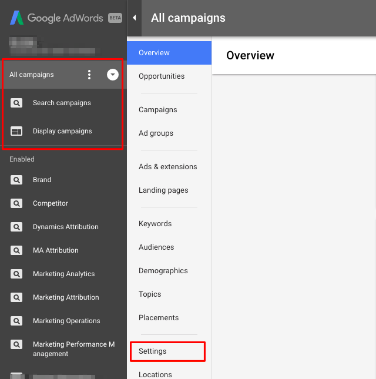
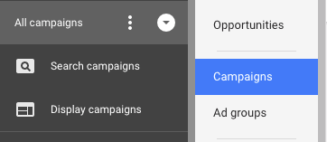

# [!DNL Marketo Measure]件のAdWords タグ付けについて {#understanding-marketo-measure-adwords-tagging}

広告を非常に細かく追跡するには、広告宛先URLが一意である必要があります。 これを実現するために、[!DNL Marketo Measure]自動タグ付けは、[!DNL AdWords]広告の広告宛先URLにトラッキングパラメーターを自動的に追加します。 以下の例を見てみましょう。

次のURLでは、詳細なデータは提供されません：

* `http://example.com/landing-page?myParam=foo`

ただし、同じURLでは、[!DNL Marketo Measure] パラメーターが原因で詳細なデータが提供されます。

* `http://example.com/landing-page?myParam=foo&_bt={creative}&_bk={keyword}&_bm={matchtype}&_bn={network}&_bg={adgroupid}`

## [!DNL Marketo Measure]の自動タグ付けの仕組み {#how-marketo-measure-auto-tagging-works}

**[!DNL Marketo Measure]がトラッキングテンプレートを見つけた場合：**

* [!DNL Marketo Measure]がトラッキングテンプレートにパラメーターを追加します。
* KenshooやMarinなどのトラッキングテンプレートでサードパーティのリダイレクトが見つかった場合、[!DNL Marketo Measure]はアクションを実行しません。 代わりに、[&#x200B; アカウントのサードパーティツールに [!DNL Marketo Measure]  パラメーターを追加](/help/api-connections/how-bid-management-tools-affect-marketo-measure.md){target="_blank"}する必要があります。

ただし、トラッキングテンプレートが見つからない場合、[!DNL Marketo Measure]は次の操作を行います。

* [!DNL Marketo Measure] パラメーターのすべての広告宛先URLをスキャンします。
* 見つかった場合は、行くとよいでしょう。
* 見つからない場合、[!DNL Marketo Measure]は広告宛先URLの末尾にそのパラメーターを追加します。 新しい広告の場合、[!DNL Marketo Measure]は作成後2時間以内に広告宛先URLにそのパラメーターを追加します。
* 自動タグ付けを有効にする前に、トラッキングテンプレートを配置して、[!DNL Marketo Measure]が添付できるようにし、広告履歴のリセットを防ぐことが重要です。

[!DNL Marketo Measure] では、アカウントレベル、キャンペーンレベルまたは広告グループレベルのトラッキングテンプレートを使用することをお勧めします。これにより、広告履歴の中断や削除のリスクなしに、すべての広告のパラメーターを追加および削除できます。

## トラッキングテンプレート {#tracking-templates}

[!DNL Google AdWords]が説明しているように、トラッキングテンプレートは、ランディングページに到達するために使用されるURLです。 収集された追跡情報は、広告トラフィックを把握するために使用されます。 Googleの詳細については、[ここをクリック &#x200B;](https://support.google.com/adwords/answer/7197008?hl=en){target="_blank"}してください。

[!DNL Marketo Measure]では、広告履歴の中断や削除のリスクを回避して、すべての広告のパラメーターの追加と削除を可能にするため、アカウントレベル、キャンペーンレベル、または広告グループレベルの追跡テンプレートを使用することをお勧めします。

[!DNL Marketo Measure]さんが推奨するトラッキングテンプレートは2つあります。 次の手順を使用して、適切なバージョンを決定します。

* すべての広告URLに「?」がある場合 その中で、次のURLを使用します。

`{lpurl}&_bt={creative}&_bk={keyword}&_bm={matchtype}&_bn={network}&_bg={adgroupid}`

* 広告URLに「?」がない場合 その中で、次のURLを使用します。

`{lpurl}?_bt={creative}&_bk={keyword}&_bm={matchtype}&_bn={network}&_bg={adgroupid}`

## アカウントレベルでのトラッキングテンプレートの設定 {#setting-up-a-tracking-template-at-the-account-level}

1. [!DNL Google AdWords] アカウントにログインします。

1. 展開ウィンドウで「**[!UICONTROL すべてのキャンペーン]**」をクリックし、次に「**[!UICONTROL 設定]**」をクリックします。

   ですべてのキャンペーンをクリックし、「設定」をクリックします

1. 上部の&#x200B;**[!UICONTROL アカウント設定]**&#x200B;をクリックし、**[!UICONTROL トラッキングテンプレート]**&#x200B;をクリックします。 [!DNL Marketo Measure] トラッキングテンプレートを入力します。

   」をトラッキングします

1. 「**[!UICONTROL 保存]**」をクリックします。

## キャンペーンレベルでのトラッキングテンプレートの設定 {#setting-up-a-tracking-template-at-the-campaign-level}

1. 展開ウィンドウで「**[!UICONTROL すべてのキャンペーン]**」をクリックし、次に「**[!UICONTROL キャンペーン]**」をクリックします。

   で「すべてのキャンペーン」をクリックし、「キャンペーン」をクリックします

1. 該当するすべてのキャンペーンを選択するか、**[!UICONTROL すべてを選択]**&#x200B;し、**[!UICONTROL 編集]**&#x200B;をクリックしてから、**[!UICONTROL トラッキングテンプレートの変更]**&#x200B;をクリックします。

   をクリックします

1. 「[!DNL Marketo Measure] トラッキングテンプレート」を入力し、「**[!UICONTROL 適用]**」をクリックします。

## 広告グループレベルでのトラッキングテンプレートの設定： {#setting-up-a-tracking-template-at-the-ad-group-level}

1. 展開ウィンドウで「**[!UICONTROL すべてのキャンペーン]**」をクリックし、次に「**[!UICONTROL 広告グループ]**」をクリックします。

   ですべてのキャンペーンをクリックし、「広告グループ」をクリックします

1. 該当するすべての広告グループを選択するか、「すべて選択」を選択し、**[!UICONTROL 編集]**&#x200B;をクリックしてから、**[!UICONTROL トラッキングテンプレートの変更]**&#x200B;をクリックします。

1. 「[!DNL Marketo Measure] トラッキングテンプレート」を入力し、「**[!UICONTROL 適用]**」をクリックします。

   

## よくある質問 {#faq}

**Q：接続されたユーザーに必要な権限は何ですか？**

A: userinfo.email

**Q：支出データの読み込みにどのくらいの時間がかかりますか？**

A: 6時間

**Q：広告データの読み込みにどのくらいの時間がかかりますか？**

A: 4時間

**Q: Dynamic Search Adsの場合、配信されたクリエイティブ内の見出し、説明などの組み合わせを追跡できますか？**

回答：動的検索広告の個々のクリエイティブの詳細を取得することはできませんが、自動タグ付けが有効になっている場合でも、クリエイティブ IDと属性収益を取得できます。

>[!NOTE]
>
>変更が行われたら、完了です。 設定中にご質問がある場合は、[Marketo サポート &#x200B;](https://nation.marketo.com/t5/support/ct-p/Support){target="_blank"}までお気軽にお問い合わせください。

アカウントレベルのトラッキングテンプレートの作成方法については、[ここをクリック &#x200B;](https://support.google.com/adwords/answer/6076199?hl=en#tracking){target="_blank"}してGoogleの手順を参照してください。
