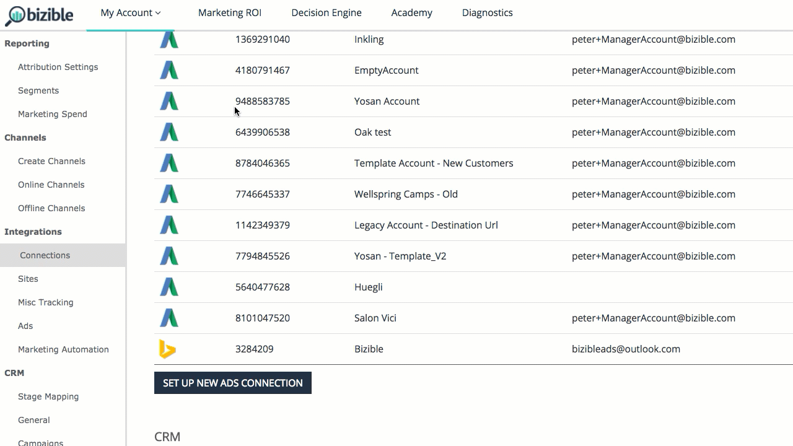
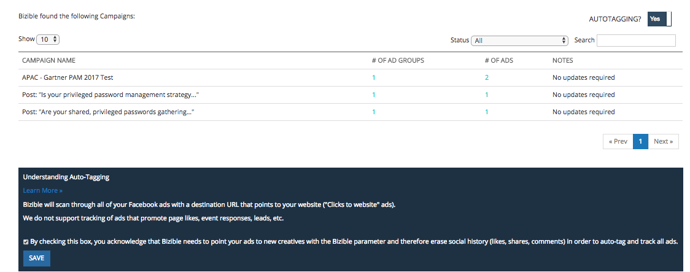
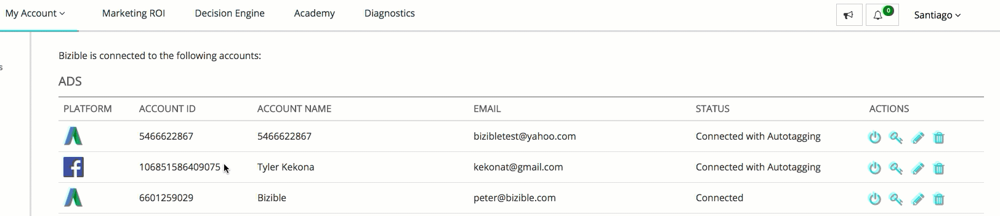

# [!DNL Facebook] API {#facebook-api}

## はじめに {#introduction}

AdWordsと[!DNL Bing Ads]統合と同様に、[!DNL Facebook]統合では、次の2つの基本的なアクションを実行します。

* [!DNL Marketo Measure] パラメーター（_bf）を使用して、すべての[!DNL Facebook]広告に自動タグ付け
* すべてのアクティブなFacebook広告の広告コスト情報をダウンロード

## [!DNL Facebook]統合の設定方法 {#how-to-configure-the-facebook-integration}

設定に関しては、[!DNL Marketo Measure] アプリ内で完了する7つの手順があります。

1. [experience.adobe.com/marketo-measure](https://experience.adobe.com/marketo-measure?lang=ja){target="_blank"}に移動してログインします。
1. マイアカウントで、**[!UICONTROL 設定]**&#x200B;を選択します。
1. 「統合」で「**[!UICONTROL 接続]**」を選択します。
1. 「**[!UICONTROL 新しい広告接続を設定]**」を選択すると、ポップアップが表示されます。 **[!UICONTROL Facebook]**&#x200B;を選択し、Facebookの資格情報を使用してログインします。

   >[!NOTE]
   >
   >[!DNL Facebook Ads] アカウントに接続するユーザーは、[!DNL Facebook Ads] アカウント内の管理者である必要があります。

1. [!DNL Marketo Measure]がFacebook アカウントに接続されたら、アカウントの横にある鉛筆アイコンをクリックします。
1. このビューで、「自動タグ付け？」トグルを「はい」に移動します。 次に、[!UICONTROL 詳細情報] セクションにあるチェックボックスを選択して、利用条件に同意します。 [!UICONTROL 自動タグ付け] トグルがまだ&#39;[!UICONTROL はい]&#39;に設定されていることを確認してください。

## アカウントの接続 {#connecting-the-account}

## 自動タグ付けを有効にする {#enabling-autotagging}

>[!NOTE]
>
>自動タグ付けを有効にすると、タグ付けするすべての広告のコンバージョン履歴とソーシャルプルーフがリセットされます。 自動タグ付けを有効にする前に、[このデータをCSV](https://www.facebook.com/business/help/205067636197240)として書き出すことを強くお勧めします。

統合を有効にすると、[!DNL Marketo Measure]は広告レベルのコストを[!DNL Marketo Measure Marketing ROI] ダッシュボードにダウンロードし始めます。

統合が正しく機能するには、[!DNL Facebook] アカウントで自動タグ付けを有効にする必要があります。 これにより、システムがすべての広告リンクに_bf パラメーターを追加できるようになります。 このプロセスでは、既に[!DNL Facebook]広告に追加されている他のトラッキングパラメーターの上に新しいパラメーターが追加されます。

## フィールド マッピング {#field-mapping}

<table> 
 <colgroup> 
  <col> 
  <col> 
 </colgroup> 
 <tbody> 
  <tr> 
   <th>
<strong>タッチポイントフィールド</strong>
</th> 
   <th>
<strong>値</strong>
</th> 
  </tr> 
  <tr> 
   <td>
広告キャンペーン Id
</td> 
   <td>
[[!DNL Facebook] キャンペーン Id]
</td> 
  </tr> 
  <tr> 
   <td>
広告キャンペーン名 
</td> 
   <td>
[[!DNL Facebook] キャンペーン名]または[utm_campaign]が指定されている場合
</td> 
  </tr> 
  <tr> 
   <td>
広告グループ Id
</td> 
   <td>
[[!DNL Facebook] Ad Set Id]
</td> 
  </tr> 
  <tr> 
   <td>
広告グループ名
</td> 
   <td>
[[!DNL Facebook] Ad Set Name]
</td> 
  </tr> 
  <tr> 
   <td>
タッチポイントソース
</td> 
   <td>
「[!DNL Facebook]」または[utm_source]が指定されている場合
</td> 
  </tr> 
  <tr> 
   <td>
中
</td> 
   <td>
"Social"、または[utm_medium]が指定されている場合
</td> 
  </tr> 
  <tr> 
   <td>
Ad Id、またはCreative_Unique_Id （Data Warehouse）
</td> 
   <td>
[utm_contentから生成されたカスタム Id]
</td> 
  </tr> 
  <tr> 
   <td>
Ad Content、またはCreative_Name （Data Warehouse）
</td> 
   <td>
[utm_content]を指定します
</td> 
  </tr> 
  <tr> 
   <td>
Keyword_Name （Data Warehouse）またはKeyword_Text
</td> 
   <td>
[utm_term]が指定されている場合
</td> 
  </tr> 
  <tr> 
   <td>
Ad_Unique_Id （Data Warehouse）
</td> 
   <td>
[[!DNL Facebook] Ad Id]
</td> 
  </tr> 
  <tr> 
   <td>
Ad_Name （Data Warehouse）
</td> 
   <td>
[[!DNL Facebook] Ad Name]
</td> 
  </tr> 
  <tr> 
   <td>
Keyword_Unique_Id （Data Warehouse）
</td> 
   <td>
[utm_termから生成されたカスタム Id]
</td> 
  </tr> 
  <tr> 
   <td>
Ad_Provider （Data Warehouse）
</td> 
   <td>
"[!DNL Facebook]"
</td> 
  </tr> 
  <tr> 
   <td>
Account_Unique_ID （Data Warehouse）
</td> 
   <td>
[[!DNL Facebook] Account #]
</td> 
  </tr> 
  <tr> 
   <td>
Account_Name （Data Warehouse）
</td> 
   <td>
[[!DNL Facebook] アカウント名]
</td> 
  </tr> 
 </tbody> 
</table>

## よくある質問 {#faq}

**Q: [!DNL Marketo Measure]がサポートしている[!DNL Facebook]広告は何ですか？**

A: カルーセル、単一画像。 現時点では、ビデオ、スライドショー、コレクションは使用できません。

**Q: ソーシャルプルーフとは何ですか？**

回答：ソーシャルプルーフとは、いいね！、クリック、コメント、共有などの目に見えるエンゲージメントのことです。

**Q: [!DNL Marketo Measure]さんが広告にタグを付けるとどうなりますか？**

回答：[!DNL Facebook]では広告を編集できないため、[!DNL Marketo Measure]はクリエイティブを削除する必要があります。クリエイティブには宛先URLが含まれています。その後、新しいパラメーターを使用して広告を再作成してください。

**Q: [!DNL Marketo Measure]が[!DNL Facebook]広告をすべて更新するのはなぜですか？**

A: [!DNL Marketo Measure] プロセスでは、すべての広告が再アクティブ化された場合に備えて、すべての広告にタグを付けます。

**Q：接続されたユーザーに必要な権限は何ですか？**

A: ads_management, email

**Q：支出データの読み込みにどのくらいの時間がかかりますか？**

A: 1時間

**Q：広告データの読み込みにどのくらいの時間がかかりますか？**

A: 4時間
