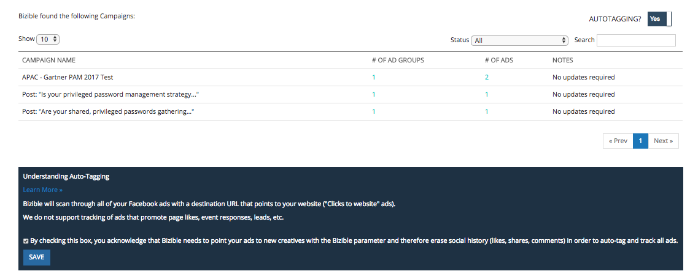

# [!DNL Facebook] API {#facebook-api}

## はじめに {#introduction}

AdWords &amp;と類似 [!DNL Bing Ads] 統合、 [!DNL Facebook] 統合には、次の 2 つの基本的なアクションがあります。

* すべて自動タグ付け [!DNL Facebook] 広告 [!DNL Marketo Measure] パラメータ (_bf)
* すべてのアクティブなFacebook広告にわたる広告コスト情報のダウンロード

## 設定方法 [!DNL Facebook] 統合 {#how-to-configure-the-facebook-integration}

設定に関しては、 [!DNL Marketo Measure] アプリを使用します。

1. に移動します。 [experience.adobe.com/marketo-measure](https://experience.adobe.com/marketo-measure){target="_blank"} をクリックし、ログインします。
1. 「マイアカウント」で、「 **[!UICONTROL 設定]**.
1. 「統合」で、「 **[!UICONTROL 接続]**.
1. 選択 **[!UICONTROL 新しい広告接続の設定]** ポップアップが表示されます。 選択 **[!UICONTROL Facebook]** facebookの資格情報を使用してログインします。

   >[!NOTE]
   >
   >接続している人 [!DNL Facebook Ads] アカウントは、 [!DNL Facebook Ads] アカウント

1. 1 回 [!DNL Marketo Measure] がFacebookアカウントに接続されている場合は、アカウントの横にある鉛筆アイコンをクリックします。
1. このビュー内で、「自動タギング？」を移動します。 「はい」に切り替えます。 次に、 [!UICONTROL 詳細情報] のセクションを参照してください。 次を確認します。 [!UICONTROL 自動タグ付け] 切り替えは、引き続き「 」に設定されます。[!UICONTROL はい]&#39;.

## アカウントの接続 {#connecting-the-account}

## 自動タギングの有効化 {#enabling-autotagging}

>[!NOTE]
>
>自動タグ付けを有効にすると、タグ付けしたすべての広告のコンバージョン履歴とソーシャル配達確認がリセットされます。 を強くお勧めします [このデータを CSV として書き出す](https://www.facebook.com/business/help/205067636197240) 自動タグ付けを有効にする前に

統合を有効にしたら、 [!DNL Marketo Measure] 広告レベルのコストのダウンロードを [!DNL Marketo Measure Marketing ROI] ダッシュボード。

統合が正しく機能するには、 [!DNL Facebook] アカウント これにより、システムはすべての広告リンクに_bf パラメータを追加できます。 このプロセスは、既に [!DNL Facebook] 広告。

## フィールドマッピング {#field-mapping}

<table> 
 <colgroup> 
  <col> 
  <col> 
 </colgroup> 
 <tbody> 
  <tr> 
   <th>
<strong>タッチポイントフィールド</strong>
</th> 
   <th>
<strong>値</strong>
</th> 
  </tr> 
  <tr> 
   <td>
広告キャンペーン ID
</td> 
   <td>
[[!DNL Facebook] キャンペーン ID]
</td> 
  </tr> 
  <tr> 
   <td>
広告キャンペーン名 
</td> 
   <td>
[[!DNL Facebook] キャンペーン名 ]、または [utm_campaign]（指定されている場合）
</td> 
  </tr> 
  <tr> 
   <td>
広告グループ ID
</td> 
   <td>
[[!DNL Facebook] 広告セット ID]
</td> 
  </tr> 
  <tr> 
   <td>
広告グループ名
</td> 
   <td>
[[!DNL Facebook] 広告セット名 ]
</td> 
  </tr> 
  <tr> 
   <td>
Touchpointソース
</td> 
   <td>
"[!DNL Facebook]"、または [utm_source] （指定されている場合）
</td> 
  </tr> 
  <tr> 
   <td>
中
</td> 
   <td>
"Social"、または [utm_medium]（指定されている場合）
</td> 
  </tr> 
  <tr> 
   <td>
広告 ID、または Creative_Unique_Id (Data Warehouse)
</td> 
   <td>
[utm_content から生成されたカスタム ID]
</td> 
  </tr> 
  <tr> 
   <td>
広告コンテンツ、または Creative_Name(Data Warehouse)
</td> 
   <td>
[utm_content] を指定した場合
</td> 
  </tr> 
  <tr> 
   <td>
キーワードテキスト、またはキーワード名 (Data Warehouse)
</td> 
   <td>
[utm_term] （指定されている場合）
</td> 
  </tr> 
  <tr> 
   <td>
Ad_Unique_Id (Data Warehouse)
</td> 
   <td>
[[!DNL Facebook] 広告 ID]
</td> 
  </tr> 
  <tr> 
   <td>
Ad_Name (Data Warehouse)
</td> 
   <td>
[[!DNL Facebook] 広告名]
</td> 
  </tr> 
  <tr> 
   <td>
Keyword_Unique_Id (Data Warehouse)
</td> 
   <td>
[utm_term から生成されたカスタム ID]
</td> 
  </tr> 
  <tr> 
   <td>
Ad_Provider (Data Warehouse)
</td> 
   <td>
"[!DNL Facebook]"
</td> 
  </tr> 
  <tr> 
   <td>
Account_Unique_ID (Data Warehouse)
</td> 
   <td>
[[!DNL Facebook] アカウント #]
</td> 
  </tr> 
  <tr> 
   <td>
Account_Name (Data Warehouse)
</td> 
   <td>
[[!DNL Facebook] アカウント名]
</td> 
  </tr> 
 </tbody> 
</table>

## よくある質問 {#faq}

**Q:What [!DNL Facebook] 広告は、 [!DNL Marketo Measure]?**

回答：カルーセル、単一の画像。 現時点では、ビデオ、スライドショーまたはコレクションではありません。

**Q:ソーシャルプルーフとは**

回答：Social の配達確認は、「いいね！」、クリック数、コメント数、共有数などのエンゲージメントが表示されます。

**Q:次の場合に発生すること [!DNL Marketo Measure] 広告にタグを付けますか？**

回答： [!DNL Facebook] 広告の編集を許可しない [!DNL Marketo Measure] リンク先 URL を含むクリエイティブを削除し、新しいパラメーターを使用して広告を再作成する必要があります。

**Q:理由： [!DNL Marketo Measure] すべてを更新 [!DNL Facebook] 広告？**

回答：この [!DNL Marketo Measure] プロセスでは、すべての広告が再アクティブ化された場合に備えてタグ付けされます。

**Q:接続したユーザーに必要な権限**

回答：ads_management, email

**Q:支出データのインポートにはどのくらいの時間がかかりますか？**

回答：1 時間

**Q:広告データのインポートにはどの程度の時間がかかりますか？**

回答：4 時間
