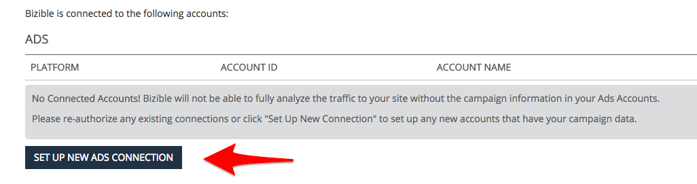
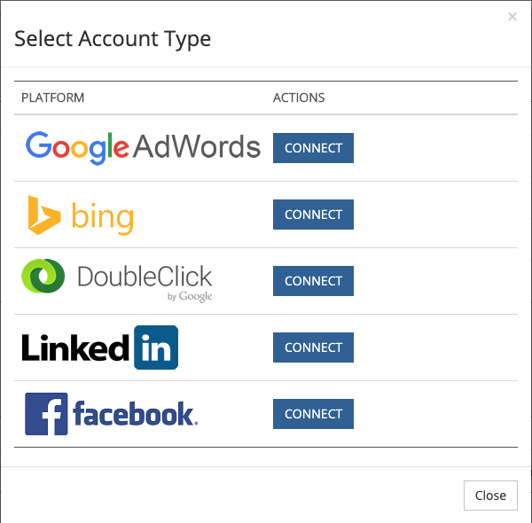
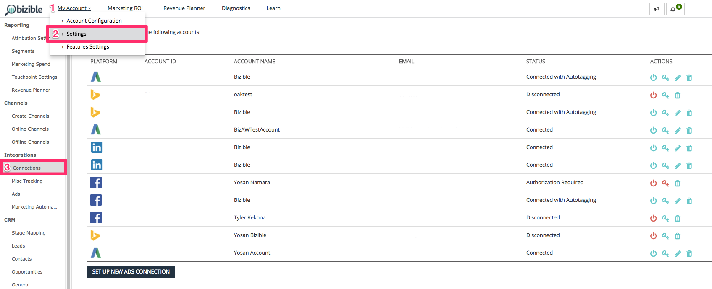
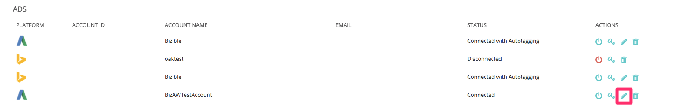
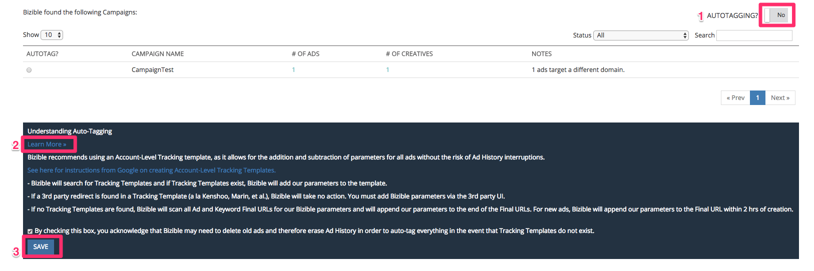

# 統合された広告プラットフォーム {#integrated-ad-platforms}

[!DNL Marketo Measure]には、Google AdWords、Microsoft BingAds、[!DNL Facebook]広告、DoubleClick Campaign ManagerとのAPI接続があります。 これらのAPI接続を通じて、[!DNL Marketo Measure]は簡単にデータを取得し、外部バイヤーアプリと共にCRMにプッシュできます。 コストやデータを手動でアップロードする必要はありません。 アカウントは、[!DNL Marketo Measure] アプリに接続して承認する必要があります。 [!DNL Marketo Measure]は、マーケティングコストをプラットフォームから自動的にダウンロードし、[!DNL Marketo Measure] アプリに読み込みます。 AdWords、BingAds、または[!DNL Facebook]広告の自動タグ付けを有効にするように選択した場合、[!DNL Marketo Measure]は自動的に広告のURLにそのパラメーターを追加します。

## 広告プラットフォームを連携させる方法 {#how-to-connect-ad-platforms}

>[!NOTE]
>
>Ad Platform接続の最大数は300です。

各プラットフォームの詳細を説明する前に、これらのアカウントのいずれかを[!DNL Marketo Measure]に接続する方法について説明します。 最初に[!DNL Marketo Measure]にログインし、画面左上の「**[!UICONTROL マイアカウント]**」タブの「**[!UICONTROL 設定]**」オプションに移動します。 次に、左側の「**[!UICONTROL 統合]**」セクションで「**[!UICONTROL 接続]**」を選択します。

下の画像に示すように、新しい広告接続を設定するためのボタンが表示されます。

「[!UICONTROL 新しい広告接続を設定]」ボタンをクリックすると、4つの広告[!UICONTROL connect]ion タイプのウィンドウ（下図）がポップアップ表示されます。 「接続」をクリックすると、資格情報を求める別のウィンドウが表示されます。 資格情報を入力し、[!UICONTROL authorize]をクリックして、アカウントを[!DNL Marketo Measure]に接続します。

## Google AdWords {#google-adwords}

[!DNL Google AdWords]で広告を作成する場合、手動タグ付け、自動タグ付け、トラッキングテンプレートの作成という3つの方法のいずれかでキャンペーンにタグ付けすることをお勧めします。 AdWords URLを手動でタグ付けするには、広告のURLの最後にパラメーターを定義して追加する必要があります。 手作業によるタグ付けにより、Google以外の基盤でも、パラメーターによって収集されたデータを簡単に読み取ることができます。

トラッキングテンプレートは、GoogleがValueTrack パラメーターと呼ばれるものを追加するために提供するツールです。 UTMやその他のタグ付けパラメーターと同じ方法で動作します。

## 自動タグ付けが有効になっている場合の処理 {#what-happens-when-auto-tagging-is-enabled}

[!DNL Marketo Measure] [!DNL AdWords] アカウントでトラッキングテンプレートを検索：

* *オプション A*：トラッキングテンプレートが見つかりました。 [!DNL Marketo Measure]はパラメーターをテンプレートに追加します。
* *オプション B*: サードパーティ リダイレクトが見つかりました。 トラッキング テンプレートにサードパーティのリダイレクトが見つかった場合、[!DNL Marketo Measure]は何もアクションを実行できません。 サードパーティシステムに[!DNL Marketo Measure] タグを手動で追加する必要があります。 サードパーティーリダイレクトの例としては、KenshooやMarinのような入札管理ツールがあります。 [入札管理ツールが [!DNL Marketo Measure]](/help/api-connections/utilizing-marketo-measures-api-connections/how-bid-management-tools-affect-marketo-measure.md){target="_blank"}にどのような影響を与えるかについて詳しく説明します。

* *オプション C*: トラッキングテンプレートが見つかりません。 [!DNL Marketo Measure]はすべての広告宛先URLを[!DNL Marketo Measure] パラメーター用にスキャンします。 スキャンに基づいて、次の場合：
   * パラメーターが見つかりました：設定が完了しました。
   * パラメーターが見つかりません：[!DNL Marketo Measure]は、そのパラメーターを広告宛先URLの末尾に追加します。 [!DNL Marketo Measure]は、作成してから2時間以内に新しい広告を追加します。 パラメーターはテンプレートに追加されないことに注意してください。

[[!DNL AdWords] 自動タグ付け機能](/help/api-connections/utilizing-marketo-measures-api-connections/understanding-marketo-measure-adwords-tagging.md){target="_blank"}の詳細をご覧ください。

## Adwordsの[!DNL Marketo Measure]自動タグ付けを有効にする方法 {#how-to-enable-marketo-measure-auto-tagging-for-adwords}

[!DNL Marketo Measure]の自動タグ付けを有効にする前に、**Adwords アカウント内のアカウント、キャンペーン、または広告グループ レベルでトラッキングテンプレートが有効になっていることを確認してください。 これは、[!DNL Marketo Measure]の自動タグ付けが有効になっているAdwords アカウントに対して必要です。** トラッキングテンプレートを有効にすることで、広告パフォーマンス履歴データの損失を防ぐことができます。 キーワード、サイトリンク、または広告レベルでトラッキングテンプレートを有効にすると、広告がレビューと承認プロセスを経て、広告のパフォーマンス履歴が再起動する可能性があることに注意してください。 トラッキングテンプレートがまったく有効になっていない場合、[!DNL Marketo Measure]は[!DNL Marketo Measure] トラッキングパラメーターを広告の「最終URL」に直接追加します。これも広告履歴データの損失につながる可能性があります。

トラッキングテンプレートを設定したら、次の手順に従って[!DNL Marketo Measure]自動タグ付けを有効にします。 注：[!DNL Marketo Measure]は、アカウント内の一時停止した広告にも自動的にタグ付けします。

1. [experience.adobe.com/marketo-measure](https://experience.adobe.com/marketo-measure?lang=ja){target="_blank"}で[!DNL Marketo Measure] アカウントにログインします。

1. [!UICONTROL &#x200B; マイアカウント &#x200B;] > [!UICONTROL 設定] > [!UICONTROL 統合] > [!UICONTROL 接続]に移動します。

   

1. [!DNL Marketo Measure]の自動タグ付けが有効になるAdwords アカウントの横にある鉛筆アイコンをクリックします。

   

1. 右上隅で、**[!UICONTROL 自動タグ付け]** スイッチを&#x200B;**[!UICONTROL はい]**&#x200B;に切り替えます。 ページの下部にある「**[!UICONTROL 詳細情報]**」をクリックしてテキストボックスを展開し、「**[!UICONTROL 保存]**」をクリックします。 自動タグ付けの設定が完了しました。

   

## [!DNL Marketo Measure] パラメーターを使用してAdWordsでトラッキングテンプレートを設定する方法 {#how-to-set-up-a-tracking-template-in-adwords-with-marketo-measure-parameters}

AdWordsの[!UICONTROL &#x200B; アカウント &#x200B;]、[!UICONTROL &#x200B; キャンペーン &#x200B;]または広告グループ レベルにトラッキングテンプレートを追加する必要があることに注意してください。 トラッキングテンプレートをキーワード、サイトリンク、または広告レベルに追加する場合、広告はレビューと承認プロセスを経る必要があり、広告のパフォーマンス履歴を再開するリスクがあります。 [&#x200B; トラッキングテンプレートの作成](https://support.google.com/adwords/answer/6076199?hl=en#tracking){target="_blank"}について詳しく見る。

1. [!DNL Google AdWords] アカウントにログインします。
1. 左側のナビゲーションバーから[!UICONTROL &#x200B; キャンペーン &#x200B;] ビューに移動します
1. 左側のナビゲーションバーにある「[!UICONTROL 設定]」に移動します
1. 上部の「[!UICONTROL &#x200B; アカウント設定]」ビューに切り替えます
1. 「[!UICONTROL &#x200B; トラッキング &#x200B;]」セクションを展開します
1. トラッキングテンプレートに次のいずれかのテキスト文字列を貼り付けて、テンプレートの値を設定します。

   * すべてのURLに疑問符がある場合は、次のURL テキストを使用します。

   `{lpurl}&_bt={creative}&_bk={keyword}&_bm={matchtype}&_bn={network}&_bg={adgroupid}`

   * どのURLにも疑問符がない場合は、次のURL テキストを追加します。

   `{lpurl}?_bt={creative}&_bk={keyword}&_bm={matchtype}&_bn={network}&_bg={adgroupid}*`

   URLを手動でタグ付けする際にエラーが発生するのを防ぐには、通常、UTM パラメーターを自動的に生成することをお勧めします。 これは、AdWordsや[!DNL Marketo Measure]個のパラメーターによる自動タグ付けを意味するものではありません。指定した情報に基づいてURLのパラメーターを自動的に生成することで、プロセスを簡素化するツールが複数あります。

   >[!TIP]
   >
   >トラッキングテンプレートが無効であることを示すエラーが発生した場合は、ブラウザーのキャッシュをクリアして、もう一度試してください。多くの場合、この問題は解決されます。

## [!DNL Google AdWords]のUTM タグを自動生成する方法 {#how-to-automatically-generate-utm-tags-for-google-adwords}

UTM タグは最初は作成が難しく見えますが、UTM パラメーターを使用してURLを簡単に作成できるツールは数多くあります。 次のいずれかのリソースを使用するか、webで他のツールを検索します。 [!DNL Marketo Measure]は、これらのプラットフォームおよびツールに対して何かを支持または保証するものではないことに注意してください。

**[!DNL Google URL]ビルダー**

Google URL Builderは、UTM タグを使用して正しい形式のURLを作成するための標準ツールです。 各パラメーターのURLと目的の値を入力し、「[!UICONTROL URLを生成]」をクリックします。 これは、タグ付けするURLが一握りしかない場合に使用するのに最適なツールです。 ツール [こちら](https://support.google.com/analytics/answer/1033867?hl=ja){target="_blank"}にアクセスします。

**EpikOneによって生成されたGoogle スプレッドシート**

このスプレッドシートには、タグ付けされた宛先URLを自動的に生成する数式があります。 これは、多数のリンクにタグ付けが必要な場合に使用するのに最適なツールです。 スプレッドシート [こちら](https://spreadsheets.google.com/ccc?key=p7c_HKcmspSUfEYSO0gskKw&hl=en){target="_blank"}にアクセスします。

**Rafflecopter リンク タグ付けツール**

Rafflecopterによって作成されたスプレッドシートは、[!DNL EpikOne's] スプレッドシートの修正バージョンです。 また、タグ付きの宛先リンクを自動生成する数式も含まれています。

各ツールには、ニーズに合わせて使用および変更する方法に関する詳細な手順が記載されています。 ツールは[こちら](https://docs.google.com/spreadsheets/d/1QCIr1WUJQHE68cA4VTks2XE7nxuryaUymCEy_23-Oew/edit#gid=0){target="_blank"}で利用できます。

**素晴らしいUTM ビルダーを使用**

このツールは、UTM タグを素早く生成できるChromeの拡張機能です。 [ここ](https://chrome.google.com/webstore/detail/effin-amazing-utm-builder/eoaapiimcaimddnfhfnifgkinmpcbccp?hl=en){target="_blank"}を検索します。

## Bing Ads {#bing-ads}

Bing Adsは、URLの自動タグ付けを有効にしたり、[!DNL Marketo Measure]などのサードパーティ ツールを使用して広告をタグ付けしたりできる統合プラットフォームです。 [!DNL Bing Ads]もUTM パラメーターに依存しています。

アドビの統合では、次の広告タイプをサポートしています。

* テキスト広告
* モバイル広告
* 拡張テキスト広告

Bing広告の自動タグ付け機能では、次のUTM パラメーターが追加されます。

* Utm_source
* Utm_medium
* Utm_term

Bing広告の自動タグ付けでは、次のカスタムパラメーターも追加されます。

`_bt={adid}`

文字列は次のようになります。

`{lpurl}?_bt={adid}&utm_term={keyword}&utm_source=Bing_Yahoo&utm_medium=CPC`

重要なのは、[!DNL Bing Ads]では、最終的なURLでカスタムタグを使用して、さらに多くのパラメーターを追加し、必要に応じて詳細を取得できることです。

必要に応じてトラッキングテンプレートを使用できますが、[!DNL Bing Ads]と[!DNL Marketo Measure]を統合する必要はありません。 これは、[!DNL Bing]では履歴を変更せずに広告を編集できるため、[!DNL Marketo Measure]では宛先URLを更新できるためです。

カスタム [!DNL Marketo Measure] パラメーターを自動的に追加できるように、[!DNL Marketo Measure]を通じて自動タグ付けを有効にする必要があります。 Bing広告で過去の広告パフォーマンス履歴を失うリスクはありません。

プラットフォームでのタグの追加について詳しくは、[[!DNL Bing Ads]](https://advertise.bingads.microsoft.com/en-us/blog/post/august-2016/upgraded-urls-now-available-in-bing-ads-an-easier-way-to-manage-your-tracking-urls){target="_blank"} web サイトを参照してください。

## Facebook 広告 {#facebook-ads}

[!DNL Marketo Measure]と[!DNL Facebook]の統合により、広告情報を自動的にダウンロードし、URLにパラメーターをタグ付けすることができます。 [!DNL Marketo Measure]は、自動タグ付けを通じてキャンペーン情報と広告セット情報を取り込みます。 広告セットは、「広告グループ名」フィールドに入力されます。 [!DNL Facebook] プラットフォームでのURL タグの設定について詳しくは、[!DNL Facebook] [business](https://www.facebook.com/business/help/1016122818401732/?ref=u2u){target="_blank"} ページを参照してください。

[!DNL Facebook Ads]での自動タグ付けを有効にする前に、以前のパフォーマンス履歴をCSVとして書き出すことが重要です。 この時点で、[!DNL Marketo Measure]が[!DNL Facebook Ads]を_bf パラメーターでタグ付けすると、[!DNL Facebook]は広告を真新しいものとして読み取り、パフォーマンス履歴を消去します。 したがって、以前のパフォーマンスの記録を、あなたやあなたの組織にとって価値のあるものであれば、書き出すことが重要です。

[!DNL Facebook] アカウントはいつでも[!DNL Marketo Measure] アプリに接続できます。データは失われません。自動タグ付けが有効になっている場合にのみ、パフォーマンス履歴が消去されます。

[!DNL Facebook]広告レポートの書き出しについて詳しくは、「[Facebookからのこの記事](https://www.facebook.com/business/help/393890194130036){target="_blank"}」を参照してください。

## LinkedIn スポンサードコンテンツ {#linkedin-sponsored-content}

LinkedInとの統合により、[!DNL Marketo Measure]は[!DNL LinkedIn]のスポンサードコンテンツの宛先URLをタグ付けできます。これにより、[!DNL Marketo Measure]は最終的に、ユーザーのタッチポイントジャーニー全体を通じてユーザーをフォローし、特定の[!DNL LinkedIn] キャンペーンとCreativeにアクティビティをマッピングできます。 これにより、顧客の[!DNL LinkedIn] アクティビティのROIに関するインサイトが得られます。 [!DNL Marketo Measure]は、一意の[!DNL LinkedIn]共有を持つクリエイターを検索し、その末尾に`?_bl={creativeId}` パラメーターを追加します。

[!DNL LinkedIn]共有は複数のキャンペーンとクリエイティブで使用できるため、お客様は既存のクリエイティブをコピー/複製/複製せずに、その一意性を維持できるようにお願いします。 共有が見つかり、1つのCreativeでのみ使用されることが検出された場合、[!DNL Marketo Measure]はクリエイティブまたは共有を再作成することなく、そのまま共有をタグ付けでき、すべての広告履歴（インプレッション、クリック、共有）は残ります。

共有が複数のクリエイター間で共有されていることが判明すると、一意のセットを作成するために、[!DNL Marketo Measure]は一時停止、コピー、および再タグ付けのプロセスを実行する必要があります。 [!DNL Marketo Measure]はライブクリエイティブを一時停止してアーカイブします。つまり、インプレッション、クリック、ソーシャル共有を含むクリエイティブもアーカイブされます。

## 統合されていない基盤 {#non-integrated-platforms}

[!DNL Marketo Measure]と統合されていないプラットフォームの場合、[!DNL Marketo Measure]自動タグ付け機能は使用できません。 パラメーターは手動で追加する必要があります。
