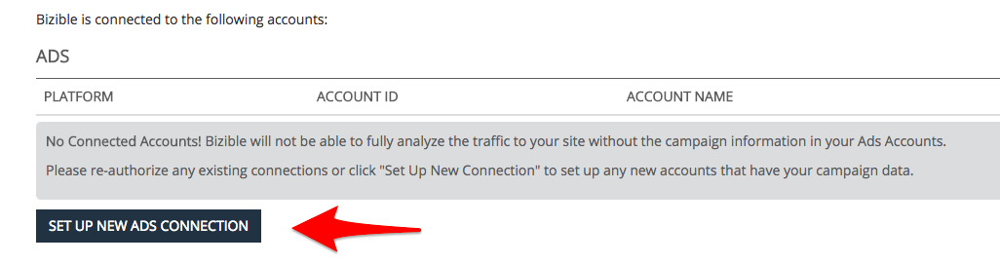
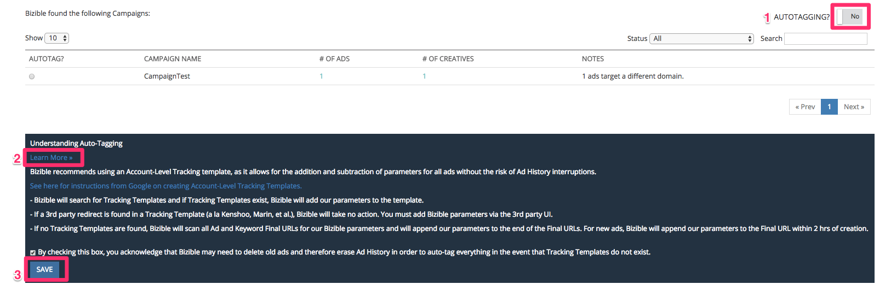

# 統合された広告プラットフォーム {#integrated-ad-platforms}

[!DNL Marketo Measure] Google AdWords、Microsoft BingAds、 [!DNL Facebook] 広告と DoubleClick Campaign Manager。 これらの API 接続を通じて、 [!DNL Marketo Measure] は、外部のバイヤーアプリと共に、データを簡単に取り込み、CRM にプッシュできます。 コストやデータを手動でアップロードする必要はありません。 代わりに、アカウントがに接続され承認されている必要があります [!DNL Marketo Measure] アプリ。 [!DNL Marketo Measure] その後、はプラットフォームからマーケティングコストを自動的にダウンロードし、に読み込みます [!DNL Marketo Measure] アプリ。 AdWords、BingAds またはの自動タグ付けを有効にするよう選択した場合 [!DNL Facebook] 広告、 [!DNL Marketo Measure] は、広告の URL にパラメーターを自動的に追加します。

## 広告プラットフォームの接続方法 {#how-to-connect-ad-platforms}

各プラットフォームの詳細を説明する前に、これらのアカウントを接続する方法について説明します [!DNL Marketo Measure]. 最初ににログイン [!DNL Marketo Measure] アプリを適用し、に移動します。 **[!UICONTROL 設定]** の下のオプション **[!UICONTROL マイアカウント]** 画面の左上にある Tab キー。 次に、を選択します **[!UICONTROL 接続]** の下 **[!UICONTROL 統合]** 左側のセクション。

以下の画像に示すように、新しい広告接続を設定するボタンが表示されます。

をクリックした後 [!UICONTROL 新しい広告接続の設定] ボタンをクリックすると、以下に示すウィンドウに 4 つの広告がポップアップ表示されます [!UICONTROL 接続]イオンの種類 「接続」をクリックすると、別のウィンドウが表示されて資格情報の入力を求められます。 資格情報を入力して、 [!UICONTROL 承認する] アカウントの接続先 [!DNL Marketo Measure].

## Google AdWords {#google-adwords}

で広告を作成するとき [!DNL Google AdWords]を使用する場合、手動のタグ付け、自動のタグ付け、トラッキングテンプレートの作成のいずれかの方法でキャンペーンにタグ付けすることをお勧めします。 AdWords URL に手動でタグを付ける場合は、広告の URL の末尾にパラメーターを定義して追加する必要があります。 手動のタグ付けを使用すると、Google以外のプラットフォームがパラメーターによって収集されたデータを容易に読み取ることができます。

トラッキングテンプレートは、Googleが ValueTrack パラメーターと呼ぶパラメーターを追加するために提供するツールです。 これらは、UTM やその他のタグ付けパラメーターと同じ方法で機能します。

## 自動タギングが有効な場合の処理 {#what-happens-when-auto-tagging-is-enabled}

[!DNL Marketo Measure] でトラッキングテンプレートを検索 [!DNL AdWords] アカウント :

* *オプション A*：追跡テンプレートが見つかりました。 [!DNL Marketo Measure] は、そのパラメーターをテンプレートに追加します。
* *オプション B*：サードパーティのリダイレクトが見つかりました。 追跡テンプレートにサードパーティのリダイレクトがある場合、 [!DNL Marketo Measure] 何もアクションを実行できません。 を手動で追加する必要があります [!DNL Marketo Measure] サードパーティシステムにタグを付けます。 サードパーティのリダイレクトの例として、Kenshoo や Marin などの入札管理ツールがあります。 方法の詳細情報 [入札管理ツールの影響 [!DNL Marketo Measure]](/help/api-connections/utilizing-marketo-measures-api-connections/how-bid-management-tools-affect-marketo-measure.md){target="_blank"}.

* *オプション C*：追跡テンプレートが見つかりません。 [!DNL Marketo Measure] はすべての広告宛先 URL をスキャンしてを検索します [!DNL Marketo Measure] パラメーター。 スキャンに基づいて、次の場合：
   * パラメーターが見つかりました。設定が完了しました。
   * パラメーターが見つかりません： [!DNL Marketo Measure] は、そのパラメーターを広告宛先 URL の末尾に追加します。 [!DNL Marketo Measure] は、作成後 2 時間以内に新しい広告を追加します。 パラメーターはテンプレートに追加されないことに注意してください。

詳しくは、こちらを参照してください [[!DNL AdWords] 自動タグ付け機能](/help/api-connections/utilizing-marketo-measures-api-connections/understanding-marketo-measure-adwords-tagging.md){target="_blank"}.

## を有効にする方法 [!DNL Marketo Measure] Adwords の自動タギング {#how-to-enable-marketo-measure-auto-tagging-for-adwords}

有効化する前に [!DNL Marketo Measure] 自動タグ付け、 **adwords アカウント内のアカウント、キャンペーン、広告グループのレベルでトラッキングテンプレートが有効になっていることを確認してください。 次のアカウントを持つすべての Adwords アカウントに必要です [!DNL Marketo Measure] 自動タグ付けが有効になりました。** トラッキングテンプレートを有効にすると、広告パフォーマンス履歴データの損失を防ぐことができます。 キーワード、サイトリンク、または広告レベルでトラッキングテンプレートを有効にすると、広告はレビューと承認プロセスを経て、広告のパフォーマンス履歴が再開される可能性があることに注意してください。 有効なトラッキングテンプレートがない場合は、 [!DNL Marketo Measure] は以下を追加します [!DNL Marketo Measure] 広告の「最終 URL」に直接トラッキングパラメーターを指定します。これにより、広告履歴データが失われる可能性もあります。

トラッキングテンプレートを設定したら、次の手順に従って有効にします [!DNL Marketo Measure] 自動タギング。 注意： [!DNL Marketo Measure] は、アカウントで一時停止されている広告も自動タグ付けします。

1. にログイン [!DNL Marketo Measure] アカウント： [experience.adobe.com/marketo-measure](https://experience.adobe.com/marketo-measure?lang=ja){target="_blank"}.

1. に移動 [!UICONTROL マイアカウント] > [!UICONTROL 設定] > [!UICONTROL 統合] > [!UICONTROL 接続].

   

1. 表示される Adwords アカウントの横にある鉛筆アイコンをクリックします [!DNL Marketo Measure] 自動タグ付けが有効になりました。

   

1. 右上隅のを切り替えます **[!UICONTROL 自動タギング]** 切り替え先 **[!UICONTROL はい]**. ページの下部にある、 **[!UICONTROL 詳細情報]** テキスト ボックスを展開し、をクリックするには **[!UICONTROL 保存]**. 自動タグ付けの設定が完了しました。

   

## を使用して AdWords にトラッキングテンプレートを設定する方法 [!DNL Marketo Measure] パラメーター {#how-to-set-up-a-tracking-template-in-adwords-with-marketo-measure-parameters}

トラッキングテンプレートは、 [!UICONTROL アカウント], [!UICONTROL キャンペーン] または AdWords の広告グループレベル。 トラッキングテンプレートをキーワード、サイトリンク、広告の各レベルに追加した場合は、広告のレビューと承認のプロセスを実行する必要があり、広告のパフォーマンス履歴が再度開始される恐れがあります。 の詳細情報 [追跡テンプレートの作成](https://support.google.com/adwords/answer/6076199?hl=en#tracking){target="_blank"}.

1. にログインする [!DNL Google AdWords] アカウント。
1. に移動 [!UICONTROL キャンペーン] 左側のナビゲーションバーからの表示
1. に移動します。[!UICONTROL 設定]」が、左側のナビゲーションバーにも表示されます
1. 「」に切り替えます。[!UICONTROL アカウント設定]の上部に表示
1. 「」を展開します[!UICONTROL トラッキング]`` セクション
1. 追跡テンプレートに次のテキスト文字列のいずれかを貼り付けて、テンプレートの値を設定します。

   * すべての URL に疑問符が含まれる場合は、次の URL テキストを使用します。

   `{lpurl}&_bt={creative}&_bk={keyword}&_bm={matchtype}&_bn={network}&_bg={adgroupid}`

   * URL に疑問符がない場合は、次の URL テキストを追加します。

   `{lpurl}?_bt={creative}&_bk={keyword}&_bm={matchtype}&_bn={network}&_bg={adgroupid}*`

   URL を手動でタグ付けするときにエラーが発生しないように、通常は UTM パラメーターを自動的に生成することをお勧めします。 AdWords またはを使用して自動タグ付けする必要はありません。 [!DNL Marketo Measure] パラメーターには、指定した情報に基づいて URL のパラメーターを自動的に生成することで、プロセスを簡略化する複数のツールがあります。

   >[!TIP]
   >
   >トラッキングテンプレートが無効であるというエラーが表示された場合は、ブラウザーのキャッシュをクリアして再試行してください。多くの場合、これによって問題が解決します。

## の UTM タグを自動生成する方法 [!DNL Google AdWords] {#how-to-automatically-generate-utm-tags-for-google-adwords}

UTM タグは、最初は作成が困難に見えるかもしれませんが、UTM パラメーターを使用して URL を簡単に作成できるツールは多数あります。 次のいずれかのリソースを使用するか、web で他のツールを検索できます。 ということを覚えておきなさい [!DNL Marketo Measure] は、これらのプラットフォームやツールを推奨したり、保証したりするものではありません。

**[!DNL Google URL]ビルダー**

Google URL ビルダーは、UTM タグを使用して正しい形式の URL を作成するための標準ツールです。 各パラメーターの URL と目的の値を入力して、「」をクリックします[!UICONTROL URL を生成]」と入力します。 これは、タグ付けする URL が少数しかない場合に使用する理想的なツールです。 ツールへのアクセス [こちら](https://support.google.com/analytics/answer/1033867?hl=ja){target="_blank"}.

**EpikOne が生成したGoogle スプレッドシート**

このスプレッドシートには、タグ付けされた宛先 URL を自動的に生成する数式が含まれています。 これは、多数のリンクをタグ付けする必要がある場合に使用する優れたツールです。 スプレッドシートへのアクセス [こちら](https://spreadsheets.google.com/ccc?key=p7c_HKcmspSUfEYSO0gskKw&amp;hl=en){target="_blank"}.

**Rafflecopter リンクのタグ付けツール**

Rafflecopter が作成したスプレッドシートは、の変更版です。 [!DNL EpikOne's] スプレッドシート。 また、タグ付けされた宛先リンクを自動生成して使用する数式も含まれています。

これらの各ツールには、ニーズに合わせて使用および変更する方法の詳細な手順が記載されています。 ツールは使用可能です [こちら](https://docs.google.com/spreadsheets/d/1QCIr1WUJQHE68cA4VTks2XE7nxuryaUymCEy_23-Oew/edit#gid=0){target="_blank"}.

**素晴らしい UTM ビルダーを有効にする**

このツールは、UTM タグをすばやく生成できる Chrome 拡張機能です。 検索 [こちら](https://chrome.google.com/webstore/detail/effin-amazing-utm-builder/eoaapiimcaimddnfhfnifgkinmpcbccp?hl=en){target="_blank"}.

## Bing Ads {#bing-ads}

Bing Ads は、URL の自動タグ付けを有効にしたり、サードパーティのツール（例：）を使用したりできる統合プラットフォームです [!DNL Marketo Measure]：広告にタグ付けします。 [!DNL Bing Ads] は、UTM パラメーターにも依存します。

統合では、以下の広告タイプをサポートしています。

* テキスト広告
* モバイル広告
* テキスト広告を展開

Bing Ads の自動タグ付け機能では、次の UTM パラメーターが追加されます。

* Utm_source
* Utm_medium
* Utm_term

Bing Ads の自動タギングでは、次のカスタムパラメーターも追加されます。

`_bt={adid}`

文字列は次のようになります。

`{lpurl}?_bt={adid}&utm_term={keyword}&utm_source=Bing_Yahoo&utm_medium=CPC`

に注意することが重要です [!DNL Bing Ads] を使用すると、最終的な URL でカスタムタグを使用して、必要に応じてさらに多くのパラメーターを追加し、より詳細な情報を取得できます。

必要に応じて、トラッキングテンプレートを使用できますが、以下の場合は使用する必要はありません。 [!DNL Bing Ads] および [!DNL Marketo Measure] を統合します。 これは、 [!DNL Bing] これにより、履歴を変更せずに広告を編集できるようになります [!DNL Marketo Measure] 宛先 URL を更新できる。

自動タギングは次を通じて有効にする必要があります： [!DNL Marketo Measure] そのため、次のようなカスタム [!DNL Marketo Measure] パラメーターは自動的に追加できます。 Bing Ads で過去の広告パフォーマンス履歴が失われるリスクはありません。

にアクセスします [[!DNL Bing Ads]](https://advertise.bingads.microsoft.com/en-us/blog/post/august-2016/upgraded-urls-now-available-in-bing-ads-an-easier-way-to-manage-your-tracking-urls){target="_blank"} プラットフォームへのタグの追加について詳しくは、web サイトを参照してください。

## Facebook 広告 {#facebook-ads}

この [!DNL Marketo Measure] との統合 [!DNL Facebook] を使用すると、広告情報を自動的にダウンロードし、URL にパラメーターをタグ付けできます。 [!DNL Marketo Measure] 自動タギングにより、キャンペーンと広告セットの情報を取り込みます。 広告セットが広告グループ名フィールドに表示されます。 での URL タグの設定に関する詳細 [!DNL Facebook] プラットフォーム、を参照 [!DNL Facebook] [0.48111124](https://www.facebook.com/business/help/1016122818401732/?ref=u2u){target="_blank"} ページ。

での自動タグ付けを有効にする前に [!DNL Facebook Ads]以前のパフォーマンス履歴を CSV として書き出すことが重要です。 この時点 [!DNL Marketo Measure] タグ [!DNL Facebook Ads] _bf パラメータを使用して、 [!DNL Facebook] 広告を真新しいものとして読み取り、パフォーマンス履歴を消去します。 したがって、自分自身や組織にとって価値がある場合は、以前のパフォーマンスのレコードを書き出すことが重要です。

を接続することもできます [!DNL Facebook] いつでも～に説明する [!DNL Marketo Measure] アプリとデータは失われません。自動タグ付けが有効な場合にのみ、パフォーマンス履歴が消去されます。

参照： [この記事](https://www.facebook.com/business/help/393890194130036){target="_blank"} 書き出しの詳細については、Facebookから [!DNL Facebook] 広告レポート。

## LinkedIn スポンサー付きコンテンツ {#linkedin-sponsored-content}

linkedInの統合では、次のことが可能です [!DNL Marketo Measure] 宛先 URL をにタグ付けするには [!DNL LinkedIn] 最終的に以下を可能にするスポンサードコンテンツ [!DNL Marketo Measure] タッチポイントジャーニー全体を通じてユーザーを追跡し、アクティビティを特定の [!DNL LinkedIn] キャンペーンとクリエイティブ。 これにより、顧客の ROI に関するインサイトが得られます [!DNL LinkedIn] アクティビティ。 [!DNL Marketo Measure] は一意のクリエイティブを検索します [!DNL LinkedIn] を共有して追加する `?_bl={creativeId}` その末尾にパラメーターを追加します。

なぜなら [!DNL LinkedIn] 共有は複数のキャンペーンおよびクリエイティブで使用できます。一意性を維持するために、既存のクリエイティブをコピー/クローン/複製しないでください。 共有が見つかり、1 つのクリエイティブでのみ使用できることが検出された場合、 [!DNL Marketo Measure] クリエイティブや共有を再作成しなくても、共有にタグを付けることができます。すべての広告履歴（インプレッション、クリック数、共有）は残ります。

共有が複数のクリエイティブで共有されることが判明した場合、 [!DNL Marketo Measure] 一意のセットを作成するには、一時停止、コピー、再タグ付けのプロセスを実行する必要があります。 [!DNL Marketo Measure] は、ライブクリエイティブを一時停止してアーカイブします。つまり、インプレッション数、クリック数およびソーシャルシェアを含むクリエイティブもアーカイブされます。

## 非統合型プラットフォーム {#non-integrated-platforms}

と統合されていないプラットフォームの場合 [!DNL Marketo Measure], [!DNL Marketo Measure] 自動タグ付け機能は使用できません。 パラメーターは手動で追加する必要があります。
