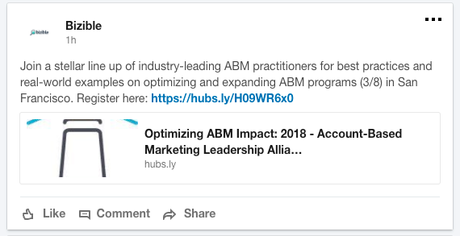
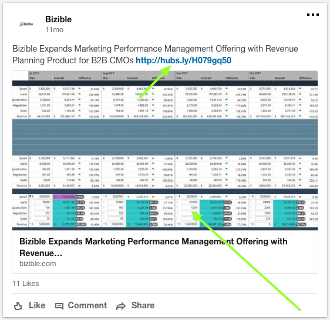

# LinkedIn統合 {#linkedin-integration}

## 概要 {#overview}

The [!DNL Marketo Measure] linkedInとの統合には、次の 2 つの部分があります。

スポンサー付きコンテンツ：スポンサー付きコンテンツの統合により、 [!DNL Marketo Measure] 宛先 URL をタグ付けするには、次の手順に従います。 [!DNL LinkedIn] 広告。最終的には [!DNL Marketo Measure] を使用して、タッチポイントジャーニー全体をフォローし、アクティビティを特定の [!DNL LinkedIn] Campaign と Creative。 これにより、顧客の ROI に関するインサイトが得られます [!DNL LinkedIn] アクティビティ。

リード生成Forms: LinkedInのリード生成Formsとの統合により、Marketo MeasureはLinkedInプラットフォームを通じて送信されたフォームに対するインサイトを得ることができます。 これらのフォーム入力は、CRM のリードと照合されます。または [!DNL Marketo Engage] インスタンスを使用して、アトリビューションの対象となるようにします。 フォームの生成に役立つキャンペーン、クリエイティブ、フォームについてのインサイトを活用して、チームがLinkedInのマーケティングおよび広告費用をさらに最適化できるようになりました。

## 利用可能性 {#availability}

すべてのお客様が利用できます。

## 要件 {#requirements}

**Campaign Manager のロール**

の場合 [!DNL Marketo Measure] Ads Data &amp; Ads のコストデータをダウンロードするには、キャンペーンマネージャーで次の役割のいずれかを持っている必要があります。

* 請求管理者
* アカウントマネージャ
* キャンペーンマネージャー

詳細情報： [Campaign Manager のユーザーの役割と機能](https://www.linkedin.com/help/lms/answer/a425731/user-roles-and-functions-in-campaign-manager).

**有料メディア管理者の役割**

の場合 [!DNL Marketo Measure] スポンサー付きクリエイティブを作成/更新するには、以下の有料メディア管理者の役割のいずれかが必要です。

* スポンサー付きコンテンツポスター
* リードジェネレーションFormsマネージャ

詳細情報： [LinkedInページ管理者の役割](https://www.linkedin.com/help/linkedin/answer/4783/linkedin-page-admin-roles-overview).

他にもある [!DNL LinkedIn] 我々が行う役割 **not** 統合にはが必要です。 これらの役割は、必須の役割と誤認されることが多いので、違いがあることに注意してください。

**ページ管理者の役割**

の場合 [!DNL Marketo Measure] リード生成フォームからリードをダウンロード/統合するには、次のページ管理者の役割が必要です。

* スーパー管理者

詳細情報： [LinkedInページ管理者の役割](https://www.linkedin.com/help/linkedin/answer/4783/linkedin-page-admin-roles-overview).

## LinkedIn Ad Types {#linkedin-ad-types}

[!DNL Marketo Measure] は次をサポートします。

**スポンサー付きコンテンツ：** スポンサー付きコンテンツを使用すると、 [!DNL LinkedIn] 会社をフォローしているメンバー以外のメンバーのフィード。 スポンサー付きコンテンツは、特定のオーディエンスをターゲットに設定し、広告主がリーチするのに役立ちます [!DNL LinkedIn] メンバーが関わっている場所や時間に関係なく [!DNL LinkedIn] プラットフォームをデスクトップ、モバイル、タブレットにまたがらせることができます。 リードジェネレーションFormsのスポンサー付きコンテンツがサポートされます。

でサポートされるスポンサー付きコンテンツ広告形式のタイプ [!DNL Marketo Measure] は、単一のイメージ広告およびビデオ広告です ( リード生成Formsを通じて )。 スキーマが複雑なので、カルーセル広告はサポートしていません。

[!DNL Marketo Measure] は、スポンサー付きメッセージ、テキスト広告、動的広告をサポートしていません。

>[!TIP]
>
>スポンサー付き以外のコンテンツソース（「テキスト広告」や「スポンサー付き InMail」のキャンペーンタイプなど）から派生するキャンペーン/支出の場合、 [!DNL Marketo Measure] は、 _not_ は、これらのキャンペーンタイプの追跡を本質的にサポートしています。 「スポンサー付きコンテンツ」支出と共にキャンペーンの支出を追跡する場合は、マーケティング支出 CSV を利用して、支出した支出を手動で記録するようにしてください。

## 仕組み：スポンサー付きコンテンツ {#how-it-works-sponsored-content}

>[!NOTE]
>
>初めて使用する前に、次の場所に移動して、この機能設定を有効にする必要があります。 [!DNL Marketo Measure] [!UICONTROL 設定] > [!UICONTROL 統合] > [!UICONTROL 広告] > [!UICONTROL linkedInリード生成Formsを有効にする].

**[!DNL LinkedIn's]独自の自動タグ付け要件**

[!DNL Marketo Measure] は、ランディングページに自動タギングすることによって、 キャンペーンの効果を追跡できます。[!DNL LinkedIn]

[!DNL Marketo Measure] 一意のLinkedIn Share を持つクリエイティブを検索し、 `?_bl={creativeId}` パラメーターを最後に追加する必要があります。

**共有のコピー**

これで [!DNL Marketo Measure/LinkedIn] 統合の際には、既存のクリエイティブのコピー/複製をおこなわないようお願いします。 共有が見つかり、1 つのクリエイティブでのみ使用されると検出された場合、 [!DNL Marketo Measure] は、クリエイティブまたは共有を再作成しなくても、そのまま共有にタグ付けでき、すべての広告履歴（インプレッション数、クリック数、共有数）が残ります。

共有が複数のクリエイティブで共有されるとすぐに、 [!DNL Marketo Measure] 一意のセットを作成するには、を一時停止、コピー、再タグ付けするプロセスを実行する必要があります。 [!DNL Marketo Measure] はライブクリエイティブを一時停止してアーカイブします。したがって、すべてを適切に自動タグ付けするために、インプレッション数、クリック数、ソーシャル共有を含む広告履歴が削除されます。

前に進み [!DNL Marketo Measure] では、 [!DNL LinkedIn] すべてのクリエイティブと共有を可能な限り一意に共有し、広告履歴を消去することなく、単に追跡を追加できるようにします。

**短縮 URL**

この追加の手順が必要な理由は、LinkedInでは宛先 URL を短縮 URL（bit.ly、goog.le など）にすることが許可されているためです。つまり、 [!DNL Marketo Measure] で、長い解決された URL が表示されない。 [!DNL Marketo Measure] 解決された URL にトラッキングパラメーターを追加する必要があります。 この問題を回避するために [!DNL Marketo Measure] 広告を再作成する前に短縮 URL を検索し、URL を展開して、解決された URL とそのすべてのパラメーターを使用して新しい広告を作成し、 [!DNL Marketo Measure] をクリックしてタグを追加します。 新しい広告を作成すると、広告履歴（インプレッション数、クリック数、共有数）が削除されるので、短縮 URL にタグ付けする権限が必要です。

短縮 URL を多用する場合は、これによってクリエイティブに大きな影響が及ぶ可能性があります。短縮 URL を使用しなくなったので、 [!DNL Marketo Measure] は、新しい広告を作成して広告履歴を消去することなく、ランディングページにタグ付けできます。

**プロセス**

まず例を挙げましょう。 例えば、我々が持っているとします....

クリエイティブ A :123 を共有\
クリエイティブ B ：共有 234\
クリエイティブ C :234 を共有\
クリエイティブ D :234 を共有

`1)` [!DNL Marketo Measure] が最初に「アクティブ」ステータスのすべてのキャンペーン、クリエイティブおよび共有を調べます。 [!DNL Marketo Measure] は、一時停止、アーカイブ、キャンセルされた広告にタグ付けしません。 広告が一時停止された場合、を [!UICONTROL アクティブ]を呼び出す場合、再度アクティブになったらタグ付けします。 一意の共有が見つかる場合、つまり複数のクリエイティブまたはキャンペーン（クリエイティブ A ：共有 123 など）で使用されていない場合、 [!DNL Marketo Measure] カスタムパラメーターを追加します `>> ?_bl={creativeId}` を共有 URL に追加します。

`2)` 共有が共有され、一意性が失われた場合（例：クリエイティブ B ：共有 234、クリエイティブ C ：共有 234、クリエイティブ D ：共有 234）、 [!DNL Marketo Measure] は、類似したクリエイティブ（クリエイティブ B、クリエイティブ C、クリエイティブ D）をすべて一時停止してアーカイブします。

`3)` [!DNL Marketo Measure] クリエイティブ B のコンテンツをコピーする、クリエイティブ E、クリエイティブ F、クリエイティブ G の 3 つの新しいクリエイティブが作成されます。このクリエイティブ B はアーカイブされます。

`4)` [!DNL Marketo Measure] また、3 つの新しい株式、345 株、456 株、567 を作成し、234 株の内容をコピーします。ただし、独自の独自の内容を持つことを除きます `?_bl` タグ付け。

`5)` [!DNL Marketo Measure] 共有が共有されないことを定期的に確認する必要があり、共有されている場合は、上記の手順 2 でプロセスを再開します。

>[!NOTE]
>
>これを実装すると、お客様はクリエイティブ B の広告履歴 ( 共有 234、クリエイティブ C ：共有 234、クリエイティブ D ：共有 234 が失われます。現在は、クリエイティブ E ：共有 345、共有 F ：共有 456、クリエイティブ G ：共有 567 で再作成されるからです。

## 仕組み：リードジェネレーションForms {#how-it-works-lead-gen-forms}

**プロセス**

～ [!DNL LinkedIn's] 広告フォーム API と広告フォーム応答 API を使用すると、広告アカウントのフォーム送信データを収集し、電子メールアドレスを CRM またはMarketoのリードに関連付けることができます。

LinkedIn forms には、複数の電子メールアドレスを含めることができます。 フォームの回答をダウンロードする際に、仕事用電子メール、電子メールアドレス（プライマリフォームフィールド）、または有効な電子メール値を持つカスタムフィールドを優先して電子メールアドレスを検索します。

Campaign やクリエイティブのステータスに関係なく、すべてのフォームの回答は、タッチポイントを生成します。 [!DNL Marketo Measure] には 90 日間のルックバック制限があるので、 [!DNL Marketo Measure] は 90 日を超える古いフォームの回答にアクセスできませんが、長い時間は [!DNL Marketo Measure] および [!DNL LinkedIn] 統合が有効になっている場合、より多くのリード生成フォームタッチポイントが、 [!DNL Marketo Measure].

>[!NOTE]
>
>LinkedInのコストは、スポンサー付きコンテンツキャンペーンの一部として引き続きダウンロードされます。

**CRM またはMarketoでのリードジェネレーションFormsの追跡**

の前に [!DNL Marketo Measure] linkedInリード生成Forms統合が存在したので、お客様は、フォーム送信をMarketoプログラムや CRM Campaign にプッシュしてフォームをトラッキングし、それらのアクティビティに関する属性を受け取るのが一般的な方法でした。 「リード生成Forms」設定が有効になったら、これらのフォーム送信が二重にカウントされないようにする必要があります。 次の点を確認してください。

* CRM オブジェクトの「購入者タッチポイントを有効にする」フィールドが「なし」または「すべてのキャンペーンメンバーを除外」に設定されている
* 関連するMarketoプログラムまたはMarketoアクティビティルールを更新する
* 関連する CRM キャンペーンルールを更新します

>[!NOTE]
>
>linkedIn API には 90 日間のルックバック制限があるので、Marketoまたは CRM ルールを使用している場合は、ルールの終了日を、 [!DNL Marketo Measure].

## Touchpoint の詳細 {#touchpoint-details}

1 回 [!DNL Marketo Measure] では、LinkedInクリエイティブでランディングページが正常にタグ付けされ、タッチポイントで解決された広告データを表示できます。 次に、表示されるはずのデータ値のマッピングを示します。

<table> 
 <colgroup> 
  <col> 
  <col> 
 </colgroup> 
 <tbody> 
  <tr> 
   <th>タッチポイントフィールド</th> 
   <th>サンプル値</th> 
  </tr> 
  <tr> 
   <td>
広告 ID 
</td> 
   <td>
84186224 
</td> 
  </tr> 
  <tr> 
   <td>
広告コンテンツ 
</td> 
   <td>
copy-1-image-2-man 95%のマーケターは、需要創出戦略を成功に導くと考えていま#B2B。 詳細情報： [!DNL https]://lnkd.in/jgdi50vKrgv
</td> 
  </tr> 
  <tr> 
   <td>
広告グループ ID 
</td> 
   <td>
(空白) 
</td> 
  </tr> 
  <tr> 
   <td>
広告グループ名 
</td> 
   <td>
(空白) 
</td> 
  </tr> 
  <tr> 
   <td>
広告キャンペーン ID 
</td> 
   <td>
138949954 
</td> 
  </tr> 
  <tr> 
   <td>
広告キャンペーンの名前 
</td> 
   <td>
SU - COM Accounts - Demand Skills 
</td> 
  </tr> 
  <tr> 
   <td>
広告のリンク先 URL 
</td> 
   <td>
https://www.adobe.com/marketing-attribution-for-demand-generation-leaders?_bl=84186217 
</td> 
  </tr> 
  <tr> 
   <td>
フォーム/URL 
</td> 
   <td>
info.bizible.com/demo 
</td> 
  </tr> 
  <tr> 
   <td>
フォーム URL — 生 
</td> 
   <td>
info.bizible.com/demo 
</td> 
  </tr> 
  <tr> 
   <td>
キーワード ID 
</td> 
   <td>
(空白) 
</td> 
  </tr> 
  <tr> 
   <td>
キーワード一致タイプ 
</td> 
   <td>
(空白) 
</td> 
  </tr> 
  <tr> 
   <td>
ランディングページ 
</td> 
   <td>
https://www.adobe.com/marketing-attribution-for-demand-generation-leaders 
</td> 
  </tr> 
  <tr> 
   <td>
ランディングページ — Raw 
</td> 
   <td>
https://www.adobe.com/marketing-attribution-for-demand-generation-leaders?_bl=84186217 
</td> 
  </tr> 
  <tr> 
   <td>
マーケティングチャネル 
</td> 
   <td>
ペイドソーシャル 
</td> 
  </tr> 
  <tr> 
   <td>
マーケティングチャネル — パス 
</td> 
   <td>
ペイドソーシャル。LinkedIn 
</td> 
  </tr> 
  <tr> 
   <td>
中 
</td> 
   <td>
"cpc"または"リード生成フォーム"
</td> 
  </tr> 
  <tr> 
   <td>
参照元ページ 
</td> 
   <td>
www.linkedin.com/ 
</td> 
  </tr> 
  <tr> 
   <td>
リファラーページ — Raw 
</td> 
   <td>
www.linkedin.com/ 
</td> 
  </tr> 
  <tr> 
   <td>
検索フレーズ 
</td> 
   <td>
(空白) 
</td> 
  </tr> 
  <tr> 
   <td>
Touchpointのタイプ 
</td> 
   <td>
ウェブフォーム 
</td> 
  </tr> 
  <tr> 
   <td>
Touchpoint ソース 
</td> 
   <td>
LinkedIn 
</td> 
  </tr> 
 </tbody> 
</table>

## コスト {#costs}

理由： [!DNL Marketo Measure] は、 [!DNL LinkedIn]を使用する場合は、毎日キャンペーンとクリエイティブの記録済み支出をダウンロードします。 お客様が [!DNL LinkedIn] ～の中で過ごす [!DNL Marketo Measure] アプリケーションが終了しました。

他の広告統合と同様に、 [!DNL Marketo Measure] は、すべての [!DNL LinkedIn] キャンペーン、クリエイティブ、コスト。 ルールを使用するには、顧客は有料顧客の新しい行を挿入します [!DNL LinkedIn] 努力。 新規または既存のチャネルにすることができます。 リファラー列で、「[[!DNL LinkedIn] 有料 ]」 [!DNL Marketo Measure] は、 [!DNL Marketo Measure] タグを使用します。

## [!DNL Marketo Measure] Discover {#marketo-measure-discover}

いくつかの機能強化がおこなわれました。 [!DNL Marketo Measure] リードジェネレーションFormsのレポートをサポートするための Discover。

**有料メディアボード**

リード生成Formsタイル： LinkedInのフォーム入力数を含む新しいタイル。 このカウントのドリルスルーには、アクティビティ ID、フォーム日、フォーム名、メールアドレスが表示されます。

**エンゲージメントパスボード**

イベントのジャーニー：統合を通じて得られるフォームには、「アクティビティ」イベントタイプと中程度の「リード生成フォーム」が含まれます。 ドリルスルー表示には、キャンペーン、クリエイティブ、フォームの詳細が含まれます。

## スポンサー付きコンテンツに関する FAQ {#sponsored-content-faq}

**ダークシェアとは**

ダークシェアとは、会社ページに投稿されず、すぐに作成され、クリエイティブとして直接追加される投稿です。 そうして [!DNL Marketo Measure] — 創作クリエイティブは、会社のページの先頭には表示されず、再度プロモーションされることもなく、暗いシェアを使用して、裏で打ち上げることができます。

**ステータスの機能 [!DNL Marketo Measure] 実際にタグを付ける？**

には 4 つの異なるステータスがあります [!DNL LinkedIn] Campaign とクリエイティブ：アクティブ、一時停止、アーカイブおよびキャンセル済み。 アクティブなキャンペーンおよびクリエイティブのみにタグ付けします。 他のステータスにタグを付けると、それらは再び「アクティブ」に設定されます。 [!DNL Marketo Measure] 一時停止、アーカイブ済み、キャンセル済みのキャンペーンやクリエイティブのタグ付けはおこなわれませんが、ステータスが「アクティブ」に変わるとタグ付けが再開されます。

**その価値とは何か [!DNL Marketo Measure] を使用してタグを付けますか？**

リンク先 URL の末尾に、 [!DNL Marketo Measure] はパラメーターを追加しています `&_bl={creativeId}`( ここで `{creativeId}` は、LinkedInのクリエイティブ ID です。 クリエイティブ ID を持つ [!DNL Marketo Measure] また、キャンペーン ID( [!DNL LinkedIn] には、各クリエイティブが 1 つのキャンペーンにしか属していないので、かなり基本的な広告構造があります。

**以前のクリエイティブとの関係 [!DNL Marketo Measure] 新しいバージョンを作成しますか？**

条件 [!DNL Marketo Measure] 共有を再作成し、新しいクリエイティブに配置します。古いクリエイティブはアーカイブされます。 その理由もこうです。 [!DNL Marketo Measure] アーカイブされたキャンペーンまたはクリエイティブにタグ付けしません。タグ付けしない場合、次を使用してループします。 [!DNL Marketo Measure] 無期限にタグ付けしようとしています。

**作成した広告のリンク先 URL が元の広告と一致しないのはなぜですか？**

[!DNL Marketo Measure] では、解決された URL にトラッキングパラメーターを追加する必要がありますが、API で提供される URL は、すべてのパラメーターが存在しない場合、短縮 URL になる可能性があります。 この問題を回避するために [!DNL Marketo Measure] 追加を再作成する前に短縮 URL を探して解決し、解決された URL とそのすべてのパラメーターを使用して新しい広告を作成し、 [!DNL Marketo Measure] をクリックしてタグを追加します。

**すべての広告にタグを付けていますか？ すべてのランディングページに bl パラメーターが表示されない**

一部のマーケターがリンク先 URL に画像リンクを配置し、 [!DNL Marketo Measure] ではタグ付けできないので、広告コンテンツ内で URL を検索します。 次の場合 [!DNL Marketo Measure] には、短縮 URL にタグ付けする権限があります。URL を拡張してタグ付けしますが、LinkedInのコピー構造により、テキスト内で自動的に短縮されます。 タグはLinkedIn短縮 URL 内に存在し、タッチポイントの「広告コンテンツ」フィールドに表示されます。このフィールドは、「ランディングページ — 生」フィールドには表示されません。

**いや、私のチームの誰かが誤って 1 つのシェアを複製しました。 止めてもいい？**

心配しないで。 [!DNL Marketo Measure] は、一意でなくなった共有（その後別のクリエイティブにコピーされた共有）をプログラムによって確認します。 そのコピーが検出されたら、 [!DNL Marketo Measure] は、通常のフローに従って、新しい広告をタグ付けし作成します。

**私の広告は先ほどレビュー待ちでした。 次の後も再度レビューを保留中なのはなぜですか？ [!DNL Marketo Measure] タグ付けした？**

LinkedInは、作成または変更されたすべての広告が、通常のセキュリティプロセスを経てから投稿される必要があります。 [!DNL Marketo Measure] は、を使用して 6 時間ごとに新しい広告をスキャンするので、可能な限り迅速に広告の切り取りを試みます。 [!DNL LinkedIn's] 追加の手順では、起動が数時間遅れる場合があります。

**広告に 2 つの URL があります。 誰がタグ付けされる？**

両方. The [!DNL Marketo Measure] 統合により、広告内のクリックスルー画像から宛先 URL にタグ付けできますが、広告の説明に含まれる短縮 URL も自動的に更新されます。

**接続しました [!DNL LinkedIn ads] アカウント。 がないのはなぜですか。 [!DNL Marketo Measure] リンクにタグ付けしますか？**

接続された [!DNL LinkedIn] ユーザーは適切な編集アクセス権を持つ必要があります。つまり、ユーザーはアカウントマネージャー、キャンペーンマネージャー、クリエイティブマネージャーのいずれかである必要があります。

**クリエイティブがコピーされるかどうかを確認するには、どうすればよいですか？ クリエイティブが同じシェアを使用しているかどうかを確認できますか？**

共有 ID が [!DNL LinkedIn] ですから、クリエイティブと共有のマッピングを確認する明確で明確な方法はありません。 クリエイティブがコピーであると思われる場合は、 [!DNL LinkedIn] キャンペーンマネージャー — 広告が新しいタブで開き、URL に共有 ID が表示されます。

## リード生成Forms FAQ {#lead-gen-forms-faq}

**この機能強化のコストはどれくらいですか？**

このオファーは、有料のものに含まれます [!DNL Marketo Measure] 購読。

**統合は遡及的ですか？**

はい、90 日間のルックバックウィンドウに制限されていますが、LinkedInからの履歴広告フォームの応答をダウンロードします。 長い時間 [!DNL Marketo Measure] とLinkedInの統合が有効になっている場合、より多くのリード生成フォームタッチポイントが、 [!DNL Marketo Measure].

ダウンロード用に特定の日付を設定するオプションはありませんが、抑制する必要があるタッチポイントがある場合は、オプションでタッチポイント削除ルールを設定できます。

**既に [!DNL Marketo Measure] LinkedIn広告の統合？**

いいえ、すべてのお客様に対して自動的にダウンロードを開始するわけではありませんが、設定でこの機能を有効にする簡単な切り替えです。

**フォームデータは使用できますか？**

フォームデータは、 [!DNL Marketo Measure] フォーム ID とフォーム名を含む Discover を参照してください。 フォームの詳細は、CRM のタッチポイントオブジェクトではまだ使用できません。

**何が起こるか [!DNL LinkedIn] 以前にMarketoプログラムまたは CRM キャンペーンに同期されたリード**

任意の [!DNL Marketo Measure] 重複を避けるために、特定のプログラムまたはキャンペーンからタッチポイントを生成するルールです。 linkedIn API には 90 日間のルックバック制限があるので、Marketoまたは CRM ルールを使用している場合は、ルールの終了日を、 [!DNL Marketo Measure]. これ以降、 [!DNL Marketo Measure] は、より詳細なインサイトと詳細を使用して、これらのリードをダウンロードできます。

**自動タギングまたはトラッキングは必要ですか？**

いいえ、これは他とは異なります [!DNL Marketo Measure] 統合と呼ばれます。 ランディングページを変更するのではなく（クリックスルーランディングページがないので）、LinkedInから関連情報をダウンロードするだけで、内でのアクティビティとして扱います [!DNL Marketo Measure].
