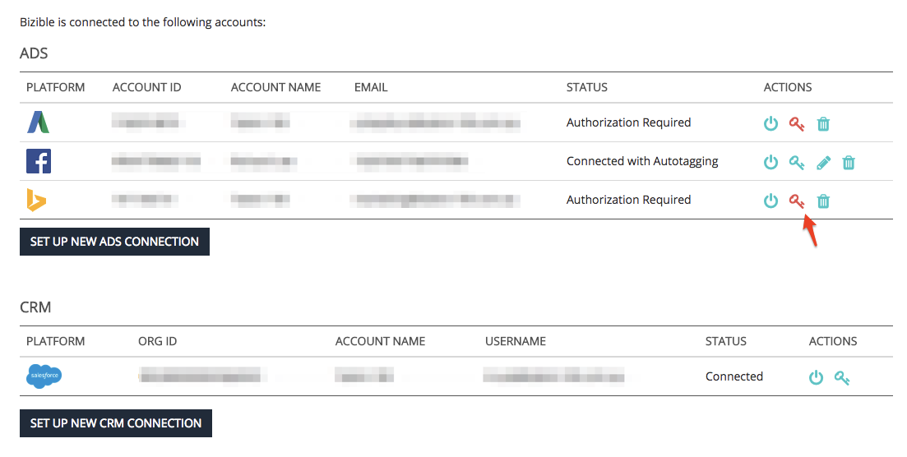

# 接続されたアカウントの再認証 {#reauthorizing-connected-accounts}

アカウントが[!DNL Marketo Measure] アカウントから切断されると、プラットフォームのステータスが「承認必須」に変わり、赤いキーアイコンが表示されます。

広告プラットフォームが切断されると、[!DNL Marketo Measure]はコストデータをダウンロードできなくなります。また、自動タグ付けが有効になっている場合は、新しく作成された広告に[!DNL Marketo Measure] UTM パラメーターを追加します。 アカウントが切断されている間、広告プラットフォームから作成されたタッチポイントにUTM パラメーターを過去にさかのぼって追加することはできません。[!DNL Marketo Measure]

CRM プラットフォームが切断された場合、[!DNL Marketo Measure]は[!DNL Marketo Measure] データを更新したり、新しいタッチポイントを組織にプッシュしたりすることはできません。 CRM接続が再確立されると、[!DNL Marketo Measure]は、アカウントが切断されたときに見逃したデータをすべてプッシュします。

## 切断されたアカウントの再認証 {#re-authorizing-disconnected-accounts}

1. [experience.adobe.com/marketo-measure](https://experience.adobe.com/marketo-measure?lang=ja){target="_blank"}に移動してログインします。
1. 左上隅の「[!UICONTROL  マイアカウント ]」タブで「**[!UICONTROL 設定]**」を選択します。
1. 左側の「統合」セクションを見つけて、**[!UICONTROL 接続]**&#x200B;をクリックします。
1. 再接続する必要があるアカウントの横にある赤いキー記号を選択します。
1. ポップアップウィンドウが表示され、アカウントのログイン詳細を入力するよう求められます。
