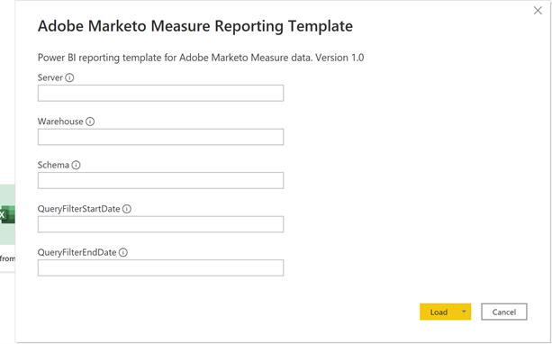
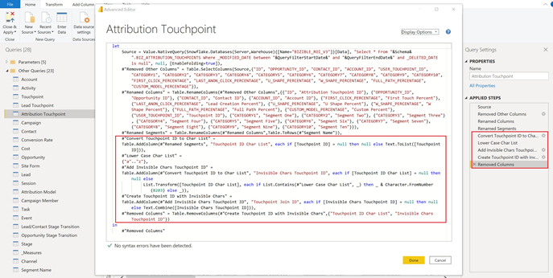

# [!DNL Marketo Measure] レポートテンプレート —Power BI {#marketo-measure-report-template-power-bi}

## はじめに {#getting-started}

データレポートテンプレートにアクセスするPower BI [ここ](https://github.com/adobe/Marketo-Measure-BI-Templates){target="_blank"}.

Adobeを開く [!DNL Marketo Measure] レポートテンプレートPower BIファイル。

特定のサーバー、ウェアハウス、スキーマ情報は、 [!DNL Marketo Measure] の UI [!DNL Data Warehouse] 情報ページ。 このページの場所の指定方法について詳しくは、 [ここ](/help/marketo-measure-data-warehouse/data-warehouse-access-reader-account.md){target="_blank"}.

QueryFilterStartDate パラメーターと QueryFilterEndDate パラメーターは、インポートするデータの量を制限するために使用されます。 これらのパラメーターは、に送信されるクエリで使用されるので、SQL フォーマットである必要があります [!DNL Snowflake]. たとえば、データを過去 2 年間に制限する場合、 QueryFilterStartDate は dateadd (year,-2,current_date()) になります。 これらのパラメーターは、日時のデータ型と比較されるので、QueryFilterEndDate に dateadd (day,1,current_date()) を使用して、すべてのデータを現在の時刻に返すことをお勧めします。

## データ接続 {#data-connection}

ファイルを開く際に入力するパラメーターは、Data Warehouse からテーブルをインポートするネイティブクエリを構造化するために使用されます。 引き続き、 [!DNL Snowflake] インスタンス。 この場合、同じ Server と Warehouse の名前と、ユーザー名とパスワードが必要です。 ユーザー名の見つけ方と、必要に応じてパスワードをリセットする方法の詳細は、ドキュメントに記載されています [ここ](/help/marketo-measure-data-warehouse/data-warehouse-access-reader-account.md){target="_blank"}.

## データのインポート {#data-import}

レポートのパフォーマンスを向上させ、Power Query の変換機能を活用するために、インポートストレージ方法を使用してこのテンプレートを設定することにしました。

### クエリのパラメータ {#query-parameters}

モデルにインポートするデータを制限するために、各テーブルは、ネイティブクエリをソースとして使用して設定されます。 ネイティブクエリの実行には承認が必要です。各クエリに対して「実行」をクリックする必要があります。 この手順は、クエリを初めて実行したとき、またはパラメーターが変更された場合にのみ必要です。

すべてのクエリで、削除された行と [!UICONTROL 事実] 表は、開始日と終了日の間の変更日をパラメーターとして入力した行にフィルターするように設定されます。

>[!NOTE]
>
>日付フィルターは行の変更日に適用されるので、制限された日付範囲外の日付に関するレポートを作成する場合は注意が必要です。 例えば、変更された日付範囲は過去 2 年に制限されています。 これには、3 年前のイベント日を持つが、最近変更されたイベントを含めることができます。 ただし、3 年前のイベントをレポートすると、2 年以内にすべての行が変更されていないので、不完全な結果が返されます。

次の表は事実表として扱われ、これらのクエリに、変更日の日付制限が追加されました。

* アクティビティ
* Touchpoint
* リードタッチポイント
* 属性タッチポイント
* コスト
* サイトフォーム
* セッション
* キャンペーンメンバ
* タスク
* イベント
* リード/連絡先ステージ遷移
* 商談ステージの遷移

次のテーブルは、ディメンションテーブルとして扱われます。これらのクエリに対して日付制限は設定されていません。

* アカウント
* キャンペーン
* 取引先責任者
* コンバージョン率
* 商談
* リード
* ステージ
* チャネル

## データ変換 {#data-transformations}

Power Query のデータには、いくつかの変換が適用されています。 表の特定の変換を表示するには、Power Query を開き、表に移動し、ウィンドウの左側にある「適用ステップ」に注意します。 以下に、具体的な変換の一部を示します。

### 削除された列 {#removed-columns}

データモデルを簡素化し、冗長で不要なデータを削除するために、元のデータからPower BIに読み込まれる列の数を減らしました [!DNL Snowflake] 表。 削除された列には、不要な外部キー、非正規化されたディメンションデータが含まれ、モデル内の他のテーブル、監査列、内部で使用されるフィールドとの関係を通じて、より有効に活用されます [!DNL Marketo Measure] 処理中。 必要に応じて、ビジネスニーズに応じて列を追加または削除できます。 任意のテーブルの「ソース」ステップの後の「他の列を削除」ステップに移動し、歯車アイコンをクリックして、表示されるリストで選択した列を更新します。

>[!NOTE]
>
>* 外部キー値を追加する場合は注意が必要です。 Power BIは、多くの場合、モデル内の関係を自動検出するように設定され、外部キー値を追加すると、テーブル間の望ましくないリンクや既存の関係が無効になる場合があります。
>
>* のほとんどのテーブル [!DNL Marketo Measure] data warehouse には、非正規化されたディメンションデータが含まれます。 パフォーマンスとPower BIの正確性を向上させるために、できる限りデータ内のモデルを正規化およびクリーンアップするように作業しました。 非正規化されたフィールドをファクトテーブルに追加する場合は注意が必要です。これにより、テーブル間のディメンションフィルタリングが壊れ、レポートが不正確になる可能性があります。

### 列名の変更 {#renamed-columns}

テーブルと列の名前は、よりユーザーにわかりやすい名前に変更され、命名規則を標準化するようになりました。 列名の変更を表示するには、任意のテーブルの「他の列を削除」ステップの後の「列名を変更」ステップに移動します。

### セグメント名の変更 {#renamed-segments}

セグメント名はカスタマイズ可能なので、SnowflakeData Warehouse では汎用の列名が付けられます。 [!DNL BIZ_SEGMENT_NAMES] は、汎用のセグメント名と、 [!DNL Marketo Measure] UI 「セグメント名」テーブルは、リードタッチポイントおよび属性タッチポイントテーブルのセグメント列の名前を変更するために使用されます。 カスタマイズされたセグメントが存在しない場合、汎用セグメント名はそのまま残ります。

### 大文字と小文字を区別する ID の変換 {#case-sensitive-id-conversion}

[!DNL Marketo Measure] データには、プライマリキー (ID) 値の大文字と小文字が区別されるテーブル（タッチポイントおよびキャンペーン）が 2 つあります。 Power BIモデリングレイヤーを駆動するデータエンジンでは大文字と小文字が区別されないので、id 値が「重複」します。 これらのキー値の大文字と小文字の区別を保持するために、データエンジンレイヤーで評価した際の ID の一意性を保ちながら、不可視の文字を小文字に付加する変換手順を実装しました。 問題の詳細と使用した方法の詳細な手順は、こちらを参照してください [ここ] (https://blog.crossjoin.co.uk/2019){target="_blank"}. これらの大文字と小文字を区別する ID 値は、「結合 ID」というラベルが付けられ、関係レイヤーの結合キーとして使用されます。 結合 ID はレポートレイヤーで非表示にし、元の ID 値はレポートで使用する際に表示したままにしました。非表示の文字が切り取り/貼り付け機能やフィルタリングに影響を与える可能性があるからです。

### 追加された行 {#rows-added}

モデルの計算に通貨換算機能を追加するために、商談テーブルとコストテーブルの両方に企業換算率列を追加しました。 この列の値は行レベルで追加され、日付と通貨 ID の両方でコンバージョン率テーブルに結合して評価されます。 このモデルでの通貨換算の仕組みについて詳しくは、 [通貨換算](#currency-conversion) の節を参照してください。

次の場所に保存されているコンバージョン率テーブル： [!DNL Snowflake] には、各コンバージョンの日付範囲が含まれます。 Power BIでは、計算の結合条件（日付範囲内など）は使用できません。 日付を結合するために、コンバージョン率テーブルに、コンバージョン日付範囲の各日に対して 1 行が表示されるように行を展開する手順を追加しました。

## データモデル {#data-model}

フルサイズ版の場合は、以下の画像をクリックしてください。

{target="_blank"}

### 関係とデータフロー {#relationships-and-data-flow}

タッチポイントの作成に使用されるイベントデータは、 [!UICONTROL セッション], [!UICONTROL タスク], [!UICONTROL イベント], [!UICONTROL アクティビティ]、キャンペーンメンバーテーブル。 これらのイベントテーブルは、それぞれの ID を介してタッチポイントテーブルに結合され、イベントの結果がタッチポイントになった場合は、詳細がタッチポイントテーブルに格納されます。

リードタッチポイントとアトリビューションタッチポイントは、タッチポイントテーブルへのリンクと共に、独自のテーブルに格納されます。 リードおよびアトリビューションタッチポイントのほとんどのディメンションデータは、対応するタッチポイントへのリンクから提供されます。

このモデルでは、キャンペーンディメンションとチャネルディメンションがタッチポイントにリンクされているので、これらのディメンションに関するすべてのレポートはこのリンクを通じており、イベントデータに関するディメンションレポートが不完全な可能性があります。 これは、多くのイベントでは、タッチポイントへと処理されるまで、これらのディメンションへのリンクがないからです。 注意：セッションなどの一部のイベントには、キャンペーンディメンションとチャネルディメンションへの直接リンクがあります。 これらのディメンションのセッションレベルでのレポートが必要な場合は、そのために別のデータモデルを作成することをお勧めします。

コストデータは、 [!DNL Snowflake] data warehouse のコストテーブル。 すべての広告プロバイダーについて、Campaign レベルのデータをチャネルレベルにロールアップできます。 この理由から、このモデルは「campaign_is_aggregatable_cost」フラグに基づいてコストデータを取り込みます。 自己報告されたコストは、チャネルレベルでのみ提出でき、Campaign データを持つ必要はありません。 可能な限り正確なコストレポートを提供するために、自己報告されたコストは「channel_is_aggregatable_cost」フラグに基づいて取り出されます。 コストデータを読み込むクエリは、次のロジックを使用して記述されます。ad_provider = &quot;SelfReported&quot;の場合、 channel_is_aggregatable_cost = true、それ以外の場合、 campaign_is_aggregatable_cost = true。

コストデータとタッチポイントデータにはいくつかの共通ディメンションがあるので、ファクトテーブルの両方にキャンペーンおよびチャネルディメンションテーブルとの関係があります。

このモデルのコンテキスト内で、 [!UICONTROL リード], [!UICONTROL 連絡先], [!UICONTROL アカウント]、および [!UICONTROL 商談] データはディメンションデータと見なされ、直接 [!UICONTROL リード] タッチポイントおよび [!UICONTROL 帰属] タッチポイントテーブル。

### 追加されたテーブル {#added-tables}

**日付**

Power BIは 1 つの列のテーブル間の関係のみを可能にするので、日付ディメンションテーブルが追加され、金額（商談とコスト）を含むテーブルとコンバージョン率テーブルの間で必要な結合を容易にしました。 このモデルでの通貨換算の計算方法の詳細については、「通貨換算」の節を参照してください。

**測定**

すべての測定が専用の測定テーブルに追加されました。 モデルに接続されていませんが、すべての測定を保存する 1 つの場所として機能し、使いやすくなります。

**アトリビューションモデル**

アトリビューションモデルの名前を保存するための別のテーブルが追加されました。 このテーブルは、属性売上高の計算に関するアトリビューションモデルを切り替えるフィルターの作成に使用します。

### 通貨換算 {#currency-conversion}

コンバージョン率テーブルの率は、金額を会社通貨から換算するために必要な値を表します。 任意の通貨への換算では、最初に元の通貨から会社通貨に、次に会社通貨から選択した通貨に、二重換算が必要です。 モデルのこのチェーンの最初の手順は、コンバージョン率の列を企業のテーブルに追加し、金額、商談、コストを含むテーブルに追加することです。 これらの手順について詳しくは、このドキュメントのデータ変換の節にある行の追加ヘッダーを参照してください。 元の通貨から企業通貨への換算は、値をこの加算列で割ることで構成されます。 次に、企業の通貨の値に、選択した通貨に対応する「換算レート」テーブルのレートを掛けます。

* 元の値を企業通貨価値に変換/企業換算レート=企業通貨での値
* 企業から選択した通貨値に企業通貨で値を変換します `*` 選択した通貨のコンバージョン率=選択した通貨の値

コンバージョン率は静的である必要はなく、指定した日付範囲で変更される場合があるので、すべての通貨コンバージョンの計算は行レベルで実行する必要があります。 この場合も、コンバージョン率は特定の日付範囲に関係するので、参照計算は測定の DAX 内で実行する必要があり、通貨コードと日付の両方で関係を定義できます。

換算レートが識別できない場合、このモデルの通貨換算メジャーは、レートの値を 1.0 に置き換えます。 メジャーの通貨値を表示する個別のメジャーが作成され、計算に複数の通貨値が含まれる場合（つまり、値を選択した通貨に変換できなかった場合）にアラートが表示されます。

## データ定義 {#data-definitions}

テーブル、カスタム列、測定のPower BIモデルに定義が追加されました。

直接移動元の列の定義を表示するには [!DNL Snowflake]詳しくは、 [data warehouse ドキュメント](/help/marketo-measure-data-warehouse/data-warehouse-schema.md){target="_blank"}

## テンプレートと Discover の相違 {#discrepancies-between-templates-and-discover}

### 起因する収益 {#attributed-revenue}

リードタッチポイントおよびアトリビューションタッチポイントは、元のタッチポイントからディメンションデータを継承します。 レポートテンプレートモデルは、すべての継承されたディメンションデータをタッチポイントとの関係からソースします。一方、Discover モデルでは、ディメンションデータはリードとアトリビューションのタッチポイントレコードに非正規化されます。 全体的な属性別売上高または属性別パイプライン売上高の値は、2 つのレポートの間で並ぶ必要があります。 ただし、売上高がディメンションデータ（チャネル、サブチャネル、キャンペーン）で分類またはフィルタリングされると、不一致が生じる場合があります。 ディメンションの売上高がテンプレートと Discover の間で一致しない場合は、テンプレートレポートデータセットに不足しているタッチポイントレコードが存在する可能性があります。 これは、リードまたは属性のタッチポイントレコードがあるが、レポートにインポートされたデータセット内のタッチポイントテーブルに対応するレコードがない場合に発生します。 これらのテーブルは変更日でフィルタリングされるので、リード/属性タッチポイントレコードがタッチポイントレコードよりも最近変更された可能性があり、元のタッチポイントレコードが変更されていない間にリード/属性タッチポイントがデータセットにインポートされます。 この問題を修正するには、タッチポイントテーブルのフィルターされた日付範囲を広げるか、または日付制約をすべて削除することを検討します。 注意：タッチポイントは大きなテーブルなので、インポートする必要のあるデータの量に対して、より完全なデータセットのトレードオフを考慮します。

### コスト {#cost}

テンプレートのコストレポートは、キャンペーンレベルとチャネルレベルでのみ利用できますが、Discover では、一部の広告プロバイダー（クリエイティブ、キーワード、広告グループなど）に対して、より低い精度でレポートを提供しています。 テンプレートでのコストデータのモデル化の詳細については、このドキュメントの「データモデル」の節を参照してください。 次元フィルターが [!UICONTROL Discover] がチャネルまたはキャンペーンに設定され、チャネル、サブチャネル、キャンペーンの各レベルでのコストが、Discover とレポートテンプレートの間で並ぶようになります。

### ROI {#roi}

ROI は属性売上高とコストから計算されるので、これらの計算で生じるのと同じ相違が ROI で生じる可能性があり、同じ理由で、これらの節で述べたように発生する可能性があります。

### タッチポイント {#touchpoints}

レポートテンプレートに示すように、これらの指標は Discover には反映されません。 現在、この 2 つの間の直接の比較はできません。

### ウェブトラフィック {#web-traffic}

レポートテンプレートデータモデルは、セッションとタッチポイントの間の関係を介して、チャネル、サブチャネル、キャンペーンのディメンションデータを正規化します。 これは、Discover データモデルとは異なります。Discover データモデルでは、これらのディメンションを Session に対して非正規化します。 この区別のため、訪問回数と訪問者数の全体的な数は、Discover とレポートテンプレートで一致する必要がありますが、ディメンションで表示またはフィルタリングすると、これらの数は一致しなくなります。 これは、テンプレートのディメンショナルデータが、タッチポイント（匿名以外のイベント）につながった Web イベントでのみ使用できるからです。 詳しくは、 [データモデル](#data-model) 」の節を参照してください。

の間の合計サイトフォーム数に多少の相違が生じる可能性があります。 [!DNL Discover] とテンプレート。 これは、レポートテンプレートのデータモデルが、セッションとタッチポイントの関係を介してサイトフォームのディメンションデータを取得するからです。サイトフォームのデータに相関性のあるセッションがない場合があります。

### リードとアカウント {#leads-and-accounts}

タッチされたアカウントのディメンションレポートは、Discover とテンプレートの間で若干異なる場合があります。これは、タッチポイントとリードタッチポイントまたはアトリビューションタッチポイントの関係から来るディメンションモデリングが原因です。 詳しくは、属性売上高の節で説明されている詳細を参照してください。

Discover のすべてのリード数はリード数に属し、レポートテンプレートでは指標がリードに接触します。 したがって、この測定に関して 2 つのレポート間で直接比較することはできません。

### エンゲージメントパス {#engagement-path}

直接の比較は行われていない [!UICONTROL エンゲージメントパス] レポートを Discover およびテンプレートで表示します。 のレポート [!DNL Discover] はタッチポイントをモデル化しているのに対して、テンプレートのレポートはアトリビューションタッチポイントをモデル化しています。 テンプレートでは、すべてのタッチポイントデータを表示するのではなく、オポチュニティとその関連するタッチポイントのみに焦点を当てています。

### 契約速度 {#deal-velocity}

テンプレート内のこのレポートと、Discover の Velocity ダッシュボード上の Deal Velocity タイルとの間に矛盾はありません。
