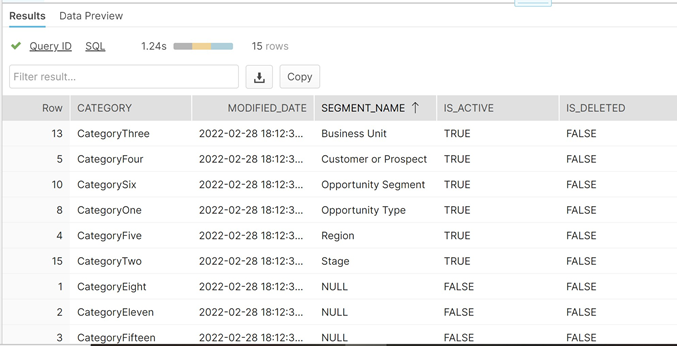

# [!DNL Marketo Measure] レポートテンプレート - Tableau {#marketo-measure-report-template-tableau}

## はじめに {#getting-started}

[!DNL Tableau] レポートテンプレートにアクセスするには [ こちら ](https://github.com/adobe/Marketo-Measure-BI-Templates){target="_blank"} をクリックします。

[!DNL Adobe Marketo Measure] レポートテンプレート Tableau ワークブックファイルを開きます。

既存の接続データを特定の Snowflake 接続情報に更新する必要があります。「[!UICONTROL 接続を編集]」ボタンをクリックし、このドキュメントの[[!UICONTROL データ接続]](#data-connection)の節に記載されている手順に従います。


## データ接続 {#data-connection}

Snowflake インスタンスへのデータ接続を設定する必要があります。このためには、ユーザ名とパスワードと共にサーバー名が必要です。この情報を見つけて、必要に応じてパスワードをリセットする場所の詳細は、[こちら](/help/data-warehouse/data-warehouse-access-reader-account.md){target="_blank"}に記載されています。


また、最初の SQL コマンドを入力する必要もあります。これにより、このデータモデルでのカスタムクエリの使用がサポートされます。入力するコマンドは、「Use Schema `<your schema name>`」です。スキーマ名は、[!UICONTROL Data Warehouse 接続ページ]で見つけることができます。上記のドキュメントを参照してください。


### カスタム SQL クエリ {#custom-sql-queries}

[!DNL Tableau] はデータソースフィルターをフィルターが設定されている個々のテーブルではなくクエリ全体に適用するので、モデル内の各テーブルにカスタム SQL を使用することを選択しました。これにより、モデルはテーブルレベルで削除された行や重複した行を除外できます。例えば、データソースフィルターとして適用すると、session._deleted_date is null がクエリの where 句に追加され、次のクエリが生成されます。

**データソースに追加されたフィルター**

```
--A deleted session removes this row completely and the touchpoint data is lost. Select *
   From Touchpoint    tp
      join Session sn
      on tp.session_id = sn.session_id
 Where tp._deleted_date is null
    and sn._deleted_date is null
```

ただし、これは、セッションが削除されたが、対応するタッチポイントが削除されなかった場合、タッチポイントデータがデータセットから削除されるという点で誤りです。タッチポイントは削除されていないので、タッチポイントデータがデータセット内に存在する必要があります。カスタム SQL を追加すると、フィルター条件がテーブルレベルで確実に適用され、次のクエリが生成されます。

**カスタム SQL 経由で適用されるフィルター**

```
--A deleted session only removes the session related data, and the touchpoint data is preserved. Select *
   From Touchpoint       tp
      join Session sn
      on tp.session_id          = sn.session_id
      and sn._deleted_date      is null
  Where tp._deleted_date is null
```

## データ変換 {#data-transformations}

[!DNL Tableau] のデータには、Snowflake の元の状態からいくつかの変換が適用されています。これらの変換のほとんどは、[!DNL Tableau] モデルにテーブルを生成するカスタム SQL クエリに適用されます。テーブルの生成に使用されたカスタム SQL を表示するには、テーブル名を右クリックし、「カスタム SQL クエリを編集」を選択します。特定の変換のいくつかについては、以下で説明します。


### 列を削除 {#removed-columns}

データモデルを簡素化し、冗長で不要なデータを削除するために、元の Snowflake テーブルから Tableau に読み込まれる列の数を減らしました。削除した列には、不要な外部キー、モデル内の他のテーブルとの関係を介してより効果的に使用できる非正規化ディメンションデータ、監査列および内部 [!DNL Marketo Measure] 処理に使用するフィールドが含まれます。カスタム SQL の「選択」セクションで読み込まれた列のリストを編集することで、ビジネスニーズに応じて列を追加または削除できます。

>[!NOTE]
>Data Warehouse 内のほとんどのテーブルには、非正規化されたディメンションデータが含まれています。アドビでは、パフォーマンスとデータの精度を向上させるために、[!DNL Tableau] のモデルを可能な限り正規化してクリーンアップすることに取り組んできました。ファクトテーブルに追加の非正規化フィールドを含める場合は注意する必要があります。これにより、テーブル間のディメンションフィルタリングが壊れたり、レポートが不正確になったりする可能性があります。

### 列名を変更 {#renamed-columns}

従来より使いやすくし、命名規則を標準化するために、テーブルと列の名前を変更しました。列名の変更を表示するには、テーブルを作成するカスタム SQL 文を参照します。

### 行の追加 {#rows-added}

モデルの計算に通貨換算機能を追加するために、社内換算率とターゲット換算率の列を商談テーブルとコストテーブルの両方に追加しました。これらの列の値は行レベルで追加し、日付と通貨 ID の両方で換算率テーブルに結合することによって評価されます。Tableau ではファクトテーブルが複数のディメンションテーブルを共有できないので、それを使用するテーブルに換算率を直接追加しました。このモデルでの通貨換算の仕組みについて詳しくは、このドキュメントの[通貨換算](#currency-conversion)の節を参照してください。


[!DNL Snowflake] の 2 つのテーブルが和集合を使用して結合され、[!DNL Tableau] データモデル内に 1 つのテーブルが作成されている場所がいくつかあります。これらのインスタンスでは、どの [!DNL Snowflake] テーブルからのものであるかを示し、行がどのエンティティを表すかを指定するために「Type」列が追加されています。組み合わされたテーブルについて詳しくは、このドキュメントの関係とデータフローの節を参照してください。


### セグメント名 {#segment-names}

セグメント名はカスタマイズ可能なので、Snowflake Data Warehouse では一般的な列名が付けられます。[!DNL BIZ_SEGMENT_NAMES] は、[!DNL Marketo Measure] UI のセグメントセクションで定義されているように、汎用セグメント名とそのマッピング先のカスタマイズされたセグメント名をリストするマッピングテーブルです。カスタムセグメント名を使用しており、これらを組み込むために [!DNL Tableau] モデルを更新する場合は、このテーブルを使用して、Tableau モデル内の列の名前を手動で変更します。セグメント列はリードおよびアトリビューションタッチポイントテーブルにあり、名前を変更する必要があるのは 1 回だけです。

[!UICONTROL CATEGORY] 列にはカテゴリ番号がリストされ、SEGMENT_NAME 列にはマッピング先のカスタマイズされたセグメント名が表示されます。



名前は、2 つの方法で更新できます。最初のオプションは、カスタム SQL を更新することです。この例では、CATEGORY 1～6 がセグメント名テーブルのマッピングに基づいて名前変更されています。


もう 1 つのオプションは、[!DNL Tableau] テーブル内の列名を直接変更することです。


## データモデル {#data-model}

以下の画像をクリックすると、フルサイズのバージョンが表示されます。

[](/help/bi-report-templates/assets/tableau-data-model.png){target="_blank"}

### 関係とデータフロー {#relationships-and-data-flow}

タッチポイントの作成に使用するイベントデータは、[!UICONTROL セッション]、[!UICONTROL タスク]、[!UICONTROL イベント]、[!UICONTROL アクティビティ]および[!UICONTROL キャンペーンメンバー]の各テーブルに保存されます。これらのイベントテーブルは、それぞれの ID を経由してタッチポイントテーブルに結合し、イベントによってタッチポイントが発生した場合、詳細がタッチポイントテーブルに保存されます。

このモデルでは、リードタッチポイントとアトリビューションタッチポイントが 1 つのテーブルに組み合わされ、タッチポイントテーブルへのリンクが付けられます。行がリードまたはアトリビューションタッチポイントであるかどうかを指定するために「タッチポイントタイプ」列を追加しました。リードおよびアトリビューションのタッチポイントのほとんどのディメンションデータは、対応するタッチポイントへのリンクから取得されます。

このモデルでは、商談ステージ移行とリードステージ移行が 1 つのテーブルに結合され、[!UICONTROL リードおよびアトリビューション]タッチポイントテーブルへのリンクが付けられます。行が商談ステージまたはリードステージの移行であるかどうかを指定するために、「移行タイプ」列を追加しました。

コストデータとタッチポイントデータは両方とも、チャネルディメンションとキャンペーンディメンションを共有します。ただし、Tableau では、ファクトテーブル間の共有ディメンションをモデル化する機能が制限されています。共有ディメンションテーブルは 1 つだけに制限されているので、チャネルデータとキャンペーンデータは 1 つのテーブルに組み合わされています。これらは、2 つのディメンションのクロス結合を使用して、Tableau の 1 つのテーブル（チャネルとキャンペーン）に組み合わされます。一意の ID は、チャネル ID とキャンペーン ID を連結することによって作成されます。この同じ ID 値がタッチポイントテーブルとコストテーブルの両方に追加され、この組み合わされたディメンションテーブルとの関係が作成されます。


このモデルでは、キャンペーンディメンションとチャネルディメンションがタッチポイントにリンクされているので、これらのディメンションに関するすべてのレポートはこのリンクを通じて行われ、イベントデータに関するディメンションレポートが不完全になる可能性があります。これは、多くのイベントには、タッチポイントに処理されるまでこれらのディメンションへのリンクがないからです。

>[!NOTE]
>セッションなどの一部のイベントには、キャンペーンおよびチャネルディメンションへの直接リンクがあります。これらのディメンションに関するセッションレベルでのレポートが必要な場合は、この目的のために別のデータモデルを作成することをお勧めします。

コストデータは、Snowflake Data Warehouse のコストテーブル内の様々な集計レベルで保存されます。すべての広告プロバイダーについて、キャンペーンレベルのデータをチャネルレベルにロールアップできます。このため、このモデルは「campaign_is_aggregatable_cost」フラグに基づいてコストデータを取得します。自己レポートコストはチャネルレベルでのみ送信でき、キャンペーンデータは必要ありません。可能な限り最も正確なコストレポートを提供するために、自己レポートコストは「channel_is_aggregatable_cost」フラグに基づいて取得します。コストデータを読み込むクエリは、次のロジックを使用して記述します：ad_provider = &quot;SelfReported&quot; の場合、channel_is_aggregatable_cost = true、それ以外の場合、 campaign_is_aggregatable_cost = true。

このモデルのコンテキスト内では、リード、[!UICONTROL 連絡先]、[!UICONTROL アカウント]および[!UICONTROL 商談]のデータはディメンションデータと見なされ、リードおよびアトリビューションタッチポイントテーブルに直接結合されます。

### 通貨換算 {#currency-conversion}

換算率テーブルの率は、社内通貨から金額を換算するのに必要な値を表します。通貨への換算には、最初に元の通貨から企業通貨へ、次に企業通貨から選択した通貨へという二重の換算が必要です。モデルのこのチェーンの最初の手順は、これらの換算率を含む 2 つの列を、金額（商談とコスト）を含むテーブルに追加することです。これらの手順について詳しくは、このドキュメントの行の追加の節を参照してください。換算率は静的である必要はなく、指定した日付範囲によって変更される可能性があるので、すべての通貨換算計算は行レベルで実行する必要があります。元の通貨から社内通貨への換算は、値を社内換算率で割ってから、ターゲット換算率を掛けることで構成されます。ターゲット換算率は、選択した通貨パラメーター値によって決まります。

* 元の値を換算：社内通貨の値／社内換算率 = 社内通貨での値
* 社内通貨から選択した通貨への換算：社内通貨 `*` 選択した通貨の換算率 = 選択した通貨の値


このモデルの通貨換算測定では、換算率が特定できない場合、率の値 1.0 が代入されます。測定の通貨値を表示し、計算に複数の通貨値が含まれる場合（つまり、値を選択した通貨に換算できなかった場合）に警告するために、別の測定が作成されています。これらの測定（コスト通貨と収益通貨）は、コストまたは収益データを表示するビジュアルにツールヒントとして含まれます。


## データ定義 {#data-definitions}

パラメーター、カスタム列、測定の定義を [!DNL Tableau model] モデルに追加しました。


[!DNL Snowflake] から直接取得する列の定義を表示するには、[Data Warehouse のドキュメント](/help/data-warehouse/data-warehouse-schema.md){target="_blank"}を参照してください。

## テンプレートと Discover 間の相違点 {#discrepancies-between-templates-and-discover}

### 起因する収益 {#attributed-revenue}

リードタッチポイントとアトリビューションタッチポイントは、元のタッチポイントからディメンションデータを継承します。レポートテンプレートモデルは、タッチポイントへの関係から継承されたすべてのディメンションデータをソースとしますが、Discover モデルでは、ディメンションデータはリードおよびアトリビューションタッチポイントレコードに非正規化されます。 全体のアトリビューション収益またはアトリビューションパイプライン収益の値は、2 つのレポート間で一致する必要があります。ただし、収益をディメンションデータ（チャネル、サブチャネル、キャンペーン）ごとに分類したりフィルタリングしたりすると、不一致が生じる場合があります。ディメンション収益額がテンプレートと Discover の間で一致しない場合は、テンプレートレポートデータセットにタッチポイントレコードが欠落している可能性があります。これは、リードまたはアトリビューションタッチポイントレコードは存在するが、レポートに読み込まれたデータセット内のタッチポイントテーブルに対応するレコードが存在しない場合に発生します。これらのテーブルは変更日でフィルタリングされるので、リード／アトリビューションタッチポイントレコードがタッチポイントレコードよりも新しく変更され、元のタッチポイントレコードが読み込まれていないのに、リード／アトリビューションタッチポイントがデータセットに読み込まれた可能性があります。この問題を修正するには、タッチポイントテーブルのフィルタリングされた日付範囲を広げるか、日付制約をすべて削除することを検討します。

>[!NOTE]
>タッチポイントは大きなテーブルなので、より完全なデータセットと読み込む必要があるデータの量のトレードオフを考慮します。

### コスト {#cost}

テンプレートのコストレポートはキャンペーンおよびチャネルレベルでのみ利用できますが、Discover は一部の広告プロバイダー（つまり、クリエイティブ、キーワード、広告グループなど）に対してより低い精度のレポートを提供します。コストデータがテンプレートでモデル化される方法について詳しくは、このドキュメントの[!UICONTROL データモデル]の節を参照してください。[!UICONTROL Discover] のディメンションフィルターがチャネルまたはキャンペーンに設定されている場合、チャネル、サブチャネルおよびキャンペーンレベルのコストが Discover とレポートテンプレートの間で一致する必要があります。

### ROI {#roi}

ROI はアトリビューション収益とアトリビューションコストから計算されるので、上記のセクションで説明したように、上記の計算のいずれかで発生する可能性がある同じ不一致が、同じ理由で ROI にも発生する可能性があります。

### タッチポイント {#touchpoints}

レポートテンプレートに示すように、これらの指標は Discover には反映されません。現時点では、この 2 つを直接比較することはできません。

### Web トラフィック {#web-traffic}

レポートテンプレートデータモデルは、セッションとタッチポイントの関係を通じてチャネル、サブチャネルおよびキャンペーンのディメンションデータを正規化します。これは、これらのディメンションをセッションに非正規化する Discover データモデルとは異なります。この違いにより、訪問数と訪問者数の全体的な数は Discover とレポートテンプレートの間で一致する必要がありますが、ディメンションごとに表示またはフィルタリングすると、これらの数は一致するとは限りません。これは、テンプレート内のディメンションデータが、タッチポイントとなった web イベント（つまり、匿名以外のイベント）でのみ使用できるからです。詳しくは、このドキュメントの[データモデル](#data-model)の節を参照してください。

[!DNL Discover] とテンプレートの間では、サイトフォームの合計数に若干の差異が生じる場合があります。これは、レポートテンプレートのデータモデルが、セッションとタッチポイントの関係を通じてサイトフォームのディメンションデータを取得するためです。時には、サイトフォームデータに相関セッションがない場合があります。

### リードとアカウント {#leads-and-accounts}

接触済みアカウントのディメンションレポートは、[!DNL Discover] とテンプレートの間で若干異なる場合があります。これも、タッチポイントとリードタッチポイント／アトリビューションタッチポイントとの関係から生じる、ディメンションモデリングによるものです。詳しくは、アトリビューション収益の節に記載されている詳細を参照してください。

[!UICONTROL Discover] のすべてのリード数はアトリビューション付きリード数、レポートテンプレートでの指標は接触済み[!UICONTROL リード数]です。したがって、この測定について 2 つのレポートを直接比較することはできません。

### エンゲージメントパス {#engagement-path}

[!DNL Discover] の[!UICONTROL エンゲージメントパス]レポートとテンプレートとの間に直接の比較はありません。[!DNL Discover] のレポートはタッチポイントをモデル化しているのに対し、テンプレートのレポートはアトリビューションタッチポイントをモデル化しています。 テンプレートは、すべてのタッチポイントデータを表示するのではなく、商談とそれに関連するタッチポイントのみに焦点を当てています。

### 取引速度 {#deal-velocity}

テンプレート内のこのレポートと、Discover の速度ダッシュボードの取引速度タイルの間に矛盾があってはなりません。
