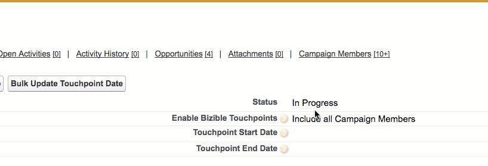

# キャンペーンの同期日 {#campaign-sync-dates}

キャンペーン同期日付機能の機能と、この機能のユースケースについて説明します。

>[!NOTE]
>
>この記事では、古いプロセスについて説明します。 ユーザには、[新しく改善されたアプリ内プロセス](/help/channel-tracking-and-setup/custom-campaign-sync.md){target="_blank"}を使用することをお勧めします。

**[!DNL Marketo Measure]パッケージが必要：6.9以降**

この機能は、[!DNL Salesforce] Campaign オブジェクトの2つのシンプルな日付フィールドで構成されます。

* タッチポイントの開始日
* タッチポイント終了日

特定のキャンペーンで購入者のタッチポイントが有効になると、キャンペーンの同期日を使用して、個々のキャンペーンでタッチポイントの日付パラメーターを設定できるようになります。 したがって、2017年3月1日のタッチポイント終了日を追加する場合、[!DNL Marketo Measure]はその日付より前にキャンペーンに追加されたキャンペーンメンバーに対してのみタッチポイントを作成します。 [!DNL Marketo Measure]は、2017年3月1日以降に追加されたキャンペーンメンバーのタッチポイントを作成しません。

同様に、キャンペーンにタッチポイント開始日（2017年1月1日など）を追加する場合、[!DNL Marketo Measure]は、2017年1月1日より前にキャンペーンに追加されたキャンペーンメンバーにタッチポイントを作成しません。 タッチポイント終了日を追加する場合は、タッチポイント開始日を追加する必要はありません。

## ユースケース {#use-cases}

**顧客接点の埋め戻し**

マーケティング部門が特定のマーケティング活動にutm パラメーターを追加し損ねる場合があります。 Campaign Sync Datesを使用すると、（SFDC Campaignを使用してオンライン作業を行う場合）見逃したデータをバックフィルできます。 例えば、5月1日に開始した電子メールキャンペーンを実行しているものの、その電子メールキャンペーンにutm パラメーターを追加しなかったとします。5月15日。 SFDC Campaignを使用してメールコンバージョンをトラッキングしている場合は、そのCampaignに5月15日のタッチポイント終了日を設定し、Campaignの「応答済み」メンバーのタッチポイントを有効にすることができます。 このアクションは、5月15日までのすべての回答のタッチポイントを作成するように[!DNL Marketo Measure]に指示します。

**遡及的なキャンペーンメンバーシップのタッチポイント**

[!DNL Marketo Measure]の新規のお客様は、SFDC Campaignsを介してトラッキングしているマーケティングデータの一部を取り込むことに関心がある可能性があります。 ただし、オンライン SFDC キャンペーンにタッチポイントを有効にする場合、[!DNL Marketo Measure]はオンラインマーケティング施策のタッチポイントを自動的に作成しているため、ダブルカウントアトリビューションの問題が発生する可能性があります。 データの二重計上を避けるために、Campaign タッチポイントの終了日を使用して、SFDC キャンペーンで[!DNL Marketo Measure]が作成したタッチポイントの日付に制限を設定できます。 例えば、SFDCでトラッキングしているソーシャルキャンペーンに遡及的なコンバージョンを追加する場合、7月1日に[!DNL Marketo Measure] JavaScript（オンラインのタッチポイントを作成している）が追加されていることを理解している場合は、ソーシャルSFDC キャンペーンを編集して、7月1日に等しいタッチポイント終了日を含め、そのキャンペーンのバイヤータッチポイントを有効にすることができます。

タッチポイントの終了日には、他にも多くの使用例があります。 具体的な状況についてサポートが必要な場合は、[Marketo サポート &#x200B;](https://nation.marketo.com/t5/support/ct-p/Support){target="_blank"}までお気軽にお問い合わせください。
