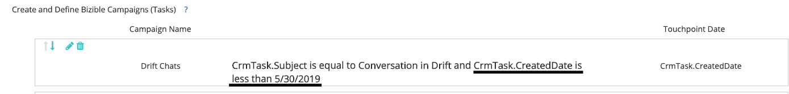

# Drift 統合に関するよくある質問 {#drift-integration-faq}

Driftとの[!DNL Marketo Measure]統合の一環として、よくある質問をいくつか紹介します。 ご不明な点がございましたら、Adobeのアカウントチーム（担当のアカウントマネージャー）または[Marketo サポート ](https://nation.marketo.com/t5/support/ct-p/Support){target="_blank"}にお問い合わせください。

**統合を有効にする方法を教えてください。**

[!DNL Marketo Measure]のドリフトチャットトラッキングは、デフォルトで有効になっています。 これを無効にする（デフォルトではDrift Chatsからタッチポイントを作成しない）場合は、次の太字で示す[!DNL Marketo Measure] Javascript実装に追加の属性を追加します。

``

[!DNL Google Tag Manager]を使用して[!DNL Marketo Measure] スクリプトを読み込む場合、ドリフトチャットをタッチポイントの対象から除外する場合は、[!DNL Marketo Measure] スクリプトの直後に次の``に追加します。

``

**統合で何ができますか？**

統合により、[!DNL Marketo Measure]は、エンドユーザーがDrift チャットでメールアドレスを提供したタイミングを追跡できるようになりました。 そこから、タッチポイントタイプの「Web チャット」を使用して、これらのインタラクションからタッチポイントを作成します。 この統合により、マーケターは、チャットでのやり取りのパフォーマンスや、顧客によるチャットでのやり取りを促進するチャネル/サブチャネル/施策を把握できます。

**キャンペーン同期ルールを使用してドリフトを追跡する場合はどうなりますか？**

ドリフトチャットのインタラクション用のタッチポイントを作成するためのキャンペーン同期ルールが存在する場合は、該当するCRM キャンペーンにそれらの特定のエンドユーザーを追加しないようにしてください。 機能ビットが有効になったら、1つのドリフトチャットインタラクションに対してCRM Campaign タッチポイントとデジタルタッチポイントを作成します。

**CRM キャンペーン経由でドリフトを追跡する場合はどうなりますか？**

ドリフトチャットのインタラクション用のタッチポイントを作成するCRM キャンペーンがある場合は、これらの特定のキャンペーンにタッチポイントの終了日を設定する必要があります（タッチポイントの終了日は、Web チャット統合機能ビットが有効になっている日付である必要があります）。

**アクティビティを使用してドリフトを追跡する場合はどうなりますか？**

ドリフトチャットのインタラクションのタッチポイントを作成するためのアクティビティルールが配置されている場合は、追加のロジックをルールに追加する必要があります。 「タスク作成日」フィールドを使用してロジックを追加し、タッチポイントの重複が作成されないようにします（例：CrmTask.CreatedDateは、機能ビットが有効になった日付よりも小さい）。 例えば、以下のスクリーンショットを参照してください。

のタッチポイントを作成するためのアクティビティルールが存在する場合
