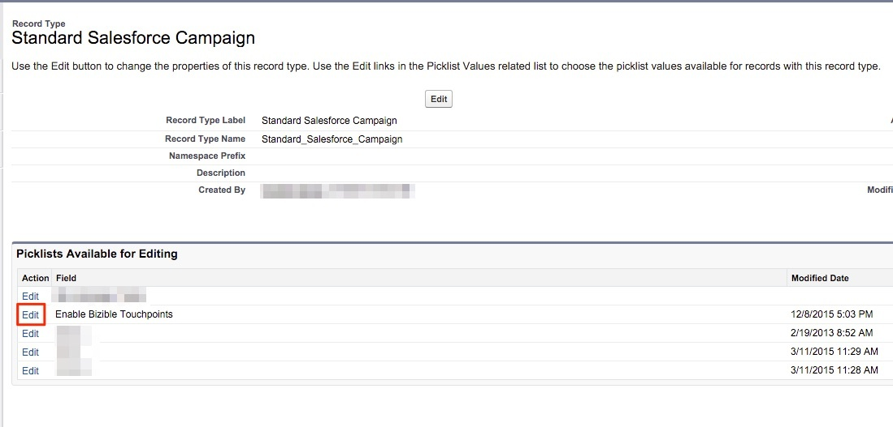

# 複数のキャンペーンレコードタイプの設定 {#configurations-for-multiple-campaign-record-types}

**「購入者のタッチポイントを有効にする」フィールドにピックリストの値がありません**

SFDC組織で複数のキャンペーンレコードタイプを使用している場合は、レコードタイプごとに「購入者のタッチポイントを有効にする」のピックリスト値を追加する必要があります。 オプションを追加するには、次の手順に従います。

1. **[!UICONTROL セットアップ]** > **[!UICONTROL カスタマイズ]** > **[!UICONTROL キャンペーン]** > **[!UICONTROL レコードタイプ]**&#x200B;に移動します。

   

1. [!UICONTROL 編集] ボタンではなく、**[!UICONTROL レコードタイプラベル]**&#x200B;をクリックして、キャンペーンレコードタイプを選択します。

   

1. ここでは、そのレコードタイプで使用可能なピックリストを使用して画面に表示されます。 「購入者のタッチポイントを有効にする」フィールドの横にある&#x200B;**[!UICONTROL 編集]**&#x200B;を選択します。

   

1. 「使用可能な値」グループから3つの値をすべて「選択済み値」グループに追加します。

   

1. デフォルト値を「なし」に設定し、**[!UICONTROL 保存]**&#x200B;をクリックします。 その他のキャンペーンレコードタイプについても、この手順を繰り返します。
