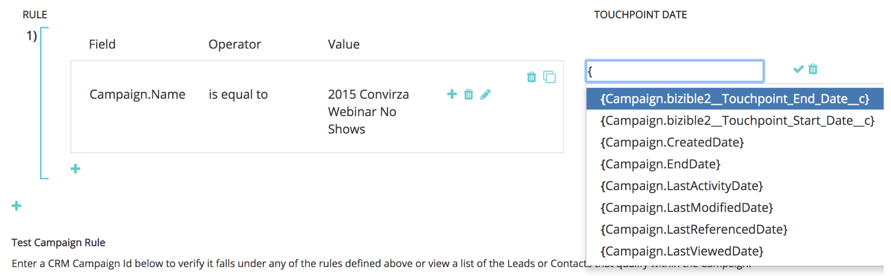

# カスタムキャンペーン同期 {#custom-campaign-sync}

現在、インストールされた [!DNL Marketo Measure] パッケージを使用して、適格なタッチポイントとして含めるキャンペーンを指定できます。 これにはこれまで存在していた複数のハードルがあります。 [!DNL Marketo Measure] パッケージが CRM にインストールされると、セキュリティチームの承認が得られるまでに時間がかかる場合があります。 さらに、Campaign オブジェクトで 1 つの選択リストを柔軟に使用できません。 この新機能を使用すると、Campaign と Campaign メンバーレコードの使用を開始するためにパッケージインストールを行う必要がなくなります。 ルールを作成すると、どのレコードを作成できるかを正確に定義し、どのレコードが適格かを正確に定義できます。

## 要件 {#requirements}

* キャンペーン同期はすべての層で使用できます
* データをインポートするには、CRM を [!DNL Marketo Measure] アカウントに接続する必要があります

## 仕組み {#how-it-works}

1. AccountAdmin 権限を使用すると、**[!UICONTROL 設定]**/**[!UICONTROL キャンペーン]** に移動し、キャンペーンメンバーのルールを同期 UI を確認できます。
1. **+** アイコンをクリックして、ルールの作成を開始します。

   

1. [!UICONTROL &#x200B; キャンペーン &#x200B;] フィールドまたは [!UICONTROL &#x200B; キャンペーンメンバー &#x200B;] フィールドからルールを作成するオプションがあります。 ルールの残りの部分に、検証する必要のある演算子と値を入力します。 次の例では、特定のキャンペーンを名前で確認しています。

   

   >[!NOTE]
   >
   >数式フィールドはルール内で使用できず、選択リストには表示されません。 式はバックグラウンドで計算され、レコードは変更されないの [!DNL Marketo Measure]、レコードが規則に適合するかどうかを検出できません。

1. タッチポイント日を選択します。 中括弧 `{` を入力すると、可能な日付のリストが表示されます。その後、ルールから作成されたすべてのタッチポイントに適用する日付を選択できます。

   

   >[!NOTE]
   >
   >カスタムキャンペーン同期ルールを使用してい [!DNL Marketo Measure] 場合、「タッチポイント日を一括更新」ボタンを使用して行った更新は読み取られません。

1. チェックマークをクリックして、必要に応じて追加のキャンペーン用に追加のルールを追加します。

   

   >[!NOTE]
   >
   >CRM 同期と共にルールが定義されたので、宣言されるルールが自然に競合し始めます。 カスタムのキャンペーン同期 _と CRM 同期タイプの両方_ を引き続き使用する場合は、CRM 同期タイプが無視されないようにルールを作成することが重要です。

   

   >[!NOTE]
   >
   >[!UICONTROL CRM 同期タイプ &#x200B;] のユーザーを最終的に停止することを検討している場合は、「同期タイプ」を参照せずに _現在の CRM タッチポイントを維持_ るルールを作成するのが最適です。 この方法では、切り替えが行われた場合でもルールは機能します。

次に、既存の CRM タッチポイントが失われないように、どのように見えるかを例として示します。

## 検証 {#validation}

キャンペーン内の購入者タッチポイントとBuyer Attribution Touchpoint レコードを簡単に確認して、ルールが正しく機能していることを確認できます。 次に、適切な動的タッチポイントの日付 [!DNL Marketo Measure] 作成され、キャンペーンから取得されたBATを示します。 作成日フィールドは、その下の画像にあります。

## テスト {#testing}

1. キャンペーン同期機能にはテスト機能が備わっているので、作成したルールが実際にキャンペーンの条件に適合するかどうかを確認できます。 最初に「[!UICONTROL &#x200B; テスト &#x200B;]」ボタンをクリックします。 テストを開始するには、まずルールを保存する必要があります。

   

   テストするキャンペーン ID （CRM から 15 文字または 18 文字）を入力できるポップアップが表示されます。 ポイントは、同期しようとしている CRM のキャンペーン ID を入力して、作成したルールと一致していることを確認することです。

   

1. 「[!UICONTROL &#x200B; テスト &#x200B;]」をクリックすると、キャンペーンの名前と、タッチポイントの対象となるキャンペーンメンバーの数が表示されます。 以下に、キャンペーン ID に一致するすべてのルールを示すテーブルが表示されます。 一致するもののみが表示されます。

   

1. また、「メンバー数」をクリックして、Campaign ルールの実施要件に含まれるリードと連絡先とその ID のリストを表示することもできます。 これは単なるサンプルセットで、最大 50 が表示されるので、どのレコードが適合するかを把握できます。

   
