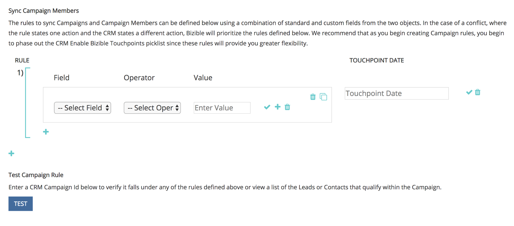
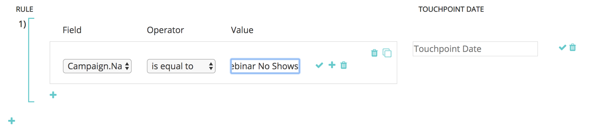
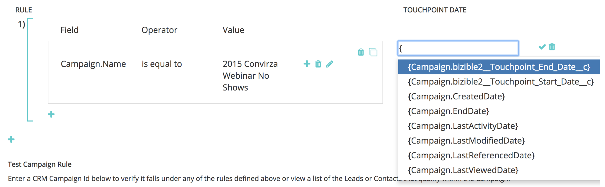
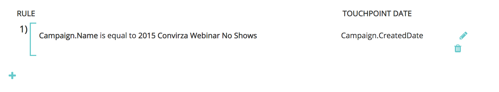
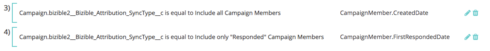
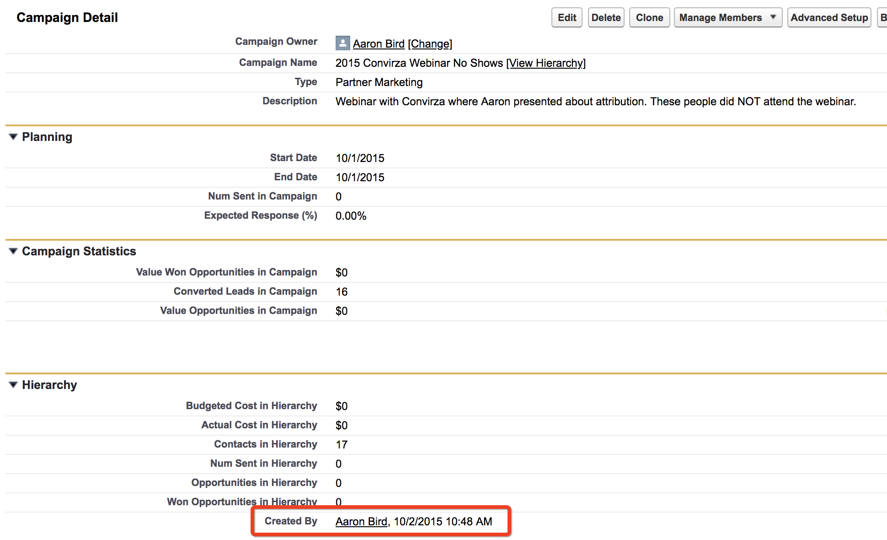
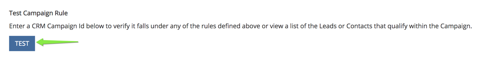
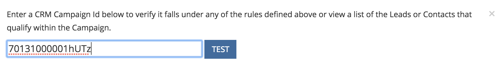
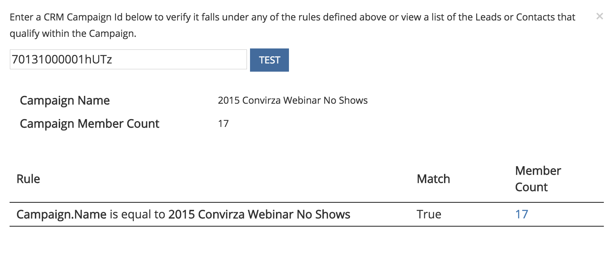
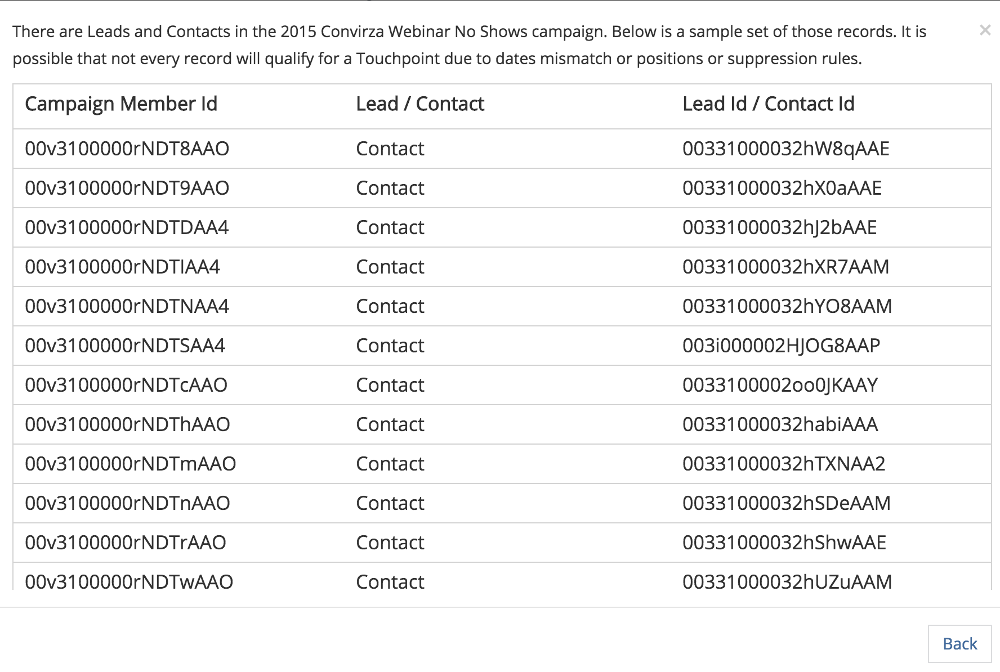

# カスタムキャンペーン同期 {#custom-campaign-sync}

現在、インストール済みの[!DNL Marketo Measure] パッケージを使用すると、対象となるタッチポイントとして含めるキャンペーンを指定できます。 これには、以前に存在していたように、複数のハードルがあります。 [!DNL Marketo Measure] パッケージがCRMにインストールされると、セキュリティ チームによる承認に時間がかかる場合があります。 さらに、Campaign オブジェクトで単一の選択リストを使用する際に、柔軟性が不足しています。 この新機能では、Campaign メンバーレコードとCampaign メンバーレコードの使用を開始するためにパッケージのインストールは必要ありません。 ルールを作成して、どのレコードを作成すれば、どのレコードが適しているかを正確に定義できます。

## 要件 {#requirements}

* Campaign Syncは、すべての階層で使用できます
* データを読み込むには、CRMを[!DNL Marketo Measure] アカウントに接続する必要があります

## 仕組み {#how-it-works}

1. AccountAdmin権限を使用すると、**[!UICONTROL 設定]** > **[!UICONTROL キャンペーン]**&#x200B;に移動して、Campaign メンバーの同期ルール UIを確認できます。
1. ルールの作成を開始するには、**+** アイコンをクリックします。

   

1. [!UICONTROL &#x200B; キャンペーン &#x200B;]または[!UICONTROL &#x200B; キャンペーンメンバー]のフィールドからルールを作成するオプションがあります。 ルールの残りの部分に、検証が必要な演算子と値を入力します。 以下の例では、特定のCampaignをその名前で確認しています。

   

   >[!NOTE]
   >
   >数式フィールドはルール内で使用できず、選択リストには表示されません。 数式はバックグラウンドで計算され、レコードは変更されないため、[!DNL Marketo Measure]はレコードがルールに適合するかどうかを検出できません。

1. タッチポイント日を選択します。 使用可能な日付のリストは、中括弧`{`を入力した後に表示されます。その後、ルールから作成されたすべての顧客接点に適用する日付を選択できます。

   

   >[!NOTE]
   >
   >カスタムキャンペーン同期ルールを使用している場合、「[!DNL Marketo Measure]」は「タッチポイントの一括更新」ボタンを使用して行った更新を読み取りません。

1. チェックマークをクリックし、必要に応じてキャンペーンの追加ルールを追加します。

   

   >[!NOTE]
   >
   >CRM同期と共にルールが定義されたことで、記述されたルールは自然に競合し始めます。 カスタム Campaign Sync _と_&#x200B;の両方のCRM Sync Typeを引き続き使用する場合は、CRM Sync Typeが無視されないようにルールを作成することが重要です。

   

   >[!NOTE]
   >
   >[!UICONTROL CRM同期タイプ &#x200B;]のユーザーを最終的に停止することを検討している場合は、「同期タイプ」を参照せずに&#x200B;_それでも_&#x200B;現在のCRM タッチポイントを維持するルールを作成することをお勧めします。 これにより、その切り替えが行われた場合でも、ルールが引き続き機能します。

例えば、既存のCRMの顧客接点が失われることはありません。

## 検証 {#validation}

Campaign内のバイヤータッチポイントとBuyer Attribution Touchpoint レコードを簡単に確認して、ルールが適切に機能していることを確認できます。 これは、[!DNL Marketo Measure]が適切な動的タッチポイント日付で作成し、キャンペーンから取得したBATです。 「作成日」フィールドは、その下の画像にあります。

## テスト {#testing}

1. Campaign Sync機能にはテスト機能が付属しており、作成したルールが実際にCampaignの条件に適合しているかどうかを確認できます。 最初に、「[!UICONTROL &#x200B; テスト &#x200B;]」ボタンをクリックします。 テストを開始する前に、ルールを最初に保存する必要があります。

   

   テストするキャンペーン ID （CRMから15文字または18文字）を入力できるポップアップが表示されます。 ここで重要なのは、同期しようとしているCRMからキャンペーン IDを入力し、作成したルールと一致するようにすることです。

   

1. 「[!UICONTROL &#x200B; テスト &#x200B;]」をクリックすると、キャンペーンの名前と、タッチポイントの対象となるキャンペーンメンバーの数が表示されます。 キャンペーン IDに一致するすべてのルールを示すテーブルが下に表示されます。 マッチのみが表示されます。

   

1. メンバー数をクリックして、キャンペーンルールの適格性の一部であるリードと取引先責任者とそのIDのリストを表示することもできます。 これはサンプルセットに過ぎず、最大50個まで表示されるので、どのレコードが該当するかを判断できます。

   
