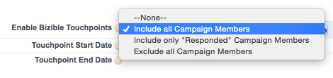

# Dynamics キャンペーンとマーケティングリスト {#dynamics-campaigns-and-marketing-lists}

>[!NOTE]
>
>この記事では、古いプロセスについて説明します。ユーザには、[新しく改善されたアプリ内プロセス](/help/channel-tracking-and-setup/offline-channels/custom-campaign-sync.md){target="_blank"}を使用することをお勧めします。

## キャンペーン {#campaigns}

Dynamics キャンペーンは、オフラインのマーケティングアクティビティを追跡し、それらをオムニチャネルジャーニーに含めるのに適しています。 キャンペーンはリードまたは連絡先に関連付ける必要があり、キャンペーンの応答またはマーケティングリストを通じてキャンペーンにロールアップできます。

## キャンペーンの応答 {#campaign-responses}

リードまたは連絡先がキャンペーンに直接追加されると、キャンペーンの応答レコードとして入力されます。

## タッチポイントの有効化 {#enable-touchpoints}

これらのレコードをタッチポイントジャーニーに含めるには、同期するキャンペーン応答のタイプに対していくつかのオプションがあります。 キャンペーンレコードには、インストールされたソリューションの「[!UICONTROL &#x200B; 購入者タッチポイントを有効にする &#x200B;] というラベルのカスタムフィールドが必要です。 表示されない場合は、フォームエディターでフィールドを追加する必要があります。

キャンペーンにキャンペーンの応答を持つすべてのレコードを含めるか、「関心あり」の応答を持つレコードのみを含めるか、デフォルトでキャンペーンの応答を全く含めないかを選択できます。 このフィールドは空白のままにするか、明示的に除外します。

[!DNL Marketo Measure] は、カスタムの応答値をサポートしていません。

キャンペーン応答の在庫応答値は次のとおりです。

選択内容に基づいて、これらのレコードは、リード、連絡先または商談ジャーニーのタッチポイントに対して実施要件を満たすようになりました。 選定されると、「Dynamics Campaign」タッチポイントがジャーニーに表示されます。

Campaign の応答が表示されない可能性がある理由の 1 つは、ファーストタッチまたはリード作成タッチ （またはその両方）のアクティビティがリード/連絡先に対して既に記録されていて、「PostLC」機能が無効になっているか、最大タッチポイント数に達しているためです。

## Touchpoint の日付 {#touchpoint-date}

キャンペーンのタッチポイント日は、通常、キャンペーンの応答がキャンペーンに追加された日付になります。 インストールされたソリューションの「Buyer Touchpoint日」というラベルの付いたカスタムフィールドに値が入力されている場合は、このフィールドを上書きできます。 表示されない場合は、フォームエディターでフィールドを追加する必要があります。

このフィールドを使用する一般的な例の 1 つは、イベントからのバッジスキャンのリストがイベント発生後に CRM に追加され、Buyer Touchpointの日付をイベントが発生した日付に実際に戻すことができるイベントです。

## マーケティングリスト {#marketing-lists}

マーケティングリストは、リードまたは連絡先をマーケティングジャーニーに含める別の方法です。 マーケティングリストはリードまたは連絡先のグループに対して一意です。つまり、ユーザーは、リストをリードのセットと連絡先のセットのどちらにするかを選択する必要があります。

[!DNL Marketo Measure] では、静的マーケティングリストのみをサポートしています。 動的マーケティングリストはサポートしていません。これは、処理ではレコードの変更日を確認する必要があるのに対して、動的リストは頻繁に変更されるので、[!DNL Marketo Measure] ーザーが確認する変更日がないためです。 これには、1 日を通じて完全なデータセットを継続的にダウンロードする必要があります。

上のスクリーンショットは、リードのマーケティングリストです。 マーケティングリストは、キャンペーンに関連付けられ、複数のキャンペーンに関連付けることができます。 1 つのキャンペーンに対して 1 つのマーケティングリストのみを作成する場合を除き、[!DNL Marketo Measure] では、マーケティングリストを使用してキャンペーンをトラッキングすることはお勧めしません。 複数のキャンペーンをまたいで、まったく同じリード/連絡先のリストがタッチポイントの対象になる可能性は低くなります。

## タッチポイントの有効化 {#enable-touchpoints-1}

タッチポイントのマーケティングリストを有効にするには、キャンペーンレコードに「[!UICONTROL &#x200B; マーケティングリストを同期 &#x200B;]」というラベルの別の設定があります。これは、単純な「はい/いいえ」の切り替えです。 表示されない場合は、フォームエディターでフィールドを追加する必要があります。 キャンペーンレコード上で、キャンペーンに関連するマーケティングリストを確認して、有効にするリストの数を把握できます。

## Touchpoint の日付 {#touchpoint-date-1}

マーケティングリストのタッチポイント日は通常、ListMember の作成日なので、リードまたは連絡先がマーケティングリストに追加された日付になります。 インストールされたソリューションの「Buyer Touchpoint日」というラベルの付いたカスタムフィールドに値が入力されている場合は、このフィールドを上書きできます。 表示されない場合は、フォームエディターでフィールドを追加する必要があります。

## チャネルマッピング {#channel-mapping}

Dynamics キャンペーンは、「キャンペーンタイプ」フィールドを使用して、カスタムマーケティングチャネルでバケット化されます。 これらは、Dynamics カスタマイズ メニューで変更できます。

キャンペーンタイプ メニューの値が [!DNL Marketo Measure] アプリケーションに取り込まれます。 **[!UICONTROL マイアカウント]**/**[!UICONTROL 設定]**/**[!UICONTROL オフラインチャネル]**。

キャンペーンのタイプごとにチャネルとサブチャネルの組み合わせにマッピングできるので、キャンペーンから派生する各タッチポイントには、正しくマッピングされたチャネルとサブチャネルを設定できます。

## キャンペーン同期日 {#campaign-sync-date}

これは、Dynamics 顧客には使用できません

## よくある質問 {#faq}

**マーケティングリストのタッチポイントを有効にできますか？それとも、Dynamics のキャンペーンのみを有効にできますか？**

マーケティングリストを有効にすることはできますが、マーケティングリストを同期するオプションはキャンペーンにのみ存在するので、キャンペーンと関連付ける必要があります。

**キャンペーンの応答やマーケティングリストをキャンペーンで使用することはできますか？**

はい。
