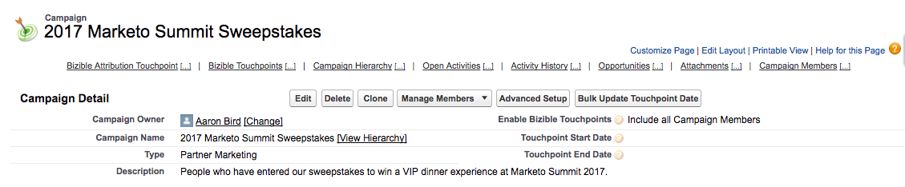
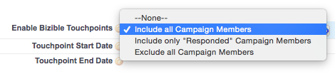
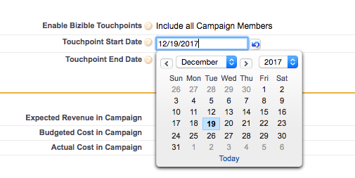
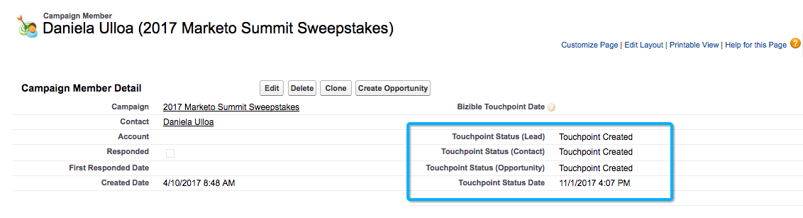
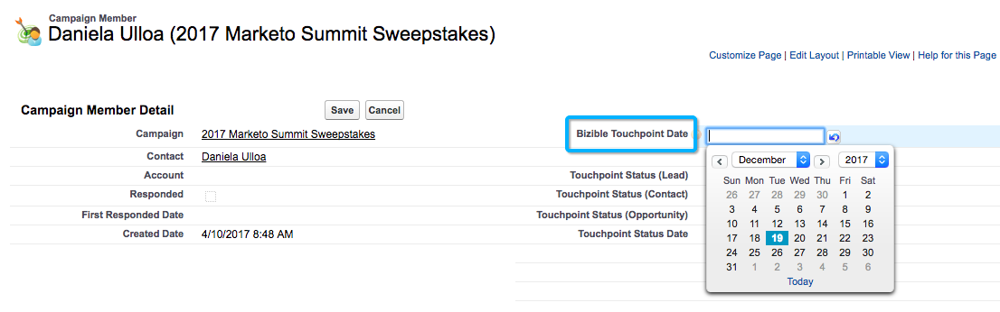
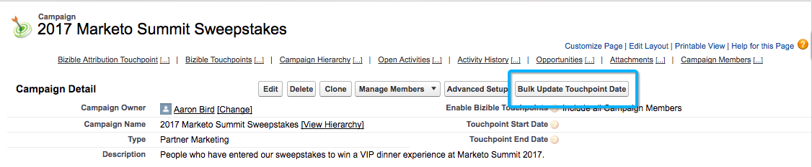
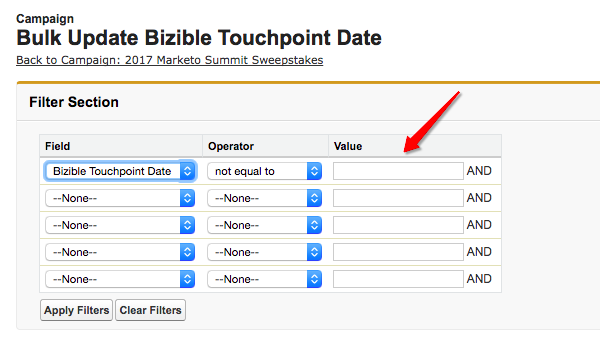
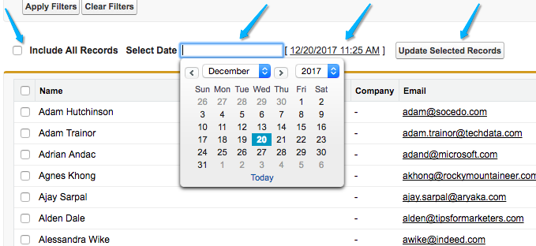

# Dynamics キャンペーンとマーケティングリスト {#dynamics-campaigns-and-marketing-lists}

>[!NOTE]
>
>この記事では、古いプロセスについて説明します。 ユーザには、[新しく改善されたアプリ内プロセス](/help/channel-tracking-and-setup/offline-channels/custom-campaign-sync.md){target="_blank"}を使用することをお勧めします。

## キャンペーン {#campaigns}

Dynamics キャンペーンは、オフラインマーケティング活動を追跡し、オムニチャネルジャーニーに含めるのに適しています。 キャンペーンはリードまたは取引先責任者に関連付ける必要があり、キャンペーンの応答またはマーケティングリストを通じてキャンペーンにロールアップできます。

## キャンペーンの反応 {#campaign-responses}

リードまたは連絡先がキャンペーンに直接追加されると、キャンペーン応答レコードとして入力されます。

## タッチポイントの有効化 {#enable-touchpoints}

これらのレコードをタッチポイントジャーニーに含めるには、キャンペーン応答の種類を同期させるオプションがいくつかあります。 Campaign レコードには、「[!UICONTROL  バイヤータッチポイントを有効にする]」というラベルの付いたインストール済みソリューションのカスタムフィールドが必要です。 このフィールドが表示されない場合は、フォームエディターでフィールドを追加する必要があります。

キャンペーンにキャンペーン応答を持つすべてのレコードを含めるか、「関心のある」応答を持つレコードのみを含めるか、デフォルトではキャンペーン応答を含めることはできません。 フィールドを空白のままにするか、明示的に除外するかを選択できます。

[!DNL Marketo Measure]はカスタム応答値をサポートしていません。

キャンペーン応答の在庫応答値は次のとおりです。

選択に基づいて、これらのレコードは、リード、取引先責任者、または商談ジャーニーのタッチポイントの対象になります。 条件が満たされると、ジャーニーに「Dynamics Campaign」タッチポイントが表示されます。

キャンペーン応答が表示されない理由の1つは、最初のタッチやリード作成のタッチアクティビティがリード/コンタクトに対して既に記録されており、「PostLC」機能が無効になっているか、タッチポイントの最大数に達しているためです。

## Touchpoint の日付 {#touchpoint-date}

キャンペーンのタッチポイント日は、通常、キャンペーン応答がキャンペーンに追加された日付になります。 「Buyer Touchpoint日」というラベルが付いたインストール済みソリューションのカスタムフィールドが入力されている場合、このフィールドは上書きできます。 このフィールドが表示されない場合は、フォームエディターでフィールドを追加する必要があります。

このフィールドを使用する一般的な例として、イベントが発生した後のCRM日数にイベントからのバッジスキャンのリストが追加されるイベントが挙げられます。これにより、ユーザーは実際にイベントが発生したときにBuyer Touchpoint日を戻すことができます。

## マーケティングリスト {#marketing-lists}

マーケティングリストは、リードや連絡先をマーケティングジャーニーに含めるもうひとつの方法です。 マーケティングリストは、リードまたは連絡先のグループに対して一意であり、ユーザーはリストがリードのセットか連絡先のセットかを選択する必要があります。

[!DNL Marketo Measure]は静的マーケティングリストのみをサポートしています。 動的マーケティングリストはサポートしていません。処理では、レコードの変更日を確認する必要がありますが、動的リストが頻繁に変更されるため、[!DNL Marketo Measure]に対して確認する変更日はありません。 これには、1日を通して完全なデータセットを定期的にダウンロードする必要があります。

上のスクリーンショットは、リードのマーケティングリストです。 マーケティングリストはキャンペーンに関連付けられ、複数のキャンペーンに関連付けることができます。 1つのキャンペーンに対して1つのマーケティングリストのみを作成しない限り、[!DNL Marketo Measure]は、顧客がマーケティングリストを使用してキャンペーンを追跡することを推奨しません。 複数のキャンペーンをまたいで、同じリード/コンタクトのリストが顧客接点の対象になる可能性は低くなります。

## タッチポイントの有効化 {#enable-touchpoints-1}

タッチポイントのマーケティングリストを有効にするには、「[!UICONTROL  マーケティングリストを同期]」というラベルの付いたキャンペーンレコードに個別の設定があります。これは、簡単なyes/no切り替えです。 このフィールドが表示されない場合は、フォームエディターでフィールドを追加する必要があります。 キャンペーンレコードでは、キャンペーンに関連するマーケティングリストを確認できるので、有効にしているリストの数を把握できます。

## Touchpoint の日付 {#touchpoint-date-1}

マーケティングリストのタッチポイント日は、通常、ListMemberが作成した日付であるため、リードまたは連絡先がマーケティングリストに追加された日付です。 「Buyer Touchpoint日」というラベルが付いたインストール済みソリューションのカスタムフィールドが入力されている場合、このフィールドは上書きできます。 このフィールドが表示されない場合は、フォームエディターでフィールドを追加する必要があります。

## チャネルマッピング {#channel-mapping}

Dynamics キャンペーンは、「キャンペーンタイプ」フィールドを使用して、カスタムマーケティングチャネルにグループ化されます。 これらは、Dynamicsのカスタマイズ メニューで変更できます。

Campaign Type メニューの値が[!DNL Marketo Measure] アプリケーションに取り込まれます。 **[!UICONTROL 自分のアカウント]** > **[!UICONTROL 設定]** > **[!UICONTROL オフラインチャネル]**。

キャンペーンのタイプごとに、チャネルとサブチャネルの組み合わせにマッピングできるため、キャンペーンから派生する各タッチポイントに、マッピングされた正しいチャネルとサブチャネルを設定できます。

## キャンペーンの同期日 {#campaign-sync-date}

これは、Dynamicsのお客様には使用できません

## よくある質問 {#faq}

**マーケティングリストまたはDynamicsのキャンペーンのみのタッチポイントを有効にできますか？**

マーケティングリストを有効にできますが、マーケティングリストを同期するオプションはキャンペーンに存在するため、キャンペーンに関連付ける必要があります。

**キャンペーンの回答とマーケティングリストをキャンペーンで使用できますか？**

はい。
