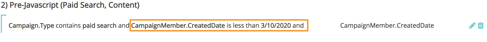
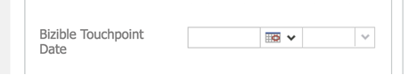

# 履歴データの同期 {#syncing-historical-data}

[!DNL Marketo Measure]は、最も詳細で実用的なデータを提供するソリューションです。 しかし、アトリビューションに使用したい既存のデータがあるかもしれないことを理解しています。 過去のデータのタッチポイントを生成することは可能ですが、このプロセスを進める前に、いくつかの要素を考慮することが重要です。

>[!NOTE]
>
>この記事では、古いプロセスについて説明します。 ユーザには、[新しく改善されたアプリ内プロセス](/help/channel-tracking-and-setup/offline-channels/custom-campaign-sync.md){target="_blank"}を使用することをお勧めします。

## 考慮すべき要素 {#factors-to-consider}

**データは既にキャンペーンに整理されていますか？**

a. タッチポイントを生成するには、データをキャンペーンに整理して[!DNL Marketo Measure]に同期する必要があります。 現在キャンペーンに整理されていない場合は、データを適切なキャンペーンにセグメント化するために必要な時間とリソースに価値があるかどうかを評価する必要があります。

b. メンバーがキャンペーンに追加された日付、または応答済みとしてマークされた日付がタッチポイントの日付に使用されるため、これも正確である必要があります。 [!DNL Marketo Measure]では、SFDCとMSDの両方で回避策を提供して日付を更新しますが、ボリュームによっては時間がかかる場合があります。

**すべてのチャネル（有料検索、イベント、オーガニックなど）のキャンペーンに整理された、かなり同量のデータがありますか？**

正確かつ「公正な」レポートを作成するためには、アトリビューションのバランスを取ることが重要です。 例えば、イベントなどの過去のオフラインチャネル施策に関するデータしか保持していない場合、データを補完するための履歴オンラインデータがなければ、データは本質的に偏ったものになります。

**どの程度の精度が期待されていますか？**

基本的には、チャネル、サブチャネル、キャンペーン名のみがわかります。

**今後のレポートの目標は何ですか？**

データは限られているため、どのように利用するかを検討することが重要です。 過去のデータと将来のデータを比較することは、あまり意味がないかもしれません。

**どれくらい前に行きたいですか？**

[!DNL Marketo Measure]さんは、前年度を過ぎないようにすることを強くお勧めします。

これは、最初に[!DNL Marketo Measure]の連絡先と話し合うことを強くお勧めします。 上記を考慮して続行したい場合は、一般的な手順（[!DNL Salesforce]と[!DNL Microsoft Dynamics]は別）を以下に示します。

## [!DNL Salesforce]で履歴キャンペーンを同期しています {#syncing-historic-campaigns-in-salesforce}

**オンライン：**

過去のオンラインデータを同期するには、データをSalesforce Campaignに整理し、[!DNL Marketo Measure] アプリの[!DNL Salesforce] Campaign Sync ルールを介して[!DNL Marketo Measure]に同期する必要があります。 JavaScriptの公開日以降、これらの施策のいずれからもタッチポイントが生成されないようにすることが重要です。 その理由は、顧客接点の重複を避けることができるからです。 JavaScriptの公開後、オンライン施策は自動的に追跡されるため、SFDC施策を通じてこれらの施策を追跡することは避けたいものです。 これを回避するには、ルールに時間的な要素を加える必要があります。 「Campaign Member Created Date is less than [JavaScript go-live date]」などの情報が表示される場合があります。

過去のオンラインデータのチャネルマッピングコンポーネントは、少々厄介な場合があります。 クリーンなレポート用に、現在のオンラインチャネルルール（オンラインルールシートから）をできる限り密接に一致させたいと考えています。 次に、理想的なチャネルマッピングの例を示します。

>[!NOTE]
>
>このチャネルマッピングは、SFDC キャンペーンを使用しているため、[!DNL Marketo Measure] アプリの[!UICONTROL &#x200B; オフラインチャネル &#x200B;] セクションで行われます。

| Salesforce キャンペーンの種類 | チャネル | サブチャネル |
|---|---|---|
| 有料検索 – AdWords | 有料検索 | AdWords |
| 有料検索 – Bing | 有料検索 | Bing |
| 有料検索 – Yahoo | 有料検索 | Yahoo |

このようにして追加されたオンラインデータは、本来、JavaScriptを介したオンラインデータ [!DNL Marketo Measure] トラックよりも詳細ではありません。 例えば、フォーム URL、ランディングページ、リファラーページなどのフィールドは入力されません。 そのため、可能であれば、施策を各ソースに分割することをお勧めします。 上記の例のように、レポートの精度を高めるには、各ソースに複数のキャンペーンタイプが必要です。

きめ細かいチャネルマッピングをサポートするSFDC Campaignの種類の数は不可能または合理的である可能性があるため、チャネルレベルにマッピングしてサブチャネルを無視するだけにすることをお勧めします。 チャネルレベルが不明な場合は、「Historic Digital」のようなプロキシチャネルを設定して、少なくともオンラインタッチであることがわかります。

これらの過去のオンライン施策のためにプッシュされるタッチポイント日付を一括編集する必要がある場合は、[!DNL Marketo Measure] カスタム「[!UICONTROL &#x200B; タッチポイント日付を一括更新]」ボタンを使用します（これは、SFDCのCampaign オブジェクトのカスタムフィールドとして使用できます）。 キャンペーンの期間が短い場合は、タッチポイントの日付を日単位で一括編集する価値があるかもしれません。キャンペーンの期間が長い場合は、週単位で一括更新することは理にかなっているかもしれません。 「タッチポイント日付一括更新」機能を使用する場合は、必ずCampaign Sync ルールを更新して、日付フィールドにBuyer Touchpoint日付を使用するようにしてください。 キャンペーンの同期ルールを作成するには、キャンペーンの同期ルールを作成する必要があります。このルールは、キャンペーンの1つまたは2つに対してのみ適用され、すべてには適用されない場合があります。

**オフライン：**

オフラインマーケティング施策の履歴データ（JavaScriptで追跡できないデータ）も、SFDC施策に整理する必要があります。 アクティビティが「過去」であるか「現在/後[!DNL Marketo Measure]」であるかを問わず、SFDC キャンペーンはオフラインの取り組みを追跡するため、元のオフラインチャネル設定トレーニングで決定したのと同じチャネルマッピングに従います。[!DNL Marketo Measure]

必要に応じて、「タッチポイントの一括更新」ボタンを使用して、キャンペーンメンバーのタッチポイントの日付を一括編集します。 例えば、イベント発生後にSFDC キャンペーンを作成する場合、正しい日付に対して一括編集を行います。 「タッチポイント日付一括更新」機能を使用する場合は、必ずCampaign Sync ルールを更新して、日付フィールドにBuyer Touchpoint日付を使用するようにしてください。 キャンペーンの同期ルールを作成するには、キャンペーンの同期ルールを作成する必要があります。このルールは、キャンペーンの1つまたは2つに対してのみ適用され、すべてには適用されない場合があります。

## [!DNL Dynamics]で履歴キャンペーンを同期しています {#syncing-historic-campaigns-in-dynamics}

[!DNL Marketo Measure]は、[!DNL Dynamics]内でキャンペーンに整理されている限り、過去に発生したインタラクションのタッチポイントを過去にさかのぼって生成できます。

通常、過去の日付を考慮して、CRMで作業する必要があります。 また、処理は、オンラインの取り組み（JSで追跡）とオフラインの取り組み（JSで追跡できない）で異なります。

[!DNL Dynamics]の履歴データを[!DNL Marketo Measure]に同期できる形式で整理するには、次の手順に従います。

**オンライン：**

バックフィルするには、過去のデジタルデータを[!DNL Dynamics]件のキャンペーンに整理する必要があります。 理想的には、この構造はすでに存在しています。

データが別の場所（マーケティングオートメーションに保管されているなど）に保管されている場合は、[!DNL Dynamics]にプッシュし、適切なキャンペーンに整理する必要があります。 次に、[!DNL Dynamics]にプッシュした日付ではなく、過去の日付を反映させるために、タッチポイント日付を考慮する必要があります。 この日付を上書きするには、カスタム「Buyer Touchpoint日付」フィールドを使用して日付を変更できます。 これをマーケティングリストフォームに追加する必要があります。

その結果、タッチポイント日に使用されるマーケティングリストのすべてのユーザーの日付を一括設定できます。 より正確な履歴日を設定するには、同じキャンペーンに対して、それぞれ独自のタッチポイント日を持つ複数のマーケティングリストを作成します。 施策の所要時間が短い場合は、毎日のマーケティングリストを作成することが有益です。 キャンペーンの期間が長い場合は、週単位でマーケティングリストを作成するのが妥当かもしれません。

マーケティングリストの同期について詳しくは、[[!DNL Dynamics]  キャンペーンとマーケティングリスト &#x200B;](/help/channel-tracking-and-setup/offline-channels/legacy-processes/dynamics-campaigns-and-marketing-lists.md)を参照してください。

>[!NOTE]
>
>何らかの理由でJavaScriptのライブ日を過ぎてアクティブなキャンペーントラッキングオンラインアクティビティがある場合は、必ず「[!UICONTROL &#x200B; タッチポイント終了日]」フィールドをJSのライブ日に設定してください。 これにより、同じインタラクションに対して重複した顧客接点を持つことは避けられます。

考慮事項：この方法で追加されたオンラインデータは、本来、JavaScriptを介したオンラインデータ [!DNL Marketo Measure] トラックよりも詳細ではありません。 例えば、フォーム URL、ランディングページ、リファラーページなどのフィールドは入力されません。 そのため、可能であれば、施策を各ソースに分割することをお勧めします。 以下は、理想的なマッピングの例です。

| Dynamics キャンペーンタイプ | チャネル | サブチャネル |
|---|---|---|
| 有料検索 – AdWords | 有料検索 | AdWords |
| 有料検索 – Bing | 有料検索 | Bing |
| 有料検索 – Yahoo | 有料検索 | Yahoo |

ソースを特定する方法がない場合、または時間と労力を費やす価値がない場合は、「レガシーデジタル」や「過去のWeb サイト」などのチャネルにマッピングされた1つのキャンペーンタイプを使用できます。

**オフライン：**

過去のオフラインマーケティング活動の顧客接点を設定するには、データを[!DNL Dynamics]件のキャンペーンに整理し、[!DNL Marketo Measure]に同期する必要があります。 このプロセスは、現在のオフラインチャネルと同じです（マーケティングリストまたはキャンペーン回答を介してキャンペーンを同期）。 次に、チャネルマッピングの例を示します。

| Dynamics キャンペーンタイプ | チャネル | サブチャネル |
|---|---|---|
| イベント – スポンサー会議 | イベント | スポンサー会議 |
| イベント – パートナーイベント | イベント | パートナーイベント |
| イベント – ホストされたイベント | イベント | ホスト済みイベント |
| ウェビナー – パートナーウェビナー | ウェビナー | パートナーウェビナー |

このデータがまだ正しい日付が設定されたキャンペーンに整理されていない場合は、「Buyer Touchpoint日」フィールドを使用して、過去のオフラインアクティビティの正確な日付を反映できます。

