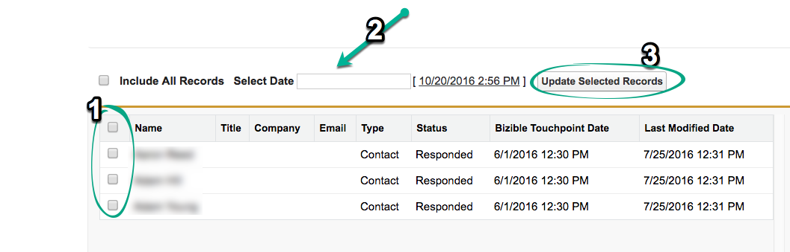

# オフラインキャンペーンの同期 {#syncing-offline-campaigns}

オフラインキャンペーンを正確にトラッキングし、デジタルマーケティング活動と比較して理解することは困難な場合があります。 [!DNL Marketo Measure] を使用すると、イベントが発生して数週間後までオフラインキャンペーンが作成されていない場合でも、[!DNL Salesforce] で [!DNL Salesforce] ッチポイントを追跡し、オフラインキャンペーンに関連付けることができます。

>[!NOTE]
>
>この記事では、古いプロセスについて説明します。ユーザには、[新しく改善されたアプリ内プロセス](/help/channel-tracking-and-setup/offline-channels/custom-campaign-sync.md){target="_blank"}を使用することをお勧めします。

## 同期前に {#before-you-sync}

効率的な同期プロセスのためのヒントを次に示します。

* オフラインキャンペーンとは、オンラインで発生しないマーケティングインタラクションを指します。 これには、イベント、ウェビナー、展示会などのマーケティングチャネルが含まれます。 オフラインマーケティングキャンペーンのみを含めます。
* [!DNL Marketo Measure] をインストールする前にオンラインアクティビティを追跡したキャンペーンを含める場合は、タッチポイント終了日をJavaScriptがサイトにデプロイされた日付として設定してください。
* オフラインチャネルページで [!DNL Marketo Measure] アプリを開いたままにすると、様々なキャンペーンタイプと、タッチポイントのバケット化されるマーケティングチャネルを簡単に識別できるので便利です。

* 「[!UICONTROL &#x200B; 保存 &#x200B;]」ボタンを押す前に、すべてを再確認してください。

## タッチポイント日付の一括更新 {#bulk-update-touchpoint-date}

[!DNL Salesforce] では、キャンペーンメンバーオブジェクトの「作成日」フィールドに、キャンペーンメンバーがキャンペーンに追加された日付が記録されます。 同期プロセスをスムーズに進めるには、「Buyer Touchpoint日」フィールドの日付が、Salesforce キャンペーンメンバーオブジェクトの日付と同じであることを確認します。 この手順は、「[!UICONTROL &#x200B; タッチポイント日を一括更新ボタン &#x200B;]」を使用して実行されます。__ 買い手タッチポイントを有効にするフィールドで [!UICONTROL &#x200B; 選択リスト &#x200B;] オプションを選択する前に実行します。

なぜこれが重要なのでしょうか？ あなたの会社が 1 月の会議でブースをスポンサーしたとしましょう。 会議では、100 人の個人がお客様の製品に関心を示し、連絡先情報を提供して電子メールで更新を受け取りました。 3 週間後、会議の結果を追跡するた [!DNL Salesforce] のキャンペーンを作成しました。

アップロード日は、会議日の 3 週間後になります。 この違いを修正するには、「[!UICONTROL &#x200B; タッチポイント日を一括更新 &#x200B;]」ボタンを使用して、適切な日付を設定します。 ボタンは、次の画像のようになります。

この場合、アップロード日から 3 週間バックフィルされます。 この手順は、「[!UICONTROL &#x200B; バイヤータッチポイントを有効にする」フィールドを設定する前に行う必要 &#x200B;] あります。

要約すると、「[!UICONTROL &#x200B; タッチポイント日を一括更新 &#x200B;]」ボタンを使用してタッチポイント日をイベントの日付に変更す [!DNL Marketo Measure] と、アップロード日ではなく、イベントの実際の日付でタッチポイントが生成されます。

また、既存のキャンペーンのすべてのキャンペーンメンバーの日付を更新することもできます。 これを行う場合は、タッチポイントの日付がメンバーのインタラクションの日付であることを確認します。 「Buyer Touchpointの一括更新日」をクリックし、キャンペーンメンバーのリストを必要に応じてフィルタリングし、キャンペーンメンバーのリストの上にある「[!UICONTROL &#x200B; 日付を選択 &#x200B;]」オプションで、イベントが発生した日付と同じ日付を追加します。

>[!CAUTION]
>
>タッチポイントの日付 _以前_ を更新する必要があります。すべてのキャンペーンメンバーのタッチポイントを有効にします。

## キャンペーンを作成し購入者タッチポイントを同期する方法 {#how-to-create-a-campaign-and-sync-buyer-touchpoints}

[!DNL Salesforce] でキャンペーンを作成するには、次の画像に示すように、「[!UICONTROL &#x200B; キャンペーン &#x200B;]」タブに移動し、「[!UICONTROL &#x200B; 新規 &#x200B;]」を選択します。 [!DNL Salesforce] の設定によっては、プラス（+）アイコンをクリックして、上部バーにキャンペーンを追加する必要がある場合があります。

このキャンペーンを作成する際に、「[!UICONTROL &#x200B; 購入者タッチポイントを有効にする &#x200B;]」フィールドをクリックし、選択リストから次のいずれかのオプションを選択します。

* **すべてのキャンペーンメンバーを含める**
   * このオプションを使用 [!DNL Marketo Measure] ると、タッチポイントを各キャンペーンメンバーに関連付けることができます。

* **「応答済み」キャンペーンメンバーを含める。**
   * このオプションは、「応答済み」ステータスのキャンペーンメンバーにタッチポイントを適用します。

* **すべてのキャンペーンメンバーを除外。**
   * このオプションでは、タッチポイントがキャンペーン内のどのメンバーにも関連付けられず、キャンペーンが意図的に [!DNL Marketo Measure] から除外されたことを示すフラグとして機能します。 キャンペーンを事故時に購入者タッチポイントと同期した場合は、ステータスを「すべてのキャンペーンメンバーを除外」に変更すると、タッチポイントが削除されます。

これらの選択の 1 つを選択 [!DNL Marketo Measure] ると、各キャンペーンメンバーにタッチポイント（該当する場合）が割り当てられます。 タッチポイントを作成するには、キャンペーンに追加されたリードまたは連絡先に、レコードに関連付けられたメールアドレスが [!DNL Marketo Measure] る _必須_ 必要があります。 メールアドレスがない場合、[!DNL Marketo Measure] ではキャンペーンメンバーにタッチポイントを割り当てません。

>[!MORELIKETHIS]
>
>[[!DNL Marketo Measure] チュートリアル：オフラインチャネルのマッピング](https://experienceleague.adobe.com/ja/docs/marketo-measure-learn/tutorials/onboarding/marketo-measure-salesforce/mapping-offline-channels){target="_blank"}
>
>[[!DNL Marketo Measure] チュートリアル：キャンペーンオブジェクトフィールド](https://experienceleague.adobe.com/ja/docs/marketo-measure-learn/tutorials/onboarding/marketo-measure-salesforce/campaign-object-fields){target="_blank"}
