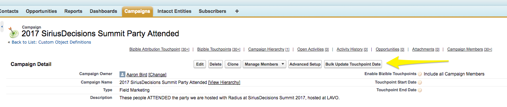
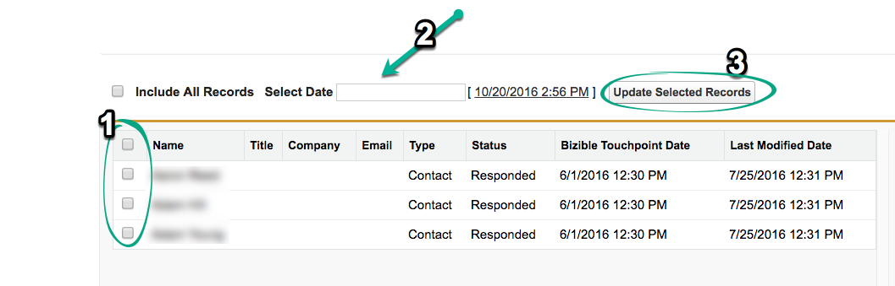
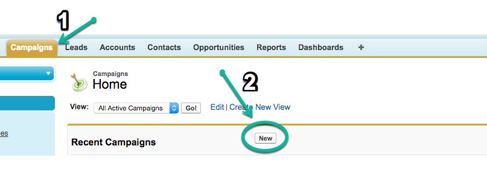
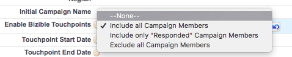

# オフラインキャンペーンの同期 {#syncing-offline-campaigns}

オフラインキャンペーンを正確に追跡し、デジタルマーケティング施策との比較を把握するのは容易なことではありません。 [!DNL Marketo Measure]を使用すると、イベントの数週間後まで[!DNL Salesforce] キャンペーンが作成されない場合でも、[!DNL Salesforce]でタッチポイントを追跡し、オフラインキャンペーンに属性を付けることができます。

>[!NOTE]
>
>この記事では、古いプロセスについて説明します。 ユーザには、[新しく改善されたアプリ内プロセス](/help/channel-tracking-and-setup/offline-channels/custom-campaign-sync.md){target="_blank"}を使用することをお勧めします。

## 同期する前に {#before-you-sync}

効率的な同期プロセスを実現するためのヒントを以下に示します。

* オフラインキャンペーンとは、オンラインで発生しないマーケティングインタラクションを指します。 イベント、ウェビナー、見本市などのマーケティングチャネルが含まれます。 オフラインマーケティング施策のみを含めます。
* [!DNL Marketo Measure]をインストールする前にオンラインアクティビティを追跡したキャンペーンを含める場合は、必ずタッチポイント終了日をJavaScriptがサイトにデプロイされた日付として設定してください。
* オフラインチャネルページで[!DNL Marketo Measure] アプリを開いたままにすることで、様々なキャンペーンタイプと、タッチポイントが属するマーケティングチャネルを簡単に特定できます。

* 「[!UICONTROL 保存]」ボタンを押す前に、すべてを再確認してください。

## タッチポイント日付の一括更新 {#bulk-update-touchpoint-date}

[!DNL Salesforce]では、キャンペーンメンバーオブジェクトの「作成日」フィールドに、キャンペーンメンバーがキャンペーンに追加された日付が記録されます。 同期プロセスをスムーズに実行するには、Buyer Touchpointの日付フィールドにSalesforce Campaign メンバーオブジェクトの日付と同じ日付が設定されていることを確認します。 この手順は、「[!UICONTROL  タッチポイントの一括更新ボタン ]」、「_before_」を使用して実行されます。「購入者のタッチポイントを有効にする」フィールドで「[!UICONTROL  ピックリスト ]」オプションを選択します。

なぜこれが重要なのでしょうか？ 貴社が1月のカンファレンスでブースをスポンサーしたとします。 会議では、100人の従業員が製品に関心を示し、連絡先情報を提供してメールで最新情報を受け取りました。 3週間後、会議の結果を追跡するためのキャンペーンを[!DNL Salesforce]でついに作成しました。

アップロード日は、カンファレンス日より3週間後になります。 この違いを修正するには、[!UICONTROL  タッチポイントの一括更新] ボタンを使用して、適切な日付を設定できます。 ボタンは下の画像に描かれています。

この場合、アップロード日を3週間バックフィルします。 この手順は、「[!UICONTROL 購入者のタッチポイントを有効にする]」フィールドを設定する前に実行する必要があります。

要約すると、「[!UICONTROL  タッチポイントの一括更新]」ボタンを使用してタッチポイントの日付をイベントの日付に変更すると、[!DNL Marketo Measure]はアップロードの日付ではなく、イベントの実際の日付のタッチポイントを生成します。

また、既存のキャンペーンのすべてのキャンペーンメンバーの日付を更新することもできます。 これを行う場合、タッチポイントの日付がメンバーのインタラクションの日付であることを確認してください。 「Buyer Touchpointの一括更新日」をクリックし、必要に応じてキャンペーンメンバーのリストをフィルタリングします。キャンペーンメンバーのリストの上にある「[!UICONTROL 日付を選択]」オプションで、イベントが発生した日付と同じ日付を追加します。

>[!CAUTION]
>
>すべてのキャンペーンメンバーに対してタッチポイントを有効にする前に、タッチポイントの日付&#x200B;_を_&#x200B;更新してください。

## キャンペーンを作成し、購入者のタッチポイントを同期する方法 {#how-to-create-a-campaign-and-sync-buyer-touchpoints}

[!DNL Salesforce]でキャンペーンを作成するには、「[!UICONTROL  キャンペーン ]」タブに移動し、下の画像に示すように「[!UICONTROL 新規]」を選択します。 [!DNL Salesforce]の設定によっては、プラス（+）アイコンをクリックしてCampaignsを上部バーに追加する必要がある場合があります。

このキャンペーンを作成する際に、「[!UICONTROL  バイヤータッチポイントを有効にする]」フィールドをクリックし、選択リストから次のいずれかのオプションを選択します。

* **すべてのキャンペーンメンバーを含める**
   * このオプションを使用すると、[!DNL Marketo Measure]は各キャンペーンメンバーにタッチポイントを関連付けることができます。

* **「応答済み」キャンペーンメンバーを含めます。**
   * このオプションは、「応答済み」ステータスを持つキャンペーンメンバーにタッチポイントを適用します。

* **すべてのキャンペーンメンバーを除外します。**
   * このオプションは、タッチポイントがキャンペーン内のメンバーに属するものではなく、キャンペーンが[!DNL Marketo Measure]から意図的に除外されたフラグとして機能します。 キャンペーンを購入者のタッチポイントと誤って同期した場合、ステータスを「すべてのキャンペーンメンバーを除外」に変更すると、タッチポイントが削除されます。

これらの選択のいずれかを選択すると、[!DNL Marketo Measure]は、該当する場合、各キャンペーンメンバーにタッチポイントを割り当てます。 キャンペーン _に追加されたリードまたは取引先責任者には、[!DNL Marketo Measure]がタッチポイントを作成するために、レコードにメールアドレスが関連付けられている必要があります_。 メールアドレスがない場合、[!DNL Marketo Measure] ではキャンペーンメンバーにタッチポイントを割り当てません。

>[!MORELIKETHIS]
>
>[[!DNL Marketo Measure]  チュートリアル：オフラインチャネルのマッピング ](https://experienceleague.adobe.com/ja/docs/marketo-measure-learn/tutorials/onboarding/marketo-measure-salesforce/mapping-offline-channels){target="_blank"}
>
>[[!DNL Marketo Measure]  チュートリアル：Campaign オブジェクトフィールド ](https://experienceleague.adobe.com/ja/docs/marketo-measure-learn/tutorials/onboarding/marketo-measure-salesforce/campaign-object-fields){target="_blank"}
