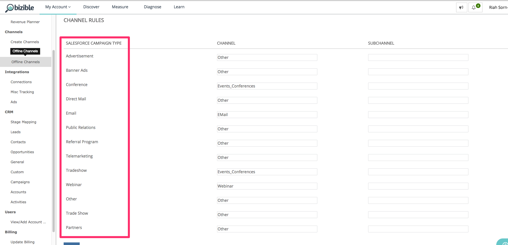
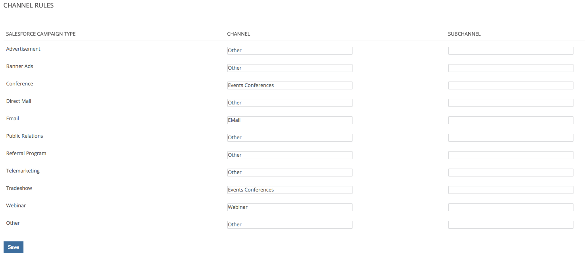

# オフラインカスタムチャネル設定 {#offline-custom-channel-setup}

## はじめに {#getting-started}

比較対象： [!DNL Marketo Measure] でオンラインチャネルルールを処理する場合は、オフラインチャネルルールにスプレッドシートを使用する必要はありません。 ただし、実装計画にはまだシートが記載されています。これは、オフラインチャネルを整理する際に考えるのに役立つからです。

スプレッドシートには次の 3 つの列があります。

**[!UICONTROL Salesforce] キャンペーンタイプ**  — で識別されたキャンペーンタイプの追加 [!DNL Salesforce] ここ

* 例えば、電子メール、ウェビナー、会議、またはこのフィールドに作成した値のうち、タッチポイントを関連付ける値などです。

**[!UICONTROL チャネル]**  — 様々なマーケティングチャネルをここに追加

**[!UICONTROL Subchannel]**  — 対応するサブチャネルをここに追加します。

## オフラインチャネルロジック {#offline-channel-logic}

[!DNL Marketo Measure] オフラインチャネルロジックは、Campaign オブジェクト、特に [!DNL Salesforce] キャンペーンのタイプ。 オフラインでの取り組みのそれぞれには、 [!DNL Salesforce] ディナーや展示会など、次の理由でキャンペーンのタイプを選択します。 [!DNL Marketo Measure] は、このフィールドに基づいて、マッピング先のチャネルとサブチャネルを把握します。

SFDC キャンペーンのタイプが [ オフラインチャネル ] タブの [ ] の下に表示されます。 [!DNL Salesforce] キャンペーンのタイプ。 注意： [!DNL Marketo Measure] では、バイヤータッチポイントが関連付けられているキャンペーンに対してのみ、SFDC キャンペーンタイプをインポートできます。

ここで、 [!DNL Marketo Measure] アプリを使用します。 これには、新しいチャネルとサブチャネルを [!DNL Marketo Measure] アプリ（以下の画像に示すように、アプリの「チャネルを作成」セクションでおこなわれます）。 用に新しいチャネルとサブチャネルを作成する必要があります [!DNL Marketo Measure] タッチポイントをプッシュする場所を理解する キャンペーンタイプのマッピング方法を決定できます。

## チャネルマッピングの例 {#channel-mapping-example}

例えば、2 人の [!DNL Salesforce] 1 年間の会議。 しかし、各会議は非常に異なり、独自のターゲットオーディエンスを持っています。 どちらがより価値を持つかを知りたいと思います。 を [!DNL Salesforce] 環境の場合は、1 月のイベントにキャンペーンのタイプを「会議」とし、チャネルに「[!DNL Salesforce]」、サブチャネルの「1 月の会議」を参照してください。

6 月の会議でも同じことをしたいと思います これは会議でもあるので、同じキャンペーンタイプ（この場合は「会議」）を指定できます。 チャネルは同じです。 [!DNL Salesforce]第 2 回会議のサブチャネルは「6 月会議」です。 これは、組織的な観点から理にかなっています。 しかし、 [!DNL Marketo Measure] どちらのキャンペーンもキャンペーンタイプが同じなので、これらのルールを読み取って適用するロジックです。 [!DNL Marketo Measure] スクリプトは、1 つのタイプから 2 つの異なるサブチャネルにデータをマッピングできません。 つまり、各サブチャネルに新しいキャンペーンタイプを作成する必要がありますが、サブチャネルに同じチャネルを割り当てることはできます。

以下は、 [!DNL Marketo Measure] は読み取れませんでした：

上記のシナリオでは、同じキャンペーンタイプを 2 つの異なるサブチャネルにマッピングできないので、一意のキャンペーンタイプを作成する必要があります。 代わりに、次のような一意のタイプを設定する必要があります。

既存のキャンペーンタイプをチャネルマップに含める必要があり、チャネルとして「NULL」を追加する必要があります。

時間をかけて～に入る [!DNL Salesforce] 既存のレコードタイプの数と特性（含めるレコードタイプ）、および上記の情報に基づいて追加のキャンペーンを作成する必要があるかどうかを判断する場合。 必要な情報をすべて入力したら、アップロードの準備が整いました。

詳細情報： [オフラインでの同期 [!DNL Salesforce] 次を使用するキャンペーン [!DNL Marketo Measure]](/help/channel-tracking-and-setup/offline-channels/legacy-processes/syncing-offline-campaigns.md).

## オンラインマーケティング活動のための SFDC キャンペーンの処理 {#handling-sfdc-campaigns-for-online-marketing-efforts}

マーケティングチームが [!DNL Salesforce] キャンペーンを使用して様々なデジタルマーケティング活動を追跡できます。 この方法に問題はありません。ただし、これらのキャンペーンを、ダイレクトメールや会議などの真のオフラインキャンペーンとは異なる方法で扱うことが重要です。 デジタルイベント（Web サイト上でおこなわれるインタラクション）に関連するキャンペーンは、と同期しないでください。 [!DNL Marketo Measure]. これらのキャンペーンを同期すると、タッチポイントが重複する原因となります。これは、 [!DNL Marketo Measure] JavaScript は既にオンラインの取り組みを追跡しています。

オンラインアクティビティのキャンペーンを処理するためのもう 1 つのヒントは、 [!DNL Salesforce] キャンペーンタイプを NULL に設定します。 これをおこなうには、まず [!DNL Marketo Measure] 以下の画像に示すように、アプリは NULL とタイトル付けされます。 これは、 [!DNL Marketo Measure] アプリの下 **チャネルを作成** 」セクションに入力します。 同期すべきでないキャンペーンが誤って同期された場合に役立ちます。 キャンペーンを簡単に見つけ出し、同期ステータスを修正するには、NULL の下にグループ化されたすべてを確認します。

## アプリへのオフラインチャネルルールの入力 {#entering-your-offline-channel-rules-to-the-app}

スプレッドシートを編集し、カスタムルールで更新したら、次の手順で、 [!DNL Marketo Measure] アプリ — 実際にはオフラインチャネル用のスプレッドシートをアップロードしません。 代わりに、以下の画像に表示される選択リストボックスに情報を入力します。 これは、 **[!UICONTROL オフラインチャネル]** の下に **[!UICONTROL チャネル]** 」セクションに入力します。

>[!TIP]
>
>決定したい _when_ a [!DNL Salesforce] キャンペーンのタイプが [!DNL Marketo Measure] チャネルマッピング？ に移動します。 **[!UICONTROL 設定]** > **[!UICONTROL キャンペーン]** > **[!UICONTROL フィールド]** > **[!UICONTROL タイプ]**. 選択リストに含まれる値と非アクティブな値を確認できます。 非アクティブなものは、「 」に選択可能なタイプとして表示されません。[!UICONTROL オフラインチャネル]」セクションに追加しました。 このプロセスには、数分から 48 時間までの時間がかかる場合があります。

クリック **[!UICONTROL 保存]** 完了して [!DNL Marketo Measure] 変更内容をアップロードし、データを再処理します。

>[!MORELIKETHIS]
>
>* [[!DNL Marketo Measure] 大学：オフラインチャネルのマッピング](https://universityonline.marketo.com/courses/bizible-fundamentals-channel-management/#/page/5c630eca34d9f0367662b77f)
>
>* [[!DNL Marketo Measure] 大学：オフラインキャンペーンの同期](https://universityonline.marketo.com/courses/bizible-fundamentals-channel-management/#/page/5c63286e34d9f0367662b78b)
>
>* [Marketo Engageプログラムの統合](/help/marketo-measure-and-marketo/marketo-measure-integrations-with-marketo/marketo-engage-programs-integration.md#channel-mapping)
