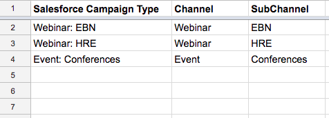
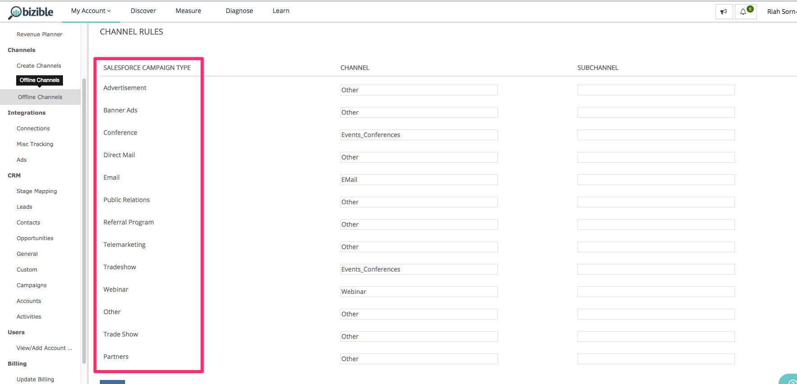
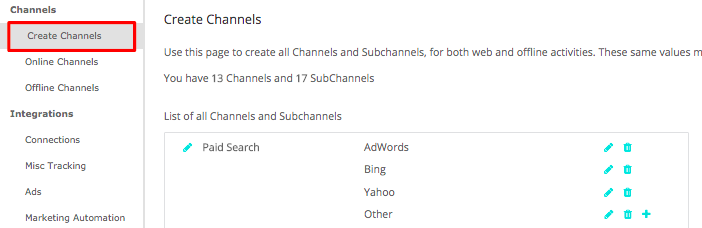
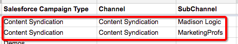
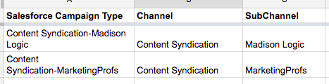
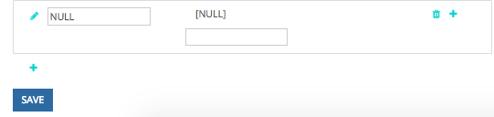
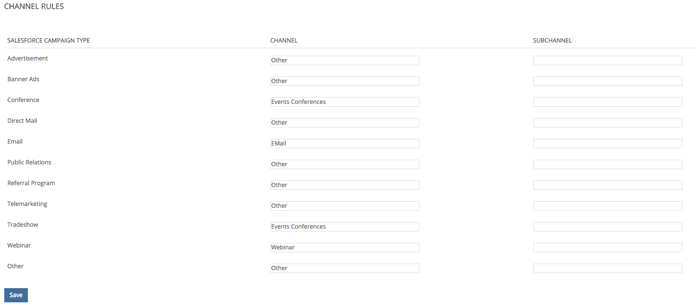

# オフラインカスタムチャネル設定 {#offline-custom-channel-setup}

## はじめに {#getting-started}

[!DNL Marketo Measure]がオンライン チャネル ルールを処理する方法と比較すると、オフライン チャネル ルールではスプレッドシートを使用する必要がないことがわかります。 ただし、オフラインチャネルを整理する方法を考えるのに役立つ可能性があるため、実装計画にはまだシートが用意されています。

スプレッドシートには、次の3つの列があります。

**[!UICONTROL Salesforce] キャンペーンの種類** – ここで[!DNL Salesforce]で特定されたキャンペーンの種類を追加します

* 例えば、電子メール、ウェビナー、会議など、このフィールドに対して作成したタッチポイントの属性を設定する値を指定できます。

**[!UICONTROL チャネル]** – 様々なマーケティングチャネルをここに追加

**[!UICONTROL サブチャネル]** – 対応するサブチャネルをここに追加

## オフライン チャネル ロジック {#offline-channel-logic}

[!DNL Marketo Measure]個のオフラインチャネルロジックは、Campaign オブジェクト、特に[!DNL Salesforce]個のキャンペーンタイプによって決まります。 各オフライン作業には、ディナーやトレードショーなどの[!DNL Salesforce] キャンペーンタイプが必要です。[!DNL Marketo Measure]はこのフィールドを使用して、マッピングするチャネルとサブチャネルを把握しているためです。

SFDC キャンペーンの種類は、「[!DNL Salesforce] キャンペーンの種類」の下の「オフラインチャネル」タブに表示されます。 [!DNL Marketo Measure]は、購入者のタッチポイントが関連付けられているキャンペーンに対してのみ、SFDC キャンペーンタイプを読み込むことができます。

ここで、[!DNL Marketo Measure] アプリでチャネル/サブチャネルマッピングを作成できます。 これには、アプリの「[!DNL Marketo Measure]」アプリで新しいチャネルとサブチャネルを作成することが含まれる可能性があります。これは、アプリの「チャネルを作成」セクション（下図に示す）で行われます。 タッチポイントをプッシュする場所を把握するには、[!DNL Marketo Measure]に対して新しいチャネルとサブチャネルを作成する必要があります。 キャンペーンタイプをどのようにマッピングするかを決定できます。

## チャネルマッピングの例 {#channel-mapping-example}

例えば、年に2回[!DNL Salesforce]会議に参加するとします。 ただし、カンファレンスごとに大きな違いがあり、それぞれ独自のターゲットオーディエンスを設定しています。 この2つのうち、どちらがより多くの価値をもたらすのかを知りたいと思います。 [!DNL Salesforce]環境では、1月のイベントにキャンペーンタイプ「Conference」を指定し、チャネル「[!DNL Salesforce]」に名前を付け、サブチャネル「January Conference」に名前を付けることができます。

同じことを6月の会議でも行います。 これも会議なので、同じキャンペーンタイプ、この場合は「会議」を指定できます。 チャネルは同じ[!DNL Salesforce]で、この2回目の会議のサブチャネルは「6月の会議」です。 これは、組織の観点からは理にかなっています。 ただし、両方のキャンペーンに同じキャンペーンタイプがあるため、これらのルールを読んで適用する[!DNL Marketo Measure] ロジックは非常に混乱します。 [!DNL Marketo Measure] スクリプトは、1つのタイプのデータを2つの異なるサブチャネルにマッピングできません。 つまり、サブチャネルごとに新しいキャンペーンタイプを作成する必要がありますが、サブチャネルは同じチャネルを持つことができます。

次に、[!DNL Marketo Measure]が読み取れなかったロジックの例を示します。

上記のシナリオでは、同じキャンペーンタイプを2つの異なるサブチャネルにマッピングできないため、一意のキャンペーンタイプを作成する必要があります。 代わりに、次のような一意のタイプを設定します。

既存のキャンペーンタイプはすべてチャネルマップに含める必要があり、「NULL」をチャネルとして追加する必要があります。

[!DNL Salesforce]に移動して、含める既存のレコードタイプの数と性質、および上記の情報に基づいて追加のキャンペーンを作成する必要があるかどうかを判断します。 必要な情報をすべて入力したら、アップロードする準備ができました。

[ オフラインの同期 [!DNL Salesforce]  キャンペーンと [!DNL Marketo Measure]](/help/channel-tracking-and-setup/offline-channels/legacy-processes/syncing-offline-campaigns.md)の同期について詳しくは、こちらを参照してください。

## オンラインマーケティングの取り組みに対するSFDC キャンペーンの処理 {#handling-sfdc-campaigns-for-online-marketing-efforts}

マーケティング部門がさまざまなデジタルマーケティング活動を追跡するために、[!DNL Salesforce]件のキャンペーンを作成するのが一般的です。 この方法には問題はありませんが、ダイレクトメールや会議などの真のオフラインキャンペーンとは異なる方法で施策を実施することが重要です。 デジタルイベント（web サイトで行われるインタラクション）に関連するキャンペーンは、[!DNL Marketo Measure]と同期しないでください。 [!DNL Marketo Measure] JavaScriptでは既にオンライン作業を追跡しているため、これらのキャンペーンを同期すると、タッチポイントが重複することになります。

オンラインアクティビティのキャンペーンを処理するもう1つのヒントは、[!DNL Salesforce] キャンペーンタイプをNULLにマッピングすることです。 これを行うには、まず、下の画像に示すように、「NULL」というタイトルの[!DNL Marketo Measure] アプリでチャネルを作成します。 これは、**チャネルの作成** セクションの[!DNL Marketo Measure] アプリにあります。 これは、同期すべきではないキャンペーンが誤って同期された場合に役立ちます。 NULLの下にグループ化されたすべての項目を確認することで、キャンペーンを簡単に見つけて同期ステータスを修正できます。

## アプリへのオフラインチャネルルールの入力 {#entering-your-offline-channel-rules-to-the-app}

カスタムルールを使用してスプレッドシートを編集および更新したら、次の手順は、[!DNL Marketo Measure] アプリでこのチャネルマッピングを再作成することです。実際には、オフラインチャネル用のスプレッドシートはアップロードされません。 代わりに、以下の画像に表示されているように、ピックリストボックスに情報を入力します。 これは、「**[!UICONTROL チャネル]**」セクションの「**[!UICONTROL オフラインチャネル]**」をクリックすると見つかります。

>[!TIP]
>
>[!DNL Salesforce]のキャンペーンタイプを&#x200B;_が[!DNL Marketo Measure]のチャネルマッピングに取り込まれた場合、_&#x200B;を判断しますか？ **[!UICONTROL 設定]** > **[!UICONTROL キャンペーン]** > **[!UICONTROL フィールド]** > **[!UICONTROL タイプ]**&#x200B;に移動します。 次に、ピックリスト内の値と非アクティブな値を確認できます。 非アクティブなチャネルは、「[!UICONTROL  オフラインチャネル ]」セクションで選択可能なタイプとして表示されません。 注意：このプロセスは、数分から48時間までかかることがあります。

完了したら、**[!UICONTROL 保存]**&#x200B;をクリックすると、[!DNL Marketo Measure]が変更をアップロードし、データを再処理します。

>[!MORELIKETHIS]
>
>* [[!DNL Marketo Measure]  チュートリアル：オフラインチャネルのマッピング ](https://experienceleague.adobe.com/ja/docs/marketo-measure-learn/tutorials/onboarding/marketo-measure-salesforce/mapping-offline-channels){target="_blank"}
>
>* [[!DNL Marketo Measure]  チュートリアル：オフラインキャンペーンの同期](https://experienceleague.adobe.com/en/docs/marketo-measure-learn/tutorials/onboarding/marketo-measure-salesforce/syncing-offline-campaigns){target="_blank"}
>
>* [Marketo Engage プログラム統合](/help/marketo-measure-and-marketo/marketo-measure-integrations-with-marketo/marketo-engage-programs-integration.md#channel-mapping){target="_blank"}
