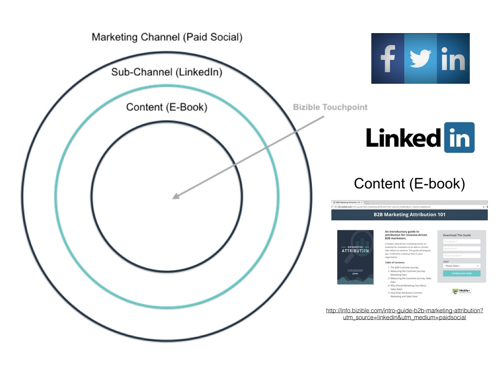

# マーケティングチャネルとサブチャネル {#marketing-channels-and-subchannels}

## 目的 {#purpose}

[!DNL Marketo Measure] のチャネルとサブチャネルの概要、コンテンツに対する関連性、2 つの分類の違い、[!DNL Marketo Measure] アプリ内での使用方法を定義します。

## 概要 {#overview}

マーケティングチャネルは、[!DNL Marketo Measure] ROI ダッシュと CRM の両方で、レポートを簡単にするためにマーケティング活動を分類（または「バケット」）するのに役立ちます。 [!DNL Marketo Measure] には、標準の 12 個のチャネル（組織の慣例に合わせてカスタマイズ／名前変更が可能）と、より詳細なフィルタリングを行うためにカスタムチャネルをさらに作成する機能が付属しています。

サイト上のいずれかのコンテンツページ（そのコンテンツが web ページ、ホワイトペーパーのダウンロード、ページ URL など）に訪問者を迎えるたびに、そのリードは、次の URL に含まれる複数の UTM パラメーターに基づいてチャネル／サブチャネルに「バケット化」されます。

* 中
* ソース
* キャンペーン
* ランディングページ
* 参照元サイト

UTM パラメーターに基づいて「バケット」に分類されるリードをカスタマイズするには、チャネルルールを使用します。 チャネルルールの設定と維持について詳しくは、[こちらをクリック](/help/channel-tracking-and-setup/online-channels/online-custom-channel-setup.md)してください。

クリックしたら、[オンラインチャネル](/help/channel-tracking-and-setup/online-channels/online-custom-channel-setup.md)および[オフラインチャネル](/help/channel-tracking-and-setup/offline-channels/offline-custom-channel-setup.md)の設定方法を参照し、その違いを確認してください。

**マーケティングチャネル**

マーケティングチャネルは、最も広範なレベルの分類で、様々なサブチャネルをカバーできます。 これらは、リードの由来となるサブチャネルの「タイプ」と見なすことができます。 マーケティングチャネルの例には、**有料検索、オーガニック検索、ディスプレイ**、**有料ソーシャル**&#x200B;などがあります。 マーケティングチャネルは通常、URL にある utm_medium パラメーター値に対応します。

**サブチャネル**

サブチャネルは、入ってくるリードをバケットする際のパズルの 2 番目の部分です。 サブチャネルは、マーケティングチャネルの&#x200B;_どの_&#x200B;反復が使用されたかを正確に伝えます。 例えば、有料ソーシャルマーケティングチャネル内では、**AdWords**、**BingAds**、**Facebook**&#x200B;などのサブチャネルを使用できます。サブチャネルは通常、URL内のutm_source パラメーター値に対応します。

## ユースケースの例 {#use-case-example}

以下の図に、次の URL の web ページに基づくマーケティングチャネル、サブチャネル、コンテンツの例を示します。

`http://info.bizible.com/intro-guide-b2b-marketing-attribution?utm_source=linkedin&utm_medium=paidsocial`

この場合、ユーザーがアクセスしようとしているコンテンツは、B2B マーケティングアトリビューションの概要ガイドです。 [!DNL Marketo Measure] では、この組織で設定されたチャネルルールを使用して、このコンテンツにつながる URL を分析および使用し、このリードをマーケティングチャネルの「有料ソーシャル」とサブチャネルの「LinkedIn」に「バケット化」します。

その他の例…

**マーケティングチャネル（中）**

* PPC
* 有料ソーシャル
* オーガニックソーシャル
* メール
* イベントと会議
* オーガニック検索／SEO
* PR
* リファラルプログラム

**サブチャネル（タッチポイントソース）**

* Google AdWords
* BingAds
* Facebook 広告
* Adroll
* ダブルクリック
* Capterra
* ドリップキャンペーン
* LinkedIn 広告

**コンテンツ（ホワイトペーパー、ページ URL、ブログ投稿）**

* www.adobe.com/blog1
* www.adobe.com/whitepaper
* www.adobe.com/sign-up-now
