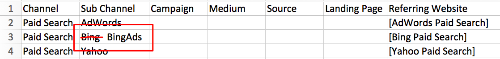

# オンラインカスタムチャネル設定 {#online-custom-channel-setup}

正確なレポートを作成するには、組織の UTM 戦略を反映するようにマーケティングチャネルを設定する必要があります。このガイドでは、カスタムチャネルルールの最適な設定方法について説明します。

## 始める前に {#before-you-begin}

[!DNL Marketo Measure] のチャネルルールの作成を開始する前に、ある程度時間をかけて、マーケティングキャンペーンの組織と、それを [!DNL Marketo Measure] フレームワークにどのように適合させるかについて検討します。トラッキングするチャネル、サブチャネル、キャンペーンおよびリファレル web サイトを特定する必要があります。

留意点：

* 組織は、最大 40 個のカスタムマーケティングチャネルを作成できます。これには、オフラインチャネルとオンラインチャネルの両方が含まれます。
* 組織は、最大 200 個のサブチャネルを作成できます。
* データの各コレクション（バケット）には、データの整理方法を指定する独自のルール（スプレッドシートの行）が必要です。できる限り具体的にします。
* [!DNL Marketo Measure] 論理では、スプレッドシートの一番上の行から順に、降順でデータを優先します。各バケット（セル）を行ごとに読み取り、最初に適合するものを探します。次に、これらのバケットの値に応じて、データが並べ替えられます。これについて詳しくは、後述します。
* 論理ルールに干渉するので、シートをアルファベット順で並べ替えないでください。
* ファイルがアップロードされると、7 日間はルールを変更できません。[!DNL Marketo Measure] は、この時間を利用して、Touchpoints を処理および更新します。

## [!DNL Marketo Measure] 論理と優先度 {#marketo-measure-logic-and-priorities}

最初の手順は、[!DNL Marketo Measure] アプリからカスタムチャネルスプレッドシートダウンロードすることです。「**マイアカウント**」タブの「**設定**」に移動して、**オンライン**&#x200B;を選択します。「**元のテンプレートをダウンロード**」または「**現在のルールをダウンロード**」を選択できます。

スプレッドシートには、次の 7 つの列があります。

* **チャネル：**&#x200B;様々なマーケティングチャネルをここに追加します
* **サブチャネル：**&#x200B;対応するサブチャネルをここに追加します
* **キャンペーン：**&#x200B;キャンペーン名をここに追加します（値が UTM と [!DNL Marketo Measure] アクティビティ機能用の Salesforce キャンペーンのどちらに起因するかにかかわらず）
* **メディア：**&#x200B;メディア列は、utm_medium パラメーターの値を表します
* **ソース：**&#x200B;ソース列は、utm_source パラメーターの値を表します
* **ランディングページ：**&#x200B;ランディングページをここに追加します
* **参照元 web サイト：**&#x200B;ページへのトラフィックを参照する web サイトの URL または組み込みの [!DNL Marketo Measure] 論理（角括弧で示される）

8 番目の列は、スプレッドシートから削除できないルールを「Do Not Remove」で示します。スプレッドシートの上部には、デフォルトのチャネルルールがあります（[!DNL Marketo Measure] では、これらのチャネルを使用しない場合でも、変更または削除しないことが推奨されます）。[!DNL Marketo Measure] はこれらのプラットフォームと深く統合されているので、デフォルトで含まれています。

行は、ルールおよび [!DNL Marketo Measure] によって優先されるデータの順序を表します。最初の行は 2 番目の行より優先され、2 番目の行は 3 番目の行より優先されます（以下同様）。タッチポイントをどのマーケティングチャネルおよびサブチャネルのバケットに含めるかを決定する場合、[!DNL Marketo Measure] は、タッチポイントの条件を満たす行を見つけるまで、上から下、左から右に読み取ります（例えば、タッチポイントに `utm_source=Facebook` がある場合、スクリーンショットのルール 15 により、タッチポイントは、Social.Facebook チャネルにバケット化されます）。

[!DNL Marketo Measure] には、12 個のデフォルトのチャネルが用意されています。これらのチャネルは、[!DNL Marketo Measure] が完全に統合されているプラットフォームと相関関係にあります。これらは、使用するかどうかにかかわらず、削除しないでください。これらのプラットフォームのいずれか（例えば、Bing Ads）を使用していて、チャネルまたはサブチャネルに異なる命名規則を使用したい場合は、名前を更新できます。以下の画像に例を済めします。

また、ルールの構造も重要です。ルールは、情報が繰り返され、データが欠落しているように見えるかもしれませんが、この構造は意図的なものです。正確なデータの並べ替えには、個々のソースを適切なチャネルに個別にマッピングする必要があります（サブチャネルおよびチャネルを共有するソースも同様）。ルールが詳細で細かければ細かいほど、結果は、より洞察に満ちたものになります。基本的に、ベストプラクティスは、トラッキングするマーケティング活動ごとに詳細なルールを記述することです。

何らかの理由でトラッキングしたくない他の広告がある場合や、慣れ親しんだソースではなく慣れ親しんだチャネルから web サイトへの訪問がある、という状況を考慮します。この状況では、[!DNL Marketo Measure] がデータの並べ替えに使用する適切なルールを見つけることができないと、データ損失につながる可能性があります。これが発生するのを防ぐために、[!DNL Marketo Measure] では、ルールを複数の行に分割することを推奨しています。

ルールの各パラメーターやコンポーネントは、チャネルに個別にマッピングされます。例えば、[!DNL Marketo Measure] が [!DNL Facebook] データを並べ替える場合、[!DNL Facebook] に関連するルールを探します。ルールは、上から下にスキャンされます。以下の図の例では、[!DNL Marketo Measure] は、最初の [!DNL Facebook] サブチャネルについて、ソースパラメーターのみを読み取って、データをそのルールのバケットにドロップします。

次のルールは、Medium パラメーターのみを要求し、そのパラメーターを持つすべてのデータが、このチャネルのバケットに入れられます。[!DNL Facebook] について最後に、Facebook URL から来るすべてのデータが、最後の Facebook バケットに入れられます。

デフォルトのチャネル「その他」は、どのルールの条件も満たさないデータをキャッチするために存在しています。他のチャネルの一部のバケットには、アスタリスク（&#42;）が含まれていることに注意してください。これらのアスタリスクは、キャッチオールとして機能するワイルドカードを表します。

[!DNL Marketo Measure] 論理は上から下に機能するので、ワイルドカードルール（アスタリスク（&#42;）で示される）は、ルールシートの一番最後に配置される必要があります。他のルールでキャッチされない、または並べ替えられないすべてのデータは、このワイルドカードバケットに追加されます。

以下に、ワイルドカード論理のその他の例を示します。

* &#42;email&#42; = 「email」を含む
* &#42;email = 「email」で終わる
* email&#42; = [!UICONTROL email で始まる]

さらに、あるチャネルにサブチャネルを作成する場合、そのチャネルの下のすべてのルールに対してサブチャネルを作成する必要があることに注意してください。つまり、1 つのサブチャネルを作成する場合、残りの列を空のままにすることはできません。

## カスタムチャネルルールの設定 {#setting-up-your-custom-channels-rules}

どのようにデータを整理して優先度を設定するかを決定したら、スプレッドシートへのルールの追加を開始します。以下に、いくつかのベストプラクティスを示します。

* 最初から可能な限りルールをシンプルにする。ルールは、いつでも自由に作成できます。
* チャネル名に特殊文字を追加しない（例：$%#&amp;&#42;@）
* Bing Ads および AdWords に関連付けられたルールを編集しない。これらのルールは、これらのプラットフォームを含む [!DNL Marketo Measure] API 統合から自動的に取得されるデータをバケットに入れるうえで、非常に重要です。ただし、ニーズに合わせてサブチャネルおよびチャネル名を変更することは問題ありません。
* 「Do Not Remove」メモが含まれるルールを削除しない。
* オーガニック検索ルールは、常に、[!UICONTROL 有料検索ルール]の後に配置する。
* 異なるサブドメインに基づいてルールを作成できない。
* スプレッドシートのセルに 1 つ以上の値を追加する場合、必ずセミコロン（`;`）のみを使用して値を区切る。コンマまたはスペースは使用できません。
* 参照元 URL の最後にドットコム（.com）を追加する必要はない。
* 参照元 URL を追加する場合、他の API 関連のルールのように角括弧で囲まない。

## カスタムチャネルルールのアップロード {#uploading-your-custom-channels-rules}

CSV に追加するすべての新規チャネルおよびサブチャネルの値が、既に Bizible アカウントのチャネル設定領域に追加されていることを確認します。CSV のすべてのチャネルおよびサブチャネル名が [!DNL Marketo Measure] アカウントのチャネル設定領域と一致することをもう一度確認します。コンマおよびスペースを必ず確認します。

アップロード中にエラーメッセージを受け取ったら、問題を修正して、もう一度アップロードします。エラーメッセージを受け取らなかった場合、ページの下部にある「**保存して処理**」をクリックします。
