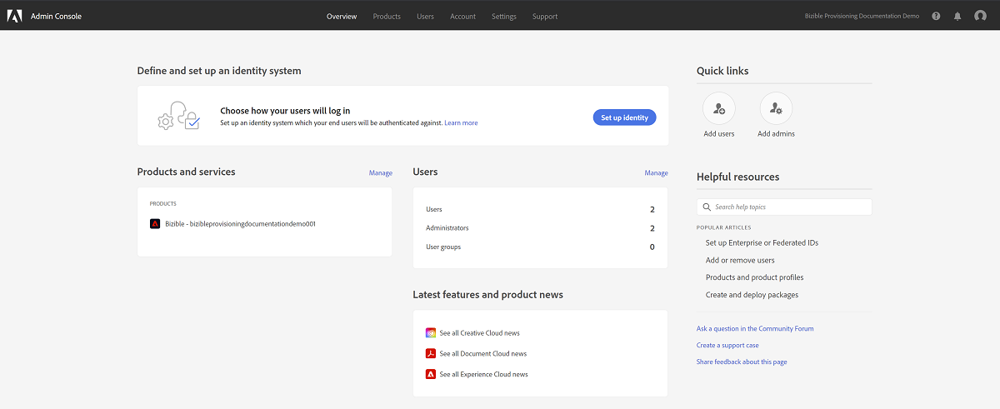

# エラー通知 {#error-notifications}

以下は、アプリ内通知またはメールで受け取る可能性のあるエラーのリストです。 これらのいずれかを受け取った場合は、それぞれのトラブルシューティング手順に従います。 このトラブルシューティング手順で問題が解決しない場合は、[Marketo サポート](https://nation.marketo.com/t5/support/ct-p/Support)にお問い合わせください。

[!DNL Marketo Measure]で完全な通知メッセージを表示するには、「通知」タブの下部にある&#x200B;**すべて表示**&#x200B;をクリックします。

」をクリックします

<table>
  <tbody>
    <tr>
      <th style="width:31%">エラーコード</th>
      <th style="width:23%">通知の例</th>
      <th style="width:23%">説明</th>
      <th style="width:23%">トラブルシューティング手順</th>
    </tr>
    <tr>
      <td>API_DISABLED</td>
      <td>CRM の読み込み中に発生したエラー：API_DISABLED：このユーザの API 呼び出しが無効になっています</td>
      <td>Marketo Measure ユーザの API 権限が無効になっています。</td>
      <td>Salesforce ドキュメントの <a href="https://help.salesforce.com/s/articleView?language=en_US&id=sf.branded_apps_commun_api_permset.htm&type=5">API アクセスを有効にする方法</a>を参照してください。</td>
    </tr>
    <tr>
      <td>API_LIMIT_EXCEEDED</td>
      <td>CRM の書き出し中に発生したエラー：PI_LIMIT_EXCEEDED</td>
      <td>CRM の API 制限（24 時間）を超えました。</td>
      <td>API クレジット割り当ての調整については、CRM に関する次のドキュメントを参照してください。

          <ul>
            <li><a href="https://learn.microsoft.com/ja-jp/dynamics365/fin-ops-core/dev-itpro/data-entities/service-protection-monitoring">Dynamics</a>
            </li>
            <li><a href="https://developer.salesforce.com/docs/atlas.en-us.salesforce_app_limits_cheatsheet.meta/salesforce_app_limits_cheatsheet/salesforce_app_limits_platform_api.htm">Salesforce</a>
            </li>
          </ul>
          
また、次の手順に従って、Marketo Measure で使用する CRM クレジットを調整できます。

          <ul>
            <li><b>設定</b>／<b>CRM</b>／<b>一般</b>に移動します。</li>
            <li>1日あたりのCRM API制限の更新 
              <ul>
                <li><b>メモ：デフォルトは 100,000 です。</b></li>
              </ul>
            </li>
          </ul>
          

          &lt;img alt="error notifications 3" src="assets/error-notifications-3.png"
          

      </td>
    </tr>
    <tr>
      <td>CANNOT_EXECUTE_FLOW_トリガー</td>
      <td>Crmの書き出し中にエラーが発生しました：CANNOT_EXECUTE_FLOW_ENTITY :トリガータイプ「連絡先」Salesforce管理者に以下の詳細を提供します。
制限を超えました
あなたまたはあなたの組織がこの機能の上限を超えています。 エラーID: 123456</td>
      <td>レコードは、Salesforce組織で設定されているトリガーフロー規則を満たしていないため、保存できません。</td>
      <td>通知メッセージの詳細を確認し、Salesforce組織のフロートリガーを確認します。
フロートリガー<a href="https://admin.salesforce.com/blog/2023/what-is-a-record-triggered-flow#:~:text=A%20record%2Dtriggered%20flow%20allows,is%20created%20and%2For%20updated">に関するSalesforceのドキュメントについては、こちらを参照してください</a>。
      </td>
    </tr>
    <tr>
      <td>CANNOT_INSERT_UPDATE_ACTIVATE_ENTITY</td>
      <td>Crm エクスポート中にエラーが発生しました：CANNOT_INSERT_UPDATE_ACTIVATE_ENTITY : エンティティ タイプ 'Lead' : CRM エラーコード : CANNOT_INSERT_UPDATE_ACTIVATE_ENTITY、CRM エラーメッセージ : System.LimitException : Apex CPUの時間制限を超えました。RecordId : 0123456
      

      Crm エクスポート中にエラーが発生しました：CANNOT_INSERT_UPDATE_ACTIVATE_ENTITY : エンティティ型「アカウント」: CRM エラーコード：CANNOT_INSERT_UPDATE_ACTIVATE_ENTITY, CRM エラーメッセージ : エンティティ型を更新できません：アカウント、レコード Id: 0123456</td>
      <td>トリガーは、オブジェクトの更新または挿入を妨げています。
      

      または
      

      オブジェクトに対する権限がありません。</td>
      <td>挿入/更新が失敗する原因となるトリガーコードを確認します。 トリガーについて詳しくは、次のSalesforce ドキュメントを参照してください。
        <ul>
          <li><a href="https://help.salesforce.com/s/articleView?id=sf.code_manage_triggers.htm&type=5">Apex トリガー</a>
          </li>
          <li><a href="https://admin.salesforce.com/blog/2023/what-is-a-record-triggered-flow#:~:text=A%20record%2Dtriggered%20flow%20allows,is%20created%20and%2For%20updated"> フロートリガー</a>
          </li>
        </ul>
        

        <a href="/help/configuration-and-setup/how-marketo-measure-and-salesforce-interact.md">Marketo Measure ユーザー</a>に必要なすべての権限を付与します。
      </td>
    </tr>
    <tr>
      <td>DUPLICATES_DETECTED</td>
      <td>Crmの書き出し中にエラーが発生しました：DUPLICATES_DETECTED : エンティティの種類「連絡先」: CRM エラーコード：DUPLICATES_DETECTED、CRM エラーメッセージ：重複レコードを作成しています。 代わりに、既存のレコードを使用することをお勧めします。, RecordId: 0123456</td>
      <td>Salesforce組織に読み込まれているレコードは既に存在します。</td>
      <td><a href="https://help.salesforce.com/s/articleView?id=000390009&type=1">重複を許可するには、「ルールの重複」設定</a>を無効にします。
          

          Marketo Measure専用ユーザーを<a href="https://trailhead.salesforce.com/content/learn/modules/validation-rules/bypass-your-validation-rules"> カスタム検証ルール </a>から除外します。</td>
    </tr>
    <tr>
      <td>DUPLICATE_VALUE</td>
      <td>Crmの書き出し中にエラーが発生しました：DUPLICATE_VALUE : エンティティタイプ 'リード' : CRM エラーコード : DUPLICATE_VALUE、CRM エラーメッセージ：重複した値が見つかりました：Email_Unique__c レコードの値をID 123、RecordId : 456で複製します</td>
      <td>Salesforce組織に読み込まれるフィールドでは、値の重複は許可されません。</td>
      <td>Salesforceの<a href="https://help.salesforce.com/s/articleView?id=000390009&type=1"> 「一意のチェックボックス」 </a>のチェックを外します。
          

          Marketo Measure専用ユーザーを<a href="https://trailhead.salesforce.com/content/learn/modules/validation-rules/bypass-your-validation-rules"> カスタム検証ルール </a>から除外します。</td>
    </tr>
    <tr>
      <td>ENTITY_IS_LOCKED</td>
      <td>Crmの書き出し中にエラーが発生しました：ENTITY_IS_LOCKED：エンティティの種類「アカウント」: CRM エラーコード：ENTITY_IS_LOCKED、CRM エラーメッセージ：このレコードはロックされています。 編集が必要な場合は、管理者にお問い合わせください。RecordId: 0123456</td>
      <td>レコードが承認プロセスにある場合、現在の承認者またはシステム管理者ではないユーザーがレコードを編集しようとします。</td>
      <td>
        <ul>
          <li>Salesforce組織のそのレコードの保留中の承認プロセスを解決します。</li>
          <li>Marketo Measure専用ユーザーを<a href="https://trailhead.salesforce.com/content/learn/modules/validation-rules/bypass-your-validation-rules"> カスタム検証ルール </a>から除外します。
          </li>
        </ul>
      </td>
    </tr>
    <tr>
      <td>FIELD_FILTER_VALIDATION_EXCEPTION</td>
      <td>Crm エクスポート中にエラーが発生しました：FIELD_FILTER_VALIDATION_EXCEPTION : エンティティ タイプ 'Lead' : CRM エラーコード : FIELD_FILTER_VALIDATION_EXCEPTION, フィールド : User__C, CRM エラーメッセージ：値が存在しないか、フィルター条件に一致しません。 「Account Executive, Inside Sales」という役割を持つユーザーを選択してください。RecordId: 0123456</td>
      <td>変更されたレコードは、オブジェクトで定義されたルックアップフィルターを満たさなくなりました。</td>
      <td>Marketo Measureが変更しようとしているオブジェクトのフィルターを確認します。 オブジェクト上のフィルターを確認する方法については、<a href="https://help.salesforce.com/s/articleView?id=000384756&type=1">このSalesforceの記事</a>を参照してください。</td>
    </tr>
    <tr>
      <td>FIELD_INTEGRITY_EXCEPTION</td>
      <td>Crmの書き出し中にエラーが発生しました：FIELD_INTEGRITY_EXCEPTION : エンティティの種類「リード」: CRM エラーコード : FIELD_INTEGRITY_EXCEPTION, フィールド：国，CRM エラーメッセージ：この国には問題がありますが、正しく表示される場合があります。 有効な国のリストから国/地域を選択してください。：国、レコード ID: 0123456</td>
      <td>レコードの期待されるタイプが一致しません。</td>
      <td>この最も一般的なケースは、Salesforce組織で設定されている州/国の命名基準に従っていません。州/国フィールドは、特定のピックリスト値のみを受け入れるように標準化されているためです。 この問題に対処するには、次の操作を行います。
        <ul>
          <li>レコードを更新して、そのフィールドに対して組織が受け入れた値に従います。 使用可能な値のリストを取得するには、SFDC管理者にお問い合わせください。</li>
          <li><a href="https://help.salesforce.com/s/articleView?id=sf.admin_state_country_picklist_enable.htm&type=5">都道府県/国の選択リストを無効にします</a>。
          </li>
        </ul>
      </td>
    </tr>
    <tr>
      <td>INACTIVE_OWNER_OR_USER</td>
      <td>Crmの書き出し中にエラーが発生しました：INACTIVE_OWNER_OR_USER : エンティティの種類「連絡先」: CRM エラーコード：INACTIVE_OWNER_OR_USER, CRM エラーメッセージ：連絡先の所有者として非アクティブユーザー[1234]で実行された操作、RecordId: 0123456</td>
      <td>Marketo Measureに「非アクティブな所有者を含むレコードを更新」権限がありません。</td>
      <td>非アクティブな所有者</a>」権限を持つ「<a href="https://help.salesforce.com/s/articleView?id=000386699&type=1"> レコードの更新」をMarketo Measureに付与します。</td>
    </tr>
    <tr>
      <td>INSUFFICIENT_ACCESS_OR_READONLY</td>
      <td>Crmの書き出し中にエラーが発生しました：INSUFFICIENT_ACCESS_OR_READONLY : エンティティの種類「アカウント」: CRM エラーコード：INSUFFICIENT_ACCESS_OR_READONLY, CRM エラーメッセージ：オブジェクト ID: [123]、RecordId: 456</td>
      <td>Marketo Measureにオブジェクト/フィールドの権限がないか、オブジェクトが読み取り専用です。</td>
      <td>Marketo Measureに必要な権限に関するガイダンスについては、次の<a href="/help/configuration-and-setup/how-marketo-measure-and-salesforce-interact.md">Experience Leagueの記事</a>を参照してください。</td>
    </tr>
    <tr>
      <td>INVALID_ADOBE_ANALYTICS_CONFIGURATION</td>
      <td>Adobe Analyticsの書き出し中にエラーが発生しました：INVALID_ADOBE_ANALYTICS_CONFIGURATION：エラー：アップロードは許可されていません。 アップロード前にデータソーススキーマを確認します。 データソース ID：1234</td>
      <td>Adobe Analytics 統合が正しく設定されていません。</td>
      <td>次のヘルプ記事を参照して、正しい設定を確認します。
        <ul>
          <li>
            <a href="/help/adobe-analytics.md">Marketo Measure と Adobe Analytics の統合</a>
          </li>
          <li>
            <a href="https://experienceleague.adobe.com/docs/core-services/interface/services/customer-attributes/t-crs-usecase.html?lang=ja">顧客属性ソースの作成とデータファイルのアップロード</a>
          </li>
        </ul>
      </td>
    </tr>
    <tr>
      <td>INVALID_CURRENCY_ISO_CODE</td>
      <td>広告の読み込み中に発生したエラー：INVALID_CURRENCY_ISO_CODE：通貨 XXX は、Marketo Measure ではサポートされていません。
      

      広告の読み込み中に発生したエラー：INVALID_CURRENCY_ISO_CODE : 1234 のアカウントの通貨 XXX は、Marketo Measure ではサポートされていません。</td>
      <td>サポートしていない通貨が検出されました。</td>
      <td>通知に示されているソースシステム（Ad、Crm、Marketo）では、レコードに関連付けられている通貨がサポートされている有効な通貨であることを確認します。 サポートされる通貨は、ISO 通貨標準に基づいています。</td>
    </tr>
    <tr>
      <td>MISSING_BIZIBLE_CUSTOM_FIELDS_PERMISSIONS</td>
      <td>Crm エクスポート中にエラーが発生しました：MISSING_BIZIBLE_CUSTOM_FIELDS_PERMISSIONS : Entity type 'Campaign': CRM ErrorCode: INVALID_FIELD_FOR_INSERT_UPDATE, Field （s）: bizible2__UniqueId__c, CRM ErrorMessage: フィールドを作成/更新できません：bizible2__UniqueId__c. このフィールドのセキュリティ設定を確認し、プロファイルまたは権限セットの読み取り/書き込みであることを確認してください。</td>
      <td>Marketo Measureには、bizible フィールドに対する権限がありません。</td>
      <td>「bizible2__」でプレフィックスが付けられたすべてのフィールドに対して、読み取りと書き込みの権限が必要です。 これらのフィールドの完全なリストについては、この記事</a>の<a href="/help/configuration-and-setup/how-marketo-measure-and-salesforce-interact.md">を参照してください。</td>
    </tr>
    <tr>
      <td>MISSING_CONVERTED_LEAD_PERMISSION</td>
      <td>CRM の書き出し中に発生したエラー：MISSING_CONVERTED_LEAD_PERMISSION</td>
      <td>Marketo Measure には変換済みリードの表示／編集権限がありません</td>
      <td>CRMでこの権限を有効にする方法については、次のExperience League ドキュメントを参照してください 
          <a href="/help/marketo-measure-salesforce-reporting/enabling-the-permission-to-edit-converted-leads.md"> コンバージョン済みリードを編集する権限を有効にする</a></td>
    </tr>
    <tr>
      <td>MISSING_FIELD_READ_PERMISSION</td>
      <td>Crmの読み込み中にエラーが発生しました：MISSING_FIELD_READ_PERMISSION : エンティティのタイプ 'Event': INVALID_FIELD: 
    SystemModstamp,IsDeleted,WhoId,bizible2__Bizible_Touchpoint_Date__c</td>
      <td>Marketo Measure には必須フィールドに対する読み取り権限がありません。</td>
      <td>Marketo Measure に必要な権限に関するガイダンスについては、次のヘルプ記事を参照してください。
        <ul>
          <li><a href="/help/marketo-measure-dynamics-schema.md">Dynamics</a>
          </li>
          <li><a href="/help/configuration-and-setup/how-marketo-measure-and-salesforce-interact.md">Salesforce</a>
          </li>
        </ul>
      </td>
    </tr>
    <tr>
      <td>MISSING_ISREPLICATABLE_PERMISSION</td>
      <td>CRM 読み込み中にエラーが発生しました：MISSING_REPLICATABLE_PERMISSION：Campaign に IsReplicatable 権限がありません</td>
      <td>この権限は、Salesforce オブジェクトで Marketo Measure と Salesforce の同期を維持するために必要です。</td>
      <td>オブジェクトに対する複製可能な権限の設定については、Salesforce のサポートにお問い合わせください。</td>
    </tr>
    <tr>
      <td>MISSING_OBJECT_READ_PERMISSION</td>
      <td>CRM 読み込み中にエラーが発生しました：MISSING_OBJECT_READ_PERMISSION：エンティティタイプキャンペーン：CRM エラーコード：MISSING_PERMISSION</td>
      <td>Marketo Measure には、必要なオブジェクトに対する読み取り権限がありません。</td>
      <td rowspan="2">Marketo Measure に必要な権限に関するガイダンスについては、次のヘルプ記事を参照してください。
          <ul>
            <li><a href="/help/marketo-measure-dynamics-schema.md">Dynamics</a>
            </li>
            <li><a href="/help/configuration-and-setup/how-marketo-measure-and-salesforce-interact.md">Salesforce</a>
            </li>
          </ul>
      </td>
    </tr>
    <tr>
      <td>MISSING_OBJECT_WRITE_PERMISSION</td>
      <td>CRM 書き出し中にエラーが発生しました：MISSING_OBJECT_WRITE_PERMISSION：エンティティタイプ 'bizible2_Bizible_Attribution_Touchpoint'：CRM エラーコード：MISSING_PERMISSION</td>
      <td>Marketo Measure には必要なオブジェクトに対する書き込み権限がありません。</td>
    </tr>
    <tr>
      <td>MISSING_RECORD_OBJECT_PERMISSIONS</td>
      <td>Crm エクスポート中にエラーが発生しました：MISSING_RECORD_OBJECT_PERMISSIONS : エンティティ タイプ 'bizible2__Bizible_Touchpoint__c': CRM エラーコード：INSUFFICIENT_ACCESS_ON_CROSS_REFERENCE_ENTITY, Field （s）: Account, CRM ErrorMessage: クロス参照IDに対するアクセス権限が不十分：0123456</td>
      <td>Marketo Measureに権限がありません。</td>
      <td>このエラーには、Salesforce組織に固有の理由がいくつかあります。 以下に、問題を解決できる一般的なトラブルシューティング手順をいくつか示します。
        <ul>
          <li>各<a href="/help/configuration-and-setup/how-marketo-measure-and-salesforce-interact.md"> オブジェクトとフィールド </a>に必要なすべての権限を確認します。</li>
          <li>Marketo Measure専用ユーザーを<a href="https://trailhead.salesforce.com/content/learn/modules/validation-rules/bypass-your-validation-rules"> カスタム検証ルール </a>から除外します。</li>
          <li>Marketo Measureに「<a href="https://developer.salesforce.com/docs/atlas.en-us.securityImplGuide.meta/securityImplGuide/users_profiles_view_all_mod_all.htm">Modify All</a>」権限を付与します。</li>
        </ul>
      </td>
    </tr>
    <tr>
      <td>NULL_EMPTY_CURRENCY_ISO_CODE</td>
      <td>
        

          CRM 読み込み中にエラーが発生しました：NULL_EMPTY_CURRENCY_ISO_CODE：MultiCurrency が RecordId 1234 に対して有効になっている場合、通貨 ISO コードは NULL または空です
      </td>
      <td>通貨は、サポートされている ISO 通貨コードである必要があります。</td>
      <td>通知に示されているソースシステム（Ad、Crm、Marketo）では、レコードに関連付けられている通貨がサポートされている有効な通貨であることを確認します。 サポートされる通貨は、ISO 通貨標準に基づいています。</td>
    </tr>
    <tr>
      <td>OPERATION_TOO_LARGE</td>
      <td>CRM 読み込み中にエラーが発生しました：OPERATION_TOO_LARGE：アクティビティを正常にクエリするには、「すべてのデータを表示」権限が必要です。</td>
      <td>CRM 設定では、Marketo Measure が十分な量のデータセットをクエリすることができません</td>
      <td>Marketo Measure に、指定したオブジェクトに対する「すべてのデータを表示」権限を付与します。
      

      「すべてのデータを表示」権限の詳細については、<a href="https://developer.salesforce.com/docs/atlas.en-us.securityImplGuide.meta/securityImplGuide/users_profiles_view_all_mod_all.htm">こちらを参照してください</a>。</td>
    </tr>
    <tr>
      <td>RECORD_NONCOMPLIANT_WITH_VALIDATION_RULES</td>
      <td>Crm エクスポート中にエラーが発生しました：RECORD_NONCOMPLIANT_WITH_VALIDATION_RULES：エンティティ タイプ「リード」: CRM ErrorCode: FIELD_CUSTOM_VALIDATION_EXCEPTION, Field （s）: Lead_Status_Reason__c, CRM ErrorMessage: リードステータスの理由、RecordId: 0123456を選択する必要があります</td>
      <td>更新するレコードは、Salesforce組織で設定された検証ルールを満たしていません。</td>
      <td>Marketo Measure専用ユーザーを<a href="https://trailhead.salesforce.com/content/learn/modules/validation-rules/bypass-your-validation-rules"> カスタム検証ルール </a>から除外します。
      

      <a href="https://help.salesforce.com/s/articleView?id=sf.fields_about_field_validation.htm&type=5">検証ルール </a>を更新します。</td>
    </tr>
    <tr>
      <td>RESTRICT_PICKLIST_VALUES_ENABLED</td>
      <td>Crmの書き出し中にエラーが発生しました：RESTRICT_PICKLIST_VALUES_ENABLED : エンティティの種類「Campaign」: CRM エラーコード：INVALID_OR_NULL_FOR_RESTRICTED_PICKLIST, フィールド：Areas_of_Interest__c, CRM エラーメッセージ：制限付きピックリストフィールドの不正な値：不明</td>
      <td>「選択リストを値セットで定義された値に制限」が選択リストフィールドの設定で有効になっている場合、またはフィールドに挿入される値がオブジェクトのレコードタイプで使用できない場合。</td>
      <td>Salesforce組織の「ピックリストを制限」設定を無効にします。
          

          Marketo Measure専用ユーザーを<a href="https://trailhead.salesforce.com/content/learn/modules/validation-rules/bypass-your-validation-rules"> カスタム検証ルール </a>から除外します。
      </td>
    </tr>
    <tr>
      <td>REQUIRED_FIELD_MISSING</td>
      <td>Crmの書き出し中にエラーが発生しました：MISSING_REQUIRED_FIELD : エンティティ型「リード」: CRM ErrorCode: REQUIRED_FIELD_MISSING, Field （s）: Product_Type__c, CRM ErrorMessage：必須フィールドが見つかりません：[Product_Type__c], RecordId: 0123456</td>
      <td>検証ルールでオブジェクトの必須フィールドが指定されている場合。</td>
      <td>Marketo Measure専用ユーザーを<a href="https://trailhead.salesforce.com/content/learn/modules/validation-rules/bypass-your-validation-rules"> カスタム検証ルール </a>から除外します。
      </td>
    </tr>
    <tr>
      <td>UNKNOWN_EXCEPTION</td>
      <td>Crmの書き出し中にエラーが発生しました：UNKNOWN_EXCEPTION : エンティティのタイプ '連絡先' : CRM エラーコード : UNKNOWN_EXCEPTION、CRM エラーメッセージ : ポータル ユーザーはパートナーアカウントを所有できません。RecordId : 0123456</td>
      <td>Salesforceで未処理の例外が発生しました。</td>
      <td>問題が解決しない場合は、Salesforceでケースをファイルし、エラーメッセージに数値をコピーします。</td>
    </tr>
    <tr>
      <td>UNSUPPORTED_CRM_PACKAGE_VERSION</td>
      <td>Crmの読み込み中にエラーが発生しました：UNSUPPORTED_CRM_PACKAGE_VERSION : CRM パッケージを更新します</td>
      <td>検出された現在のパッケージはサポートされなくなりました。</td>
      <td>パッケージを最新バージョンにアップグレードします。
        <ul>
          <li><a href="/help/configuration-and-setup/best-practices-for-marketo-measure-crm-package.md">ベストプラクティス</a>
          </li>
          <li><a href="/help/microsoft-dynamics-crm-installation-guide.md">Dynamics</a>
          </li>
          <li><a href="/help/configuration-and-setup/install-set-up.md">Salesforce</a>
          </li>
        </ul>
      </td>
    </tr>
  </tbody>
</table>
