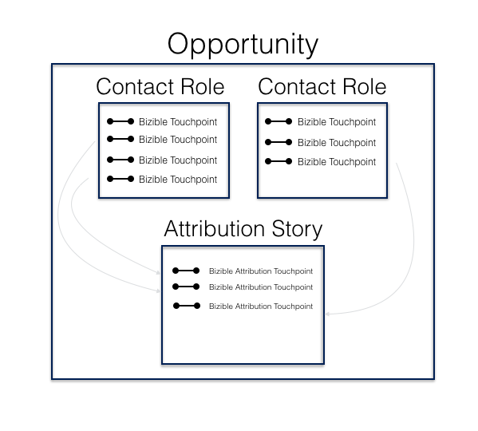

# アトリビューションマッピング手法 {#attribution-mapping-methodology}

アトリビューションマッピング手法は、CRM 内の特定のオブジェクト（連絡先、商談、アカウント）を検索し、関連するオポチュニティにアトリビューションタッチポイントを作成するプロセスです。 つまり、 [!DNL Marketo Measure] 現在の CRM のプロセスに基づいて、アトリビューションモデルに含めるタッチポイントを把握する方法。

## アカウント ID マッピング {#account-id-mapping}

すぐに使える [!DNL Marketo Measure] はアカウント ID マッピングを提供します。 つまり、 [!DNL Marketo Measure] は、商談に関連付けられた属性タッチポイントを作成するために、アカウントとその連絡先のマーケティング情報を調べます。 以下に、そのプロセスの簡単な表現を示します。

次の点に注意してください。 **すべてではない** 連絡先からのタッチポイントは、アトリビューションタッチポイントとして商談にプッシュされます。 オポチュニティのタイムライン（ファーストタッチ日 — クローズ日）は、タッチポイントがオポチュニティに影響を与える人としてカウントされるかどうかを決定します。 したがって、商談がクローズした後に連絡先 A のタッチポイントが発生した場合、獲得/損失は、 [!DNL Marketo Measure] は、そのタッチポイントを商談にプッシュしません。 このタイムライン手順は、他のすべてのアトリビューションオブジェクトマッピングで実行されます。

長所：このアトリビューション方法は、ほとんどの企業にとって非常に効果的です。 マーケティングチームは、すべての連絡先を特定のオポチュニティ（多くの場合、問題）に関連付ける際に、セールスチームに頼る必要はありません。 また、セールスチームが連絡先の役割を関連付けても、他の多くの連絡先とマーケティング資料とのやり取りが失われる可能性があります。 最後に、この方法は、特定の影響者ではなく、アカウントの全体に影響を与えるよう努める ABM 戦略を提供します。

短所：誰が何のクレジットを受け取るかを定義する強力なマーケティングおよび販売 SLA がある場合、この方法に問題が生じる可能性があります。 また、顧客が Account 階層を使用して大きなアカウント ( 例：IBM) 内で特定のビジネスユニットを定義しない場合、1 つのビジネスユニットに固有のマーケティングインタラクションが他のビジネスユニット商談に広がる可能性があります。

## オポチュニティ連絡先のロールマッピング {#opportunity-contact-role-mapping}

ほとんどのクライアントはアカウント ID マッピングを使用しますが、 [!DNL Marketo Measure] は、商談内の連絡先の役割（商談に関連付けられた連絡先）を参照して、属性プロセスを分類できます。 つまり、 [!DNL Marketo Measure] は、商談上の連絡先の役割に関連付けられたマーケティングインタラクションのみを購入者アトリビューションタッチポイントとしてプッシュします。 以下に、このプロセスを示します。

長所：チームに明確に定義された連絡先の役割プロセスがある場合、このタイプのアトリビューションマッピングが最適な場合があります。 これは、誰もがアトリビューションの分類方法を完全に理解できるように、販売とマーケティングを少し合わせるのに役立ちます。 また、このプロセスは、組織が大企業内で複数のビジネスユニットをターゲット設定し、異なる製品を同時に販売する場合にも役立ちます。

短所：ただし、連絡先の役割のプロセスが存在しない場合、マーケティングは大量のマーケティングデータを失い、チームは商談に影響を与えているマーケティング活動に対するクレジットを大幅に減らすことになります。

## 商談プライマリ連絡先のロールマッピング {#opportunity-primary-contact-role-mapping}

オポチュニティに関する連絡先の役割を単に見るだけでなく、 [!DNL Marketo Measure] は、商談に関する連絡先プライマリのみを見るために、さらに焦点を絞ることができます。 この設定を念頭に置いて [!DNL Marketo Measure] は、オポチュニティ上の主要連絡先に関連付けられたマーケティングタッチポイントのみを取得し、その情報をその特定のオポチュニティの属性ストーリーにプッシュします。 下の画像を参照してください。

長所：チームがオポチュニティに対する「プライマリ」として設定された連絡先に対するマーケティングの影響のみを理解したい場合は、このタイプのマッピングがチームに最適です。

短所：これは確かに最も使用されていないマッピングプロセスであり、機会に他の連絡先に針を動かすマーケティングの影響を大きく損なう可能性があります。
